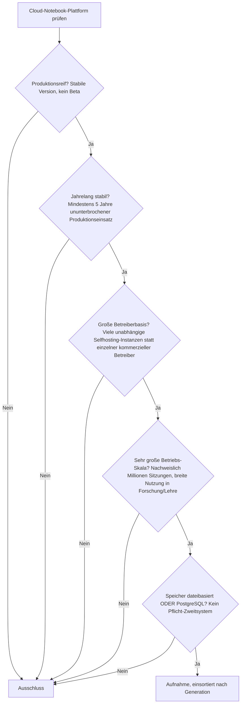
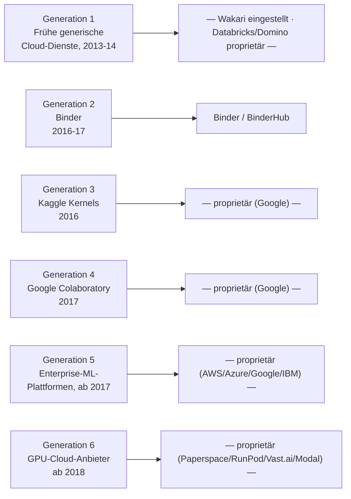

# Produktionsreife Open-Source-Cloud-Notebooks nach Generation — Reifegrad, Evaluation & Betriebs-Skala (Top 1)

Die [Evolution und Architekturen digitaler Cloud-Notebooks](evolution-digitaler-cloud-notebooks.md) zoomt in Generation 3 der [Notebook-Systeme-Chronologie](evolution-digitaler-notebook-systeme.md) hinein und zerlegt sie in sechs eigene Entwicklungsstufen, die [Topliste bester Cloud-Notebook-Plattformen 2026](cloud-notebooks-2026-topliste.md) rankt die gesamte Kategorie mit 20 Plattformen. Diese Seite wendet auf genau dieselbe Kategorie das Fünf-Filter-Sieb der Reihe an — parallel zur [Wissenssysteme-](produktionsreife-wissenssysteme-generationen-2026-topliste.md), [CMS-](produktionsreife-cms-generationen-2026-topliste.md), [Notebook-](produktionsreife-notebook-systeme-generationen-2026-topliste.md), [Semantische-&-RAG-](produktionsreife-semantische-rag-wissenssysteme-generationen-2026-topliste.md), [Static-Site-Generator-](produktionsreife-static-site-generatoren-generationen-2026-topliste.md), [Wiki-Engine-](produktionsreife-wiki-engines-generationen-2026-topliste.md), [PKM-](produktionsreife-pkm-wissensgraphen-generationen-2026-topliste.md), [Wissenssystem-Framework-](produktionsreife-wissenssystem-frameworks-generationen-2026-topliste.md), [Headless-CMS-](produktionsreife-headless-cms-generationen-2026-topliste.md), [R-Markdown-&-Quarto-](produktionsreife-rmarkdown-quarto-generationen-2026-topliste.md), [Reaktive-Notebooks-](produktionsreife-reaktive-notebooks-generationen-2026-topliste.md) und [LMS-Schwesterseite](../e-learning/produktionsreife-lms-generationen-2026-topliste.md): produktionsreif · jahrelang stabil · große Betreiberbasis · sehr große Betriebs-Skala · Speicher dateibasiert oder PostgreSQL. Sortiert nach Generation.

!!! warning "Achtung: Eine Kategorie, die per Definition proprietär ist — mit genau einer architektonischen Ausnahme"
    Cloud-Notebooks existieren als eigene Produktkategorie, **weil** Anbieter Rechenkapazität, GPU-Zugriff und Enterprise-ML-Pipelines verkaufen wollen — 19 der 20 Plattformen der [Basis-Topliste](cloud-notebooks-2026-topliste.md) sind entsprechend proprietäres SaaS. Die einzige Ausnahme, die alle fünf Filter besteht, ist **Binder** (mybinder.org / BinderHub) — und das ist bezeichnenderweise **kein Konkurrenzprodukt** zu Colab, Databricks oder SageMaker, sondern ein architektonisch anderes Werkzeug: ein von Project Jupyter selbst betriebener Dienst, der temporäre, reproduzierbare Umgebungen aus einem Git-Repository baut, statt dauerhafte Rechenkapazität zu verkaufen. Die gesamte kommerzielle Cloud-Notebook-Welt bleibt außen vor — nicht weil sie unreif wäre, sondern weil sie strukturell nie quelloffen war.

---

## Die fünf harten Filter

!!! note "Hinweis: Nur OSI-anerkannte Lizenzen"
    Wie in der [Gesamtübersicht](open-source-llm-agent-mcp-systeme.md) zählen ausschließlich OSI-anerkannte Lizenzen. In dieser Kategorie ist das der entscheidende Filter überhaupt: Er entscheidet über fast die gesamte Liste, nicht Reife oder Skala — die meisten Ausschlüsse dieser Seite wären technisch längst reif genug.

---

## Ergebnis: Ein System aus Generation 2

---

## Das System

### Generation 2 — Binder: reproduzierbare, temporäre Umgebungen aus Git (2016 – 2017)

| # | System | Speicher | Lizenz | Seit | Skala-Nachweis | Betreiberbasis |
|---|---|---|---|---|---|---|
| 1 | **Binder / BinderHub** (mybinder.org) | Kein Backend für Notebook-Inhalte (rein ephemer); Hub-State wie JupyterHub optional SQLite/PostgreSQL | BSD-3-Clause | 2016/2017 | Öffentliche mybinder.org-Föderation seit fast einem Jahrzehnt im Dauerbetrieb, breite Nutzung in Forschung, Lehre und wissenschaftlicher Reproduzierbarkeit | Von Project Jupyter/NumFOCUS getragen, mehrere unabhängig selbst gehostete BinderHub-Instanzen (u. a. akademische Rechenzentren) |

**Binder** löst ein anderes Problem als der Rest der Kategorie: Statt dauerhafter Rechenkapazität baut es aus einem GitHub-Repository samt Abhängigkeitsdatei eine **temporäre, exakt reproduzierbare** Jupyter-Umgebung — ideal, um ein Notebook ohne jede lokale Installation nachvollziehbar zu teilen, aber ungeeignet als dauerhafter Arbeitsplatz. Technisch baut BinderHub auf [JupyterHub](produktionsreife-notebook-systeme-generationen-2026-topliste.md#generation-2-ipython-notebook-die-geburt-von-jupyter-2011-2014) auf und erbt dessen Speicherarchitektur: Der Notebook-Inhalt selbst kommt aus dem Git-Repository, der Hub-State ist wahlweise dateibasiert (SQLite) oder auf PostgreSQL.

### Generation 1 — warum hier nichts steht

**Wakari** (2013, Continuum Analytics) wurde vor Jahren eingestellt und existiert nicht mehr — kein heutiger Produktivvertreter. **Databricks Notebooks** und **Domino Data Lab** (beide 2013/14) sind seit Gründung proprietäre Enterprise-Produkte ohne offenen Quellcode.

### Generation 3, 4, 5 & 6 — warum hier nichts steht

- **Generation 3** (Kaggle Kernels, 2016): Proprietär, seit 2017 im Besitz von Google.
- **Generation 4** (Google Colaboratory, 2017): Proprietär, größte Nutzerbasis der gesamten Basis-Topliste — aber kein offener Quellcode.
- **Generation 5** (Enterprise-ML-Plattformen, ab 2017): **AWS SageMaker**, **Azure ML**, **Google Vertex AI Workbench**, **IBM Watson Studio**, **Anyscale Workspaces** — durchgängig proprietäre Cloud-Angebote der großen Infrastruktur-Anbieter.
- **Generation 6** (Spezialisierte GPU-Cloud-Anbieter, ab 2018): **Paperspace Gradient**, **Lightning.ai Studios**, **RunPod**, **Vast.ai**, **Modal** — durchgängig kommerzielle GPU-Vermietung, keines davon Open Source.

In der Praxis erreicht man den Funktionsumfang dieser fünf Generationen entweder durch ein kommerzielles Abo eines der genannten Anbieter, oder durch **Selfhosting eines produktionsreifen Systems dieser Familie** (JupyterHub, siehe [Notebook-Systeme-Schwesterseite](produktionsreife-notebook-systeme-generationen-2026-topliste.md)) auf eigener oder gemieteter GPU-Hardware.

---

## Dateibasiert oder PostgreSQL? — erbt JupyterHubs Antwort

Binder hat keine eigene Speicherfrage — es erbt die Architektur von JupyterHub: Notebook-Inhalte kommen aus dem Git-Repository (dateibasiert), der einzige Datenbankbedarf ist der Hub-State (aktive Sitzungen, Ressourcen-Zuteilung), wahlweise SQLite oder PostgreSQL ab größerem parallelem Betrieb. Vertiefung zur Datenbankschicht: [IPython- & Jupyter-Systeme mit PostgreSQL-/Dateiformat-Speicherung](ipython-jupyter-postgresql-dateiformat-2026-topliste.md).

!!! warning "Achtung: Momentaufnahme, Stand August 2026"
    Sollte einer der großen proprietären Anbieter seinen Kern quelloffen lizenzieren oder ein neues Open-Source-Projekt mit vergleichbarer Skala entstehen, ändert sich dieses Bild grundlegend. Bis dahin bleibt Binder die strukturell einzig mögliche Antwort auf diese Kategorie.

---

## Was bewusst nicht auf dieser Liste steht

| System | Erfüllt nicht | Anmerkung |
|---|---|---|
| **Google Colaboratory, Kaggle Notebooks** | Lizenzfilter | Proprietär, im Besitz von Google |
| **AWS SageMaker, Azure ML, Google Vertex AI Workbench, IBM Watson Studio, Anyscale Workspaces** | Lizenzfilter | Proprietäre Enterprise-ML-Plattformen |
| **Databricks Notebooks, Domino Data Lab** | Lizenzfilter | Proprietäre Enterprise-Data-Science-Plattformen seit Gründung |
| **Paperspace Gradient, Lightning.ai Studios, RunPod, Vast.ai, Modal** | Lizenzfilter | Proprietäre GPU-Cloud-Anbieter |
| **Deepnote, Hex, JetBrains Datalore, Saturn Cloud** | Lizenzfilter | Proprietäre Startup-Welle mit modernerer Kollaborations-UX |
| **CoCalc** | Lizenzfilter (uneinheitlich) | Quellcode teils einsehbar, Lizenzmodell nicht durchgängig OSI-konform für den produktiven Betrieb |
| **Wakari** | Aktivität | Eingestellt, existiert nicht mehr |

---

## 🔗 Verwandte Themen

- [Startseite](../../index.md) — zurück zur Dokumentations-Zentrale
- [Evolution und Architekturen digitaler Cloud-Notebooks](evolution-digitaler-cloud-notebooks.md) — das sechsstufige Generationenmodell, nach dem diese Liste sortiert ist
- [Produktionsreife Open-Source-Notebook-Systeme nach Generation (Top 4)](produktionsreife-notebook-systeme-generationen-2026-topliste.md) — die übergeordnete Kategorie; JupyterHub als technische Grundlage von Binder erscheint dort als eigener Treffer
- [Produktionsreife Open-Source-Reaktive-Notebooks nach Generation (Top 1)](produktionsreife-reaktive-notebooks-generationen-2026-topliste.md) — Schwesterseite mit demselben „nur ein Treffer"-Befund, aber anderer Ursache (Kontinuität statt Lizenz)
- [Beste Cloud-Notebook-Plattformen 2026 (Top 20)](cloud-notebooks-2026-topliste.md) — breiteste Basis-Topliste inklusive aller proprietären Anbieter
- [IPython- & Jupyter-Systeme mit PostgreSQL-/Dateiformat-Speicherung (Top 20)](ipython-jupyter-postgresql-dateiformat-2026-topliste.md) — Speicherarchitektur, die Binder von JupyterHub erbt
- [Evolution und Architekturen digitaler Cloud-KI-APIs](../../künstliche-intelligenz/evolution-digitaler-cloud-ki-apis.md) — direkte Schnittmenge bei Enterprise-ML-Plattformen (Generation 5 dieser Liste)
