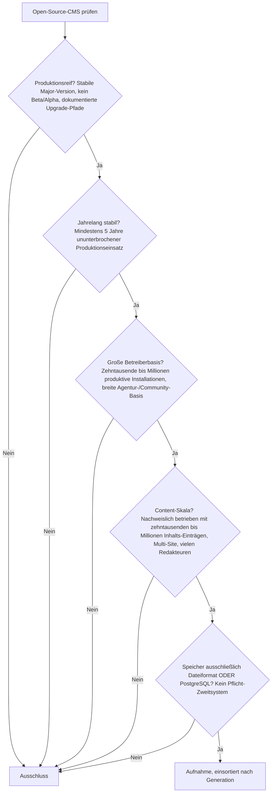
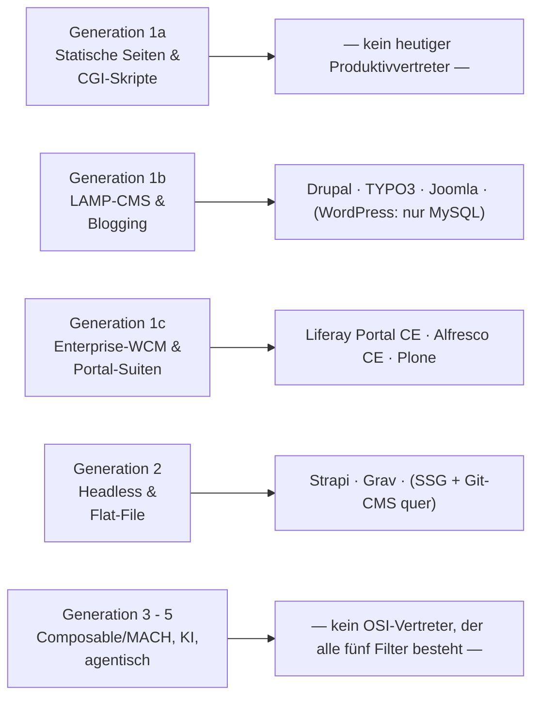
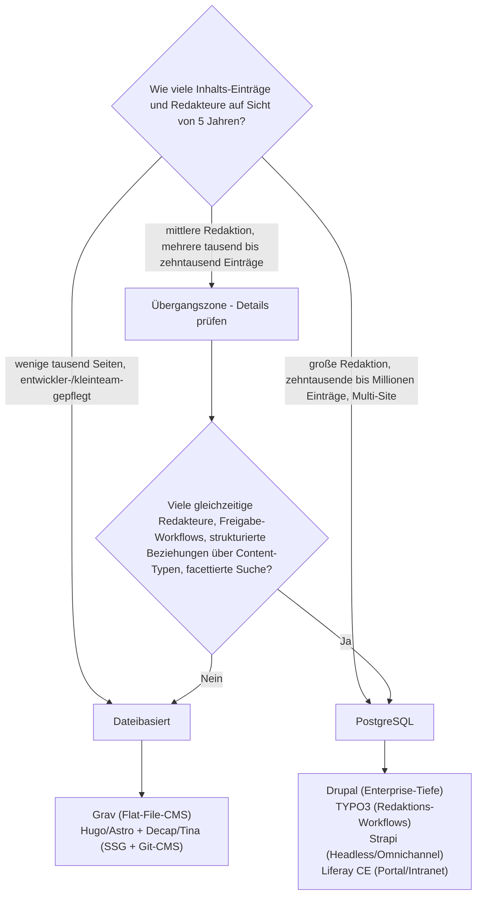

# Produktionsreife Open-Source-CMS nach Generation — Reifegrad, Evaluation & Content-Skala (Top 12)

Die [Evolution und Architekturen digitaler Content-Management-Systeme](evolution-digitaler-cms.md) ordnet die CMS-Klasse chronologisch in fünf technologische Generationen, die [Topliste klassischer CMS mit PostgreSQL-/Dateiformat-Speicherung](klassische-cms-postgresql-dateiformat-2026-topliste.md) siebt nach Lizenz, Speicherbackend und Reife, die [Headless-Schwesterliste](headless-cms-postgresql-dateiformat-2026-topliste.md) macht dasselbe für die API-first-Kategorie. Diese Seite kombiniert alle Achsen und legt — parallel zur [Wissenssysteme-Variante](produktionsreife-wissenssysteme-generationen-2026-topliste.md) — ein bewusst **konservatives** Sieb an: Aufgenommen wird nur, was **alle** folgenden Kriterien gleichzeitig erfüllt; sortiert wird anschließend **nach Generation** statt nach Rang.

!!! note "Hinweis: Nur OSI-anerkannte Lizenzen"
    Wie in der [Gesamtübersicht](open-source-llm-agent-mcp-systeme.md) zählen hier ausschließlich Systeme unter einer OSI-anerkannten Open-Source-Lizenz. Das kostet die Liste alle proprietären SaaS-/Enterprise-Anbieter (Wix, Squarespace, Webflow, Adobe Experience Manager, Sitecore, Contentful, Contentstack, Kontent.ai) sowie Craft CMS, Kirby und Statamic (kostenpflichtige Kernlizenz).

---

## Die fünf harten Filter

!!! tip "Tipp: Der Speicherfilter kostet die Liste den Marktführer"
    **WordPress** — unangefochtener Rang 1 jeder CMS-Topliste — unterstützt im Kern ausschließlich MySQL/MariaDB, kein PostgreSQL. Es erfüllt vier der fünf Filter mühelos und fällt allein am fünften heraus, zusammen mit allen direkt darauf aufbauenden Systemen (WooCommerce, Elementor, Divi). Wenn die Anforderung „relationale Datenbank allgemein" statt „PostgreSQL speziell" lautet, ist WordPress die naheliegende erste Wahl — siehe [Speicher-Fazit](#dateibasis-oder-postgresql-empfehlung-mit-klarem-umschlagpunkt) unten.

---

## Ergebnis: Reife plus PostgreSQL-Support konzentriert sich auf Generation 1

---

## Systeme nach Generation

### Generation 1b — LAMP-Content-Management & Blogging (ca. 2000 – 2010)

| # | System | Speicher | Lizenz | Seit | Skala-Nachweis | Betreiberbasis |
|---|---|---|---|---|---|---|
| 1 | **[Drupal](drupal/evolution-digitaler-drupal.md)** | PostgreSQL, MySQL/MariaDB oder SQLite offiziell wählbar | GPL-2.0-or-later | 2001 | Sites mit Millionen Nodes, Multi-Site-Farmen, Behörden- und Medienportale | Sehr große Agentur- und Community-Basis, ausgeprägteste Enterprise-Tiefe der Kategorie |
| 2 | **TYPO3** | PostgreSQL offiziell unterstützt (seit Version 9) | GPL-2.0-or-later | 2000 | Große Multi-Site-Instanzen mit zehntausenden Seiten, mehrsprachig | Sehr stark im deutschsprachigen Enterprise- und Behördenraum, breites Integrator-Netz |
| 3 | **Joomla** | PostgreSQL wählbar (MySQL/MariaDB in der Praxis üblicher) | GPL-2.0-or-later | 2005 | Große Content-Sites und Vereins-/Verbandsportale | Drittgrößtes CMS-Ökosystem weltweit |

**Drupal** ist der Referenzpunkt für „reifes Open-Source-CMS auf PostgreSQL": PostgreSQL ist hier eine gleichwertige, offiziell dokumentierte Backend-Wahl, nicht ein nachträglich angeflanschter Sonderfall. Für Sites, die WordPress-Kompatibilität mit PostgreSQL-Speicherung verbinden wollen, ist Drupal die architektonisch nächstliegende Alternative. Vertiefend: [Evolution und Architekturen von Drupal](drupal/evolution-digitaler-drupal.md), Installation: [Drupal installieren](drupal/installieren.md).

**TYPO3** ist die zweite ausgereifte Wahl mit vollem PostgreSQL-Support (seit v9, 2018) und einem granularen Rechte- und Workspace-Modell, das speziell für große Redaktionen mit mehrstufigen Freigabe-Workflows ausgelegt ist.

**Joomla** erfüllt die Filter, trägt aber einen Vorbehalt: PostgreSQL ist wählbar, wird in der Praxis aber selten eingesetzt — die meiste Erfahrung, Doku und Extension-Kompatibilität bezieht sich auf MySQL/MariaDB.

### Generation 1c — Enterprise-WCM & Portal-Suiten (ca. 2005 – 2015)

| # | System | Speicher | Lizenz | Seit | Skala-Nachweis | Betreiberbasis |
|---|---|---|---|---|---|---|
| 4 | **Liferay Portal** (Community Edition) | PostgreSQL offiziell unterstützt | LGPL-2.1 | 2004 | Große Intranets und Kundenportale mit vielen tausend Seiten und Nutzern | Führend bei Portal-/Intranet-Szenarien, breite Enterprise-Nutzung |
| 5 | **Alfresco** (Community Edition) | PostgreSQL als empfohlenes Backend | LGPL-3.0 | 2005 | Dokumenten-Repositories mit Millionen Objekten (ECM/Records-Management) | Stärkster Dokumentenmanagement-Fokus der Liste |
| 6 | **Plone** | PostgreSQL via RelStorage (Standard: ZODB-Objektdatenbank) | GPL-2.0 | 2001 | Große, tief verschachtelte Site-Strukturen; Regierungs- und NGO-Einsatz | Kleiner geworden, aber langjährig stabile, sicherheitsfokussierte Community |

**Liferay Portal CE** und **Alfresco CE** sind die beiden reifen Enterprise-Systeme mit offiziellem PostgreSQL-Support: Liferay für Portal-/Intranet-Szenarien mit vielen Nutzern und Rollen, Alfresco für Dokumenten- und Records-Management im Millionen-Objekt-Bereich. Bei der jeweiligen **Community Edition** vor dem Produktivstart die aktuelle Feature- und Support-Abgrenzung zur Enterprise-Version prüfen.

**Plone** rangiert knapp über der Schwelle: Standardmäßig speichert es in die ZODB-Objektdatenbank, per **RelStorage** lässt sich diese aber auf PostgreSQL legen — eine seit über einem Jahrzehnt genutzte Produktivkonfiguration. Die Betreiberbasis ist deutlich kleiner als bei Drupal/TYPO3, die Sicherheits- und Reife-Bilanz aber außergewöhnlich stark.

### Generation 2 — Headless & Flat-File (ca. 2015 – 2021)

| # | System | Speicher | Lizenz | Seit | Skala-Nachweis | Betreiberbasis |
|---|---|---|---|---|---|---|
| 7 | **[Strapi](cms-mcp-server-topliste.md)** | PostgreSQL, MySQL/MariaDB oder SQLite offiziell wählbar | MIT | 2015 | Große Content-Kataloge und Omnichannel-APIs im Produktivbetrieb | Dominantes selbst gehostetes Headless-CMS, sehr große Entwickler-Community |
| 8 | **Grav** | Reines Dateiformat, kein Datenbankserver | MIT | 2015 | Websites mit einigen tausend Seiten; jenseits davon wird das Flat-File-Modell zum Engpass | Größte OSI-Flat-File-CMS-Basis, aktives Plugin-/Skeleton-Ökosystem |

**Strapi** ist das einzige Generation-2-System mit Datenbank, das alle fünf Filter besteht: PostgreSQL ist eine offiziell wählbare Backend-Option, die Betreiberbasis ist sehr groß, und die v4/v5-Serie ist seit Jahren produktionsstabil. Für strukturierten Content, der per REST/GraphQL an mehrere Frontends geht, ist es die reifste selbst gehostete Wahl.

**Grav** ist die dateibasierte Ausnahme dieser Ära — analog zu DokuWiki bei den Wissenssystemen: Content liegt als Markdown/YAML im Dateisystem, Backup ist ein `rsync` oder `git commit`. Der Preis ist eine Skalierungsgrenze — jenseits einiger tausend Seiten wird das Einlesen und Durchsuchen des Dateibaums spürbar langsam, und es fehlt echte Mehrredakteur-Nebenläufigkeit.

!!! warning "Achtung: Payload, KeystoneJS, Directus & Decap — knapp daneben"
    - **Payload CMS** (MIT, PostgreSQL/MongoDB): stärkste Wachstumsdynamik der Kategorie, aber erst seit ~2021 — die Fünf-Jahres-Marke im stabilen Produktivbetrieb ist noch nicht sicher überschritten.
    - **KeystoneJS** (MIT, PostgreSQL via Prisma): reif genug, aber kleinere Betreiberbasis und wechselhafte Roadmap.
    - **Directus** (PostgreSQL-nativ): erfüllt die technischen Filter, die Kernlizenz (BSL 1.1 seit 2023) ist aber kein OSI-Open-Source mehr.
    - **Decap CMS / Tina CMS**: reine Git-basierte Editier-Oberflächen ohne eigenes Backend — die Skala liefert der dahinterliegende Static-Site-Generator (siehe nächster Abschnitt).

### Quer zu den Generationen — Static-Site-Generatoren + Git-CMS

Eine eigene Kategorie, die nicht ins Generationen-Raster passt, aber alle fünf Filter erfüllt: Generatoren, die aus reinen Markdown-/Datendateien statische Sites bauen, optional mit einer Git-basierten Redaktions-Oberfläche davor.

| System | Speicher | Betreiberbasis & Skala |
|---|---|---|
| **Hugo** | Markdown-/Datendateien | Sehr große Basis; Builds mit über 100.000 Seiten in Sekunden |
| **Jekyll** | Markdown-Dateien | Nativ von GitHub Pages getragen, seit 2008 stabil |
| **Astro / Eleventy** | Markdown/MDX-Dateien | Große, wachsende Basis; content-fokussiert |
| **Decap CMS / Tina CMS** (davor) | Git-Commits | Redaktions-UI ohne Datenbank, Änderungen als Commits |

Diese Kombination ist **Read-only-Publish** statt Multi-Editor-CMS mit Live-Datenbank: Redaktion in Dateien (ggf. über eine Web-UI), Veröffentlichung als statische Site. Für inhaltsstarke, aber selten von vielen Personen gleichzeitig bearbeitete Sites ist das die betriebsärmste Option — dieses Repository selbst wird nach diesem Prinzip mit **Zensical** gebaut. Vollständige Chronologie und Toplisten: [Evolution und Architekturen digitaler Static-Site-Generatoren](evolution-digitaler-static-site-generatoren.md), [Beste Static-Site- & Docs-Generatoren 2026 (Top 20)](static-site-generatoren-2026-topliste.md).

### Generation 3 – 5 — Composable/MACH, KI-Content, agentische Systeme

**Kein OSI-Vertreter besteht aktuell alle fünf Filter.** Die Gründe:

- **Lizenzfilter**: Die Composable-/MACH-Ebene (Contentful, Contentstack, Kontent.ai, Optimizely, Hygraph) besteht fast vollständig aus proprietären SaaS-Plattformen.
- **„Jahrelang stabil" + „große Betreiberbasis"**: Die KI-Content- und agentischen Ansätze (eingebaute LLM-Editoren, autonome Redaktions-Agenten) sind Funktionsschichten auf bestehenden CMS oder zu junge eigenständige Produkte — keines hat eine belastbare Fünf-Jahres-Produktionshistorie als eigenständiges System.
- **In der Praxis**: Generation 4 erreicht man heute, indem man ein Generation-1b-System dieser Liste (Drupal AI-Modul, WordPress + Jetpack AI) mit LLM-Funktionen nachrüstet — siehe [Klassische Wissensmanagement-, KB- & CMS-Systeme mit LLM-Integration](klassische-wissensmanagement-cms-llm-integration.md).

---

## Dateibasis oder PostgreSQL? — Empfehlung mit klarem Umschlagpunkt

**Kurzfassung:** Dateibasiert für entwicklergepflegte Sites bis mittlere Größe, PostgreSQL ab großer Redaktion oder sehr großen, strukturierten Content-Mengen. Beide Pfade kommen mit **einem einzigen Datenspeicher** aus.

**Der Umschlagpunkt liegt dort, wo mindestens eines davon zutrifft:**

1. **Viele Redakteure arbeiten gleichzeitig** an Inhalten — ein Dateibaum ohne Datenbank-Transaktionen führt zu Merge-Konflikten und Sperren; PostgreSQL löst das mit seinem Transaktionsmodell.
2. **Freigabe-Workflows, Staging und Versionierung im Editor** werden gebraucht — das ist die Domäne von Drupals und TYPO3s Workspace-/Workflow-Modell auf der Datenbank.
3. **Strukturierte Beziehungen und Abfragen über Content-Typen hinweg** („alle Artikel eines Autors mit Tag X, gefiltert nach Region, facettiert nach Datum") — flache Dateien können das nicht indiziert beantworten; PostgreSQL mit `tsvector`/GIN und relationalen Joins schon, siehe [PostgreSQL-Volltextsuche](../../entwicklung/infrastruktur/postgresql-fulltext-search.md).

**Solange keiner der drei Punkte zutrifft, ist dateibasiert die betriebsärmere Wahl:** kein Datenbankserver zu betreiben, zu patchen, zu sichern; Backup und Migration sind Dateisystem-Operationen. Ein Static-Site-Generator (Zensical/Hugo) ist dabei noch eine Stufe betriebsärmer als ein Flat-File-CMS wie Grav.

**Sobald einer der drei Punkte zutrifft, führt an einer relationalen Datenbank kein Weg vorbei** — und dann ist die Frage „PostgreSQL oder MySQL":

- **PostgreSQL ist Pflicht oder klar bevorzugt** → **Drupal** ist die reifste Wahl (voller Multi-DB-Support, größte Enterprise-Tiefe), gefolgt von TYPO3 und Strapi.
- **Nur „irgendeine relationale DB" nötig, kein PostgreSQL-Zwang** → dann öffnet sich das Feld zu **WordPress** (größtes Ökosystem, aber MySQL/MariaDB) und Joomla. Die CMS-Welt ist historisch MySQL-zentriert; PostgreSQL-Support ist bei den reifsten Systemen vorhanden, aber nicht der Normalfall.

Vertiefung zur Datenbankschicht: [PostgreSQL DBA Praxis-Handbuch](../../entwicklung/infrastruktur/postgresql-dba-praxis.md).

!!! warning "Achtung: Momentaufnahme, Stand August 2026"
    Welches Backend ein Projekt offiziell unterstützt, ändert sich mit Major-Releases (Umbraco etwa öffnete sich erst mit Version 13/2024 für PostgreSQL). Vor dem Aufsetzen eines Produktivsystems die aktuelle Installationsdokumentation prüfen.

---

## Was bewusst nicht auf dieser Liste steht

| System | Erfüllt nicht | Anmerkung |
|---|---|---|
| **WordPress** (+ WooCommerce, Elementor, Divi) | Speicherfilter | Kern nur MySQL/MariaDB — sonst in jeder Hinsicht qualifiziert; klare Nr. 1, wenn „relationale DB allgemein" statt „PostgreSQL" die Anforderung ist |
| **Concrete CMS, ProcessWire, Contao** | Speicherfilter | Kein offizieller PostgreSQL-Support |
| **Umbraco** | „Jahrelang stabil" auf PostgreSQL | PostgreSQL-Support erst seit Version 13 (2024) — noch keine mehrjährige Produktionshistorie auf diesem Backend |
| **Craft CMS, Kirby, Statamic** | Lizenzfilter | Kostenpflichtige Kernlizenz für den produktiven Einsatz |
| **Directus** | Lizenzfilter | BSL 1.1 seit 2023 — kein OSI-Open-Source mehr |
| **Payload CMS, KeystoneJS** | „Jahrelang stabil" / Betreiberbasis | Zu jung bzw. zu kleine Basis für dieses konservative Sieb |
| **Contentful, Contentstack, Kontent.ai, AEM, Sitecore** | Lizenzfilter | Proprietäre SaaS-/Enterprise-Plattformen |
| **Ghost** | Content-Skala + Speicher | Publishing-fokussiert, SQLite/MySQL; kein PostgreSQL, nicht auf sehr große strukturierte Bestände ausgelegt |

---

## 🔗 Verwandte Themen

- [Startseite](../../index.md) — zurück zur Dokumentations-Zentrale
- [Evolution und Architekturen digitaler Content-Management-Systeme](evolution-digitaler-cms.md) — das fünfstufige Generationenmodell, nach dem diese Liste sortiert ist
- [Produktionsreife Open-Source-Wissenssysteme nach Generation (Top 12)](produktionsreife-wissenssysteme-generationen-2026-topliste.md) — die Schwester-Topliste mit demselben Fünf-Filter-Sieb für Wikis, PKM und RAG statt CMS
- [Produktionsreife Open-Source-LMS nach Generation](../e-learning/produktionsreife-lms-generationen-2026-topliste.md) — dasselbe Sieb für Lernmanagement-Systeme; Ergebnis: nur Moodle und Canvas bestehen alle Filter
- [Produktionsreife Open-Source-Web-Frameworks & -Bibliotheken nach Generation](../../entwicklung/webentwicklung/produktionsreife-webframeworks-generationen-2026-topliste.md) — dasselbe Sieb für Web-Frameworks, die den Unterbau vieler Headless- und Composable-CMS bilden
- [Klassische CMS mit PostgreSQL-/Dateiformat-Speicherung (Top 7)](klassische-cms-postgresql-dateiformat-2026-topliste.md) — derselbe Speicherfilter, nach Rang statt nach Generation und ohne den Content-Skala-Filter
- [Headless-CMS mit PostgreSQL-/Dateiformat-Speicherung (Top 9)](headless-cms-postgresql-dateiformat-2026-topliste.md) — dieselben Speicherkriterien für die API-first-Kategorie
- [Produktionsreife Open-Source-Headless-CMS nach Generation (Top 3)](produktionsreife-headless-cms-generationen-2026-topliste.md) — dieselbe Kategorie mit dem feineren, sechsstufigen Headless-Generationenmodell statt der groben Generation-2-Zusammenfassung hier
- [Produktionsreife klassische Open-Source-CMS nach Generation (Top 3)](produktionsreife-klassische-cms-generationen-2026-topliste.md) — dasselbe Sieb nur für die klassische Linie, nach deren feinerem Sechs-Generationen-Modell; macht sichtbar, dass die gesamte WordPress-Linie am Speicherfilter fällt
- [Beste klassische CMS 2026 (Top 20)](klassische-cms-2026-topliste.md) — breiteste Basis-Topliste nach Marktführerschaft
- [Beste Headless-CMS 2026 (Top 20)](headless-cms-2026-topliste.md) — Basis-Topliste der API-first-Kategorie
- [Evolution und Architekturen digitaler klassischer CMS](evolution-digitaler-klassische-cms.md) — vertiefendes Generationenmodell speziell für Generation 1
- [Klassische Wissensmanagement-, KB- & CMS-Systeme mit LLM-Integration](klassische-wissensmanagement-cms-llm-integration.md) — wie man Generation 4 (KI-Content) auf den Systemen dieser Liste nachrüstet
- [Beste CMS-Systeme (Open Source) mit MCP-Server (Top 20)](cms-mcp-server-topliste.md) — enger gefasste Schwester-Topliste mit MCP-Support als Kernkriterium
- [Evolution und Architekturen von Drupal](drupal/evolution-digitaler-drupal.md) — vertiefend zu Rang 1
- [PostgreSQL DBA Praxis-Handbuch](../../entwicklung/infrastruktur/postgresql-dba-praxis.md) — Datenbankschicht hinter den PostgreSQL-Rängen
- [PostgreSQL-Volltextsuche](../../entwicklung/infrastruktur/postgresql-fulltext-search.md) — der Skalierungsvorteil, ab dem sich der Umstieg vom Dateiformat lohnt
- [Beste Static-Site- & Docs-Generatoren 2026 (Top 20)](static-site-generatoren-2026-topliste.md) — die betriebsärmste Datei-Option für Read-only-Publish-Sites
