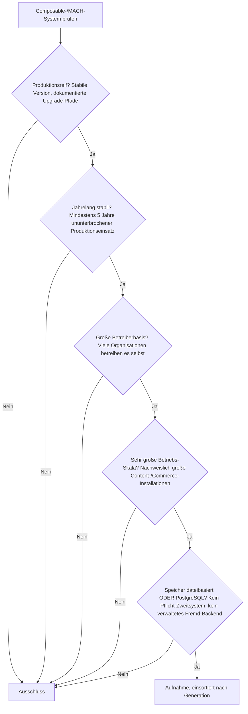
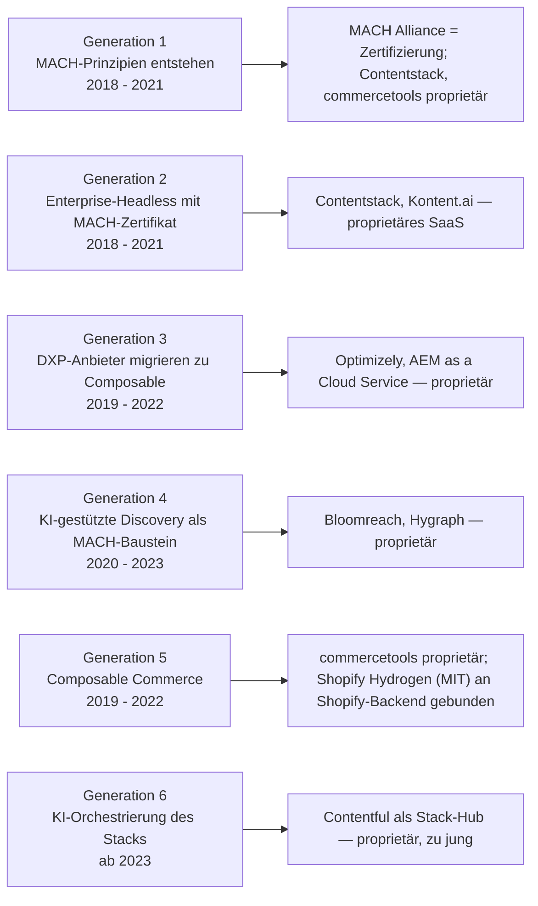
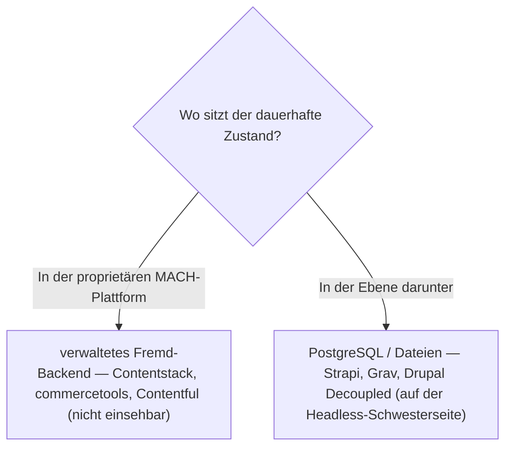

# Produktionsreife Composable-CMS & MACH-Systeme nach Generation — Reifegrad, Lizenz & Betriebs-Skala (kein Treffer — MACH ist eine Zertifizierungs-Ebene über proprietärem SaaS)

Die [Evolution und Architekturen digitaler Composable-CMS](evolution-digitaler-composable-cms.md) zoomt in Generation 3 der [übergeordneten CMS-Zeitachse](evolution-digitaler-cms.md) hinein und teilt die Composable-/MACH-Linie in ein feineres Modell: die MACH-Prinzipien entstehen (1), Enterprise-Headless mit MACH-Zertifikat (2), DXP-Anbieter migrieren zu Composable (3), KI-gestützte Discovery als MACH-Baustein (4), Composable Commerce als Nachbardisziplin (5), KI-Orchestrierung des gesamten Stacks (6). Die [Topliste bester Composable-CMS 2026](composable-cms-2026-topliste.md) rankt die gesamte Kategorie. Diese Seite legt das **konservative** Fünf-Filter-Sieb der Familie an — produktionsreif · jahrelang stabil · große Betreiberbasis · sehr große Betriebs-Skala · Speicher dateibasiert oder PostgreSQL —, hier nur für die *Composable-/MACH-Linie* und nach deren feinerem Generationenmodell sortiert.

!!! warning "Achtung: Kein einziger Treffer — die Kategorie ist ein Geschäftsmodell, kein selbst betreibbares System"
    **MACH** (Microservices, API-first, Cloud-native, Headless) ist eine **Zertifizierung** der herstellergetragenen MACH Alliance, kein Produkt. Jedes System der Chronologie ist **proprietäres SaaS**: Contentstack, commercetools, Kontent.ai (Generation 1–2), Optimizely, Adobe Experience Manager (Generation 3), Bloomreach, Hygraph (Generation 4), Contentful (Generation 6). Der einzige quelloffene Berührungspunkt ist **Shopify Hydrogen** — ein MIT-lizenziertes React-Frontend-Framework, das aber zwingend an das proprietäre Shopify-Backend gebunden ist. Was von der Composable-Idee quelloffen und selbst betreibbar besteht, sind die **Bausteine einer Ebene tiefer** — Strapi, Grav und Drupal im Decoupled-Modus —, und die stehen bereits auf der [Headless-CMS-Schwesterseite](produktionsreife-headless-cms-generationen-2026-topliste.md). Dieselbe Struktur wie bei den [Cloud-LMS](../e-learning/produktionsreife-cloud-lms-generationen-2026-topliste.md) und [Cloud-Notebooks](produktionsreife-cloud-notebooks-generationen-2026-topliste.md): Eine Kategorie, die gehosteten Betrieb als Produkt verkauft, bleibt fast vollständig proprietär.

---

## Die fünf harten Filter

!!! note "Hinweis: nur OSI-Lizenzen, nur selbst betreibbare Systeme"
    Aufgenommen werden Systeme unter OSI-anerkannter Lizenz, die man selbst betreiben kann. Das schließt die gesamte Chronologie aus — **Contentstack**, **commercetools**, **Kontent.ai**, **Optimizely**, **Adobe Experience Manager**, **Bloomreach**, **Hygraph**, **Contentful**. Das MACH-Zertifikat selbst ist keine Software.

---

## Ergebnis: kein Treffer über sechs Generationsstufen

---

## Warum keine Generation einen Treffer liefert

- **Generation 1 (MACH-Prinzipien)**: Die **MACH Alliance** ist eine von Contentstack, commercetools, Valtech und EPAM gegründete Organisation, die ein Zertifikat vergibt — Microservices, API-first, Cloud-native, Headless sind Architektur-*Prinzipien*, kein betreibbares System. Analog zu [xAPI/LTI auf der interoperablen-LMS-Seite](../e-learning/produktionsreife-interoperable-lms-generationen-2026-topliste.md): eine Spezifikations-/Standardisierungs-Ebene, kein Produkt.
- **Generation 2 (Enterprise-Headless mit Zertifikat)**: **Contentstack** und **Kontent.ai** sind proprietäres SaaS. Die quelloffenen Headless-CMS derselben Zeit (Strapi, Directus) stehen auf der [Headless-Schwesterseite](produktionsreife-headless-cms-generationen-2026-topliste.md).
- **Generation 3 (DXP-Migration)**: **Optimizely** (ehem. Episerver) und **Adobe Experience Manager as a Cloud Service** sind kommerzielle Enterprise-Suiten. AEM als klassisches Produkt fällt zusätzlich am Lizenzfilter der [klassischen CMS-Seite](produktionsreife-klassische-cms-generationen-2026-topliste.md).
- **Generation 4 (KI-Discovery)**: **Bloomreach** und **Hygraph** (ehem. GraphCMS) sind proprietäre SaaS-Plattformen.
- **Generation 5 (Composable Commerce)**: **commercetools** ist proprietär. **Shopify Hydrogen** ist MIT-lizenziert, aber ein reines Frontend-Framework, das ohne das proprietäre Shopify-Commerce-Backend nutzlos ist — dieselbe Konstellation wie eine bildungsspezifische LLM-Konfiguration auf einem offenen Basismodell.
- **Generation 6 (KI-Orchestrierung)**: **Contentful als „Composable Stack Hub"** ist proprietär *und* erst seit 2023 — doppelt außerhalb des Siebs.

---

## Dateibasiert oder PostgreSQL?

Gegenstandslos: Es gibt kein selbst betreibbares System, dessen Speicher man prüfen könnte.

- Die Composable-Plattformen halten Inhalte in verwalteten, nicht einsehbaren Backends — Selbstbetrieb ist per Geschäftsmodell ausgeschlossen.
- Wer die Composable-Architektur quelloffen und PostgreSQL-gestützt will, kombiniert die Bausteine der [Headless-Schwesterseite](produktionsreife-headless-cms-generationen-2026-topliste.md) — Strapi (PostgreSQL wählbar), Grav (dateibasiert), Drupal (Decoupled, PostgreSQL) — selbst.

Vertiefung zur Datenbankschicht: [PostgreSQL DBA Praxis-Handbuch](../../entwicklung/infrastruktur/postgresql-dba-praxis.md).

!!! warning "Achtung: Momentaufnahme, Stand August 2026"
    Die MACH-Kategorie entstand als kommerzielle Klasse und hatte nie einen quelloffenen, selbst betreibbaren Vertreter mit großer Betreiberbasis. Eine Trendwende ist nicht in Sicht — der quelloffene Weg bleibt die Eigenkombination reifer Headless-Bausteine.

---

## Was bewusst nicht auf dieser Liste steht

| System | Erfüllt nicht | Anmerkung |
|---|---|---|
| **Contentstack, commercetools, Kontent.ai** | Lizenzfilter | Proprietäres SaaS, MACH-Alliance-Gründungsmitglieder |
| **Optimizely, Adobe Experience Manager** | Lizenzfilter | Kommerzielle Enterprise-DXP-Suiten |
| **Bloomreach, Hygraph** | Lizenzfilter | Proprietäre Discovery-/Headless-SaaS |
| **Contentful** | Lizenz + Reifezeit | Proprietär; „Composable Stack Hub" erst seit 2023 |
| **Shopify Hydrogen** | Kategorie | MIT-Frontend-Framework, aber an proprietäres Shopify-Backend gebunden |
| **MACH Alliance / MACH-Zertifikat** | Kategorie | Herstellergetragene Zertifizierung, keine Software |
| **Strapi, Grav, Drupal (Decoupled)** | Kategorie dieser Seite | Bestehen das Sieb — auf der [Headless-CMS-Schwesterseite](produktionsreife-headless-cms-generationen-2026-topliste.md) |

---

## 🔗 Verwandte Themen

- [Evolution und Architekturen digitaler Composable-CMS](evolution-digitaler-composable-cms.md) — das feinere Generationenmodell der MACH-Linie, nach dem diese Liste sortiert ist
- [Beste Composable-CMS & MACH-Systeme 2026 (Top 20)](composable-cms-2026-topliste.md) — breiteste Basis-Topliste inklusive aller proprietären Plattformen
- [Produktionsreife Open-Source-Headless-CMS nach Generation (Top 3)](produktionsreife-headless-cms-generationen-2026-topliste.md) — die Ebene darunter: Strapi, Grav, Drupal Decoupled bestehen dort das Sieb
- [Produktionsreife klassische Open-Source-CMS nach Generation (Top 3)](produktionsreife-klassische-cms-generationen-2026-topliste.md) — die vorausgehende, monolithische Generation
- [Produktionsreife Open-Source-CMS nach Generation (Top 12)](produktionsreife-cms-generationen-2026-topliste.md) — die allgemeine Schwesterseite über alle CMS-Generationen
- [Produktionsreife Cloud-LMS & LXP nach Generation (Top 1)](../e-learning/produktionsreife-cloud-lms-generationen-2026-topliste.md) — dieselbe strukturelle Aussage: eine Kategorie, die gehosteten Betrieb verkauft, bleibt fast vollständig proprietär
- [PostgreSQL DBA Praxis-Handbuch](../../entwicklung/infrastruktur/postgresql-dba-praxis.md) — Datenbankschicht der quelloffenen Bausteine eine Ebene tiefer
