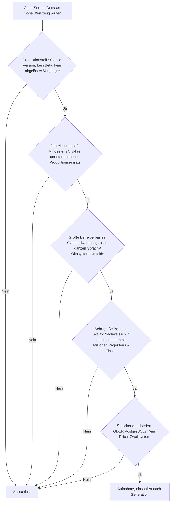
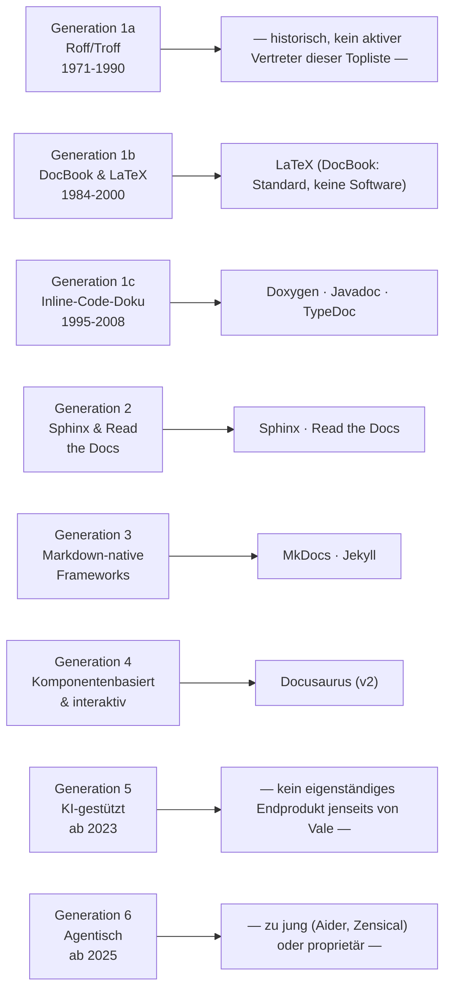

# Produktionsreife Open-Source-Docs-as-Code-Werkzeuge nach Generation — Reifegrad, Evaluation & Betriebs-Skala (Top 10)

Die [Evolution und Architekturen digitaler Docs-as-Code](evolution-digitaler-docs-as-code.md) ordnet die Kategorie chronologisch in sechs Generationen — von struktureller Textauszeichnung über die Geburt des eigentlichen Docs-as-Code-Workflows mit Sphinx bis zu agentischer Pflege. Die [Topliste bester Open-Source-Docs-as-Code-Werkzeuge 2026](docs-as-code-open-source-2026-topliste.md) rankt die gesamte Kategorie nach Lizenz gefiltert. Diese Seite kombiniert alle Achsen — parallel zur [Wissenssysteme-](produktionsreife-wissenssysteme-generationen-2026-topliste.md), [CMS-](produktionsreife-cms-generationen-2026-topliste.md), [Notebook-](produktionsreife-notebook-systeme-generationen-2026-topliste.md), [Semantische-&-RAG-](produktionsreife-semantische-rag-wissenssysteme-generationen-2026-topliste.md), [Static-Site-Generator-](produktionsreife-static-site-generatoren-generationen-2026-topliste.md), [Wiki-Engine-](produktionsreife-wiki-engines-generationen-2026-topliste.md), [PKM-](produktionsreife-pkm-wissensgraphen-generationen-2026-topliste.md), [Wissenssystem-Framework-](produktionsreife-wissenssystem-frameworks-generationen-2026-topliste.md), [Headless-CMS-](produktionsreife-headless-cms-generationen-2026-topliste.md), [R-Markdown-&-Quarto-](produktionsreife-rmarkdown-quarto-generationen-2026-topliste.md), [Reaktive-Notebooks-](produktionsreife-reaktive-notebooks-generationen-2026-topliste.md), [Cloud-Notebooks-](produktionsreife-cloud-notebooks-generationen-2026-topliste.md) und [LMS-Schwesterseite](../e-learning/produktionsreife-lms-generationen-2026-topliste.md) — zu einem bewusst **konservativen** Fünf-Filter-Sieb: produktionsreif · jahrelang stabil · große Betreiberbasis · sehr große Betriebs-Skala · Speicher dateibasiert oder PostgreSQL. Sortiert nach Generation.

!!! warning "Achtung: Vier Systeme dieser Liste stehen bereits auf der Static-Site-Generator-Schwesterseite — die eigentliche Substanz liegt in Generation 1"
    **Sphinx**, **MkDocs**, **Jekyll** und **Docusaurus** bestehen dieses Sieb bereits auf der [Static-Site-Generator-Schwesterseite](produktionsreife-static-site-generatoren-generationen-2026-topliste.md) — sie erscheinen hier erneut, aber in ihrer **Docs-as-Code-eigenen** Generation statt der Rendering-Architektur-Generation dort. Der eigentliche neue Befund dieser Seite liegt in **Generation 1**: **LaTeX**, **Doxygen** und **Javadoc** sind zwischen 29 und 42 Jahre alt, bestehen alle fünf Filter mühelos und tauchen in **keiner anderen Seite** dieser Familie auf — sie galten bislang als reine „Vorläufer", nicht als eigenständige, noch heute produktionsreife Docs-as-Code-Werkzeuge.

---

## Die fünf harten Filter

!!! note "Hinweis: Nur OSI-anerkannte Lizenzen, Spezifikationen zählen nicht als Software"
    Wie in der [Gesamtübersicht](open-source-llm-agent-mcp-systeme.md) zählen ausschließlich OSI-anerkannte Lizenzen — das kostet dieser Liste **Algolia DocSearch**, **Mintlify**, **Kapa.ai** und **Claude Code/Antigravity CLI** (alle proprietär). Zusätzlich gilt hier dieselbe Regel wie bei den [Wissenssystem-Frameworks](produktionsreife-wissenssystem-frameworks-generationen-2026-topliste.md#die-funf-harten-filter): Eine reine **Markup-Spezifikation** (DocBook) ist kein installierbares System — bewertet wird nur tatsächliche Software.

---

## Ergebnis: Zehn Systeme über vier von sechs Generationen, plus ein Quer-Einstieg

---

## Systeme nach Generation

### Generation 1b — DocBook & LaTeX: strukturiertes XML-/Markup-Publishing (1991 – 2000)

| # | System | Speicher | Lizenz | Seit | Skala-Nachweis | Betreiberbasis |
|---|---|---|---|---|---|---|
| 1 | **LaTeX** | Reines Dateiformat (`.tex`) | LPPL (OSI-anerkannt) | 1984 | Quasi-Standard für wissenschaftliche Publikationen und technische Bücher seit über 40 Jahren, Single-Source-Publishing in PDF/HTML/Druckformate | Universell in Wissenschaft, Verlagswesen und technischer Dokumentation verankert |

**LaTeX** ist der mit Abstand älteste Treffer der gesamten Wissenssysteme-Familie — 42 Jahre alt und ohne jeden Zweifel weiterhin produktionsreif, aktiv gepflegt (TeX Live, MiKTeX) und in praktisch jeder wissenschaftlichen Disziplin Standard. Es erfüllt exakt das Docs-as-Code-Kernprinzip (Klartext-Quelle, Trennung von Inhalt und Layout), Jahrzehnte bevor der Begriff geprägt wurde. **DocBook** (1991) definiert dieselbe Ära, ist aber ein XML-Schema/eine Spezifikation — keine eigenständig installierbare Software — und wird deshalb nicht mitgezählt.

### Generation 1c — Inline-Code-Dokumentation & Doc-Generatoren (1995 – 2008)

| # | System | Speicher | Lizenz | Seit | Skala-Nachweis | Betreiberbasis |
|---|---|---|---|---|---|---|
| 2 | **Javadoc** | Reines Dateiformat | GPL-2.0 (Classpath Exception) | 1995 | Fester Bestandteil des offenen OpenJDK, offizieller Standard für Java-API-Referenzen | Universell in der gesamten Java-Welt verankert, seit über drei Jahrzehnten unverändert im Kernprinzip |
| 3 | **Doxygen** | Reines Dateiformat | GPL-2.0 | 1997 | Bis heute Standard für C/C++-Systemsoftware-Dokumentation, extrahiert Referenzseiten direkt aus Quellcode-Kommentaren | Extrem breite Verankerung im C/C++/Java-Ökosystem, fast 30 Jahre ununterbrochene Pflege |
| 4 | **TypeDoc** | Reines Dateiformat | Apache-2.0 | 2015 | Moderner Nachfolger von Javadoc/Doxygen für die TypeScript-Welt, extrahiert API-Referenzen aus TS-Kommentaren | Standardwerkzeug im gesamten TypeScript-Ökosystem, elf Jahre stabil |

**Javadoc** und **Doxygen** sind die stillen Konstanten dieser Kategorie: Beide extrahieren Referenzdokumentation direkt aus Quellcode-Kommentaren, ohne je eine „Neuerfindung" nötig gehabt zu haben — dasselbe Grundprinzip funktioniert seit drei Jahrzehnten unverändert. **TypeDoc** überträgt exakt dieses Prinzip auf die TypeScript-Welt und ist dort ebenso fest verankert wie seine beiden Vorbilder in ihren jeweiligen Sprachökosystemen. **Perl POD**, ebenfalls Generation 1c, ist an die schrumpfende Perl-Nutzerbasis gekoppelt und erfüllt die Betreiberbasis-Schwelle dieser Liste nicht mehr in vergleichbarem Maß.

### Generation 2 — Sphinx & die Geburt des eigentlichen Docs-as-Code-Workflows (2008 – 2014)

| # | System | Speicher | Lizenz | Seit | Skala-Nachweis | Betreiberbasis |
|---|---|---|---|---|---|---|
| 5 | **Sphinx** | Reines Dateiformat (reStructuredText/Markdown) | BSD-2-Clause | 2008 | Standard für Python-API-Dokumentation, die Python-Doku selbst, Linux-Kernel-Dokumentation | Bereits auf der [Static-Site-Generator-Schwesterseite](produktionsreife-static-site-generatoren-generationen-2026-topliste.md#generation-2-ruby-pioniere-github-pages-integration-2008-2013) bestätigt |
| 6 | **Read the Docs** | PostgreSQL (selbstgehostete Community Edition) | MIT | 2010 | Hostet Dokumentation für zehntausende Open-Source-Projekte, der zentrale Auslöser der gesamten Docs-as-Code-Bewegung | Kern-Plattform vollständig quelloffen und selbst hostbar, seit 16 Jahren im Dauerbetrieb |

**Sphinx** ist bereits an anderer Stelle dieser Familie bestätigt — hier eingeordnet in seine eigentliche, namensgebende Rolle: Zusammen mit **Read the Docs** definiert es den Workflow, der den Begriff „Docs as Code" erst rechtfertigt (Git-Repository, Pull-Request-Review, automatisierter Build). **Read the Docs** ist der einzige Treffer dieser Liste, der PostgreSQL als echten Primärspeicher braucht — die selbst hostbare Community Edition ist eine Django-Anwendung mit klassischem relationalem Backend, kein reiner Dateiverarbeiter wie der Rest der Kategorie.

### Generation 3 — Markdown-native Docs-as-Code-Frameworks & YAML-Konfiguration (2014 – 2020)

| # | System | Speicher | Lizenz | Seit | Skala-Nachweis | Betreiberbasis |
|---|---|---|---|---|---|---|
| 7 | **MkDocs** (+ Material for MkDocs) | Reines Dateiformat | BSD-2-Clause | 2014 | De-facto-Standard für Projekt-Dokumentation im Python-Lager, auch dieses Repository | Bereits auf der [Static-Site-Generator-Schwesterseite](produktionsreife-static-site-generatoren-generationen-2026-topliste.md#generation-3-performance-generatoren-jenseits-von-ruby-2013-2017) bestätigt |
| 8 | **Jekyll** | Reines Dateiformat | MIT | 2008 | Größte installierte Basis der Kategorie durch native GitHub-Pages-Integration | Bereits auf der [Static-Site-Generator-Schwesterseite](produktionsreife-static-site-generatoren-generationen-2026-topliste.md#generation-2-ruby-pioniere-github-pages-integration-2008-2013) bestätigt |

**MkDocs** und **Jekyll** senkten die Einstiegshürde von RST auf Markdown und machten Docs-as-Code auch für Teams ohne Sphinx-Erfahrung praktikabel — beide bereits ausführlich auf der Static-Site-Generator-Schwesterseite gewürdigt, hier in ihrer Docs-as-Code-spezifischen Rolle bestätigt. **GitBook (Legacy CLI)** ist eingestellt und größtenteils im Community-Fork **HonKit** aufgegangen — eine deutlich kleinere Nische als MkDocs/Jekyll. **Docusaurus v1** ist vom eigenen Nachfolger (Generation 4) abgelöst.

### Generation 4 — Komponentenbasierte & interaktive Docs-Frameworks (2020 – 2023)

| # | System | Speicher | Lizenz | Seit | Skala-Nachweis | Betreiberbasis |
|---|---|---|---|---|---|---|
| 9 | **Docusaurus** (v2) | Reines Dateiformat (MDX) | MIT | 2020 | Dominant für versionierte Open-Source-Projekt-Dokumentation, von Meta initiiert | Bereits auf der [Static-Site-Generator-Schwesterseite](produktionsreife-static-site-generatoren-generationen-2026-topliste.md#generation-4-javascript-frameworks-die-jamstack-bewegung-2015-2020) bestätigt |

**Docusaurus v2** brachte MDX-Integration, Versionierung und Mehrsprachigkeit als Kern-Features statt Zusatzaufwand — derselbe Treffer wie auf der Schwesterseite. **Nextra** und **Astro Starlight** (2023) sind vielversprechend, aber mit drei bzw. Jahren noch zu jung; **Algolia DocSearch** ist ein proprietärer, gehosteter Crawler-Dienst.

### Quer zu den Generationen — Vale als eigenständiger Prosa-Linter

| System | Speicher | Betreiberbasis & Reife |
|---|---|---|
| **Vale** | Reines Dateiformat | MIT, seit 2017 — „Standardwerkzeug in praktisch jeder Open-Source-Docs-as-Code-Pipeline" |

Die Evolution-Chronologie ordnet Vale als „Vale + LLM-Ergänzung" Generation 5 (KI-gestützt) zu — der eigentliche **Vale-Kern** ist jedoch ein rein regelbasierter Prosa-Linter, der seit 2017 unabhängig von jeder LLM-Anbindung funktioniert und die Fünf-Jahres-Marke klar überschreitet. Er wird deshalb hier separat geführt, analog zu Typst bei den [Wissenssystem-Frameworks](produktionsreife-wissenssystem-frameworks-generationen-2026-topliste.md#generation-4-graph-query-frameworks-property-graph-treiber-2009-2020). **cspell** (2018, MIT) ergänzt Vale um reine Tippfehler-Erkennung, bleibt aber ein kleineres Zusatzwerkzeug ohne vergleichbar breite eigenständige Betreiberbasis.

### Generation 1a, 5 & 6 — warum hier nichts (weiter) steht

- **Generation 1a** (Roff/Troff & Man Pages, 1971 – 1990): **groff** wird bis heute für Unix-Man-Pages verwendet, gilt aber selbst in der Basis-Chronologie als historischer Vorläufer statt aktives Docs-as-Code-Werkzeug im modernen Sinn — kein Vertreter in den aktuellen Toplisten dieser Dokumentation.
- **Generation 5** (KI-gestützte Docs-as-Code, 2023 – 2025): **Mintlify AI** und **Kapa.ai** sind proprietäre SaaS-Widgets; „Docstring-zu-Seite-Generierung" ist ein Nutzungsmuster, kein eigenständiges Produkt. Vale selbst wird oben separat geführt.
- **Generation 6** (Agentische Docs-as-Code, ab 2025): **Claude Code/Antigravity CLI** proprietär; **Zensical** ist mit zwei Jahren noch zu jung — dieselbe Einstufung wie auf der [Static-Site-Generator-Schwesterseite](produktionsreife-static-site-generatoren-generationen-2026-topliste.md#was-bewusst-nicht-auf-dieser-liste-steht); **Aider** (agentische Doku-Pflege unter MIT-Lizenz) ist als eigenständiges Projekt erst seit 2023 aktiv und damit noch keine fünf Jahre alt.

---

## Dateibasiert oder PostgreSQL? — Fast durchgängig dateibasiert, mit einer Ausnahme

Neun der zehn Treffer dieser Liste speichern ausschließlich in Klartextdateien — Quellcode-Kommentare, `.tex`-Dateien, Markdown/RST/MDX. Die einzige Ausnahme ist **Read the Docs**: Die selbst hostbare Community Edition ist eine klassische Django-Webanwendung mit PostgreSQL als Primärspeicher für Projekt-Metadaten, Build-Historie und Nutzerkonten — der Dokumentations-**Inhalt** selbst kommt weiterhin aus dem Git-Repository. Vertiefung zur Datenbankschicht: [PostgreSQL DBA Praxis-Handbuch](../../entwicklung/infrastruktur/postgresql-dba-praxis.md).

!!! warning "Achtung: Momentaufnahme, Stand August 2026"
    Aider und Zensical überschreiten die Fünf-Jahres-Marke 2027/2028. Nextra und Astro Starlight können bei anhaltendem Wachstum ebenfalls nachrücken. Perl PODs Betreiberbasis kann sich mit der allgemeinen Perl-Nutzung weiter verändern.

---

## Was bewusst nicht auf dieser Liste steht

| System | Erfüllt nicht | Anmerkung |
|---|---|---|
| **DocBook** | Kategorie | XML-Schema/Spezifikation, keine eigenständig installierbare Software |
| **groff** | Kategorie | Historischer Vorläufer, in der aktuellen Docs-as-Code-Chronologie kein aktiver Vertreter |
| **Perl POD** | Betreiberbasis | An die schrumpfende Perl-Nutzerbasis gekoppelt |
| **GitBook (Legacy CLI)** | Aktivität | Eingestellt, im deutlich kleineren Community-Fork HonKit aufgegangen |
| **Docusaurus v1** | Kontinuität | Vom eigenen Nachfolger v2 abgelöst |
| **Nextra** | „Jahrelang stabil" | Solide, aber kleinere Betreiberbasis als Docusaurus |
| **Astro Starlight** | „Jahrelang stabil" | Erst seit 2023, noch keine fünf Jahre |
| **Algolia DocSearch** | Lizenzfilter | Proprietärer, gehosteter Crawler-/Index-Dienst |
| **Mintlify AI, Kapa.ai** | Lizenzfilter | Proprietäre RAG-Chat-Widgets |
| **Claude Code, Antigravity CLI** | Lizenzfilter | Proprietäre agentische Coding-Werkzeuge |
| **Aider** | „Jahrelang stabil" | Als eigenständiges Projekt erst seit 2023 aktiv |
| **Zensical** | „Jahrelang stabil" | Rust-Kern-Nachfolger von MkDocs, erst 2024 |
| **cspell** | Betreiberbasis | Solides Zusatzwerkzeug, aber kleinere eigenständige Basis als Vale |

---

## 🔗 Verwandte Themen

- [Startseite](../../index.md) — zurück zur Dokumentations-Zentrale
- [Evolution und Architekturen digitaler Docs-as-Code](evolution-digitaler-docs-as-code.md) — das sechsstufige Generationenmodell, nach dem diese Liste sortiert ist
- [Produktionsreife Open-Source-Static-Site-Generatoren nach Generation (Top 8)](produktionsreife-static-site-generatoren-generationen-2026-topliste.md) — Schwesterseite; Sphinx, MkDocs, Jekyll und Docusaurus erscheinen dort ebenfalls, in der Rendering-Architektur-Generation statt der Docs-as-Code-Generation
- [Produktionsreife Open-Source-Wissenssystem-Frameworks nach Generation (Top 8)](produktionsreife-wissenssystem-frameworks-generationen-2026-topliste.md) — dieselbe Bauteil-Ebene; Pandoc dort oft im Hintergrund derselben Toolchains
- [Beste Docs-as-Code-Werkzeuge 2026 (Top 15)](docs-as-code-2026-topliste.md) — breiteste Basis-Topliste ohne Lizenzfilter
- [Beste Open-Source-Docs-as-Code-Werkzeuge 2026 (Top 20)](docs-as-code-open-source-2026-topliste.md) — derselbe Lizenzfilter, nach Rang statt nach Generation und ohne den Skala-/Reifegrad-Filter
- [Beste Docs-as-Code-Analytics-Werkzeuge 2026 (Top 15)](docs-as-code-analytics-2026-topliste.md) — ergänzende Auswertungs-Ebene, die misst statt zu bauen oder zu prüfen
- [PostgreSQL DBA Praxis-Handbuch](../../entwicklung/infrastruktur/postgresql-dba-praxis.md) — Datenbankschicht hinter Read the Docs
- [AI Agents – Das Praxis-Handbuch & Architektur-Leitfaden](../../künstliche-intelligenz/coding/ai-agents-praxis.md) — Vertiefung zu Generation 6 dieser Liste
