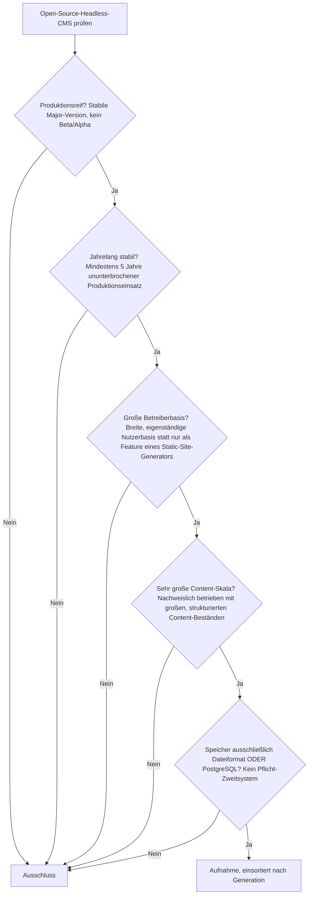
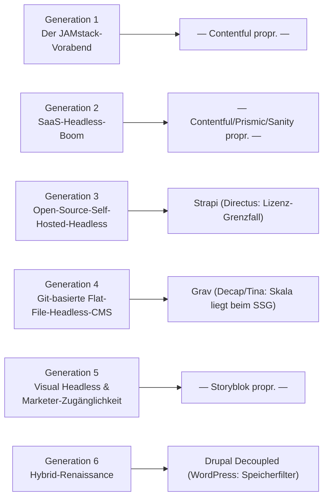

# Produktionsreife Open-Source-Headless-CMS nach Generation — Reifegrad, Evaluation & Content-Skala (Top 3)

Die [Evolution und Architekturen digitaler Headless-CMS](evolution-digitaler-headless-cms.md) zoomt in Generation 2 der [CMS-Chronologie](evolution-digitaler-cms.md) hinein und zerlegt sie in sechs eigene Entwicklungsstufen, die [Topliste bester Headless-CMS 2026](headless-cms-2026-topliste.md) rankt die gesamte Kategorie nach Marktführerschaft, die [PostgreSQL-/Dateiformat-Variante](headless-cms-postgresql-dateiformat-2026-topliste.md) siebt bereits nach Lizenz, Speicherbackend und Aktivität. Diese Seite kombiniert alle Achsen — parallel zur [Wissenssysteme-](produktionsreife-wissenssysteme-generationen-2026-topliste.md), [CMS-](produktionsreife-cms-generationen-2026-topliste.md), [Notebook-](produktionsreife-notebook-systeme-generationen-2026-topliste.md), [Semantische-&-RAG-](produktionsreife-semantische-rag-wissenssysteme-generationen-2026-topliste.md), [Static-Site-Generator-](produktionsreife-static-site-generatoren-generationen-2026-topliste.md), [Wiki-Engine-](produktionsreife-wiki-engines-generationen-2026-topliste.md), [PKM-](produktionsreife-pkm-wissensgraphen-generationen-2026-topliste.md), [Wissenssystem-Framework-](produktionsreife-wissenssystem-frameworks-generationen-2026-topliste.md) und [LMS-Schwesterseite](../e-learning/produktionsreife-lms-generationen-2026-topliste.md) — zu einem bewusst **konservativen** Fünf-Filter-Sieb: produktionsreif · jahrelang stabil · große Betreiberbasis · sehr große Content-Skala · Speicher dateibasiert oder PostgreSQL. Sortiert nach Generation.

!!! warning "Achtung: Fast die gesamte Kategorie ist proprietäres SaaS — nur drei Vertreter bleiben übrig, und keiner ist ein reinrassiges Headless-CMS"
    Vier der sechs Generationen bestehen fast ausschließlich aus proprietären SaaS-Produkten (Contentful, Sanity, Prismic, Storyblok) und fallen komplett am Lizenzfilter heraus. Von den verbleibenden Open-Source-Kandidaten bestehen am Ende nur **drei** alle fünf Filter — und keiner davon ist ein reinrassiges, nur-headless gedachtes Produkt: **Strapi** (das einzige „echte" Headless-CMS der Liste), **Grav** (eigentlich ein Flat-File-CMS, das die Chronologie selbst der Headless-Bewegung zurechnet) und **Drupal im Decoupled-Modus** (ein klassisches CMS, das per JSON:API auch headless betrieben wird). Das bestätigt einen Verdacht, den bereits die [CMS-Generationen-Schwesterseite](produktionsreife-cms-generationen-2026-topliste.md) andeutet: reinrassige Headless-Startups sind entweder proprietär, zu jung oder zu klein — die produktionshärtesten „Headless"-Systeme sind Allrounder mit Headless-Option.

---

## Die fünf harten Filter

!!! note "Hinweis: Nur OSI-anerkannte Lizenzen — und ein Widerspruch zwischen zwei Schwesterseiten"
    Wie in der [Gesamtübersicht](open-source-llm-agent-mcp-systeme.md) zählen ausschließlich OSI-anerkannte Lizenzen. Das kostet dieser Liste sofort **Contentful**, **Sanity**, **Prismic**, **Storyblok**, **Builder.io**, **Hygraph**, **Contentstack**, **Kontent.ai** und **ButterCMS** (alle proprietäres SaaS) sowie **Kirby**/**Statamic** (kostenpflichtige Kernlizenz). Bei **Directus** widerspricht sich diese Dokumentation selbst: Die [PostgreSQL-/Dateiformat-Topliste](headless-cms-postgresql-dateiformat-2026-topliste.md) führt es als GPL-3.0, die [CMS-Generationen-Schwesterseite](produktionsreife-cms-generationen-2026-topliste.md) als seit 2023 auf Business Source License umgestellt und damit nicht mehr OSI-Open-Source. Diese Seite folgt der schärferen, explizit begründeten Einstufung der CMS-Generationen-Schwesterseite und schließt Directus aus — vor einer Produktiv-Entscheidung die aktuelle Lizenzdatei des Projekts selbst prüfen.

---

## Ergebnis: Drei Systeme über drei von sechs Generationen

---

## Systeme nach Generation

### Generation 1 & 2 — warum hier nichts steht

**Generation 1** (Der JAMstack-Vorabend, 2012 – 2015) und **Generation 2** (SaaS-Headless-CMS-Boom, 2013 – 2017) sind architektonisch identisch besetzt: **Contentful** (2013), **Prismic** (2013) und **Sanity** (2017) definierten die Kategorie, sind aber allesamt proprietäre SaaS-Plattformen ohne offenen Quellcode. Keiner der drei prägenden Namen dieser beiden Generationen ist Open Source — die gesamte Gründerzeit der Kategorie scheitert vollständig am Lizenzfilter.

### Generation 3 — Open-Source-Self-Hosted-Headless (2015 – 2016)

| # | System | Speicher | Lizenz | Seit | Content-Skala-Nachweis | Betreiberbasis |
|---|---|---|---|---|---|---|
| 1 | **[Strapi](cms-mcp-server-topliste.md#top-20-im-uberblick)** | PostgreSQL, MySQL/MariaDB oder SQLite offiziell wählbar | MIT | 2015 | Große Content-Kataloge und Omnichannel-APIs im Produktivbetrieb | Dominantes selbst gehostetes Headless-CMS, sehr große Entwickler-Community |

**Strapi** ist das einzige System dieser Liste, das von Anfang an als reines Headless-CMS konzipiert wurde und alle fünf Filter besteht — dieselbe Einstufung, die bereits die [CMS-Generationen-Schwesterseite](produktionsreife-cms-generationen-2026-topliste.md#generation-2-headless-flat-file-ca-2015-2021) für die breitere CMS-Klasse trifft. PostgreSQL ist eine offiziell wählbare Backend-Option, die v4/v5-Serie ist seit Jahren produktionsstabil.

!!! warning "Achtung: Directus — Lizenz-Grenzfall statt klarer Treffer"
    **Directus** (2016, „Daten-first": legt sich über eine bestehende SQL-Datenbank statt ein eigenes Schema zu erzwingen) wäre technisch der zweite naheliegende Treffer dieser Generation — PostgreSQL ist hier die konsequenteste „Postgres als alleinige Wahrheitsquelle"-Umsetzung der ganzen Wissenssysteme-Familie. Der Lizenzstatus ist jedoch umstritten (siehe [Hinweis oben](#die-funf-harten-filter)): Diese Seite folgt der Einstufung als Business Source License seit 2023 und schließt es deshalb aus.

### Generation 4 — Git-basierte Flat-File-Headless-CMS (2015 – 2016)

| # | System | Speicher | Lizenz | Seit | Content-Skala-Nachweis | Betreiberbasis |
|---|---|---|---|---|---|---|
| 2 | **Grav** | Reines Dateiformat, kein Datenbankserver | MIT | 2015 | Websites mit einigen tausend Seiten; jenseits davon wird das Flat-File-Modell zum Engpass | Größte OSI-Flat-File-CMS-Basis, aktives Plugin-/Skeleton-Ökosystem |

**Grav** ist dieselbe dateibasierte Ausnahme, die bereits die [CMS-Generationen-Schwesterseite](produktionsreife-cms-generationen-2026-topliste.md#generation-2-headless-flat-file-ca-2015-2021) beschreibt — hier eingeordnet in die Generation, der die Headless-Chronologie selbst es zurechnet: Git-versionierte Flat-Files statt Datenbank-Overhead. **Kirby**, **Statamic** und **Pico CMS** aus derselben Generation scheitern an Lizenz (Kirby/Statamic kostenpflichtige Kernlizenz) beziehungsweise an zu geringer Aktivität/Betreiberbasis (Pico CMS).

!!! warning "Achtung: Decap CMS und Tina CMS scheitern an der Content-Skala — nicht an Reife oder Lizenz"
    **Decap CMS** (ehem. Netlify CMS, 2015) und **Tina CMS** (Nachfolger von Forestry, 2016) sind beide reif, aktiv gepflegt und quelloffen (MIT bzw. Apache-2.0/MIT) — sie scheitern trotzdem am Skala- **und** Betreiberbasis-Filter: Beide sind reine **Git-basierte Editier-Oberflächen ohne eigenes Content-Backend**. Die tatsächliche Content-Skala liefert der dahinterliegende [Static-Site-Generator](produktionsreife-static-site-generatoren-generationen-2026-topliste.md), nicht das CMS selbst — dieselbe Begründung, mit der bereits die CMS-Generationen-Schwesterseite beide ausschließt.

### Generation 5 — warum hier nichts steht

**Visual Headless & Marketer-Zugänglichkeit** (2017 – 2020) hat mit **Storyblok** genau einen prägenden Vertreter — proprietäres SaaS, scheitert am Lizenzfilter. Kein Open-Source-System hat diese Nische bislang mit vergleichbarer Marktdurchdringung besetzt.

### Generation 6 — Hybrid-Renaissance: Headless-Features in klassischen CMS (ab 2016)

| # | System | Speicher | Lizenz | Seit | Content-Skala-Nachweis | Betreiberbasis |
|---|---|---|---|---|---|---|
| 3 | **Drupal** (Decoupled via JSON:API) | PostgreSQL, MySQL/MariaDB oder SQLite offiziell wählbar | GPL-2.0-or-later | 2001 (JSON:API im Core seit 2019) | Sites mit Millionen Nodes, Multi-Site-Farmen, auch im reinen Decoupled-Betrieb | Sehr große Agentur- und Community-Basis, ausgeprägteste Enterprise-Tiefe der Kategorie |

**Drupal im Decoupled-Modus** ist keine eigenständige Codebasis, sondern dasselbe produktionsreife System, das bereits [Generation 1b der CMS-Generationen-Schwesterseite](produktionsreife-cms-generationen-2026-topliste.md#generation-1b-lamp-content-management-blogging-ca-2000-2010) als klassisches CMS führt — hier betrieben ohne eigenes Frontend, nur über die JSON:API. Es erbt Drupals volle PostgreSQL-Reife und Enterprise-Skala und ist damit der einzige Vertreter dieser Generation, der alle fünf Filter besteht.

!!! warning "Achtung: WordPress REST API scheitert am selben Speicherfilter wie das klassische WordPress"
    Die **WordPress REST API** erschließt zwar Headless-Einsatzszenarien für das größte CMS-Ökosystem weltweit, ändert aber nichts an der zugrunde liegenden Datenbankschicht: WordPress unterstützt im Kern ausschließlich MySQL/MariaDB, kein PostgreSQL — dieselbe Begründung, mit der bereits die [CMS-Generationen-Schwesterseite](produktionsreife-cms-generationen-2026-topliste.md#was-bewusst-nicht-auf-dieser-liste-steht) das klassische WordPress ausschließt.

---

## Dateibasiert oder PostgreSQL? — dieselbe Empfehlung wie bei klassischen CMS

Die drei Treffer dieser Liste spiegeln exakt den Umschlagpunkt der [CMS-Generationen-Schwesterseite](produktionsreife-cms-generationen-2026-topliste.md#dateibasis-oder-postgresql-empfehlung-mit-klarem-umschlagpunkt): **Grav** für entwicklergepflegte Sites bis mittlere Größe ohne Datenbankserver, **Strapi** und **Drupal (Decoupled)** für PostgreSQL ab großer Redaktion, vielen strukturierten Content-Typen oder Multi-Channel-Auslieferung. Ein eigenständiger Umschlagpunkt speziell für Headless-Architekturen existiert nicht — die Speicherfrage entscheidet sich unabhängig davon, ob ein System ein eigenes Frontend mitbringt oder nur eine API ausliefert.

!!! warning "Achtung: Momentaufnahme, Stand August 2026"
    Directus' Lizenzstatus kann sich mit einer künftigen Version wieder ändern; Payload CMS überschreitet die Fünf-Jahres-Marke 2026/2027 gefestigt und ist der aussichtsreichste Nachrücker dieser Liste. Vor einer Produktiv-Entscheidung die aktuelle Lizenz- und Versionsdokumentation prüfen.

---

## Was bewusst nicht auf dieser Liste steht

| System | Erfüllt nicht | Anmerkung |
|---|---|---|
| **Contentful, Sanity, Prismic, Storyblok, Builder.io, Hygraph, Contentstack, Kontent.ai, ButterCMS** | Lizenzfilter | Proprietäre SaaS-Plattformen |
| **Kirby, Statamic** | Lizenzfilter | Kostenpflichtige Kernlizenz |
| **Directus** | Lizenzfilter (Grenzfall) | Business Source License seit 2023 laut CMS-Generationen-Schwesterseite — Widerspruch zu einer anderen Schwesterseite, siehe [Hinweis](#die-funf-harten-filter) |
| **Decap CMS (ehem. Netlify CMS), Tina CMS** | Content-Skala + Betreiberbasis | Reine Git-basierte Editier-Oberflächen ohne eigenes Backend — Skala liefert der dahinterliegende Static-Site-Generator |
| **Forestry** | Aktive Weiterentwicklung | Eingestellt, in Tina CMS aufgegangen |
| **Pico CMS** | Betreiberbasis | Kleinere, ruhigere Nische als Grav |
| **Payload CMS** | „Jahrelang stabil" | Stärkste Wachstumsdynamik seit 2021, Fünf-Jahres-Marke noch nicht sicher gefestigt |
| **KeystoneJS** | Betreiberbasis | Reif genug, aber kleinere Nutzerbasis und wechselhafte Roadmap |
| **Cockpit CMS** | Betreiberbasis | Bewusst leichtgewichtige Nischen-Alternative für kleinere Projekte |
| **WordPress (Headless via REST API)** | Speicherfilter | Erbt die MySQL-only-Beschränkung des WordPress-Kerns |

---

## 🔗 Verwandte Themen

- [Startseite](../../index.md) — zurück zur Dokumentations-Zentrale
- [Evolution und Architekturen digitaler Headless-CMS](evolution-digitaler-headless-cms.md) — das sechsstufige Generationenmodell, nach dem diese Liste sortiert ist
- [Produktionsreife Open-Source-CMS nach Generation (Top 12)](produktionsreife-cms-generationen-2026-topliste.md) — die Schwester-Topliste mit demselben Sieb für die gesamte CMS-Klasse; Strapi, Grav und Drupal erscheinen dort ebenfalls
- [Produktionsreife Open-Source-Static-Site-Generatoren nach Generation (Top 8)](produktionsreife-static-site-generatoren-generationen-2026-topliste.md) — die Systeme, deren Content-Skala Decap CMS/Tina CMS tatsächlich tragen
- [Beste Headless-CMS 2026 (Top 20)](headless-cms-2026-topliste.md) — breiteste Basis-Topliste nach Marktführerschaft
- [Headless-CMS mit PostgreSQL- oder Dateiformat-Speicherung (Top 9)](headless-cms-postgresql-dateiformat-2026-topliste.md) — derselbe Speicher-/Lizenzfilter, nach Rang statt nach Generation und ohne den Content-Skala-Filter
- [Evolution und Architekturen digitaler Content-Management-Systeme](evolution-digitaler-cms.md) — übergeordnetes Generationenmodell, Generation 2 dort entspricht dieser Kategorie im Ganzen
- [Evolution und Architekturen digitaler Composable-CMS](evolution-digitaler-composable-cms.md) — nachfolgende Generation der CMS-Chronologie
- [Beste CMS-Systeme (Open Source) mit MCP-Server (Top 20)](cms-mcp-server-topliste.md) — Agenten-/MCP-Anbindung, u. a. zu Rang 1 dieser Liste
- [Evolution und Architekturen von Drupal](drupal/evolution-digitaler-drupal.md) — vertiefende Produktgeschichte zu Rang 3 dieser Liste
