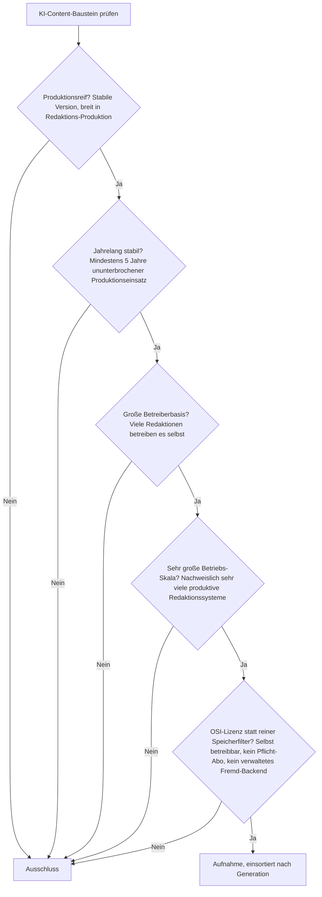
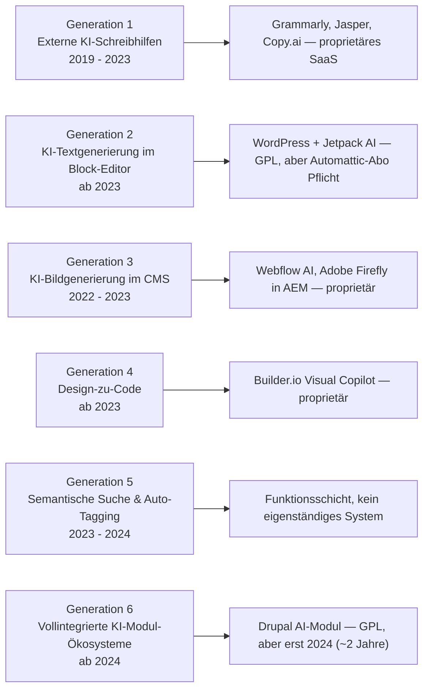
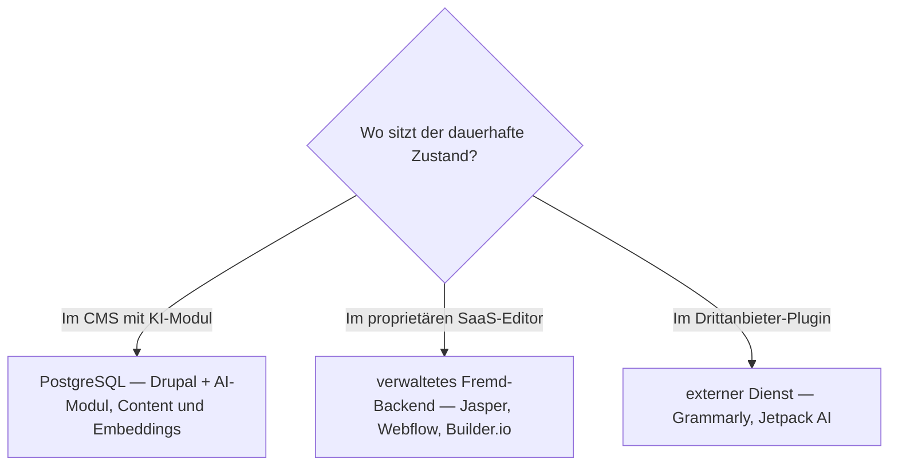

# Produktionsreife KI-Content-Erstellung in CMS nach Generation — Reifegrad, Lizenz & Betriebs-Skala (kein Treffer — der einzige quelloffene Kern-Baustein ist von 2024)

Die [Evolution und Architekturen digitaler KI-Content-Erstellung](evolution-digitaler-ki-content-erstellung.md) zoomt in Generation 4 der [übergeordneten CMS-Zeitachse](evolution-digitaler-cms.md) hinein und teilt die Linie in ein feineres Modell: frühe KI-Schreibhilfen als externes Plugin (1), KI-Textgenerierung im Block-Editor (2), KI-Bildgenerierung im CMS (3), Design-zu-Code-Umsetzung (4), semantische Suche & Auto-Tagging (5), vollintegrierte KI-Modul-Ökosysteme (6). Die [Topliste bester KI-Content-Erstellung 2026](ki-content-erstellung-2026-topliste.md) rankt die gesamte Kategorie. Diese Seite legt das **konservative** Fünf-Filter-Sieb der Familie an und sortiert nach Generation.

!!! warning "Achtung: Kein Treffer — die Kategorie ist ~5 Jahre alt und fast vollständig proprietär"
    Der generative Kern ist erst seit 2021 (GPT-3-Plugins) real, native Editor-Integration seit 2022/23 — jede Generation reißt die Fünf-Jahres-Marke. Die genannten Systeme sind überwiegend **proprietär**: Grammarly, Jasper, Copy.ai (Gen 1), Jetpack AI (Gen 2, Automattic-Abo nötig), Webflow AI, Adobe Firefly (Gen 3), Builder.io Visual Copilot (Gen 4). Der **einzige quelloffene Kern-Baustein** ist das **Drupal AI-Modul** (Generation 6) — GPL, an über 48 Modell-Provider anbindbar über Symfony AI — aber erst seit **2024**, ~2 Jahre. Der praktische Weg ist derselbe wie bei den [KI-adaptiven Lernplattformen](../e-learning/produktionsreife-ki-adaptive-lernplattformen-generationen-2026-topliste.md): reifes CMS ([Drupal, WordPress](produktionsreife-klassische-cms-generationen-2026-topliste.md)) + KI-Modul, wobei die Modul-Schicht die Reife des jüngeren Teils erbt.

---

## Die fünf harten Filter

!!! note "Hinweis: KI als Kern-Modul zählt, KI als Drittanbieter-SaaS nicht"
    Aufgenommen wird, was quelloffen und selbst betreibbar direkt im CMS-Core oder als offizielles Contrib-Modul läuft. Grammarly, Jasper und Copy.ai sind eigenständige SaaS-Dienste; Jetpack AI ist quelloffen (GPL), aber die KI-Funktionen erfordern ein kostenpflichtiges Automattic-Abonnement — beides scheitert am Selbst-Betrieb.

---

## Ergebnis: kein Treffer über sechs Generationsstufen

---

## Warum keine Generation einen Treffer liefert

- **Generation 1 (externe KI-Schreibhilfen)**: **Grammarly**-Integrationen, **Jasper**, **Copy.ai** — eigenständige proprietäre SaaS-Dienste vor jeder CMS-Integration.
- **Generation 2 (KI-Text im Block-Editor)**: **WordPress + Jetpack AI** (2023) — Jetpack ist GPL, aber die KI-Funktionen laufen über einen kostenpflichtigen Automattic-Dienst; kein reiner Selbst-Betrieb.
- **Generation 3 (KI-Bild im CMS)**: **Webflow AI** ist Teil einer proprietären No-Code-Plattform; die **Adobe-Firefly-Integration in AEM** ist proprietär auf proprietär.
- **Generation 4 (Design-zu-Code)**: **Builder.io Visual Copilot** ist ein proprietärer Dienst, der Figma-Designs in Komponenten übersetzt.
- **Generation 5 (semantische Suche & Auto-Tagging)**: eine **Funktionsschicht** — automatische Verschlagwortung, semantische Suche im Editor — kein eigenständig betreibbares Produkt mit eigener Betreiberbasis. Die quelloffene Infrastruktur dafür (Embeddings, pgvector) steht auf der [semantische-RAG-Schwesterseite](produktionsreife-semantische-rag-wissenssysteme-generationen-2026-topliste.md).
- **Generation 6 (vollintegrierte KI-Modul-Ökosysteme)**: Das **Drupal AI-Modul** (2024) ist der einzige quelloffene Kern-Baustein — GPL, Content-Erstellung, semantische Suche, automatischer Alt-Text, über **Symfony AI** an über 48 Modell-Provider anbindbar. **Drupal selbst** besteht das Sieb (Generation-1b-Treffer auf der [klassischen CMS-Seite](produktionsreife-klassische-cms-generationen-2026-topliste.md)), das AI-Modul ist mit ~2 Jahren aber klar unter der Fünf-Jahres-Marke.

---

## Dateibasiert oder PostgreSQL?

Für den einen relevanten Pfad — Drupal + AI-Modul — gilt das eindeutige Ergebnis der [klassischen CMS-Schwesterseite](produktionsreife-klassische-cms-generationen-2026-topliste.md#dateibasiert-oder-postgresql): **PostgreSQL**.

- Das CMS mit KI-Modul hält Inhalte, Revisionen und Embeddings in **PostgreSQL** — dieselbe transaktionale Anforderung wie bei jedem CMS.
- Die generative Modell-Inferenz selbst läuft über externe LLM-APIs oder lokale Modelle; das ist Modell-, nicht Speicherwahl.

Vertiefung zur Datenbankschicht: [PostgreSQL DBA Praxis-Handbuch](../../entwicklung/infrastruktur/postgresql-dba-praxis.md).

!!! warning "Achtung: Momentaufnahme, Stand August 2026"
    Erreicht das **Drupal AI-Modul** (2029) oder ein vergleichbares WordPress-Core-KI-Modul die Fünf-Jahres-Marke mit nachweisbarer Betreiberbasis, bekommt diese Seite ihren ersten Treffer — in Generation 6, PostgreSQL-gestützt.

---

## Was bewusst nicht auf dieser Liste steht

| Baustein | Erfüllt nicht | Anmerkung |
|---|---|---|
| **Drupal AI-Modul** | Reifezeit | GPL, an 48+ Modell-Provider anbindbar — aber erst seit 2024 (~2 Jahre) |
| **Grammarly, Jasper, Copy.ai** | Lizenzfilter | Eigenständige proprietäre SaaS-Schreibhilfen |
| **WordPress + Jetpack AI** | Selbst-Betrieb | Jetpack GPL, aber KI-Funktionen erfordern kostenpflichtiges Automattic-Abo |
| **Webflow AI, Adobe Firefly in AEM** | Lizenzfilter | Proprietäre KI in proprietären Plattformen |
| **Builder.io Visual Copilot** | Lizenzfilter | Proprietärer Design-zu-Code-Dienst |
| **Drupal, WordPress** | Kategorie dieser Seite | Bestehen das Sieb als CMS — auf der [klassischen CMS-Schwesterseite](produktionsreife-klassische-cms-generationen-2026-topliste.md) |

---

## 🔗 Verwandte Themen

- [Evolution und Architekturen digitaler KI-Content-Erstellung](evolution-digitaler-ki-content-erstellung.md) — das feinere Generationenmodell, nach dem diese Liste sortiert ist
- [Beste KI-Content-Erstellung in CMS-Editoren 2026 (Top 20)](ki-content-erstellung-2026-topliste.md) — breiteste Basis-Topliste inklusive aller proprietären Systeme
- [Produktionsreife klassische Open-Source-CMS nach Generation (Top 3)](produktionsreife-klassische-cms-generationen-2026-topliste.md) — Drupal und WordPress als CMS, die man um KI-Module nachrüstet
- [Produktionsreife Composable-CMS & MACH-Systeme nach Generation (kein Treffer)](produktionsreife-composable-cms-generationen-2026-topliste.md) — vorausgehende Generation, ebenfalls ohne Treffer
- [Produktionsreife agentische Content-Ökosysteme nach Generation (kein Treffer)](produktionsreife-agentische-content-oekosysteme-generationen-2026-topliste.md) — nachfolgende Generation, ebenfalls ohne Treffer
- [Produktionsreife KI-adaptive Lernplattformen nach Generation (kein Treffer)](../e-learning/produktionsreife-ki-adaptive-lernplattformen-generationen-2026-topliste.md) — dieselbe „reifes System + zu junges KI-Modul"-Struktur für LMS
- [Klassische Wissensmanagement-, KB- & CMS-Systeme mit LLM-Integration](klassische-wissensmanagement-cms-llm-integration.md) — konkrete LLM-Integrationen im Detail
- [PostgreSQL DBA Praxis-Handbuch](../../entwicklung/infrastruktur/postgresql-dba-praxis.md) — Datenbankschicht des CMS mit KI-Modul
