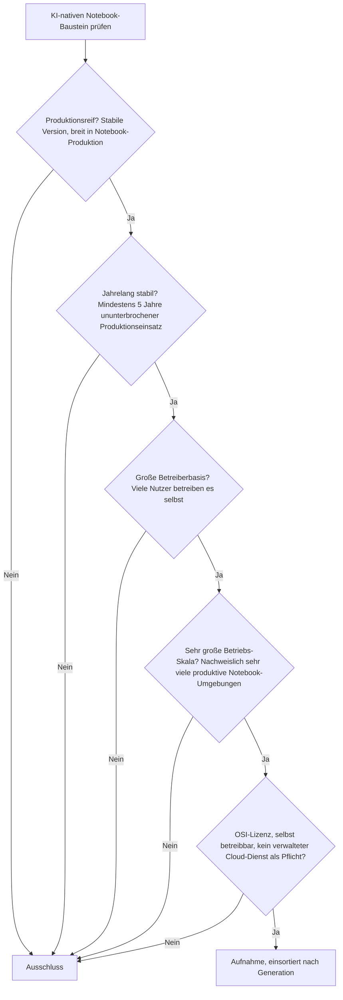
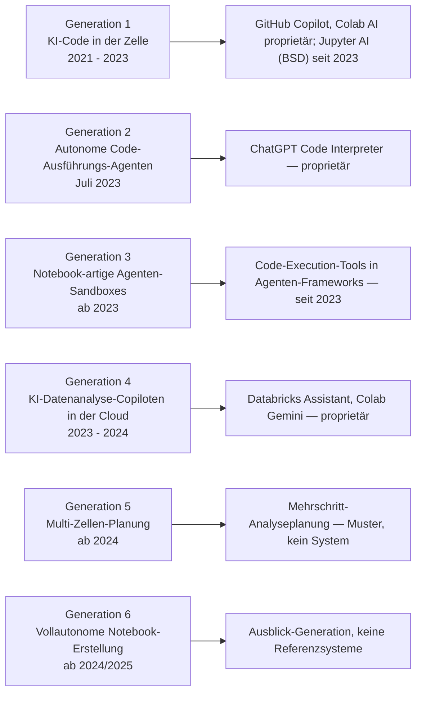
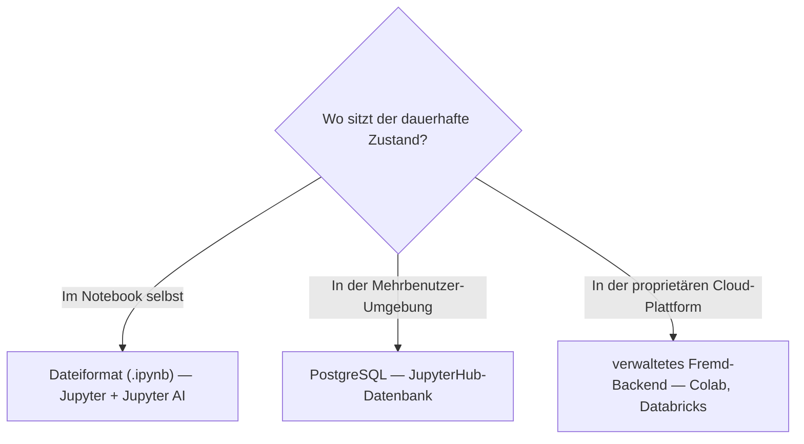

# Produktionsreife KI-native Notebook-Umgebungen nach Generation — Reifegrad, Lizenz & Betriebs-Skala (kein Treffer — der einzige quelloffene Baustein ist von 2023)

Die [Evolution und Architekturen digitaler KI-nativer Notebook-Umgebungen](evolution-digitaler-ki-native-notebooks.md) zoomt in Generation 6 — die aktuelle und letzte — der [übergeordneten Notebook-Zeitachse](evolution-digitaler-notebook-systeme.md) hinein und teilt die Linie in ein feineres Modell: von Autovervollständigung zu KI-generiertem Code in der Zelle (1), autonome Code-Ausführungs-Agenten (2), Notebook-artige Agenten-Sandboxes (3), KI-Datenanalyse-Copiloten in Cloud-Plattformen (4), Multi-Zellen-Planung (5), vollautonome Notebook-Erstellung (6). Die [Topliste bester KI-nativer Notebook-Umgebungen 2026](ki-native-notebooks-2026-topliste.md) rankt die gesamte Kategorie. Diese Seite legt das **konservative** Fünf-Filter-Sieb der Familie an und sortiert nach Generation.

!!! warning "Achtung: Kein Treffer — der einzige quelloffene Baustein (Jupyter AI) ist von 2023"
    Die Kategorie ist erst seit 2021 (GitHub Copilot in Notebooks) real. Fast alle genannten Systeme sind **proprietär**: GitHub Copilot, Google Colab AI/Gemini (Gen 1), ChatGPT Code Interpreter (Gen 2), Databricks Assistant (Gen 4). Der **einzige quelloffene Kern-Baustein** ist **Jupyter AI** (Generation 1b) — offizielles Project-Jupyter-Subprojekt, BSD-3, `%%ai`-Magic + Chat in JupyterLab — aber erst seit **2023**, ~3 Jahre. Die eigentlich „KI-nativen" Generationen 5–6 (Multi-Zellen-Planung, vollautonome Notebook-Erstellung) sind **Bausteine bzw. Ausblick**, ohne Produkte. Der praktische Weg ist derselbe wie bei [Moodle + KI-Plugins](../e-learning/produktionsreife-ki-adaptive-lernplattformen-generationen-2026-topliste.md): reifes **[Jupyter/JupyterLab](produktionsreife-notebook-systeme-generationen-2026-topliste.md)** + Jupyter AI, wobei die KI-Schicht die Reife des jüngeren Teils erbt.

---

## Die fünf harten Filter

!!! note "Hinweis: KI als offizielles Notebook-Feature zählt, KI als proprietärer Cloud-Copilot nicht"
    Aufgenommen wird, was quelloffen und selbst betreibbar direkt in einer Notebook-Umgebung läuft. GitHub Copilot, Colab AI, ChatGPT Code Interpreter und Databricks Assistant sind an proprietäre Editoren bzw. Cloud-Plattformen gebunden.

---

## Ergebnis: kein Treffer über sechs Generationsstufen

---

## Warum keine Generation einen Treffer liefert

- **Generation 1 (KI-Code in der Zelle)**: **GitHub Copilot** in Notebook-Erweiterungen und **Google Colab AI** sind proprietär. **Jupyter AI** (2023) ist der einzige quelloffene Kern-Baustein — offizielles Project-Jupyter-Subprojekt, BSD-3, mit `%%ai`-Magic-Commands und Chat-Interface in JupyterLab. **Jupyter/JupyterLab selbst** besteht das Sieb (Generation-2-Treffer auf der [Notebook-Systeme-Schwesterseite](produktionsreife-notebook-systeme-generationen-2026-topliste.md)), Jupyter AI ist mit ~3 Jahren aber unter der Fünf-Jahres-Marke.
- **Generation 2 (autonome Code-Ausführungs-Agenten)**: **ChatGPT Code Interpreter** (später „Advanced Data Analysis") ist proprietär.
- **Generation 3 (Agenten-Sandboxes)**: Code-Execution-Tools in Agenten-Frameworks (E2B, allgemeine Sandbox-Bausteine) — seit 2023, domänenneutral; siehe [Rust-LMS-Seite](../e-learning/produktionsreife-rust-lms-generationen-2026-topliste.md) zu Firecracker als reifer Sandbox-Basis.
- **Generation 4 (Cloud-Datenanalyse-Copiloten)**: **Databricks Assistant** und die **Colab-Gemini-Integration** sind proprietäre Funktionen proprietärer Plattformen.
- **Generation 5 (Multi-Zellen-Planung)**: ein Agent zerlegt eine Aufgabe in mehrere aufeinander aufbauende Zellen — ein **Muster**, kein Produkt.
- **Generation 6 (vollautonome Notebook-Erstellung)**: die **Ausblick-Generation**, ohne Referenzsysteme.

---

## Dateibasiert oder PostgreSQL?

Für den einen relevanten Pfad — Jupyter/JupyterLab + Jupyter AI — gilt das Ergebnis der [Notebook-Systeme-Schwesterseite](produktionsreife-notebook-systeme-generationen-2026-topliste.md): Das Notebook ist eine **`.ipynb`-Datei** (dateibasiert); erst eine Mehrbenutzer-Umgebung (JupyterHub) braucht eine relationale Datenbank.

Vertiefung zur Datenbankschicht: [PostgreSQL DBA Praxis-Handbuch](../../entwicklung/infrastruktur/postgresql-dba-praxis.md).

!!! warning "Achtung: Momentaufnahme, Stand August 2026"
    Erreicht **Jupyter AI** (2028) oder ein vergleichbares quelloffenes KI-Notebook-Modul die Fünf-Jahres-Marke, bekommt diese Seite ihren ersten Treffer — in Generation 1, dateibasiert.

---

## Was bewusst nicht auf dieser Liste steht

| Baustein | Erfüllt nicht | Anmerkung |
|---|---|---|
| **Jupyter AI** | Reifezeit | Offizielles Project-Jupyter-Subprojekt, BSD-3 — aber erst seit 2023 (~3 Jahre) |
| **GitHub Copilot (in Notebooks)** | Lizenzfilter | Proprietäre Editor-Erweiterung |
| **Google Colab AI / Gemini** | Lizenzfilter | Proprietäre Funktion einer proprietären Cloud-Plattform |
| **ChatGPT Code Interpreter** | Lizenzfilter | Proprietärer Dienst |
| **Databricks Assistant** | Lizenzfilter | Proprietäre Plattform-Funktion |
| **Jupyter / JupyterLab** | Kategorie dieser Seite | Besteht das Sieb als Notebook-System — auf der [Notebook-Systeme-Schwesterseite](produktionsreife-notebook-systeme-generationen-2026-topliste.md) |

---

## 🔗 Verwandte Themen

- [Evolution und Architekturen digitaler KI-nativer Notebook-Umgebungen](evolution-digitaler-ki-native-notebooks.md) — das feinere Generationenmodell, nach dem diese Liste sortiert ist
- [Beste KI-native Notebook-Umgebungen 2026 (Top 20)](ki-native-notebooks-2026-topliste.md) — breiteste Basis-Topliste inklusive aller proprietären Systeme
- [Produktionsreife Open-Source-Notebook-Systeme nach Generation (Top 4)](produktionsreife-notebook-systeme-generationen-2026-topliste.md) — Jupyter/JupyterLab als Umgebung, die man um Jupyter AI nachrüstet
- [Produktionsreife Reaktive-Notebooks nach Generation (Top 1)](produktionsreife-reaktive-notebooks-generationen-2026-topliste.md) — vorausgehende Generation
- [Produktionsreife Rust-Bausteine für Notebooks nach Generation (Top 4)](produktionsreife-rust-notebooks-generationen-2026-topliste.md) — die Bauteil-Ebene der Notebook-Werkzeugkette
- [Produktionsreife KI-adaptive Lernplattformen nach Generation (kein Treffer)](../e-learning/produktionsreife-ki-adaptive-lernplattformen-generationen-2026-topliste.md) — dieselbe „reifes System + zu junges KI-Modul"-Struktur
- [PostgreSQL DBA Praxis-Handbuch](../../entwicklung/infrastruktur/postgresql-dba-praxis.md) — Datenbankschicht einer Mehrbenutzer-Notebook-Umgebung
