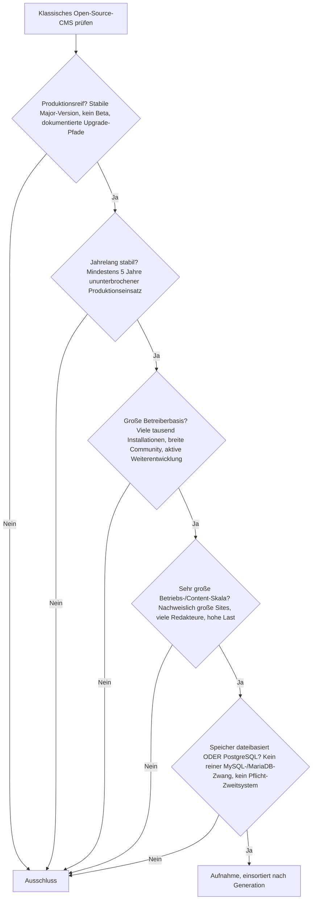
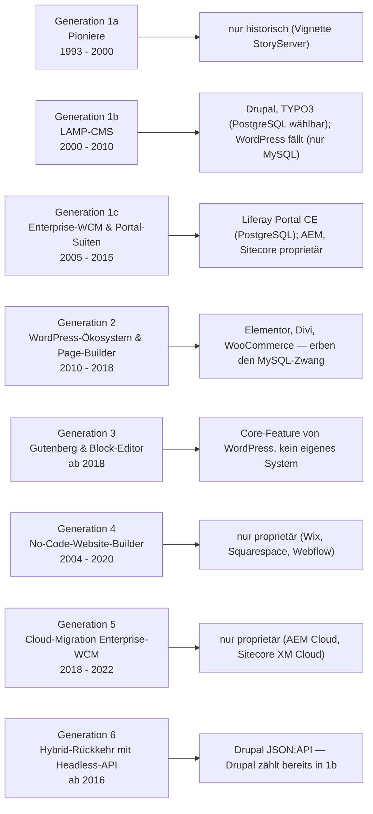
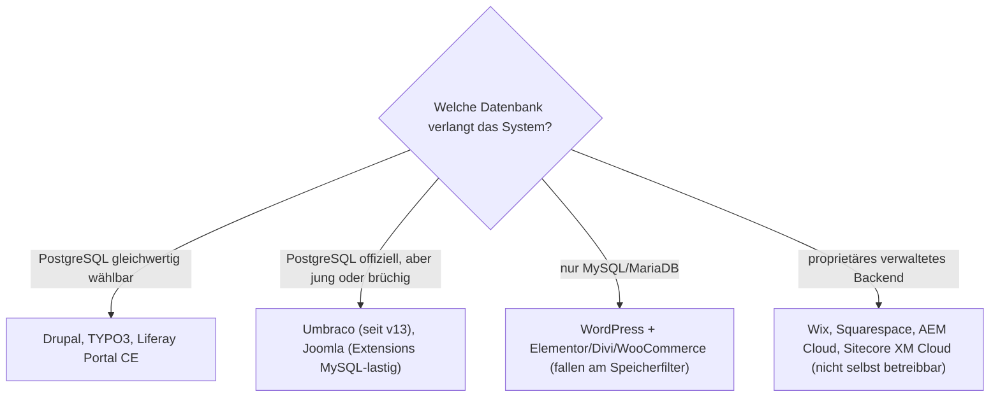

# Produktionsreife klassische Open-Source-CMS nach Generation — Reifegrad, Evaluation & Betriebs-Skala (Top 3)

Die [Evolution und Architekturen digitaler klassischer CMS](evolution-digitaler-klassische-cms.md) zoomt in Generation 1 der [übergeordneten CMS-Zeitachse](evolution-digitaler-cms.md) hinein und teilt die klassische, monolithische Linie in ein feineres Modell: Pioniere, LAMP-CMS & Enterprise-WCM (1), WordPress-Ökosystem-Dominanz & Page-Builder (2), Gutenberg & Block-Editor-Paradigma (3), No-Code-Website-Builder (4), Cloud-Migration klassischer Enterprise-WCM (5), Hybrid-Rückkehr mit optionaler Headless-API (6). Die [Topliste bester klassischer CMS 2026](klassische-cms-2026-topliste.md) rankt die gesamte Kategorie, die [Speicherbackend-Variante](klassische-cms-postgresql-dateiformat-2026-topliste.md) filtert nach Lizenz und Persistenz. Diese Seite legt dasselbe **konservative** Fünf-Filter-Sieb an wie die [CMS-Basisseite](produktionsreife-cms-generationen-2026-topliste.md), die [Headless-](produktionsreife-headless-cms-generationen-2026-topliste.md) und die [klassische-LMS-Schwesterseite](../e-learning/produktionsreife-klassische-lms-generationen-2026-topliste.md) — produktionsreif · jahrelang stabil · große Betreiberbasis · sehr große Betriebs-/Content-Skala · Speicher dateibasiert oder PostgreSQL —, hier nur für die *klassische CMS-Linie* und nach deren feinerem Sechs-Generationen-Modell sortiert.

!!! warning "Achtung: Das dominierende klassische CMS besteht das Sieb nicht — WordPress fällt am Speicherfilter"
    Nur **Drupal**, **TYPO3** und **Liferay Portal** (Community Edition) bestehen alle fünf Filter. Der Grund ist derselbe strukturelle Bruch wie bei der [klassischen LMS-Linie](../e-learning/produktionsreife-klassische-lms-generationen-2026-topliste.md): **WordPress** — mit Abstand die größte installierte Basis aller CMS weltweit, überreif und riesig skaliert — unterstützt im Kern **ausschließlich MySQL/MariaDB, kein PostgreSQL**. Damit fällt die gesamte Generation-2/3-Linie mit (Elementor, Divi, WooCommerce, Gutenberg bauen alle auf demselben Kern). Die **Generationen 4–5** (Wix, Squarespace, Webflow; Adobe Experience Manager Cloud, Sitecore XM Cloud) sind vollständig proprietäres SaaS. Es besteht also ausgerechnet die **Enterprise-Open-Source-Hälfte** — gerade *weil* sie von Anfang an Multi-Datenbank ausgelegt ist. Grenzfälle: **Joomla** (PostgreSQL offiziell, in der Praxis brüchig), **Umbraco** (PostgreSQL erst seit v13/2024), **Alfresco CE**, **October CMS** ([Speicher-Fazit](#dateibasiert-oder-postgresql)).

---

## Die fünf harten Filter

!!! note "Hinweis: nur OSI-Lizenzen, nur selbst betreibbare Systeme"
    Aufgenommen werden Systeme unter OSI-anerkannter Lizenz, die man selbst betreiben kann. Das schließt die gesamte SaaS-/Enterprise-Hälfte der [Basis-Topliste](klassische-cms-2026-topliste.md) aus — **Wix**, **Squarespace**, **Webflow**, **Adobe Experience Manager**, **Sitecore XM Cloud** — sowie **Craft CMS** und **October CMS**, deren Kernlizenz einen kostenpflichtigen Erwerb für den produktiven Einsatz verlangt (October seit 2020).

---

## Ergebnis: drei Systeme über sechs Generationsstufen

---

## Systeme nach Generation

### Generation 1b — LAMP-Content-Management & Blogging-Systeme (2000 – 2010)

| # | System | Speicher | Lizenz | Seit | Skala-Nachweis | Betreiberbasis |
|---|---|---|---|---|---|---|
| 1 | **[Drupal](drupal/evolution-digitaler-drupal.md)** | PostgreSQL, MySQL/MariaDB oder SQLite offiziell gleichwertig | GPL-2.0-or-later | 2001 | Regierungsportale, Großuniversitäten, internationale Medien-Sites mit sehr hoher Last | Ausgeprägteste Enterprise-Tiefe der Open-Source-CMS, hauptamtliches Kernteam plus großes Modul- und Agentur-Ökosystem |
| 2 | **TYPO3** | PostgreSQL offiziell unterstützt seit Version 9 (2018) | GPL-2.0-or-later | 2000 | Dominant im deutschsprachigen Enterprise- und Behördenraum, große mehrsprachige Konzern-Sites | Starke, langlebige Community und Agenturlandschaft im DACH-Raum, geregelte LTS-Release-Politik |

**Drupal** ist der klare Treffer der LAMP-Generation und das einzige klassische CMS mit großer Betreiberbasis, bei dem PostgreSQL eine **von Anfang an gleichwertige, offiziell dokumentierte** Backend-Wahl ist. Über zwei Jahrzehnte Produktionshistorie, granulares Rechte- und Workflow-Modell, vollständige Headless-Option über JSON:API (Generation 6). Vertiefend: [Evolution und Architekturen von Drupal](drupal/evolution-digitaler-drupal.md).

**TYPO3** besteht dasselbe Sieb: seit 2000 in Produktion, PostgreSQL seit Version 9 (2018) offiziell — also lange genug für die Fünf-Jahres-Marke auch auf der Speicherachse. Der Schwerpunkt liegt klar im europäischen, besonders deutschsprachigen Enterprise-Segment.

### Generation 1c — Enterprise-WCM & Portal-Suiten (2005 – 2015)

| # | System | Speicher | Lizenz | Seit | Skala-Nachweis | Betreiberbasis |
|---|---|---|---|---|---|---|
| 3 | **Liferay Portal** (Community Edition) | PostgreSQL offiziell unterstützt | LGPL-2.1 | 2004 | Führend bei großen Intranet-/Portal-Installationen mit komplexer Rechtestruktur und vielen tausend Nutzern | Etablierte Enterprise-Community neben dem kommerziellen Liferay DXP; kontinuierliche Releases |

**Liferay Portal CE** ist der Enterprise-WCM-Treffer: seit rund zwanzig Jahren in Produktion, PostgreSQL offiziell unterstützt, sehr große Portal-Installationen. Es ist eher Portal-Framework als reines Redaktions-CMS — die [Evolution-Seite](evolution-digitaler-klassische-cms.md#generation-1-pioniere-lamp-cms-enterprise-wcm-1993-2015) führt es aber als Kernvertreter der Generation 1c, und für die klassische, monolithische Architektur (Rendering und Content-Speicher im selben System) ist es ein sauberes Beispiel.

### Generation 1a & 2 – 6 — warum hier nichts (Neues) steht

- **Generation 1a (Pioniere)**: Vignette StoryServer, Apache-SSI-Seiten — historisch, proprietär oder längst eingestellt.
- **Generation 2 (WordPress-Ökosystem & Page-Builder)**: **WordPress** selbst ist überreif, hat die mit Abstand größte installierte Basis und skaliert bis zu den größten Sites der Welt — scheitert aber an einer einzigen technischen Randbedingung: Der Kern unterstützt **offiziell nur MySQL/MariaDB**. Die inoffiziellen PostgreSQL-Adapter (PG4WP u. Ä.) sind nicht produktionsreif gepflegt. **Elementor**, **Divi** und **WooCommerce** setzen direkt auf diesem Kern auf und erben die Einschränkung. Damit fällt die gesamte Generation-2-Linie am Speicherfilter — dieselbe Begründung wie in der [Speicherbackend-Topliste](klassische-cms-postgresql-dateiformat-2026-topliste.md#wordpress-fallt-ausgerechnet-am-speicherkriterium).
- **Generation 3 (Gutenberg & Block-Editor)**: Gutenberg-Core und Full Site Editing sind **Funktionsschichten im WordPress-Core**, kein eigenständig betreibbares System — und erben denselben MySQL-Zwang.
- **Generation 4 (No-Code-Website-Builder)**: **Wix**, **Squarespace**, **Webflow** — sämtlich proprietäres, vollständig gehostetes SaaS. Die No-Code-Website-Builder-Kategorie entstand als kommerzielle Klasse und hatte nie einen quelloffenen, selbst betreibbaren Vertreter mit großer Betreiberbasis.
- **Generation 5 (Cloud-Migration Enterprise-WCM)**: **Adobe Experience Manager as a Cloud Service**, **Sitecore XM Cloud** — proprietär und als verwalteter Betrieb konzipiert.
- **Generation 6 (Hybrid-Rückkehr mit Headless-API)**: **WordPress REST API** ändert nichts am MySQL-Zwang. **Drupal JSON:API** ist eine Zusatz-API auf einem System, das bereits als Generation-1b-Treffer zählt — Generation 6 bringt keinen neuen Kandidaten.

### Grenzfälle

| System | Warum knapp daneben |
|---|---|
| **Joomla** | Reif (seit 2005), GPL-2.0+, drittgrößtes CMS-Ökosystem — PostgreSQL ist zwar seit Joomla 3.0 wählbar, in der Praxis aber schwach getestet: viele Erweiterungen setzen MySQL voraus. Grenzfall am Speicherfilter |
| **Umbraco** | Führende .NET-Wahl, MIT-lizenziert, große Betreiberbasis — PostgreSQL-Support erst seit Version 13 (Dezember 2023), also unter fünf Jahre. Ohne PostgreSQL ist das Backend SQL Server (proprietär) |
| **Alfresco** (Community Edition) | Seit ~2005, LGPL-3.0, PostgreSQL empfohlen — aber die Community-Edition-Weiterentwicklung ist unter Hyland spürbar zurückgefahren; stärker Dokumentenmanagement- als CMS-System |
| **October CMS** | Modernes Laravel-Fundament, PostgreSQL über Eloquent — aber kleines Ökosystem und seit 2020 kostenpflichtige Lizenz für den produktiven Einsatz (wie Craft CMS) |

---

## Dateibasiert oder PostgreSQL?

Die Antwort ist dieselbe wie auf der [CMS-Basisseite](produktionsreife-cms-generationen-2026-topliste.md) und der [klassischen LMS-Schwesterseite](../e-learning/produktionsreife-klassische-lms-generationen-2026-topliste.md): **PostgreSQL** — und in der klassischen CMS-Linie besonders trennscharf.

- Ein klassisches CMS ist ein **transaktionales System of Record**: Inhalte, Revisionen, Nutzer, Rechte, Workflows — alles konsistent, alles gleichzeitig bearbeitbar. Flache Dateien scheiden aus, sobald mehrere Redakteure und Publikations-Workflows dazukommen; **rein dateibasierte** klassische CMS mit großer Betreiberbasis gibt es nicht (das ist die Domäne der [Static-Site-Generatoren](produktionsreife-static-site-generatoren-generationen-2026-topliste.md)).
- **PostgreSQL ist Pflicht oder gleichwertig** → **Drupal**, **TYPO3**, **Liferay Portal CE**.
- **Nur MySQL/MariaDB** → die gesamte WordPress-Linie. Wer WordPress-Nähe mit PostgreSQL kombinieren will, findet in **Drupal** die architektonisch nächste Alternative mit vergleichbarer Enterprise-Tiefe.

Vertiefung zur Datenbankschicht: [PostgreSQL DBA Praxis-Handbuch](../../entwicklung/infrastruktur/postgresql-dba-praxis.md).

!!! warning "Achtung: Momentaufnahme, Stand August 2026"
    Datenbank-Unterstützung ändert sich mit Major-Releases. Erreicht **Umbracos** PostgreSQL-Support die Fünf-Jahres-Marke (2029) oder festigt Joomla seine PostgreSQL-Kompatibilität im Extension-Ökosystem, wächst diese Liste. **Drupal**, **TYPO3** und **Liferay Portal CE** sind die stabilen Konstanten.

---

## Was bewusst nicht auf dieser Liste steht

| System | Erfüllt nicht | Anmerkung |
|---|---|---|
| **WordPress** (Core) | Speicherfilter | Nur MySQL/MariaDB — ansonsten in jeder Hinsicht überqualifiziert: größte installierte Basis aller CMS, überreif, riesige Skala |
| **Elementor, Divi, WooCommerce** | Speicherfilter | Bauen auf dem WordPress-Kern auf und erben dessen MySQL-Zwang |
| **Gutenberg, Full Site Editing** | Kategorie + Speicherfilter | Funktionsschichten im WordPress-Core, kein eigenständiges System |
| **Joomla** | Speicherfilter (Grenzfall) | PostgreSQL wählbar, aber Extension-Ökosystem stark MySQL-orientiert |
| **Umbraco** | Speicherfilter (Reifezeit) | PostgreSQL erst seit v13 (2024); sonst SQL Server |
| **Alfresco** (CE) | Betreiberbasis / Aktivität | Community-Edition-Entwicklung unter Hyland zurückgefahren |
| **October CMS, Craft CMS** | Lizenzfilter | Kostenpflichtiger Erwerb für den produktiven Einsatz |
| **Concrete CMS, ProcessWire, Contao** | Speicherfilter | Kein offizieller PostgreSQL-Support |
| **Wix, Squarespace, Webflow** | Lizenzfilter | Proprietäres, vollständig gehostetes SaaS ohne selbst betreibbare Variante |
| **Adobe Experience Manager, Sitecore XM Cloud** | Lizenzfilter | Proprietäre Enterprise-/Cloud-WCM |

---

## 🔗 Verwandte Themen

- [Evolution und Architekturen digitaler klassischer CMS](evolution-digitaler-klassische-cms.md) — das feinere Sechs-Generationen-Modell der klassischen Linie, nach dem diese Liste sortiert ist
- [Beste klassische CMS 2026 (Top 20)](klassische-cms-2026-topliste.md) — breiteste Basis-Topliste inklusive proprietärer und historischer Systeme
- [Klassische CMS mit PostgreSQL-/Dateiformat-Speicherung (Top 7)](klassische-cms-postgresql-dateiformat-2026-topliste.md) — mittlere Filterstufe: Lizenz, Speicher, Aktivität, aber ohne die Fünf-Jahres-/Skala-Härte dieser Seite
- [Produktionsreife Open-Source-CMS nach Generation (Top 12)](produktionsreife-cms-generationen-2026-topliste.md) — allgemeine Schwesterseite über alle fünf CMS-Generationen
- [Produktionsreife Open-Source-Headless-CMS nach Generation (Top 3)](produktionsreife-headless-cms-generationen-2026-topliste.md) — Schwesterseite für die nachfolgende, API-first-Generation
- [Produktionsreife klassische Open-Source-LMS nach Generation (Top 1)](../e-learning/produktionsreife-klassische-lms-generationen-2026-topliste.md) — dieselbe strukturelle Aussage für LMS: die Massenmarkt-Systeme sind an MySQL gebunden, nur die Enterprise-Hälfte besteht
- [Evolution und Architekturen von Drupal](drupal/evolution-digitaler-drupal.md) — vertiefend zu Rang 1
- [Beste Static-Site- & Docs-Generatoren 2026 (Top 20)](static-site-generatoren-2026-topliste.md) — die dateibasierte Alternative zum datenbankgestützten klassischen CMS
- [PostgreSQL DBA Praxis-Handbuch](../../entwicklung/infrastruktur/postgresql-dba-praxis.md) — Datenbankschicht hinter den drei Rängen dieser Liste
