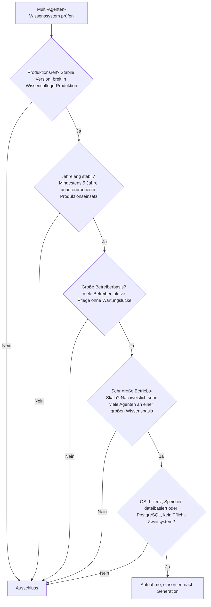
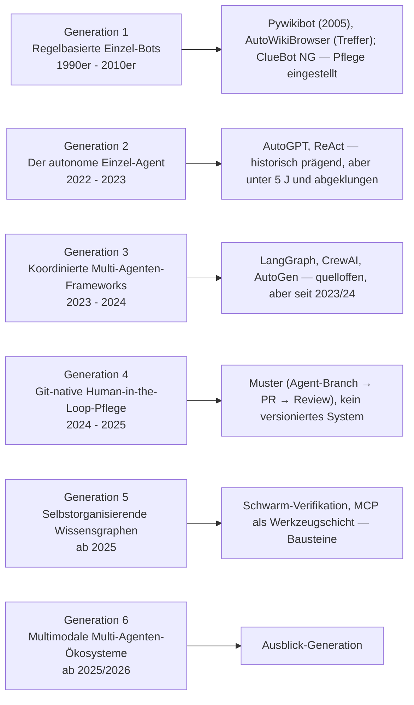
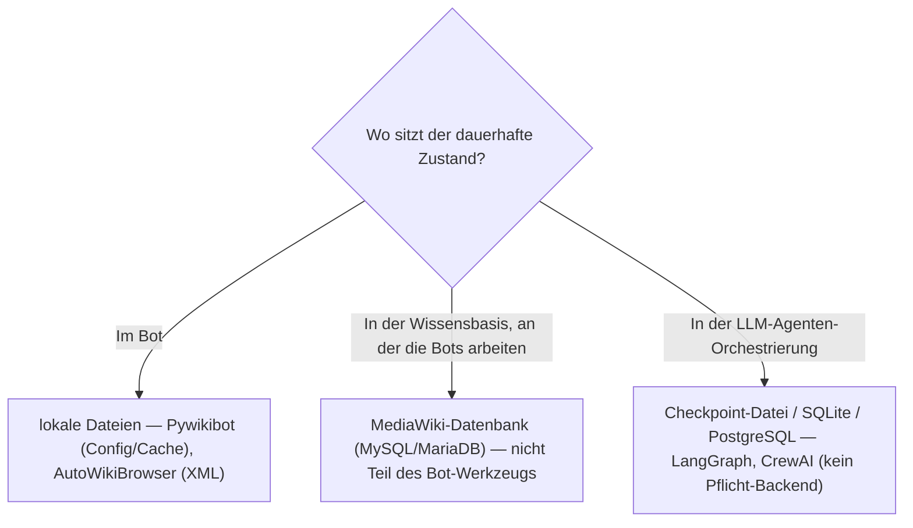

# Produktionsreife Multi-Agenten-Wissensökosysteme nach Generation — Reifegrad, Lizenz & Betriebs-Skala (Top 2 — nur die klassischen Wikipedia-Bots von vor der LLM-Ära)

Die [Evolution und Architekturen digitaler Multi-Agenten-Wissensökosysteme](evolution-digitaler-multiagenten-wissensoekosysteme.md) folgt der **Orchestrierungs**-Zeitachse von Generation 6 der [übergeordneten Wissenssysteme-Zeitachse](evolution-digitaler-wissenssysteme.md): regelbasierte Einzel-Bots (1), der autonome Einzel-Agent (2), koordinierte Multi-Agenten-Frameworks (3), Git-native Human-in-the-Loop-Wissenspflege (4), selbstorganisierende Wissensgraphen & Schwarm-Verifikation (5), multimodale Multi-Agenten-Ökosysteme (6). Die [Basis-Topliste](multiagenten-wissensoekosysteme-2026-topliste.md) und die [Speicherbackend-Variante](multiagenten-wissensoekosysteme-postgresql-dateiformat-2026-topliste.md) ranken die Kategorie. Diese Seite legt das **konservative** Fünf-Filter-Sieb der Familie an und sortiert nach Generation.

!!! warning "Achtung: Nur Generation 1 besteht — die gesamte LLM-native Multi-Agenten-Ära ist unter fünf Jahre"
    Dasselbe Muster wie bei den [Rust-KI-Anwendungen](../../künstliche-intelligenz/produktionsreife-rust-ki-anwendungen-generationen-2026-topliste.md): Nur der **eine Baustein von vor dem Boom** besteht. Hier ist es die **klassische Wikipedia-Bot-Infrastruktur** — **Pywikibot** (seit 2005, MIT) und **AutoWikiBrowser** (GPL) — die seit rund zwei Jahrzehnten tausende automatisierte Agenten koordiniert an der größten offenen Wissensbasis der Welt arbeiten lässt. Die **gesamten Generationen 2–6** (AutoGPT, LangGraph, CrewAI, AutoGen, Letta, MetaGPT, Camel-AI …) sind **nach 2022 entstanden** — unter fünf Jahre, überwiegend in Bewegung. **ClueBot NG** (Gen 1c, ML-Vandalismus-Erkennung) läuft produktiv weiter, aber die Codepflege ist praktisch eingestellt — Grenzfall.

---

## Die fünf harten Filter

!!! note "Hinweis: „Multi-Agenten" ist hier weit gefasst"
    Aufgenommen wird, was 2026 produktiv mehrere automatisierte Akteure koordiniert an einer gemeinsamen Wissensbasis arbeiten lässt — auch wenn die Akteure deterministische Skript-Bots statt LLM-Agenten sind. „Sehr aktive Weiterentwicklung" bedeutet nachweisliche Kontinuität ohne Wartungslücke, nicht zwingend hohe Release-Frequenz (dieselbe Auslegung wie bei DokuWiki/TiddlyWiki in den PKM-Toplisten).

---

## Ergebnis: zwei Treffer über sechs Generationsstufen

---

## Systeme nach Generation

### Generation 1 — Regelbasierte Einzel-Bots (1990er – 2010er)

| # | System | Speicher | Lizenz | Seit | Skala-Nachweis |
|---|---|---|---|---|---|
| 1 | **[Pywikibot](mediawiki/mediawiki-python-bot.md)** | lokale Konfigurations-/Cache-Dateien | MIT | 2005 | Fundament des gesamten Wikipedia-Bot-Ökosystems — tausende registrierte Bots führen Massenbearbeitungen (Kategorien, Interwiki-Links, Wartungsläufe) über alle Wikimedia-Projekte hinweg aus |
| 2 | **AutoWikiBrowser** (AWB) | lokale XML-/Einstellungsdateien | GPL | ~2005 | Halbautomatisches Massenbearbeitungs-Werkzeug, von der Wikipedia-Editoren-Community kontinuierlich gepflegt |

**Pywikibot** ist der klare Treffer: seit rund zwanzig Jahren das Standard-Framework für Bot-Zugriff auf die MediaWiki-API, MIT-lizenziert, dateibasiert, in gigantischer Skala an der größten offenen Wissensbasis der Welt. Kein LLM, keine Autonomie über die zugewiesene Regel hinaus — aber exakt die Definition eines Multi-Agenten-Wissensökosystems im klassischen Sinn: viele koordinierte Akteure, eine gemeinsame Wissensbasis. **AutoWikiBrowser** ergänzt dasselbe Profil mit ruhiger, aber lückenloser Community-Pflege.

**ClueBot NG** (Generation 1c, ML-Vandalismus-Erkennung seit 2010) läuft produktiv weiter und revertiert automatisiert Vandalismus, aber die aktive Codepflege ist laut [Speicherbackend-Schwesterseite](multiagenten-wissensoekosysteme-postgresql-dateiformat-2026-topliste.md#was-bewusst-nicht-in-dieser-liste-steht) praktisch eingestellt — Grenzfall an der Kontinuität.

### Generation 2 – 6 — warum hier nichts steht

- **Generation 2 (autonomer Einzel-Agent)**: das **ReAct-Paper** (2022) und **AutoGPT** (2023) prägten die Kategorie, sind aber unter fünf Jahre — und AutoGPTs Entwicklungstempo ist seit dem Hype 2023 deutlich abgeklungen.
- **Generation 3 (koordinierte Multi-Agenten-Frameworks)**: **LangGraph**, **CrewAI**, **AutoGen** sind die dominanten quelloffenen Frameworks — alle seit 2023/24, dieselbe Einordnung wie auf der [Autonome-KI-Agenten-Schwesterseite](../../künstliche-intelligenz/produktionsreife-autonome-ki-agenten-generationen-2026-topliste.md). Auch die Speicherbackend-Variante dieser Kategorie (Top 14) filtert nur nach Lizenz und Speicher, nicht nach Reifezeit.
- **Generation 4 (Git-native Human-in-the-Loop-Pflege)**: Agent-Branch → automatisierte Prüfung → Pull Request → menschlicher Review — ein **Muster** (das dieses Repository selbst nutzt), kein versioniertes System.
- **Generation 5 (selbstorganisierende Wissensgraphen)**: Schwarm-Verifikation und MCP als gemeinsame Werkzeugschicht — **Bausteine**, seit ~2025.
- **Generation 6 (multimodale Multi-Agenten-Ökosysteme)**: die **Ausblick-Generation**, ab 2025/2026.

---

## Dateibasiert oder PostgreSQL?

Zweigeteilt — für die Treffer eindeutig **dateibasiert**, für die Wissensbasis darunter **relational**.

- **Pywikibot** und **AutoWikiBrowser** halten nur lokale Konfigurations- und Cache-Dateien — sie schreiben über die API in ein fremdes Wiki, das seinen Zustand selbst verwaltet.
- Die LLM-nativen Frameworks der oberen Generationen kommen ebenfalls ohne Pflicht-Backend aus (Session-State als Datei/SQLite, optional PostgreSQL) — sie scheitern nicht am Speicher, sondern an der Reifezeit.

Vertiefung zur Datenbankschicht: [PostgreSQL DBA Praxis-Handbuch](../../entwicklung/infrastruktur/postgresql-dba-praxis.md).

!!! warning "Achtung: Momentaufnahme, Stand August 2026"
    Erreicht eines der LLM-Multi-Agenten-Frameworks (LangGraph, AutoGen) fünf Jahre Produktion mit dann breiter, wissenssystem-spezifischer Betreiberbasis, wächst diese Liste. **Pywikibot** ist die stabile Konstante.

---

## Was bewusst nicht auf dieser Liste steht

| System | Erfüllt nicht | Anmerkung |
|---|---|---|
| **ClueBot NG** | Kontinuität | Läuft produktiv, aber ohne nennenswerte aktive Codepflege |
| **AutoGPT, BabyAGI** | Reifezeit + Aktivität | Historisch prägend für Generation 2, aber seit dem Hype 2023 deutlich abgeklungen |
| **LangGraph, CrewAI, AutoGen, AG2** | Reifezeit | Dominante quelloffene Frameworks, alle seit 2023/24 |
| **Letta, MetaGPT, Camel-AI, ChatDev, OpenHands** | Reifezeit | Agentisches Gedächtnis bzw. simulierte Software-Firmen, alle seit 2023/24 |
| **OpenAI AgentKit** | Lizenzfilter | Herstellerseitiges, nicht offen lizenziertes Toolkit |
| **Git-native PR-Pflege, Schwarm-Verifikation** | Kategorie | Muster bzw. Bausteine, keine versionierten Systeme |

---

## 🔗 Verwandte Themen

- [Evolution und Architekturen digitaler Multi-Agenten-Wissensökosysteme](evolution-digitaler-multiagenten-wissensoekosysteme.md) — das Orchestrierungs-Generationenmodell, nach dem diese Liste sortiert ist
- [Beste Multi-Agenten-Wissensökosysteme 2026 (Top 20)](multiagenten-wissensoekosysteme-2026-topliste.md) — breiteste Basis-Topliste inklusive aller LLM-nativen Frameworks
- [Multi-Agenten-Wissensökosysteme mit PostgreSQL-/Dateiformat-Speicherung (Top 14)](multiagenten-wissensoekosysteme-postgresql-dateiformat-2026-topliste.md) — mittlere Filterstufe: Lizenz und Speicher, ohne die Fünf-Jahres-/Skala-Härte dieser Seite
- [Produktionsreife Rust-Bausteine für KI-Anwendungen nach Generation (Top 1)](../../künstliche-intelligenz/produktionsreife-rust-ki-anwendungen-generationen-2026-topliste.md) — dieselbe Struktur: nur der eine Baustein von vor dem LLM-Boom besteht
- [Produktionsreife autonome KI-Agenten nach Generation (kein Treffer)](../../künstliche-intelligenz/produktionsreife-autonome-ki-agenten-generationen-2026-topliste.md) — die allgemeine Agenten-Kategorie, dieselbe „zu jung"-Struktur für die Generationen 2–6
- [MediaWiki Python Bot Automatisierung](mediawiki/mediawiki-python-bot.md) — praktische Umsetzung von Rang 1
- [LLM-Wiki-Pattern (Karpathy-Muster)](llm-wiki-pattern-karpathy.md) — das Human-in-the-Loop-Muster der Generation 4, das dieses Repository selbst nutzt
- [PostgreSQL DBA Praxis-Handbuch](../../entwicklung/infrastruktur/postgresql-dba-praxis.md) — Datenbankschicht der LLM-Agenten-Orchestrierung
