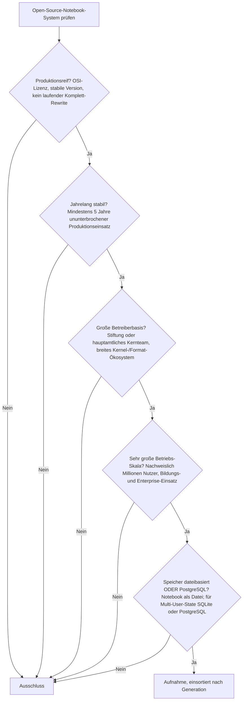
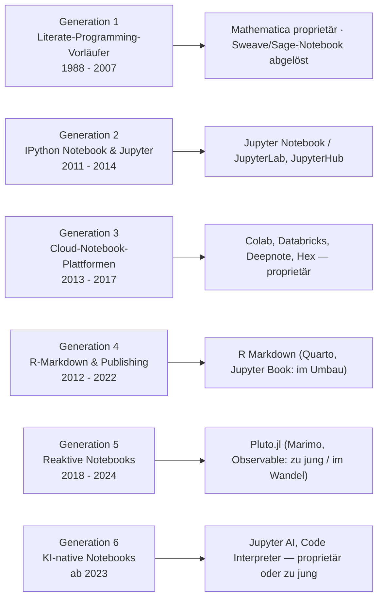

# Produktionsreife Open-Source-Notebook-Systeme nach Generation — Reifegrad, Evaluation & Betriebs-Skala (Top 4)

Die [Evolution und Architekturen digitaler Notebook-Systeme](evolution-digitaler-notebook-systeme.md) ordnet die „Executable"-Notebook-Kategorie chronologisch in sechs Generationen — von Mathematica über Jupyter und die Cloud-Plattformen bis zu reaktiven und KI-nativen Umgebungen. Die [Topliste bester Notebook-Systeme 2026](notebook-systeme-2026-topliste.md) rankt die gesamte Kategorie. Diese Seite legt — parallel zur [Wissenssysteme-](produktionsreife-wissenssysteme-generationen-2026-topliste.md), [CMS-](produktionsreife-cms-generationen-2026-topliste.md), [Semantische-&-RAG-](produktionsreife-semantische-rag-wissenssysteme-generationen-2026-topliste.md) und [LMS-Schwesterseite](../e-learning/produktionsreife-lms-generationen-2026-topliste.md) — dasselbe bewusst **konservative** Fünf-Filter-Sieb an: produktionsreif · jahrelang stabil · große Betreiberbasis · sehr große Betriebs-Skala · Speicher dateibasiert oder PostgreSQL. Sortiert nach Generation.

!!! warning "Achtung: Ein seit über einem Jahrzehnt stabiler Kern — und der Speicherfilter ist fast immer erfüllt"
    Vier Systeme bestehen alle fünf Filter: **Jupyter Notebook / JupyterLab** ist der unangefochtene De-facto-Standard, **JupyterHub** die Standardlösung für den Mehrbenutzerbetrieb, **R Markdown** die reifste Publishing-Linie, **Pluto.jl** die reifste reaktive. Der Rest der prominenten Liste ist entweder **proprietär** (Google Colab, Databricks, Deepnote, Hex, SageMaker) oder **zu jung** (Quarto, Marimo, Jupyter AI). Und: Notebooks sind von Natur aus **dateibasiert** — `.ipynb`, `.qmd`, `.py`, `.jl` — [der Speicherfilter greift hier fast nie](#dateibasiert-oder-postgresql-dateibasiert-fast-immer).

---

## Die fünf harten Filter

!!! note "Hinweis: Nur OSI-anerkannte Lizenzen"
    Das kostet die Liste **Mathematica Notebooks** (Wolfram, proprietär) und die gesamte Cloud-Generation als Produkt: **Google Colab, Databricks, Amazon SageMaker Studio, Deepnote, Hex, Kaggle**. Deren quelloffene Grundlage — Jupyter — steht in Generation 2.

---

## Ergebnis: vier Systeme aus den Generationen 2, 4 und 5

---

## Systeme nach Generation

### Generation 2 — IPython Notebook & die Geburt von Jupyter (2011 – 2014)

| # | System | Speicher | Lizenz | Seit | Skala-Nachweis |
|---|---|---|---|---|---|
| 1 | **Jupyter Notebook / JupyterLab** | `.ipynb` (JSON) — **dateibasiert** | BSD-3-Clause | 2011 (IPython Notebook), 2014 (Jupyter) | Der De-facto-Standard; größtes Kernel-Ökosystem aller Systeme, GitHub rendert `.ipynb` nativ, Grundlage praktisch jeder Data-Science-Ausbildung |
| 2 | **JupyterHub** | Notebooks als Dateien; Hub-State in **SQLite (Default) oder PostgreSQL** | BSD-3-Clause | 2015 | Standardlösung für Notebook-Zugriff im Team- und Bildungskontext; nationale Bildungs-Deployments mit zehntausenden Nutzern |

**Jupyter** unter der Fiskal-Trägerschaft von NumFOCUS ist seit über einem Jahrzehnt die Referenz. Das Kernel-Server-Modell trennt Ausführung (jeder Kernel für eine Sprache) vom Frontend; der IPython-Kernel (seit 2001) ist die Python-Grundlage. **JupyterHub** ergänzt Authentifizierung, Ressourcen-Isolation und Multi-User-Deployment — sein einziger Datenbankbedarf ist der Hub-State, wahlweise dateibasiert (SQLite) oder auf PostgreSQL.

### Generation 4 — R-Markdown-Ökosystem & Multi-Sprachen-Publishing (2012 – 2022)

| # | System | Speicher | Lizenz | Seit | Skala-Nachweis |
|---|---|---|---|---|---|
| 3 | **R Markdown** (+ `knitr`, `bookdown`) | `.Rmd` (Klartext) — **dateibasiert** | GPL-3.0 / MIT | 2012/2014 | Etablierter Enterprise-Reporting-Standard mit der größten Bestandsbasis im R-Ökosystem; von Posit getragen |

**R Markdown** kombiniert Markdown mit ausführbaren Code-Chunks und rendert daraus PDF, HTML, Bücher und Präsentationen — Klartext-Quelldatei, git-diff-freundlich. **Quarto** (2022) ist der sprachunabhängige Nachfolger, aber erst vier Jahre alt und mit „Quarto 2" (Rust-Rewrite) bereits im nächsten Umbau; **Jupyter Book** wird gerade komplett auf die MyST-Engine neu geschrieben (2.0). Beide sind [Grenzfälle](#was-bewusst-nicht-auf-dieser-liste-steht).

### Generation 5 — Reaktive Notebooks ohne versteckten Zustand (2018 – 2024)

| # | System | Speicher | Lizenz | Seit | Skala-Nachweis |
|---|---|---|---|---|---|
| 4 | **Pluto.jl** | `.jl` (Klartext, mit reproduzierbarer Paketumgebung) — **dateibasiert** | MIT | 2020 | Referenzimplementierung für Reaktivität im wissenschaftlichen Rechnen (Julia); breite akademische Nutzung, Julia-Community-getragen |

**Pluto.jl** löst das „versteckter Zustand"-Problem klassischer Notebooks durch dataflow-basierte Neuberechnung und speichert das Notebook als reine `.jl`-Datei samt exakt reproduzierbarer Paketumgebung. **Observable** (2018) hat sein Modell mehrfach umgestellt (gehostet → Observable Framework → lokales Format); **Marimo** (2022, `.py`-Dateien) wächst schnell, ist aber erst drei Jahre alt und wurde im Oktober 2025 von CoreWeave übernommen.

### Generation 1 & 6 — warum hier nichts steht

- **Generation 1**: **Mathematica Notebooks** (1988) sind proprietär; **Sweave** ist eine Legacy-Komponente von R; das alte **Sage Notebook** wurde zugunsten von Jupyter aufgegeben.
- **Generation 6**: **Jupyter AI** (offizielles Jupyter-Sub-Projekt) ist erst drei Jahre alt; **ChatGPT Advanced Data Analysis** und **Google Colab AI** sind proprietär; **E2B** (Notebook-artige Agenten-Sandbox) ist zwei Jahre alt. In der Praxis erreicht man Generation 6, indem man Jupyter mit **Jupyter AI** oder einem Coding-Assistenten nachrüstet — siehe [Evolution digitaler KI-nativer Notebook-Umgebungen](evolution-digitaler-ki-native-notebooks.md).

---

## Dateibasiert oder PostgreSQL? — Dateibasiert, fast immer

Notebook-Systeme sind die **klarste „dateibasiert"-Kategorie** der ganzen Familie: Ein Notebook *ist* eine Datei.

| Format | Systeme | Eigenschaft |
|---|---|---|
| **JSON** (`.ipynb`) | Jupyter, JupyterLab, VS Code Notebooks | Enthält Code, Ausgaben und Metadaten; schlechter git-diff-bar |
| **Klartext-Quelle** | R Markdown (`.Rmd`), Quarto (`.qmd`), Marimo (`.py`), Pluto.jl (`.jl`) | Git-diff-freundlich; `jupytext` überbrückt zu `.ipynb` |

**PostgreSQL** taucht nur an einer Stelle auf: als optionales Backend für den **Multi-User-State von JupyterHub** (Nutzer, aktive Server, Tokens) — SQLite ist der Default, PostgreSQL die Wahl ab vielen hundert gleichzeitigen Nutzern. Die Notebooks selbst bleiben immer Dateien. Vertiefung: [IPython- & Jupyter-Systeme mit PostgreSQL-/Dateiformat-Speicherung](ipython-jupyter-postgresql-dateiformat-2026-topliste.md).

!!! warning "Achtung: Momentaufnahme, Stand August 2026"
    Generation 4 ist im Umbau (Quarto 2 als Rust-Rewrite, Jupyter Book 2 auf MyST); Marimo unter neuer Eigentümerschaft. R Markdown und Jupyter selbst sind die stabilen Konstanten.

---

## Was bewusst nicht auf dieser Liste steht

| System | Erfüllt nicht | Anmerkung |
|---|---|---|
| **Mathematica Notebooks** | Lizenzfilter | Wolfram, proprietär — prägte 1988 den Begriff |
| **Google Colab, Databricks, SageMaker Studio, Deepnote, Hex, Kaggle** | Lizenzfilter | Proprietäre, gehostete Plattformen auf Jupyter-Basis |
| **ChatGPT Advanced Data Analysis, Colab AI, GitHub Copilot in Notebooks** | Lizenzfilter | Proprietäre KI-Schichten |
| **Quarto** | Reifezeit / Rewrite | Vier Jahre; „Quarto 2" als vollständiger Rust-Rewrite angekündigt |
| **Jupyter Book** | Rewrite | 2.0 komplett auf die MyST-Engine neu geschrieben |
| **Marimo** | Reifezeit / Eigentümerwechsel | Drei Jahre; Oktober 2025 von CoreWeave übernommen |
| **Observable** | Kontinuität | Modell mehrfach umgestellt (gehostet → Framework → lokales Format) |
| **Jupyter AI, E2B** | Reifezeit | Zwei bis drei Jahre |
| **VS Code Notebooks** (Jupyter-Erweiterung) | Reifezeit | MIT und weit verbreitet, aber erst ~sechs Jahre — Grenzfall |
| **Sweave** | Aktivität | Legacy-Komponente von R, von knitr/R Markdown abgelöst |

---

## 🔗 Verwandte Themen

- [Evolution und Architekturen digitaler Notebook-Systeme](evolution-digitaler-notebook-systeme.md) — das sechsstufige Generationenmodell, nach dem diese Liste sortiert ist
- [Beste Notebook-Systeme 2026 (Top 20)](notebook-systeme-2026-topliste.md) — breiteste Basis-Topliste inklusive proprietärer Plattformen
- [Evolution und Architekturen digitaler IPython- & Jupyter-Systeme](evolution-digitaler-ipython-jupyter.md) — vertiefend zu Generation 2 (Jupyter, JupyterHub, JupyterLab)
- [Evolution und Architekturen digitaler R-Markdown- & Quarto-Publishing-Systeme](evolution-digitaler-rmarkdown-quarto.md) — vertiefend zu Generation 4
- [Evolution und Architekturen digitaler Reaktiver Notebooks](evolution-digitaler-reaktive-notebooks.md) — vertiefend zu Generation 5 (Pluto.jl, Marimo, Observable)
- [IPython- & Jupyter-Systeme mit PostgreSQL-/Dateiformat-Speicherung (Top 20)](ipython-jupyter-postgresql-dateiformat-2026-topliste.md) — der Speicherfilter, nach Rang statt nach Generation
- [Produktionsreife Open-Source-semantische & RAG-Wissenssysteme nach Generation](produktionsreife-semantische-rag-wissenssysteme-generationen-2026-topliste.md) — Schwesterseite mit demselben Sieb
- [Produktionsreife Open-Source-Static-Site-Generatoren nach Generation (Top 8)](produktionsreife-static-site-generatoren-generationen-2026-topliste.md) — die andere dateibasierte Kategorie; der Speicherfilter ist dort noch bedeutungsloser
