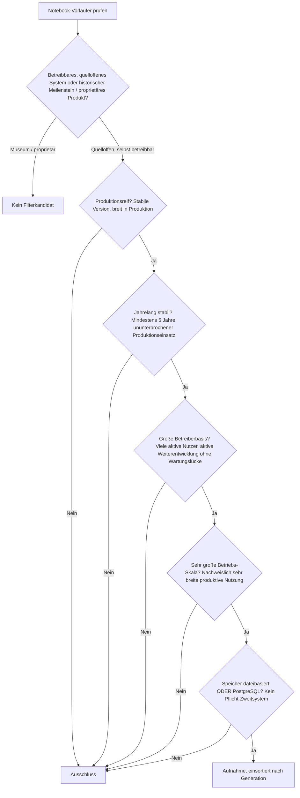
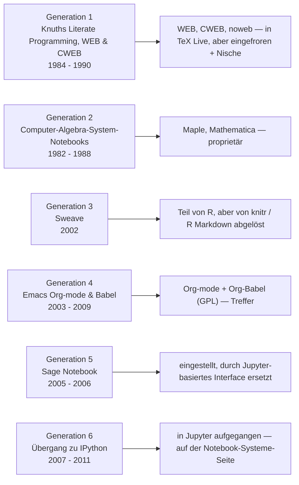
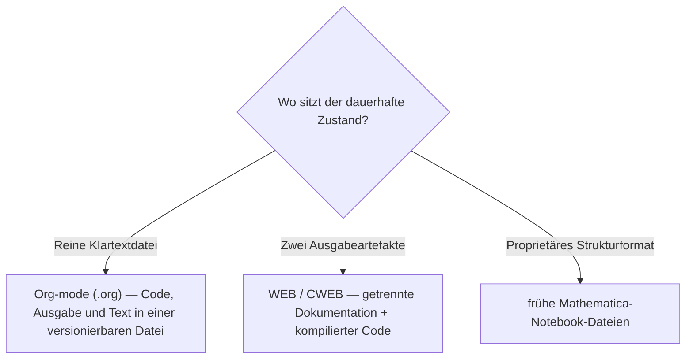

# Produktionsreife Notebook-Vorläufer nach Generation — Reifegrad, Lizenz & Betriebs-Skala (Top 1 — Literate Programming überlebt produktiv nur im Texteditor: Org-mode/Babel)

Die [Evolution und Architekturen digitaler Notebook-Vorläufer](evolution-digitaler-notebook-vorlaeufer.md) ist die vertiefte Zeitachse von Generation 1 der [übergeordneten Notebook-System-Chronologie](evolution-digitaler-notebook-systeme.md): Knuths Literate Programming, WEB & CWEB (1), Computer-Algebra-System-Notebooks (2), Sweave (3), Emacs Org-mode & Babel (4), Sage Notebook (5), der Übergang zu IPython (6). Die [Topliste einflussreichster Literate-Programming-Vorläufer (Top 10)](literate-programming-vorlaeufer-topliste.md) rankt die Kategorie nach historischem Einfluss. Diese Seite legt das **konservative** Fünf-Filter-Sieb der Familie an — produktionsreif · jahrelang stabil · große Betreiberbasis · sehr große Betriebs-Skala · Speicher dateibasiert oder PostgreSQL — und sortiert nach Generation.

!!! warning "Achtung: Von einer historischen Kategorie überlebt genau ein produktiv genutztes System"
    Die Basis-Topliste sagt es selbst: „Org-mode/Babel bilden die einzige Ausnahme mit echter eigenständiger 2026-Marktpräsenz." Alles andere ist **historisch** (WEB, CWEB, IPython Qt Console), **proprietär** (Mathematica, Maple) oder **abgelöst** (Sweave → R Markdown, Sage Notebook → Jupyter). **WEB/CWEB/noweb** werden zwar bis heute mit jeder TeX-Live-Distribution ausgeliefert und funktionieren — aber die aktive Nutzung ist auf Nischen geschrumpft, und Knuth pflegt sie bewusst nur noch fehlerkorrigierend. Der eine Treffer ist **Org-mode + Org-Babel** (GPL, seit 2003/2009): Teil von **Emacs** — das selbst ein [Top-3-Treffer der Editoren-Seite](../../entwicklung/system/produktionsreife-editoren-generationen-2026-topliste.md) ist —, aktiv weiterentwickelt, mit riesiger Nutzerbasis, reines Klartextformat. Dieselbe Beobachtung wie bei den [Islands-Architekturen](../../entwicklung/webentwicklung/produktionsreife-islands-edge-architekturen-generationen-2026-topliste.md): das Prinzip gewinnt als **Modus eines reifen Werkzeugs**, nicht als eigenständiges Produkt.

---

## Die fünf harten Filter

!!! note "Hinweis: mitgeliefert werden ist nicht dasselbe wie aktiv genutzt werden"
    WEB, CWEB und noweb sind in TeX Live enthalten und lauffähig — aber die produktive Nutzung ist auf Literate-Haskell- und ähnliche Spezial-Setups zurückgegangen, und die Entwicklung ist bewusst eingefroren. „Große, aktive Betreiberbasis" verlangt mehr als Distributions-Präsenz (dieselbe Auslegung wie bei ClueBot NG auf der [Multi-Agenten-Seite](produktionsreife-multiagenten-wissensoekosysteme-generationen-2026-topliste.md)).

---

## Ergebnis: ein Treffer über sechs Generationen

---

## Systeme nach Generation

### Generation 4 — Emacs Org-mode & Babel (2003 – 2009)

| # | System | Speicher | Lizenz | Seit | Skala-Nachweis |
|---|---|---|---|---|---|
| 1 | **Org-mode + Org-Babel** | reine `.org`-Klartextdatei | GPL-3.0-or-later | Org-mode 2003, Org-Babel 2009 | Mitgeliefert mit jeder Emacs-Installation, aktiv weiterentwickelt (Org 9.x), sehr breite Nutzung für Notizen, Publishing, reproduzierbare Analysen und Aufgabenverwaltung |

**Org-mode mit Org-Babel** ist der einzige Treffer: ausführbare Multi-Sprachen-Codeblöcke in einer reinen Klartextdatei, von Beginn an Git-diff-freundlich (JSON-freies Format, anders als `.ipynb`). Es ist Teil von **Emacs**, das auf der [Editoren-Seite](../../entwicklung/system/produktionsreife-editoren-generationen-2026-topliste.md) selbst das Sieb besteht — der Literate-Programming-Gedanke überlebt produktiv also genau dort, wo er in ein bereits reifes Werkzeug eingebettet ist, statt als eigenständige Anwendung. **Sweave** (Generation 3) ist ebenfalls noch Teil von R, aber von knitr und [R Markdown](produktionsreife-rmarkdown-quarto-generationen-2026-topliste.md) abgelöst — Grenzfall an der aktiven Nutzung.

### Generation 1, 2, 3, 5 & 6 — warum hier nichts steht

- **Generation 1 (WEB, CWEB, noweb)**: **WEB** (1984) ist die konzeptionelle Wurzel jedes Notebook-Systems, **CWEB** (1987) und **noweb** (1989) verbreiterten das Prinzip — alle drei werden mit TeX-Distributionen ausgeliefert und funktionieren, aber die aktive produktive Nutzung ist auf Nischen geschrumpft und die Entwicklung ist eingefroren. Große, *aktive* Betreiberbasis: nicht erfüllt.
- **Generation 2 (CAS-Notebooks)**: **Maple Worksheets** (1982) und **Mathematica Notebooks** (1988) sind proprietäre Produkte — Mathematica prägte den Begriff „Notebook", ist aber nicht selbst betreibbar.
- **Generation 3 (Sweave)**: Teil des R-Basissystems, aber seit über einem Jahrzehnt von **knitr** / **R Markdown** verdrängt — konzeptionell einflussreich, produktiv kaum noch gewählt.
- **Generation 5 (Sage Notebook)**: das erste browserbasierte Notebook-Interface, aber **eingestellt** und durch ein Jupyter-basiertes Interface ersetzt — Kontinuitätsbruch.
- **Generation 6 (Übergang zu IPython)**: **IPython Qt Console** lebt als `jupyter-qtconsole` weiter, **IPython Notebook** wurde zu Jupyter — beide gehören zur [Notebook-Systeme-Seite](produktionsreife-notebook-systeme-generationen-2026-topliste.md), nicht zu den Vorläufern.

---

## Dateibasiert oder PostgreSQL?

Eindeutig **dateibasiert** — und das ist kein Zufall, sondern das Wesensmerkmal des überlebenden Treffers:

- **Org-mode** speichert alles in einer einzigen `.org`-Klartextdatei — kein Backend, kein JSON, trivial in Git zu versionieren. Genau dieses Format-Argument (Klartext statt `.ipynb`-JSON) ist einer der Gründe, warum es die anderen Vorläufer überlebt hat.
- Eine Anwendung darüber (Publishing-Pipeline, Wissensdatenbank) hält ihren Zustand relational — das ist die Ebene der [Notebook-Systeme](produktionsreife-notebook-systeme-generationen-2026-topliste.md), nicht der Vorläufer.

Vertiefung zur Datenbankschicht: [PostgreSQL DBA Praxis-Handbuch](../../entwicklung/infrastruktur/postgresql-dba-praxis.md).

!!! warning "Achtung: Momentaufnahme, Stand August 2026"
    Diese Kategorie ist per Definition abgeschlossen — sie endet 2011 mit dem IPython-Notebook-Release. Neue Treffer sind ausgeschlossen; **Org-mode/Babel** ist die stabile Konstante, solange Emacs es ist.

---

## Was bewusst nicht auf dieser Liste steht

| System | Erfüllt nicht | Anmerkung |
|---|---|---|
| **WEB, CWEB, noweb** | Aktive Betreiberbasis | In TeX Live enthalten und lauffähig — aber eingefrorene Entwicklung, Nischen-Nutzung |
| **Mathematica Notebooks, Maple Worksheets** | Lizenzfilter | Proprietäre Produkte |
| **Sweave** | Aktive Nutzung | Teil von R, aber von knitr / R Markdown abgelöst — Grenzfall |
| **Sage Notebook** | Kontinuität | Eingestellt, durch Jupyter-basiertes Interface ersetzt |
| **IPython Qt Console, IPython Notebook** | Kategorie | In Jupyter aufgegangen — auf der [Notebook-Systeme-Seite](produktionsreife-notebook-systeme-generationen-2026-topliste.md) |

---

## 🔗 Verwandte Themen

- [Evolution und Architekturen digitaler Notebook-Vorläufer](evolution-digitaler-notebook-vorlaeufer.md) — das sechsstufige Generationenmodell, nach dem diese Liste sortiert ist
- [Einflussreichste Literate-Programming-Vorläufer (Top 10)](literate-programming-vorlaeufer-topliste.md) — breitere Basis-Topliste nach historischem Einfluss statt aktueller Nutzung
- [Produktionsreife Open-Source-Notebook-Systeme nach Generation (Top 4)](produktionsreife-notebook-systeme-generationen-2026-topliste.md) — die Nachfolge-Kategorie (Jupyter, R Markdown, Pluto.jl)
- [Produktionsreife R-Markdown- & Quarto-Werkzeuge nach Generation (Top 5)](produktionsreife-rmarkdown-quarto-generationen-2026-topliste.md) — die direkte Fortsetzung von Sweave aus Generation 3
- [Produktionsreife Open-Source-Editoren nach Generation (Top 3)](../../entwicklung/system/produktionsreife-editoren-generationen-2026-topliste.md) — Emacs als Trägerwerkzeug des einzigen Treffers
- [Produktionsreife Islands- & Edge-Architekturen nach Generation](../../entwicklung/webentwicklung/produktionsreife-islands-edge-architekturen-generationen-2026-topliste.md) — dieselbe „Prinzip gewinnt als Modus, nicht als Produkt"-Beobachtung
- [PostgreSQL DBA Praxis-Handbuch](../../entwicklung/infrastruktur/postgresql-dba-praxis.md) — Datenbankschicht der Notebook-Anwendung
