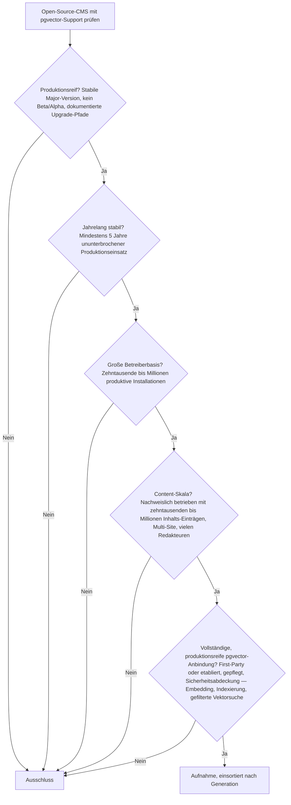
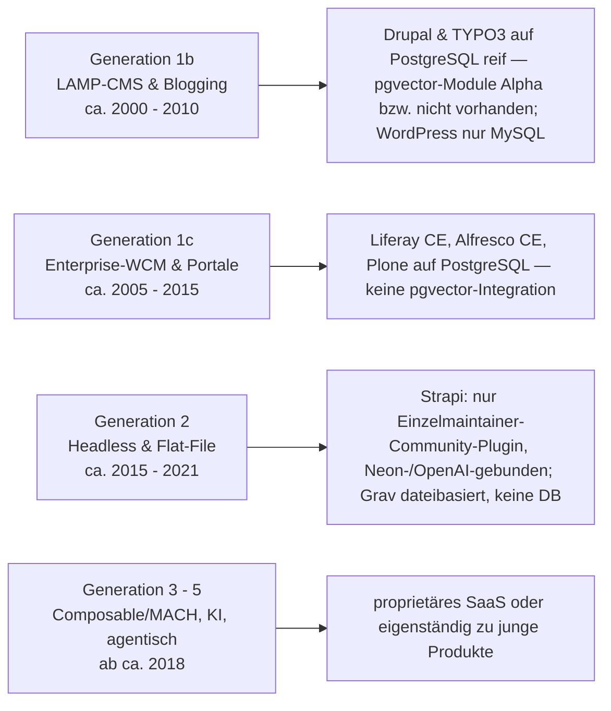
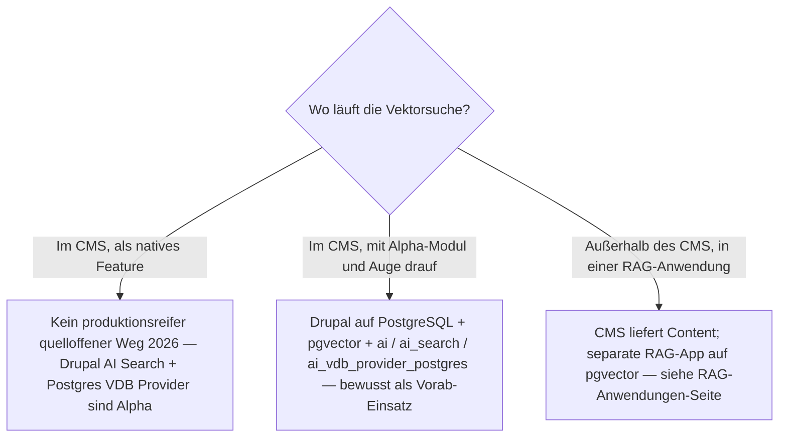

# Produktionsreife Open-Source-CMS mit vollständigem pgvector-Support nach Generation — Reifegrad, Lizenz & Integrationstiefe (kein Treffer — die CMS sind reif, die pgvector-Anbindung ist Alpha)

Die [Evolution und Architekturen digitaler Content-Management-Systeme](evolution-digitaler-cms.md) ordnet die CMS-Klasse in fünf technologische Generationen, die [Topliste produktionsreifer Open-Source-CMS nach Generation](produktionsreife-cms-generationen-2026-topliste.md) siebt sie nach Reife, Betreiberbasis und Speicherbackend. Diese Seite verengt den Speicherfilter auf eine konkrete Frage: **Welches quelloffene CMS bindet [pgvector](../daten/datenbanken/pgvector-anleitung.md) vollständig und produktionsreif an — Embedding-Erzeugung, Indexierung, Vektorsuche mit Filtern — als gepflegte First-Party-Komponente statt als Bastellösung?** Sortiert wird — parallel zur Familie — **nach Generation** statt nach Rang. Die Nachrüstung von KI-Funktionen auf bestehende CMS behandelt [Klassische Wissensmanagement-, KB- & CMS-Systeme mit LLM-Integration](klassische-wissensmanagement-cms-llm-integration.md).

!!! warning "Achtung: Kein Treffer — die CMS sind reif, pgvector ist reif, nur die Schicht dazwischen nicht"
    **pgvector** besteht das Fünf-Filter-Sieb der Familie seit April 2021 (siehe [semantische & RAG-Wissenssysteme](produktionsreife-semantische-rag-wissenssysteme-generationen-2026-topliste.md)). Mehrere CMS laufen seit Jahren produktionsreif auf PostgreSQL — **Drupal**, **TYPO3**, **Liferay CE**. Was **fehlt**, ist die reife Verbindung: Die Module, Plugins und Extensions, die ein CMS pgvector *vollständig nutzen* lassen, sind 2026 durchweg ein bis zwei Jahre alt und vor-stabil. **Drupal** kommt am nächsten — PostgreSQL ist gleichwertige Core-Datenbank, und das offizielle KI-Ökosystem hat einen dedizierten Postgres-/pgvector-Vektorprovider —, aber genau dieses Modul (`ai_vdb_provider_postgres`, seit Oktober 2024) steht bei `1.0.0-alpha3`, ~267 Installationen, ohne Abdeckung durch die Security-Advisory-Policy; das darüberliegende **AI Search** ist selbst noch Alpha. **TYPO3** läuft auf PostgreSQL, hat aber gar keinen pgvector-Pfad (nur Pinecone- und Solr-Wege). **WordPress** ist im Kern MySQL. Dieselbe Struktur wie bei den [semantischen & RAG-Wissenssystemen](produktionsreife-semantische-rag-wissenssysteme-generationen-2026-topliste.md) („Infrastruktur reif, Anwendungen nicht") und der [KI-Content-Erstellung in CMS](produktionsreife-ki-content-erstellung-generationen-2026-topliste.md) („reifes CMS + zu junges KI-Modul").

---

## Die fünf harten Filter

!!! note "Hinweis: Nur OSI-anerkannte Lizenzen"
    Wie in der [Gesamtübersicht](open-source-llm-agent-mcp-systeme.md) zählen hier ausschließlich Systeme unter einer OSI-anerkannten Open-Source-Lizenz. Das kostet die Liste die proprietären SaaS-Plattformen (Contentful, Contentstack, Sanity, Sitecore, Adobe Experience Manager) sowie **Directus**, dessen Kernlizenz seit 2023 BSL 1.1 ist — kein OSI-Open-Source mehr, obwohl es PostgreSQL-nativ arbeitet.

---

## Ergebnis: kein Treffer über alle Generationen

---

## Warum keine Generation einen Treffer liefert

- **Generation 1b (Drupal, TYPO3, Joomla)**: Der Unterbau besteht — **Drupal** führt PostgreSQL als gleichwertige Core-Datenbank, das **AI**-Kernmodul ist stabil (`1.4.6`, 17.000+ aktive Installationen im August 2026). Die pgvector-Kette darüber besteht nicht: **AI Search** (`ai_search`) ist Alpha, der **Postgres VDB Provider** (`ai_vdb_provider_postgres`, seit Oktober 2024) steht bei `1.0.0-alpha3` mit ~267 Installationen und ohne Security-Advisory-Abdeckung, der alternative **Search API PostgreSQL** (`search_api_postgresql`, seit Juni 2025) ebenfalls ohne Sicherheitsabdeckung und mit winziger Basis. **TYPO3** läuft seit v9 (2018) auf PostgreSQL, hat aber keine pgvector-Extension — die vorhandenen semantischen Wege gehen über Pinecone (`amt_pinecone`), das generische `smart_search` oder Apache Solr. **Joomla** hat weder verbreiteten PostgreSQL-Einsatz noch einen pgvector-Pfad.
- **Generation 1c (Liferay CE, Alfresco CE, Plone)**: Alle drei unterstützen PostgreSQL offiziell, keiner bringt eine pgvector-gestützte Vektorsuche mit. Semantische Suche läuft hier klassisch über Elasticsearch/OpenSearch oder Solr — ein Pflicht-Zweitsystem, kein pgvector.
- **Generation 2 (Strapi, Grav)**: **Strapi** unterstützt PostgreSQL als Backend, aber die pgvector-Anbindung existiert nur als **Einzelmaintainer-Community-Plugin** (`strapi-content-embeddings`), fest an Neon-PostgreSQL und OpenAI-Embeddings gebunden — kein First-Party-Feature und keine belastbare Betreiberbasis. **Grav** ist dateibasiert und hat gar keine Datenbank, an die pgvector andocken könnte.
- **Generation 3 – 5 (Composable/MACH, KI-Content, agentisch)**: Die Composable-Ebene (Contentful, Contentstack, Sanity) ist proprietäres SaaS mit nicht einsehbarem Speicher — siehe [Produktionsreife Composable-CMS & MACH-Systeme](produktionsreife-composable-cms-generationen-2026-topliste.md). Die KI-nativen und agentischen Ansätze sind Funktionsschichten auf bestehenden CMS oder eigenständig zu junge Produkte ohne Fünf-Jahres-Historie.

---

## Die Bausteine im Einzelnen

| Baustein | CMS | Lizenz | Seit | Status (Aug 2026) | pgvector-Abdeckung |
|---|---|---|---|---|---|
| **AI (Core)** (`ai`) | Drupal | GPL-2.0-or-later | 2024 | stabil `1.4.6`, 17.000+ Installationen | LLM-/Provider-Abstraktion — **kein** Vektorspeicher |
| **AI Search** (`ai_search`) | Drupal | GPL-2.0-or-later | 2024 | **Alpha** | Search-API-Integration für semantische Vektorsuche, backend-agnostisch |
| **Postgres VDB Provider** (`ai_vdb_provider_postgres`) | Drupal | GPL-2.0-or-later | Okt. 2024 | **`1.0.0-alpha3`**, ~267 Installationen, keine Security-Advisory-Abdeckung | Tabellen anlegen, Indexierung, gefilterte Vektorsuche direkt über pgvector |
| **Search API PostgreSQL** (`search_api_postgresql`) | Drupal | GPL-2.0-or-later | Juni 2025 | keine Security-Advisory-Abdeckung, sehr kleine Basis | Volltext + Vektor + Hybrid über pgvector, OpenAI-/Azure-Embeddings |
| **smart_search / amt_pinecone** | TYPO3 | GPL-2.0-or-later | 2024/25 | jung, kleine Basis | **kein pgvector** — Pinecone bzw. provider-generisch |
| **strapi-content-embeddings** | Strapi | MIT | 2024 | Community, Einzelmaintainer | pgvector über Neon-PostgreSQL, fest an OpenAI-Embeddings |
| *(kein Baustein)* | WordPress | — | — | — | Core nur MySQL/MariaDB — kein nativer pgvector-Pfad |

---

## Dateibasiert oder PostgreSQL? — hier ist pgvector selbst der Filter

Die Speicherfrage ist bei dieser Seite schon durch die Kategorie beantwortet: pgvector **ist** eine PostgreSQL-Erweiterung, ein Treffer würde also zwingend auf PostgreSQL laufen. Die eigentliche Entscheidung liegt eine Ebene höher — **im CMS oder außerhalb**:

- **Nativ im CMS:** Es gibt 2026 keinen quelloffenen Weg, der alle fünf Filter besteht. Wer trotzdem im CMS bleiben will, nimmt **Drupal auf PostgreSQL** und kombiniert das stabile `ai`-Kernmodul mit dem Alpha-Stand von `ai_search` und `ai_vdb_provider_postgres` — im Wissen, dass diese Schicht vor-stabil ist und ohne Sicherheitsabdeckung läuft.
- **Außerhalb des CMS:** Der heute belastbare Weg ist die Trennung — das CMS liefert Inhalte per API, eine separate RAG-Anwendung hält Retrieval in pgvector. Details: [Produktionsreife RAG- & Werkzeug-Anwendungen nach Generation](../../künstliche-intelligenz/produktionsreife-rag-werkzeug-anwendungen-generationen-2026-topliste.md) und [PostgreSQL + pgvector (Praxis-Guide)](../daten/datenbanken/pgvector-anleitung.md).

**Der wahrscheinlichste künftige Treffer ist Drupal**, sobald `ai_search` und `ai_vdb_provider_postgres` einen Stable-Release erreichen — realistisch 2027/28. Dieselbe „nächster Treffer absehbar"-Lage wie bei der [KI-Bildgenerierung](../../kreativ/design/produktionsreife-ki-bildgenerierung-generationen-2026-topliste.md).

!!! warning "Achtung: Momentaufnahme, Stand August 2026"
    Der Reifegrad dieser Module ändert sich schnell — die Drupal-KI-Initiative veröffentlicht im Monatsrhythmus. Vor einer Entscheidung den aktuellen Release-Status auf der jeweiligen `drupal.org`-Projektseite prüfen.

---

## Was bewusst nicht auf dieser Liste steht

| System | Erfüllt nicht | Anmerkung |
|---|---|---|
| **Drupal** (+ `ai`, `ai_search`, `ai_vdb_provider_postgres`) | Produktionsreife der pgvector-Schicht | CMS und PostgreSQL-Support reif; die pgvector-Module sind Alpha und ohne Security-Advisory-Abdeckung |
| **TYPO3** | Vollständige pgvector-Anbindung | Läuft seit v9 auf PostgreSQL, hat aber keinen pgvector-Pfad — nur Pinecone, `smart_search`, Solr |
| **WordPress** | Speicher / pgvector-Pfad | Core nur MySQL/MariaDB; KI-Plugins nutzen externe Vektordienste, nicht pgvector |
| **Strapi** | Betreiberbasis der pgvector-Anbindung | PostgreSQL wählbar, aber pgvector nur über ein Einzelmaintainer-Community-Plugin (Neon-/OpenAI-gebunden) |
| **Liferay CE, Alfresco CE, Plone** | pgvector-Integration | PostgreSQL offiziell unterstützt; semantische Suche läuft über Elasticsearch/Solr als Zweitsystem |
| **Directus** | Lizenzfilter | PostgreSQL-nativ und mit Vektor-Ansätzen, aber Kernlizenz BSL 1.1 seit 2023 — kein OSI-Open-Source |
| **Payload CMS** | „Jahrelang stabil" | PostgreSQL über Drizzle, pgvector-Plugins vorhanden, aber erst seit ~2021 |
| **Contentful, Contentstack, Sanity** | Lizenzfilter | Proprietäre SaaS-Plattformen mit nicht einsehbarem Speicher |

---

## 🔗 Verwandte Themen

- [Startseite](../../index.md) — zurück zur Dokumentations-Zentrale
- [Produktionsreife Open-Source-CMS nach Generation (Top 12)](produktionsreife-cms-generationen-2026-topliste.md) — die allgemeine Schwesterseite; dort ist der Speicherfilter „dateibasiert oder PostgreSQL", hier auf „vollständiger pgvector-Support" verengt
- [Evolution und Architekturen digitaler Content-Management-Systeme](evolution-digitaler-cms.md) — das fünfstufige Generationenmodell, nach dem diese Liste sortiert ist
- [Produktionsreife KI-Content-Erstellung in CMS nach Generation](produktionsreife-ki-content-erstellung-generationen-2026-topliste.md) — dieselbe Struktur für die Editor-Seite der KI-Funktionen: reifes CMS, zu junges Modul
- [Produktionsreife semantische & RAG-Wissenssysteme nach Generation (Top 7)](produktionsreife-semantische-rag-wissenssysteme-generationen-2026-topliste.md) — dort besteht pgvector das Sieb; die Infrastruktur ist reif, die Anwendungen nicht
- [Produktionsreife Open-Source-Wissenssysteme mit vollständigem pgvector-Support nach Generation (Top 2)](produktionsreife-pgvector-wissenssysteme-generationen-2026-topliste.md) — dieselbe Frage für Wissenssysteme statt CMS: Haystack und pgvector bestehen, kein integriertes Produkt
- [Produktionsreife Open-Source-Web-Frameworks mit vollständigem pgvector-Support nach Generation (Top 2)](../../entwicklung/webentwicklung/produktionsreife-pgvector-webframeworks-generationen-2026-topliste.md) — dieselbe Frage für Web-Frameworks: Django und Rails bestehen
- [Produktionsreife RAG- & Werkzeug-Anwendungen nach Generation](../../künstliche-intelligenz/produktionsreife-rag-werkzeug-anwendungen-generationen-2026-topliste.md) — der Weg außerhalb des CMS: Retrieval in einer eigenen Anwendung auf pgvector
- [Klassische Wissensmanagement-, KB- & CMS-Systeme mit LLM-Integration](klassische-wissensmanagement-cms-llm-integration.md) — wie CMS ihre KI-Funktionen 2026 benennen und wie tief die Integration reicht
- [PostgreSQL + pgvector (Praxis-Guide)](../daten/datenbanken/pgvector-anleitung.md) — Installation, Indexierung und Vektorsuche in der Praxis
- [PostgreSQL DBA Praxis-Handbuch](../../entwicklung/infrastruktur/postgresql-dba-praxis.md) — Betrieb der Datenbankschicht hinter pgvector
- [Evolution und Architekturen von Drupal](drupal/evolution-digitaler-drupal.md) — vertiefend zum aussichtsreichsten künftigen Treffer
