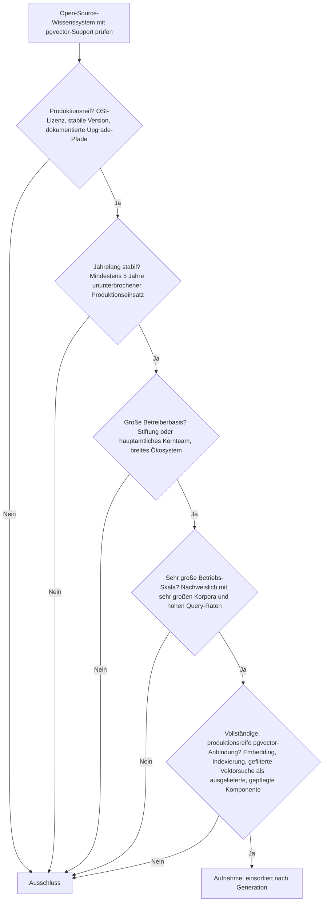
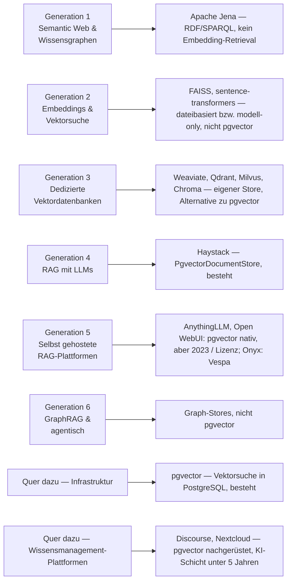
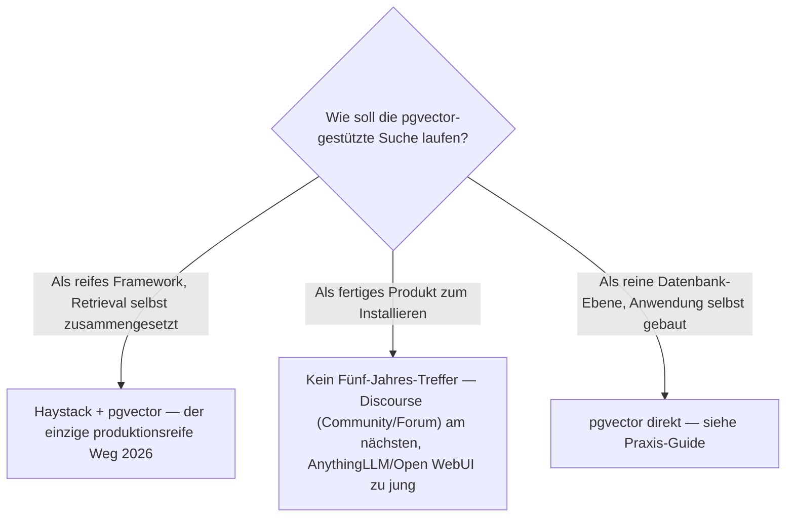

# Produktionsreife Open-Source-Wissenssysteme mit vollständigem pgvector-Support nach Generation — Reifegrad, Lizenz & Integrationstiefe (Top 2 auf Bauteil-Ebene — kein integriertes Produkt besteht das Sieb)

Die [Evolution und Architekturen digitaler Semantischer & RAG-Wissenssysteme](evolution-digitaler-semantische-rag-wissenssysteme.md) ordnet die Retrieval-Infrastruktur in sechs Generationen, die [Topliste produktionsreifer semantischer & RAG-Wissenssysteme nach Generation (Top 7)](produktionsreife-semantische-rag-wissenssysteme-generationen-2026-topliste.md) siebt sie nach Reife, Betreiberbasis und Speicherbackend. Dort lautet der Speicherfilter „dateibasiert **oder** PostgreSQL — self-contained **oder** pgvector". Diese Seite verengt ihn auf eine Frage: **Welches quelloffene Wissenssystem nutzt [pgvector](../daten/datenbanken/pgvector-anleitung.md) vollständig und produktionsreif — Embedding-Erzeugung, Indexierung, gefilterte Vektorsuche — als gepflegte, ausgelieferte Komponente?** Sortiert wird — parallel zur [CMS-Schwesterseite](produktionsreife-pgvector-cms-generationen-2026-topliste.md) — **nach Generation** statt nach Rang.

!!! warning "Achtung: Das Bauteil besteht, das integrierte Produkt nicht"
    Von den sieben Systemen der [semantische-RAG-Schwesterseite](produktionsreife-semantische-rag-wissenssysteme-generationen-2026-topliste.md) bleiben unter dem verengten Filter nur **zwei**: **Haystack** mit seinem `PgvectorDocumentStore` (Framework seit 2019, vollständiges Keyword- plus Embedding-Retrieval auf pgvector) und **pgvector** selbst (PostgreSQL-Erweiterung seit April 2021). Die anderen fünf nutzen pgvector *nicht* — Apache Jena und Neo4j arbeiten mit RDF bzw. Property-Graphen, FAISS und sentence-transformers sind dateibasiert, Weaviate ist ein eigener Vektorserver und damit eine **Alternative zu** pgvector, kein Nutzer davon. Auf der **Produkt-Ebene** — fertig installierbare Wissens-, KB- oder RAG-Systeme — gibt es **keinen Treffer**: **AnythingLLM** und **Open WebUI** binden pgvector nativ an, sind aber 2023 entstanden (Open WebUI trägt seit April 2025 zusätzlich eine Marken-Klausel); **Onyx/Danswer** nutzt **Vespa**, nicht pgvector; **Discourse** liefert pgvector-gestützte Semantiksuche seit April 2023 auf einem 13 Jahre alten GPL-Fundament — der nächste Kandidat, aber die KI-Schicht ist ~3 Jahre jung. Dieselbe Struktur wie bei der [CMS-Schwesterseite](produktionsreife-pgvector-cms-generationen-2026-topliste.md) und den [RAG-Anwendungen](../../künstliche-intelligenz/produktionsreife-rag-werkzeug-anwendungen-generationen-2026-topliste.md).

---

## Die fünf harten Filter

!!! note "Hinweis: Nur OSI-anerkannte Lizenzen"
    Das kostet die Liste **Pinecone** und **Amazon Neptune** (proprietäre Managed-Dienste), **Outline** (Business Source License seit 2021 — kein OSI-Open-Source, obwohl PostgreSQL-nativ) und **Open WebUI**, dessen Lizenz seit v0.6.6 (April 2025) eine Marken-Schutzklausel mit CLA trägt und damit keine reine OSI-Lizenz mehr ist.

---

## Ergebnis: zwei Treffer auf Bauteil-Ebene, keiner auf Produkt-Ebene

---

## Systeme nach Generation

### Generation 1 — Semantic Web & symbolische Wissensgraphen

**Apache Jena** ist die reife Referenz für tripelbasierte Wissensgraphen, arbeitet aber mit RDF/SPARQL, nicht mit Vektor-Embeddings. pgvector ist hier strukturell fremd — es gibt kein Embedding-Retrieval, an das es andocken könnte.

### Generation 2 — Neuronale Embeddings & Vektorsuche

**FAISS** persistiert seinen Index als Datei im eigenen Prozess, **sentence-transformers** liefert nur die Embedding-Modelle und hat gar keinen Speicher. Beide bestehen das Sieb der Schwesterseite, aber nicht über pgvector.

### Generation 3 — Dedizierte Vektordatenbanken

**Weaviate** (besteht die Schwesterseite), **Qdrant**, **Milvus** und **Chroma** bringen jeweils ihren eigenen Vektor-Store mit. Sie sind per Definition die **Alternative zu** pgvector — „dedizierter Vektorserver statt Erweiterung der vorhandenen relationalen Datenbank" —, keine Systeme, die pgvector nutzen.

### Generation 4 — Retrieval-Augmented Generation mit LLMs

| # | System | Rolle | pgvector-Anbindung | Lizenz | Seit | Status im Sieb |
|---|---|---|---|---|---|---|
| 1 | **Haystack** (deepset) | RAG-Orchestrierungs-Framework | `PgvectorDocumentStore` — Keyword- plus Embedding-Retrieval, HNSW/IVFFlat, Metadaten-Filter | MIT | November 2019 | **besteht** — über sechs Jahre, Enterprise-Fokus, offizielle pgvector-Integration |

**Haystack** ist der einzige Treffer der Produkt-nahen Ebene: ein reifes RAG-Framework mit einer offiziell gepflegten `pgvector`-Integration, die den vollen Retrieval-Weg abdeckt. **LangChain** und **LlamaIndex** haben ebenfalls pgvector-Integrationen, sind aber erst 2022 entstanden.

### Generation 5 — Selbst gehostete RAG-Plattformen — warum hier nichts steht

| System | pgvector-Anbindung | Lizenz | Seit | Warum kein Treffer |
|---|---|---|---|---|
| **AnythingLLM** | nativer `PGVector`-Provider, eigene Tabelle, Schema-Validierung | MIT | 2023 | Reifezeit — drei Jahre |
| **Open WebUI** | `VECTOR_DB=pgvector`, Pflicht-Backend im Multi-Replica-Betrieb | Open-WebUI-Lizenz (BSD + Marken-Klausel) | 2023 | Reifezeit **und** Lizenzfilter seit April 2025 |
| **Onyx / Danswer** | **keine** — nutzt **Vespa** als Vektor- und Suchmaschine | MIT | 2023 | Bindet pgvector gar nicht an; zusätzlich Reifezeit |
| **Dify, Flowise, RAGFlow, Quivr** | teils pgvector wählbar | diverse OSI | 2023 – 2024 | Reifezeit |

Alle 2023 oder jünger — ausführlich auf der [RAG- & Werkzeug-Anwendungen-Seite](../../künstliche-intelligenz/produktionsreife-rag-werkzeug-anwendungen-generationen-2026-topliste.md).

### Generation 6 — GraphRAG & agentische Wissenssysteme

Läuft über Property-Graph-Stores (**Neo4j**) oder temporale Wissensgraphen (**Graphiti**), nicht über pgvector.

### Quer zu den Generationen — die PostgreSQL-Erweiterung selbst

| # | System | Speicher | Lizenz | Seit | Einordnung |
|---|---|---|---|---|---|
| 2 | **pgvector** | PostgreSQL-Erweiterung — Vektoren neben den relationalen Daten | PostgreSQL-Lizenz | April 2021 | Fünf Jahre; Releases von der PostgreSQL Global Development Group angekündigt — **besteht** |

### Quer zu den Generationen — Wissensmanagement-Plattformen mit nachgerüsteter pgvector-Schicht

| System | pgvector-Anbindung | Lizenz | Core seit | KI-Schicht seit | Status |
|---|---|---|---|---|---|
| **Discourse** (+ `discourse-ai`) | Semantic Search & Semantic Related Topics speichern und suchen Embeddings in pgvector; ausgeliefert, auf sehr großen Foren im Einsatz | GPL-2.0 | 2013 | April 2023 | **Grenzfall** — Fundament überreif, pgvector-Schicht ~3 Jahre |
| **Nextcloud** (+ Context Chat) | Context-Chat-Backend chunkt und embeddet Inhalte in PostgreSQL mit pgvector (`EXTERNAL_DB`) | AGPL-3.0 | 2016 | ~2024 | **Grenzfall** — pgvector-Schicht ~2 Jahre |

**Discourse** ist auf der Produkt-Ebene der nächste Kandidat: eine GPL-lizenzierte, seit 2013 auf sehr großer Skala betriebene Community-Plattform, deren offizielles KI-Modul pgvector-gestützte Semantiksuche **seit dem ersten Release (April 2023)** mitbringt. Es fehlt allein die Fünf-Jahres-Historie dieser Schicht.

---

## Dateibasiert oder PostgreSQL? — hier ist pgvector der Filter selbst

Die Speicherfrage ist durch die Kategorie beantwortet: Ein Treffer läuft zwingend auf PostgreSQL. Die Entscheidung liegt eine Ebene höher — **welche Bauform**:

- **Framework:** **Haystack** als Orchestrierung plus **pgvector** als Speicher — beide bestehen das Sieb, die Integration ist offiziell gepflegt. Der belastbare Weg, wenn die Anwendung ohnehin selbst gebaut wird.
- **Fertiges Produkt:** 2026 kein Treffer. Wer ein Forum oder eine Community-Wissensbasis betreibt, kommt mit **Discourse** am weitesten — im Wissen, dass die KI-Schicht ~3 Jahre jung ist.
- **Reine DB-Ebene:** pgvector direkt ansprechen, Embedding-Pipeline selbst schreiben — siehe [PostgreSQL + pgvector (Praxis-Guide)](../daten/datenbanken/pgvector-anleitung.md).

**Absehbare künftige Treffer:** **AnythingLLM** überschreitet 2028 die Fünf-Jahres-Marke, **Discourse AI** ebenfalls 2028; **Open WebUI** bliebe am Lizenzfilter hängen. LangChain und LlamaIndex mit ihren pgvector-Integrationen folgen 2027.

!!! warning "Achtung: Momentaufnahme, Stand August 2026"
    Die RAG-Anwendungsschicht verändert sich im Quartalsrhythmus — Lizenzen (Open WebUI 2025), Vektor-Backends und Reifegrade. Die stabilen Konstanten sind **Haystack** und **pgvector**. Vor einer Entscheidung den aktuellen Stand prüfen.

---

## Was bewusst nicht auf dieser Liste steht

| System | Erfüllt nicht | Anmerkung |
|---|---|---|
| **Onyx / Danswer** | pgvector-Anbindung | Nutzt Vespa als Vektor- und Suchmaschine — bindet pgvector gar nicht an |
| **AnythingLLM** | Reifezeit | Nativer PGVector-Provider, aber erst 2023 |
| **Open WebUI** | Reifezeit + Lizenz | pgvector-Backend, aber 2023 und seit April 2025 Marken-Klausel mit CLA |
| **Weaviate, Qdrant, Milvus, Chroma** | Kategorie | Eigener Vektor-Store — die Alternative zu pgvector, kein Nutzer davon |
| **FAISS, sentence-transformers** | pgvector-Anbindung | Dateibasierter Index bzw. reine Modell-Bibliothek |
| **Apache Jena, Neo4j** | Kategorie | RDF- bzw. Graph-Retrieval, nicht Vektor-Embeddings in pgvector |
| **LangChain, LlamaIndex** | Reifezeit | pgvector-Integrationen vorhanden, aber erst 2022 |
| **txtai** | Betreiberbasis | pgvector-Support vorhanden, aber sehr kleines Kernteam |
| **Outline** | Lizenzfilter | PostgreSQL-nativ, aber Business Source License seit 2021 |
| **Discourse (+ discourse-ai), Nextcloud (+ Context Chat)** | „Jahrelang stabil" der pgvector-Schicht | Fundament überreif, KI-/pgvector-Schicht ~2 – 3 Jahre — Grenzfälle |

---

## 🔗 Verwandte Themen

- [Startseite](../../index.md) — zurück zur Dokumentations-Zentrale
- [Produktionsreife Open-Source-semantische & RAG-Wissenssysteme nach Generation (Top 7)](produktionsreife-semantische-rag-wissenssysteme-generationen-2026-topliste.md) — die Schwesterseite mit dem weiteren Speicherfilter; dort bestehen sieben Systeme, hier nur die zwei pgvector-gebundenen
- [Evolution und Architekturen digitaler Semantischer & RAG-Wissenssysteme](evolution-digitaler-semantische-rag-wissenssysteme.md) — das sechsstufige Generationenmodell, nach dem diese Liste sortiert ist
- [Produktionsreife Open-Source-Frameworks & -Bibliotheken für Wissenssysteme nach Generation (Top 8)](produktionsreife-wissenssystem-frameworks-generationen-2026-topliste.md) — die Bauteil-Ebene, auf der Haystack ebenfalls erscheint
- [Produktionsreife Open-Source-Wissenssysteme nach Generation (Top 12)](produktionsreife-wissenssysteme-generationen-2026-topliste.md) — die übergeordnete Wissenssysteme-Variante
- [Produktionsreife Open-Source-CMS mit vollständigem pgvector-Support nach Generation (kein Treffer)](produktionsreife-pgvector-cms-generationen-2026-topliste.md) — dieselbe Frage für CMS; dort kommt Drupal am nächsten
- [Produktionsreife Open-Source-Web-Frameworks mit vollständigem pgvector-Support nach Generation (Top 2)](../../entwicklung/webentwicklung/produktionsreife-pgvector-webframeworks-generationen-2026-topliste.md) — dieselbe Frage für Web-Frameworks; Django und Rails bestehen
- [Produktionsreife Open-Source-RAG- & Werkzeug-Anwendungen nach Generation](../../künstliche-intelligenz/produktionsreife-rag-werkzeug-anwendungen-generationen-2026-topliste.md) — die Anwendungsschicht (AnythingLLM, Onyx, Open WebUI) im Detail
- [PostgreSQL + pgvector (Praxis-Guide)](../daten/datenbanken/pgvector-anleitung.md) — Installation, Indexierung und Vektorsuche in der Praxis
- [PostgreSQL DBA Praxis-Handbuch](../../entwicklung/infrastruktur/postgresql-dba-praxis.md) — Betrieb der Datenbankschicht hinter pgvector
