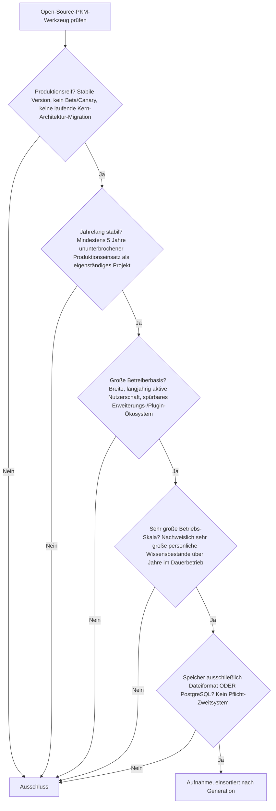
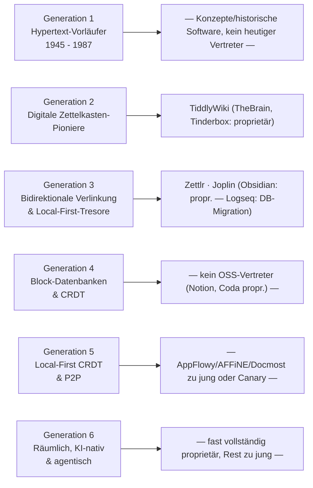

# Produktionsreife Open-Source-PKM-Wissensgraphen & Block-Editoren nach Generation — Reifegrad, Evaluation & Betriebs-Skala (Top 3)

Die [Evolution und Architekturen digitaler PKM-Wissensgraphen & Block-Editoren](evolution-digitaler-pkm-wissensgraphen.md) ordnet die Kategorie chronologisch in sechs Generationen, die [Topliste bester PKM-Wissensgraphen 2026](pkm-wissensgraphen-2026-topliste.md) rankt die gesamte Kategorie ohne Lizenzfilter, die [Open-Source-Variante mit PostgreSQL-/Dateiformat-Speicherung](bidirektionale-wissensgraphen-realtime-block-editoren-2026-topliste.md) siebt bereits nach Lizenz, Speicherbackend und Aktivität. Diese Seite kombiniert alle Achsen — parallel zur [Wissenssysteme-](produktionsreife-wissenssysteme-generationen-2026-topliste.md), [CMS-](produktionsreife-cms-generationen-2026-topliste.md), [Notebook-](produktionsreife-notebook-systeme-generationen-2026-topliste.md), [Semantische-&-RAG-](produktionsreife-semantische-rag-wissenssysteme-generationen-2026-topliste.md), [Static-Site-Generator-](produktionsreife-static-site-generatoren-generationen-2026-topliste.md), [Wiki-Engine-](produktionsreife-wiki-engines-generationen-2026-topliste.md) und [LMS-Schwesterseite](../e-learning/produktionsreife-lms-generationen-2026-topliste.md) — zu einem bewusst **konservativen** Fünf-Filter-Sieb: produktionsreif · jahrelang stabil · große Betreiberbasis · sehr große Betriebs-Skala · Speicher dateibasiert oder PostgreSQL. Sortiert nach Generation.

!!! warning "Achtung: Skala-Filter neu definiert — und trotzdem die am dünnsten besetzte Kategorie der Familie"
    Die [Wissenssysteme-Schwesterseite](produktionsreife-wissenssysteme-generationen-2026-topliste.md) prüft PKM-Werkzeuge gegen ihren **Enzyklopädie-Skala**-Filter (zehntausende bis Millionen Artikel, viele gleichzeitige Autoren) und findet **keinen** Vertreter — folgerichtig, denn dieser Maßstab ist für Multi-Autoren-Wikis gemacht, nicht für persönliche Notizarchive. Diese Seite definiert „Betriebs-Skala" für die Kategorie neu: **breite, über Jahre gewachsene Nutzerbasis und belastbar große persönliche Wissensbestände** statt Enzyklopädie-Maßstab. Selbst mit diesem passenderen Maßstab bestehen nur **drei** Systeme alle fünf Filter — die Kategorie wird von proprietären Marktführern (Obsidian, Notion, Roam Research) und jungen, oft noch instabilen Open-Source-Alternativen (Logseq mitten in der DB-Migration, AppFlowy/AFFiNE/Docmost knapp unter fünf Jahren oder im Canary-Stadium) dominiert.

---

## Die fünf harten Filter

!!! note "Hinweis: Nur OSI-anerkannte Lizenzen"
    Wie in der [Gesamtübersicht](open-source-llm-agent-mcp-systeme.md) zählen ausschließlich OSI-anerkannte Lizenzen. Das kostet dieser Liste sofort die drei bekanntesten Namen der Kategorie: **Obsidian** (proprietäre Freeware, kein offener Quellcode), **Notion** und **Roam Research** (beide proprietäre Cloud-Produkte) — siehe [Speicher-Fazit](#dateibasiert-oder-postgresql-strukturell-fast-bedeutungslos) für die Konsequenz.

---

## Ergebnis: Drei Systeme über zwei von sechs Generationen

---

## Systeme nach Generation

### Generation 2 — Digitale Zettelkasten-Pioniere & Personal Wikis (1996 – 2014)

| # | System | Speicher | Lizenz | Seit | Skala-Nachweis | Betreiberbasis |
|---|---|---|---|---|---|---|
| 1 | **TiddlyWiki** | Einzeldatei (HTML), reinstes Dateiformat der ganzen Wissenssysteme-Familie | BSD-3-Clause | 2004 | Zahlreiche dokumentierte Installationen mit tausenden Tiddlers über viele Jahre; auch als kleines Team-Wiki im Einsatz, nicht nur einzelnutzergebunden | Ununterbrochen gepflegte Community seit 22 Jahren, umfangreiches Plugin-/Makro-Ökosystem (TiddlyWiki5) |

**TiddlyWiki** ist der einzige vollständige Fünf-Filter-Treffer dieser Generation — und ausgerechnet dasselbe System, das die [Wiki-Engine-Schwesterseite](produktionsreife-wiki-engines-generationen-2026-topliste.md) wegen zu geringer Multi-Autoren-Skala ausschließt. Für den **persönlichen** Wissensgraphen ist genau das kein Makel: eine portable HTML-Datei ohne jede Serverabhängigkeit ist hier die Referenzarchitektur, nicht die Ausnahme. **TheBrain** (1996) und **Tinderbox** (2001) sind technisch ähnlich langlebig, aber durchgehend proprietär und fallen am Lizenzfilter heraus.

### Generation 3 — Bidirektionale Verlinkung & Local-First-Markdown-Tresore (2019 – 2021)

| # | System | Speicher | Lizenz | Seit | Skala-Nachweis | Betreiberbasis |
|---|---|---|---|---|---|---|
| 2 | **Zettlr** | Reines Markdown-Dateiformat | GPL-3.0 | 2017 | Verifizierbar in großen akademischen Schreibprojekten (Dissertationen, Bücher) mit tausenden vernetzten Notizen, Zitationsdatenbank-Integration | Breite akademische Nutzerbasis, seit Jahren in dutzende Sprachen übersetzt |
| 3 | **Joplin** | Lokal Markdown/SQLite-Datei, Sync-Server optional PostgreSQL | MIT | 2016 | Zehntausende Notizen pro Nutzer im Dauerbetrieb dokumentiert, Cross-Platform Desktop/Mobile/CLI | Eine der größten Open-Source-Notiz-Communities, sehr regelmäßige Releases seit einem Jahrzehnt |

**Zettlr** ist die konsequenteste akademische Nische dieser Liste: Markdown pur, aber mit tiefer Citation-Manager-Integration (Zotero/BibTeX), die es zur bevorzugten Wahl für lange, quellenbasierte Schreibprojekte macht. **Joplin** ist der Allrounder — reines Dateiformat lokal, PostgreSQL taucht nur als optionales Backend des selbst gehosteten **Sync-Servers** auf, nie als Speicher der Notizen selbst.

!!! warning "Achtung: Obsidian, Roam Research und Logseq scheitern alle drei — aus drei verschiedenen Gründen"
    **Obsidian** (Marktführer der [Basis-Topliste](pkm-wissensgraphen-2026-topliste.md)) ist proprietäre Freeware ohne offenen Quellcode — Lizenzfilter. **Roam Research** ist zusätzlich eine geschlossene Cloud-Datenbank — Lizenz- und Speicherfilter gleichzeitig. **Logseq** (AGPL-3.0, seit 2020, an sich alt genug) befindet sich laut [Wissenssysteme-Schwesterseite](produktionsreife-wissenssysteme-generationen-2026-topliste.md#generation-3-6-pkm-rag-agentische-systeme) mitten in der Migration auf eine neue Datenbank-Engine — „produktionsreif, keine laufende Kern-Architektur-Migration" ist damit gerade nicht erfüllt. **Foam** und **Dendron** (beide VS-Code-Erweiterungen) erfüllen die technischen Filter, bleiben aber Nischenwerkzeuge ohne die breite, eigenständige Nutzerbasis von Zettlr oder Joplin.

### Generation 1, 4, 5 & 6 — warum hier nichts steht

- **Generation 1** (Hypertext-Vorläufer, 1945 – 1987): Memex und Xanadu waren nie gebaute Konzepte, HyperCard ist historische Software ohne heutigen Produktivvertreter.
- **Generation 4** (Block-Datenbanken & CRDT, 2016 – 2022): **Notion** und **Coda** — die prägenden Vertreter — sind beide proprietäre Cloud-Produkte. **Yjs**/**Automerge** sind CRDT-Infrastrukturbibliotheken, keine eigenständigen PKM-Endanwendungen.
- **Generation 5** (Local-First CRDT & P2P, 2021 – 2023): **AppFlowy** erreicht 2026 gerade erst die Fünf-Jahres-Marke und stützt sich für PostgreSQL primär auf den zusätzlichen „AppFlowy Cloud"-Dienst; **AFFiNE** befindet sich laut [Speicherbackend-Schwesterseite](bidirektionale-wissensgraphen-realtime-block-editoren-2026-topliste.md) noch im wöchentlichen Canary-Release-Zyklus — beides verfehlt den Produktionsreife-Filter knapp. **Docmost** ist explizit „jung"; **Tana** ist proprietär; **Anytype** hat 2026 laut Speicherbackend-Schwesterseite einen uneinheitlichen Lizenzstatus.
- **Generation 6** (Räumlich, KI-nativ & agentisch, ab 2023): Heptabase, Reflect Notes, Mem und Capacities sind proprietäre Cloud-Produkte; MemGPT/Letta ist ein agentisches Speicher-Framework für KI-Agenten, kein PKM-Endprodukt für Menschen, und ohnehin erst seit 2023 im Einsatz.

Sobald AppFlowy die Fünf-Jahres-Marke gefestigt überschreitet oder ein Logseq-Nachfolger die DB-Migration abschließt, ist das der nächste aussichtsreiche Nachrücker.

---

## Dateibasiert oder PostgreSQL? — strukturell fast bedeutungslos

Alle drei Treffer dieser Liste speichern **primär in reinen Dateien** — Einzeldatei-HTML (TiddlyWiki), Markdown (Zettlr) oder lokales Markdown/SQLite (Joplin). PostgreSQL taucht bei Joplin ausschließlich als Backend des **optionalen, selbst gehosteten Sync-Servers** auf — der Speicher der eigentlichen Notizen bleibt dateibasiert. Das ist kein Zufall: Personal-Knowledge-Management-Werkzeuge sind für **Offline-Fähigkeit, Datenhoheit und portable Backups** (ein Ordner, ein `git commit`, ein USB-Stick) optimiert — ein Laufzeit-Datenbankserver widerspräche genau diesem Versprechen. Die einzigen Systeme der Kategorie, die PostgreSQL als echten **Primärspeicher** nutzen (AppFlowy, AFFiNE, Docmost), sind alle noch zu jung oder instabil für dieses Sieb — siehe [Speicherbackend-Schwesterseite](bidirektionale-wissensgraphen-realtime-block-editoren-2026-topliste.md) für deren vollständige Bewertung.

!!! warning "Achtung: Momentaufnahme, Stand August 2026"
    AppFlowy überschreitet die Fünf-Jahres-Marke gefestigt 2027, Docmost deutlich später. Logseqs DB-Migration kann jederzeit abschließen und das System wieder stabil machen. Vor einer Produktiv-Entscheidung den aktuellen Entwicklungsstand des jeweiligen Projekts prüfen.

---

## Was bewusst nicht auf dieser Liste steht

| System | Erfüllt nicht | Anmerkung |
|---|---|---|
| **Obsidian** | Lizenzfilter | Proprietäre Freeware, kein offener Quellcode — sonst in jeder Hinsicht qualifiziert, klare Nr. 1 der Basis-Topliste |
| **Notion, Coda, Craft, Tana, Heptabase, Reflect Notes, Mem, Capacities, TheBrain, Tinderbox, The Archive, Letta** | Lizenzfilter | Proprietäre Produkte |
| **Roam Research** | Lizenzfilter + Speicherfilter | Proprietäre, geschlossene Cloud-Datenbank |
| **Anytype** | Lizenzfilter | Eigenes CRDT-Protokoll, 2026 uneinheitlicher OSI-Status |
| **Logseq** | Produktionsreife | Mitten in der Migration auf eine neue DB-Engine — aktuell nicht „stabil" |
| **AppFlowy** | „Jahrelang stabil" | Erreicht 2026 gerade erst die Fünf-Jahres-Marke, PostgreSQL primär über zusätzlichen Cloud-Dienst |
| **AFFiNE** | Produktionsreife | Wöchentlicher Canary-Release-Zyklus statt stabiler Releases |
| **Docmost** | „Jahrelang stabil" | Explizit jung, hohe Commit-Frequenz statt mehrjähriger Historie |
| **TriliumNext Notes** | „Jahrelang stabil" | Aktives Projekt erst seit dem Community-Fork 2024, trotz älterer Trilium-Basis |
| **Foam, Dendron** | Betreiberbasis | Technisch qualifiziert, aber Nischenwerkzeuge ohne breite eigenständige Nutzerbasis |
| **Org-roam, Zk, Denote** | Betreiberbasis | Emacs-/CLI-Nische, kleinere Zielgruppe als Zettlr/Joplin |
| **Focalboard** | „Jahrelang stabil" + Kategorie | Zu jung als eigenständiges Projekt, Fokus Kanban/Datenbank-Views statt Wissensverknüpfung |

---

## 🔗 Verwandte Themen

- [Startseite](../../index.md) — zurück zur Dokumentations-Zentrale
- [Evolution und Architekturen digitaler PKM-Wissensgraphen & Block-Editoren](evolution-digitaler-pkm-wissensgraphen.md) — das sechsstufige Generationenmodell, nach dem diese Liste sortiert ist
- [Produktionsreife Open-Source-Wissenssysteme nach Generation (Top 12)](produktionsreife-wissenssysteme-generationen-2026-topliste.md) — dieselbe breitere Klasse mit Enzyklopädie-Skala-Filter, dort besteht kein PKM-Werkzeug
- [Produktionsreife Open-Source-Wiki-Engines nach Generation (Top 11)](produktionsreife-wiki-engines-generationen-2026-topliste.md) — Schwesterseite; TiddlyWiki besteht dort **nicht** (Multi-Autoren-Skala), hier schon (Einzelnutzer-Skala)
- [Produktionsreife Open-Source-Notebook-Systeme nach Generation (Top 4)](produktionsreife-notebook-systeme-generationen-2026-topliste.md) — ähnlich kurze Liste, ebenfalls dateibasierte Kern-Kategorie
- [Beste PKM-Wissensgraphen & Block-Editoren 2026 (Top 20)](pkm-wissensgraphen-2026-topliste.md) — breiteste Basis-Topliste ohne Lizenzfilter
- [Bidirektionale Wissensgraphen & Real-time Block-Editoren (Top 15)](bidirektionale-wissensgraphen-realtime-block-editoren-2026-topliste.md) — derselbe Speicher-/Lizenzfilter, nach Rang statt nach Generation und ohne den Skala-Filter
- [Personal Knowledge Management (PKM) & Second Brain: Methoden](pkm-second-brain-methoden.md) — die methodische statt technische Seite derselben Kategorie
- [Evolution und Architekturen digitaler Visueller, Local-First & Agentischer Wissenssysteme](evolution-digitaler-visuell-agentische-wissenssysteme.md) — Schwester-Zeitachse zu Generation 5/6 dieser Liste
