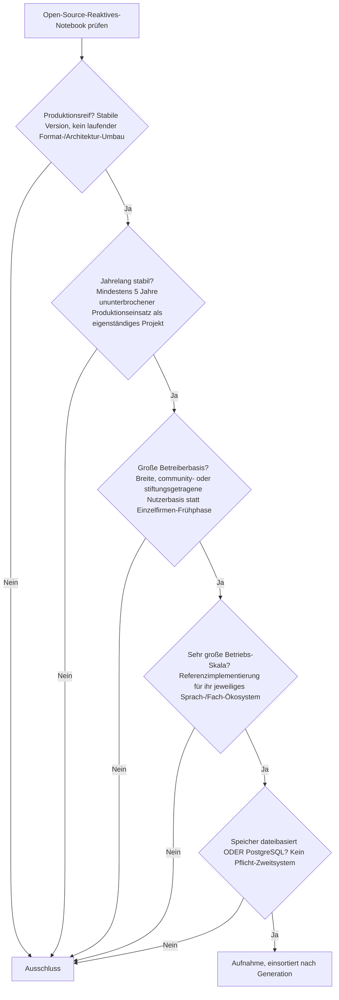
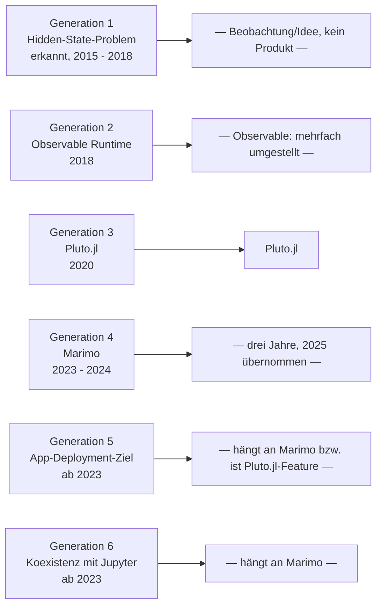

# Produktionsreife Open-Source-Reaktive-Notebooks nach Generation — Reifegrad, Evaluation & Betriebs-Skala (Top 1)

Die [Evolution und Architekturen digitaler Reaktiver Notebooks](evolution-digitaler-reaktive-notebooks.md) zoomt in Generation 5 der [Notebook-Systeme-Chronologie](evolution-digitaler-notebook-systeme.md) hinein und zerlegt sie in sechs eigene Entwicklungsstufen, die [Topliste bester reaktiver Notebooks 2026](reaktive-notebooks-2026-topliste.md) rankt die gesamte (kleine) Kategorie, die [PostgreSQL-/Dateiformat-Variante](reaktive-notebooks-postgresql-dateiformat-2026-topliste.md) siebt bereits nach Lizenz, Speicherbackend und Aktivität. Diese Seite kombiniert alle Achsen — parallel zur [Wissenssysteme-](produktionsreife-wissenssysteme-generationen-2026-topliste.md), [CMS-](produktionsreife-cms-generationen-2026-topliste.md), [Notebook-](produktionsreife-notebook-systeme-generationen-2026-topliste.md), [Semantische-&-RAG-](produktionsreife-semantische-rag-wissenssysteme-generationen-2026-topliste.md), [Static-Site-Generator-](produktionsreife-static-site-generatoren-generationen-2026-topliste.md), [Wiki-Engine-](produktionsreife-wiki-engines-generationen-2026-topliste.md), [PKM-](produktionsreife-pkm-wissensgraphen-generationen-2026-topliste.md), [Wissenssystem-Framework-](produktionsreife-wissenssystem-frameworks-generationen-2026-topliste.md), [Headless-CMS-](produktionsreife-headless-cms-generationen-2026-topliste.md), [R-Markdown-&-Quarto-](produktionsreife-rmarkdown-quarto-generationen-2026-topliste.md) und [LMS-Schwesterseite](../e-learning/produktionsreife-lms-generationen-2026-topliste.md) — zu einem bewusst **konservativen** Fünf-Filter-Sieb: produktionsreif · jahrelang stabil · große Betreiberbasis · sehr große Betriebs-Skala · Speicher dateibasiert oder PostgreSQL. Sortiert nach Generation.

!!! warning "Achtung: Die dünnste Liste der ganzen Familie — nur ein einziger Treffer"
    Reaktive Notebooks sind mit Abstand die **jüngste, volatilste** Architekturlinie in dieser gesamten Wissenssysteme-Familie: Die Kategorie existiert erst seit 2018, ihr aktuell aktivster Vertreter (**Marimo**) ist gerade drei Jahre alt und wurde 2025 übernommen, ihr Gründungsvertreter (**Observable**) hat sein Format seither mehrfach komplett umgestellt. Übrig bleibt genau **ein** System, das alle fünf Filter besteht: **Pluto.jl** — die reaktive Referenzimplementierung für das Julia-Ökosystem, seit 2020 ohne größeren Architektur-Bruch produktiv. Das ist keine Schwäche dieser Seite, sondern ein ehrliches Signal: In einer Kategorie, die per Definition auf jüngste Architektur-Innovation ausgelegt ist, ist „seit über fünf Jahren unverändert stabil" eine seltene Ausnahme, keine Regel.

---

## Die fünf harten Filter

!!! note "Hinweis: Nur OSI-anerkannte Lizenzen"
    Wie in der [Gesamtübersicht](open-source-llm-agent-mcp-systeme.md) zählen ausschließlich OSI-anerkannte Lizenzen. In dieser Kategorie ist das kaum die entscheidende Hürde — anders als bei Wiki-Engines oder CMS scheitert hier praktisch niemand am Lizenzfilter selbst; die Hürde ist durchgängig die **Reifezeit**.

---

## Ergebnis: Ein System aus Generation 3

---

## Das System

### Generation 3 — Pluto.jl: Reaktivität für wissenschaftliches Rechnen (2020)

| # | System | Speicher | Lizenz | Seit | Skala-Nachweis | Betreiberbasis |
|---|---|---|---|---|---|---|
| 1 | **Pluto.jl** | Reines Dateiformat (`.jl`) | MIT | 2020 | Referenzimplementierung für Reaktivität im wissenschaftlichen Rechnen; breite Nutzung in Lehre und Forschung mit numerischen/wissenschaftlichen Julia-Workloads | Julia-Community-getragen, sechs Jahre ohne größeren Architektur-Bruch |

**Pluto.jl** löst das „versteckter Zustand"-Problem klassischer Jupyter-Notebooks durch dataflow-basierte Neuberechnung: Ändert sich eine Zelle, berechnen sich automatisch alle abhängigen Folgezellen neu — die im Dokument sichtbare Reihenfolge entspricht damit immer dem tatsächlichen Ausführungszustand. Das Notebook speichert sich als reine `.jl`-Datei samt exakt reproduzierbarer Paketumgebung, git-diff-freundlich statt JSON-verschachtelt. Vertiefung und Einordnung in die breitere Notebook-Klasse: [Produktionsreife Open-Source-Notebook-Systeme nach Generation](produktionsreife-notebook-systeme-generationen-2026-topliste.md#generation-5-reaktive-notebooks-ohne-versteckten-zustand-2018-2024).

### Generation 1 — warum hier nichts steht

Die Gründergeneration (2015 – 2018) ist reine **Beobachtung und Lösungsidee** — das Hidden-State-Problem klassischer Jupyter-Notebooks wird erkannt (1a), die Spreadsheet-Analogie als Lösungsmodell formuliert (1b) — beides kein installierbares System. **Observable** (1c, 2018) ist der erste konkrete Vertreter, gehört aber architektonisch zu Generation 2 dieser Liste.

### Generation 2 — warum hier nichts steht

**Observable Runtime**, **Observable Framework** und **Observable Plot** sind technisch offene (ISC-lizenzierte) Bausteine desselben Teams, das die gehostete SaaS-Plattform observablehq.com betreibt — siehe [PostgreSQL-/Dateiformat-Schwesterseite](reaktive-notebooks-postgresql-dateiformat-2026-topliste.md), wo sie diesen engeren Speicher-/Lizenzfilter durchaus bestehen. Für das striktere Sieb dieser Seite scheitern sie an einem anderen Punkt: Das Gesamtmodell wurde seit 2018 **mehrfach komplett umgestellt** — vom gehosteten Notebook über den eigenständigen Observable Framework (2023) bis zum lokalen Dateiformat — dieselbe „Kontinuität"-Einstufung, mit der bereits die [Notebook-Systeme-Schwesterseite](produktionsreife-notebook-systeme-generationen-2026-topliste.md#was-bewusst-nicht-auf-dieser-liste-steht) Observable als Ganzes ausschließt. „Kein laufender Format-/Architektur-Umbau" ist damit über die gesamte Systemfamilie hinweg nicht sauber erfüllt, und Observable Framework selbst ist mit drei Jahren ohnehin noch zu jung. **Observable Plot** ist zudem primär eine Visualisierungsbibliothek, kein reaktives Notebook-System im engeren Sinn dieser Kategorie.

### Generation 4, 5 & 6 — warum hier nichts steht

- **Generation 4** (Marimo, 2023 – 2024): Als eigenständiges Projekt erst drei Jahre alt, im Oktober 2025 von CoreWeave übernommen — „jahrelang stabil" und „breite, community- statt einzelfirmengetragene Basis" sind beide nicht sauber erfüllt. Dieselbe Einstufung wie auf der [Notebook-Systeme-Schwesterseite](produktionsreife-notebook-systeme-generationen-2026-topliste.md#was-bewusst-nicht-auf-dieser-liste-steht). Aussichtsreichster Nachrücker dieser Liste, sobald sich die neue Eigentümerschaft stabilisiert hat.
- **Generation 5** (App-Deployment-Ziel, ab 2023): **Marimo-App-Modus** hängt vollständig an Marimo und erbt dessen Ausschluss; **Pluto.jl-Export** ist kein eigenständiges System, sondern eine eingebaute Funktion von Pluto.jl selbst (bereits in Generation 3 mitgezählt).
- **Generation 6** (Koexistenz mit Jupyter, ab 2023): **Marimo-Jupyter-Import** ist ebenfalls ein Feature von Marimo, kein eigenständiges Produkt.

---

## Dateibasiert oder PostgreSQL? — dieselbe „dateibasiert, fast immer"-Kategorie wie Notebooks

Reaktive Notebooks reihen sich exakt in den Befund der [Notebook-Systeme-](produktionsreife-notebook-systeme-generationen-2026-topliste.md#dateibasiert-oder-postgresql-dateibasiert-fast-immer) und [R-Markdown-/Quarto-Schwesterseite](produktionsreife-rmarkdown-quarto-generationen-2026-topliste.md#dateibasiert-oder-postgresql-dieselbe-dateibasiert-fast-immer-kategorie-wie-notebooks) ein: **Pluto.jl** speichert ausschließlich als reine `.jl`-Textdatei — kein Datenbankdienst kommt in diesem Workflow architektonisch vor. Eine „PostgreSQL-Variante" gibt es für diese Kategorie strukturell nicht.

!!! warning "Achtung: Momentaufnahme, Stand August 2026"
    Marimo überschreitet die Fünf-Jahres-Marke frühestens 2028/2029 und muss zuvor beweisen, dass die CoreWeave-Übernahme die Weiterentwicklung nicht bremst. Observable Framework kann mit wachsender eigenständiger Historie ebenfalls nachrücken, sofern kein weiterer Format-Umbau folgt.

---

## Was bewusst nicht auf dieser Liste steht

| System | Erfüllt nicht | Anmerkung |
|---|---|---|
| **Observable** (gehostete Plattform) | Lizenzfilter + Kontinuität | Proprietäres SaaS, zusätzlich mehrfach umgestelltes Modell |
| **Observable Runtime, Observable Framework** | Kontinuität | Technisch OSI-lizenziert und dateibasiert, aber Teil eines mehrfach umgestellten Gesamtmodells; Framework zusätzlich erst seit 2023 |
| **Observable Plot** | Kategorie | Visualisierungsbibliothek, kein reaktives Notebook-System im engeren Sinn |
| **Marimo** | „Jahrelang stabil" | Drei Jahre, im Oktober 2025 von CoreWeave übernommen |
| **Marimo-App-Modus, Marimo-Jupyter-Import** | „Jahrelang stabil" | Features von Marimo, erben dessen Ausschluss |
| **Pluto.jl-Export** | Kategorie | Eingebaute Funktion von Pluto.jl, kein eigenständiges System |

---

## 🔗 Verwandte Themen

- [Startseite](../../index.md) — zurück zur Dokumentations-Zentrale
- [Evolution und Architekturen digitaler Reaktiver Notebooks](evolution-digitaler-reaktive-notebooks.md) — das sechsstufige Generationenmodell, nach dem diese Liste sortiert ist
- [Produktionsreife Open-Source-Notebook-Systeme nach Generation (Top 4)](produktionsreife-notebook-systeme-generationen-2026-topliste.md) — die übergeordnete Kategorie; Pluto.jl erscheint dort ebenfalls als Generation-5-Vertreter
- [Produktionsreife Open-Source-R-Markdown- & Quarto-Werkzeuge nach Generation (Top 5)](produktionsreife-rmarkdown-quarto-generationen-2026-topliste.md) — Schwesterseite im Notebook-Cluster mit demselben Sieb
- [Beste reaktive Notebooks 2026 (Top 10)](reaktive-notebooks-2026-topliste.md) — breiteste Basis-Topliste ohne Lizenz-/Speicherbackend-/Aktivitätsfilter
- [Reaktive Notebooks mit PostgreSQL-/Dateiformat-Speicherung (Top 9)](reaktive-notebooks-postgresql-dateiformat-2026-topliste.md) — derselbe Speicher-/Lizenzfilter, nach Rang statt nach Generation und ohne den Skala-/Kontinuitätsfilter — dort bestehen auch die Observable-Bausteine
- [Evolution und Architekturen digitaler IPython- & Jupyter-Systeme](evolution-digitaler-ipython-jupyter.md) — Vorgänger-Architektur, deren Hidden-State-Problem diese Kategorie adressiert
- [Evolution und Architekturen digitaler KI-nativer Notebook-Umgebungen](evolution-digitaler-ki-native-notebooks.md) — nachfolgende Generation
