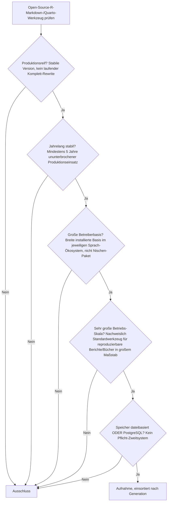
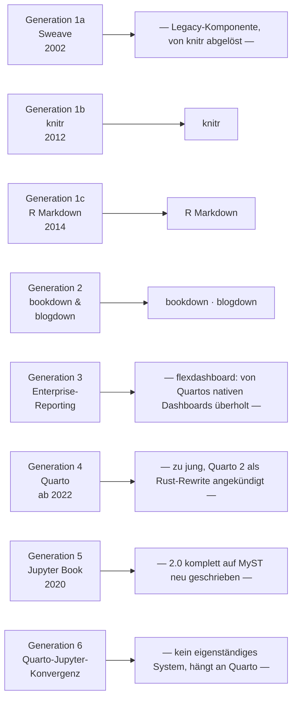

# Produktionsreife Open-Source-R-Markdown- & Quarto-Werkzeuge nach Generation — Reifegrad, Evaluation & Betriebs-Skala (Top 5)

Die [Evolution und Architekturen digitaler R-Markdown- & Quarto-Publishing-Systeme](evolution-digitaler-rmarkdown-quarto.md) zoomt in Generation 4 der [Notebook-Systeme-Chronologie](evolution-digitaler-notebook-systeme.md) hinein und zerlegt sie in sechs eigene Entwicklungsstufen, die [Topliste bester R-Markdown- & Quarto-Werkzeuge 2026](rmarkdown-quarto-2026-topliste.md) rankt die gesamte Kategorie, die [PostgreSQL-/Dateiformat-Variante](rmarkdown-quarto-postgresql-dateiformat-2026-topliste.md) siebt bereits nach Lizenz, Speicherbackend und Aktivität. Diese Seite kombiniert alle Achsen — parallel zur [Wissenssysteme-](produktionsreife-wissenssysteme-generationen-2026-topliste.md), [CMS-](produktionsreife-cms-generationen-2026-topliste.md), [Notebook-](produktionsreife-notebook-systeme-generationen-2026-topliste.md), [Semantische-&-RAG-](produktionsreife-semantische-rag-wissenssysteme-generationen-2026-topliste.md), [Static-Site-Generator-](produktionsreife-static-site-generatoren-generationen-2026-topliste.md), [Wiki-Engine-](produktionsreife-wiki-engines-generationen-2026-topliste.md), [PKM-](produktionsreife-pkm-wissensgraphen-generationen-2026-topliste.md), [Wissenssystem-Framework-](produktionsreife-wissenssystem-frameworks-generationen-2026-topliste.md), [Headless-CMS-](produktionsreife-headless-cms-generationen-2026-topliste.md) und [LMS-Schwesterseite](../e-learning/produktionsreife-lms-generationen-2026-topliste.md) — zu einem bewusst **konservativen** Fünf-Filter-Sieb: produktionsreif · jahrelang stabil · große Betreiberbasis · sehr große Betriebs-Skala · Speicher dateibasiert oder PostgreSQL. Sortiert nach Generation.

!!! warning "Achtung: Quarto — der Namensgeber der Kategorie — besteht das Sieb selbst nicht"
    Die [Notebook-Systeme-Schwesterseite](produktionsreife-notebook-systeme-generationen-2026-topliste.md#generation-4-r-markdown-okosystem-multi-sprachen-publishing-2012-2022) hat diese Frage bereits beantwortet, diese Seite bestätigt sie mit derselben Begründung: **Quarto** ist erst vier Jahre alt, und Posit hat mit **Quarto 2** einen vollständigen Rust-Rewrite angekündigt — „kein laufender Komplett-Rewrite" ist damit nicht erfüllt. Die produktionsreife Substanz der Kategorie liegt stattdessen in der **R-Markdown-Linie selbst**: **knitr**, **R Markdown**, **bookdown** und **blogdown** sind zwischen 10 und 14 Jahre alt und bilden die eigentliche Referenzarchitektur, auf der Quarto konzeptionell aufbaut.

---

## Die fünf harten Filter

!!! note "Hinweis: Nur OSI-anerkannte Lizenzen"
    Wie in der [Gesamtübersicht](open-source-llm-agent-mcp-systeme.md) zählen ausschließlich OSI-anerkannte Lizenzen. In dieser Kategorie ist das kaum eine Hürde — anders als bei Wiki-Engines oder CMS ist praktisch das gesamte R-Markdown-/Quarto-Ökosystem von Anfang an quelloffen (Posit selbst betreibt sein Geschäftsmodell über Support und Hosting, nicht über Kernlizenzen).

---

## Ergebnis: Vier Systeme über zwei von sechs Generationen, plus ein Quer-Einstieg

---

## Systeme nach Generation

### Generation 1b — knitr löst Sweave ab (2012)

| # | System | Speicher | Lizenz | Seit | Skala-Nachweis | Betreiberbasis |
|---|---|---|---|---|---|---|
| 1 | **knitr** | Reines Dateiformat | GPL-3.0 | 2012 | Chunk-Engine hinter R Markdown **und** Quartos R-Rendering — praktisch jede reproduzierbare R-Publikation läuft durch knitr | Von Yihui Xie (heute Posit) seit 14 Jahren gepflegt, faktischer Standard des R-Ökosystems |

**knitr** ist der stille Motor der gesamten Kategorie: Selbst Quarto, das knitr eigentlich ablösen soll, nutzt knitr weiterhin als R-Rendering-Backend. **Sweave** (Generation 1a, 2002) ist dagegen eine Legacy-Komponente von R, seit über einem Jahrzehnt von knitr abgelöst — kein eigenständiger heutiger Produktivvertreter.

### Generation 1c — R Markdown wird eigenständiges Format (2014)

| # | System | Speicher | Lizenz | Seit | Skala-Nachweis | Betreiberbasis |
|---|---|---|---|---|---|---|
| 2 | **R Markdown** (`rmarkdown`-Paket) | Reines Dateiformat (`.Rmd`) | GPL-3.0 | 2014 | Etablierter Enterprise-Reporting-Standard, größte Bestandsbasis im R-Ökosystem | Von Posit (vormals RStudio) hauptamtlich getragen, seit über einem Jahrzehnt stabil |

**R Markdown** ist derselbe Treffer, den bereits die [Notebook-Systeme-Schwesterseite](produktionsreife-notebook-systeme-generationen-2026-topliste.md#generation-4-r-markdown-okosystem-multi-sprachen-publishing-2012-2022) für die breitere Notebook-Klasse bestätigt — hier eingeordnet in die feinere Generation 1c dieser eigenen Chronologie statt in die grobe Generation 4 dort.

### Generation 2 — bookdown & blogdown: Buch- und Website-Publishing (2016)

| # | System | Speicher | Lizenz | Seit | Skala-Nachweis | Betreiberbasis |
|---|---|---|---|---|---|---|
| 3 | **bookdown** | Reines Dateiformat | GPL-3.0 | 2016 | Standardwerkzeug für technische Fachbücher im R-Ökosystem, mehrkapitliges Publishing mit Querverweisen und Bibliografie | Zehn Jahre stabile Pflege, breite akademische und Verlags-Nutzung |
| 4 | **blogdown** | Reines Dateiformat | MIT | 2016 | Baut vollständige Websites aus R-Markdown-Inhalten auf Basis von [Hugo](produktionsreife-static-site-generatoren-generationen-2026-topliste.md) | Zehn Jahre stabile Pflege, verbreitete Wahl für akademische und persönliche Websites im R-Umfeld |

**bookdown** und **blogdown** erweitern R Markdown von einzelnen Dokumenten auf mehrkapitlige Bücher respektive vollständige Websites — beide seit einem Jahrzehnt ohne größere Architektur-Brüche im Produktivbetrieb. **blogdown** ist dabei explizit eine Schnittmenge zur [Static-Site-Generator-Schwesterseite](produktionsreife-static-site-generatoren-generationen-2026-topliste.md): Es liefert R-Markdown-Content, Hugo übernimmt den eigentlichen Build.

### Generation 3 — warum hier nichts steht

**flexdashboard** (2014 – 2018, interaktive Dashboards direkt aus R-Markdown-Dokumenten) ist technisch reif, seine Entwicklungsgeschwindigkeit hat aber spürbar nachgelassen, seit Quarto native Dashboard-Unterstützung mitbringt — „sehr aktive Weiterentwicklung" ist damit nicht mehr sauber erfüllt. **Parametrisierte Reports** sind ein Nutzungsmuster (derselbe R-Markdown-Bericht mit unterschiedlichen Eingabeparametern), kein eigenständiges installierbares System.

### Generation 4, 5 & 6 — warum hier nichts steht

- **Generation 4** (Quarto, ab 2022): Vier Jahre alt, „Quarto 2" als vollständiger Rust-Rewrite angekündigt — dieselbe Ausschlussbegründung wie auf der [Notebook-Systeme-Schwesterseite](produktionsreife-notebook-systeme-generationen-2026-topliste.md#was-bewusst-nicht-auf-dieser-liste-steht). Aussichtsreichster Nachrücker der gesamten Familie, sobald Quarto 2 stabilisiert ist.
- **Generation 5** (Jupyter Book, 2020): Wird für Version 2.0 komplett auf die MyST-Engine neu geschrieben — „kein laufender Komplett-Rewrite" nicht erfüllt, ebenfalls konsistent mit der Notebook-Systeme-Schwesterseite.
- **Generation 6** (Quarto-Jupyter-Konvergenz, ab 2022): Kein eigenständiges Produkt, sondern ein Feature von Quarto selbst — hängt vollständig an dessen Reifegrad und erbt damit den Ausschluss aus Generation 4.

### Quer zu den Generationen — spezialisierte R-Markdown-Erweiterungspakete

Eine Gruppe kleinerer, aber ebenfalls produktionsreifer Pakete, die sich nicht in eine einzelne Architektur-Generation einsortieren lassen, weil sie R Markdown um einen einzelnen Anwendungsfall erweitern statt eine neue Architektur-Ära zu definieren:

| System | Speicher | Betreiberbasis & Reife |
|---|---|---|
| **pkgdown** | Reines Dateiformat | Erzeugt die Dokumentations-Website praktisch jedes größeren R-Pakets aus Roxygen-Kommentaren; von der tidyverse-Gruppe seit über zehn Jahren getragen — die mit Abstand größte Betreiberbasis dieser Gruppe |

**xaringan** (Präsentationen), **rticles** (Zeitschriften-Vorlagen) und **workflowr** (Git-integrierter Forschungs-Workflow) erfüllen die technischen Filter ebenfalls, bleiben aber deutlich kleinere Nischenwerkzeuge als pkgdown. **distill** (wissenschaftliche Artikel-/Blog-Vorlage) ist der Sonderfall dieser Gruppe: Seine Kernfunktionen sind inzwischen weitgehend in Quartos Website-Rendering aufgegangen, die eigenständige Weiterentwicklung hat entsprechend nachgelassen.

---

## Dateibasiert oder PostgreSQL? — dieselbe „dateibasiert, fast immer"-Kategorie wie Notebooks

Wie bereits die [Notebook-Systeme-Schwesterseite](produktionsreife-notebook-systeme-generationen-2026-topliste.md#dateibasiert-oder-postgresql-dateibasiert-fast-immer) feststellt: R-Markdown- und Quarto-Werkzeuge sind von Grund auf Compiler für Klartext-Quelldateien zu Dokumenten — ein Datenbankdienst kommt in diesem Workflow architektonisch gar nicht vor. Alle fünf Treffer dieser Liste (knitr, R Markdown, bookdown, blogdown, pkgdown) speichern ausschließlich in Klartextdateien (`.Rmd`, `.R`, `.md`), die sich hervorragend mit Git versionieren lassen. Eine „PostgreSQL-Variante" gibt es für diese Kategorie strukturell nicht — derselbe Befund wie bei den [Static-Site-Generatoren](produktionsreife-static-site-generatoren-generationen-2026-topliste.md#dateibasiert-oder-postgresql-es-gibt-keine-laufzeit-datenbank).

!!! warning "Achtung: Momentaufnahme, Stand August 2026"
    Quarto 2 und Jupyter Book 2.0 können ihre jeweiligen Rewrites in den kommenden Jahren abschließen und dann als eigenständige, wieder stabile Generationen nachrücken. flexdashboards Entwicklungstempo kann sich mit einer neuen Sponsoring-Situation ebenso ändern wie die Aktivität von distill.

---

## Was bewusst nicht auf dieser Liste steht

| System | Erfüllt nicht | Anmerkung |
|---|---|---|
| **Sweave** | Aktivität | Legacy-Komponente von R, seit über einem Jahrzehnt von knitr abgelöst |
| **flexdashboard** | Aktive Weiterentwicklung | Entwicklungstempo spürbar nachgelassen, seit Quarto native Dashboards mitbringt |
| **Parametrisierte Reports** | Kategorie | Nutzungsmuster, kein eigenständiges installierbares System |
| **Quarto** | Reifezeit / Rewrite | Vier Jahre; „Quarto 2" als vollständiger Rust-Rewrite angekündigt — dieselbe Einstufung wie auf der Notebook-Systeme-Schwesterseite |
| **Jupyter Book** | Rewrite | 2.0 komplett auf die MyST-Engine neu geschrieben |
| **Quarto-Jupyter-Integration** | Kategorie | Kein eigenständiges Produkt, sondern ein Feature von Quarto |
| **Typst** | Kategorie | Eigenständiges, von Quarto nur als PDF-Backend eingebundenes Projekt — nicht Teil der R-Markdown-/Quarto-Generationenkette selbst |
| **distill** | Aktive Weiterentwicklung | Kernfunktionen weitgehend in Quartos Website-Rendering aufgegangen |
| **xaringan, rticles, workflowr** | Betreiberbasis | Technisch qualifiziert, aber deutlich kleinere Nische als pkgdown |

---

## 🔗 Verwandte Themen

- [Startseite](../../index.md) — zurück zur Dokumentations-Zentrale
- [Evolution und Architekturen digitaler R-Markdown- & Quarto-Publishing-Systeme](evolution-digitaler-rmarkdown-quarto.md) — das sechsstufige Generationenmodell, nach dem diese Liste sortiert ist
- [Produktionsreife Open-Source-Notebook-Systeme nach Generation (Top 4)](produktionsreife-notebook-systeme-generationen-2026-topliste.md) — die übergeordnete Kategorie; R Markdown erscheint dort ebenfalls, dieselbe Quarto-/Jupyter-Book-Ausschlussbegründung
- [Produktionsreife Open-Source-Static-Site-Generatoren nach Generation (Top 8)](produktionsreife-static-site-generatoren-generationen-2026-topliste.md) — Schnittmenge bei blogdown (baut auf Hugo)
- [Beste R-Markdown- & Quarto-Werkzeuge 2026 (Top 15)](rmarkdown-quarto-2026-topliste.md) — breiteste Basis-Topliste ohne Lizenz-/Speicherbackend-/Aktivitätsfilter
- [R-Markdown- & Quarto-Werkzeuge mit PostgreSQL-/Dateiformat-Speicherung (Top 13)](rmarkdown-quarto-postgresql-dateiformat-2026-topliste.md) — derselbe Speicher-/Lizenzfilter, nach Rang statt nach Generation und ohne den Skala-Filter
- [Evolution und Architekturen digitaler Notebook-Vorläufer](evolution-digitaler-notebook-vorlaeufer.md) — vertiefend zu Sweave (Generation 1a dieser Liste)
- [Evolution und Architekturen digitaler IPython- & Jupyter-Systeme](evolution-digitaler-ipython-jupyter.md) — Schwester-Zeitachse, konvergiert bei Jupyter Book
- [Evolution und Architekturen digitaler Reaktiver Notebooks](evolution-digitaler-reaktive-notebooks.md) — Schwester-Zeitachse im Notebook-Cluster
