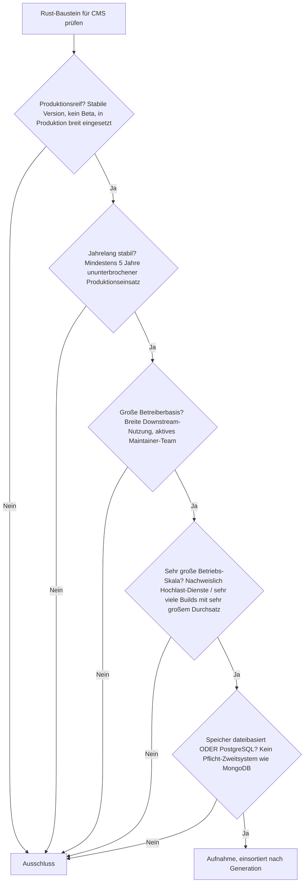
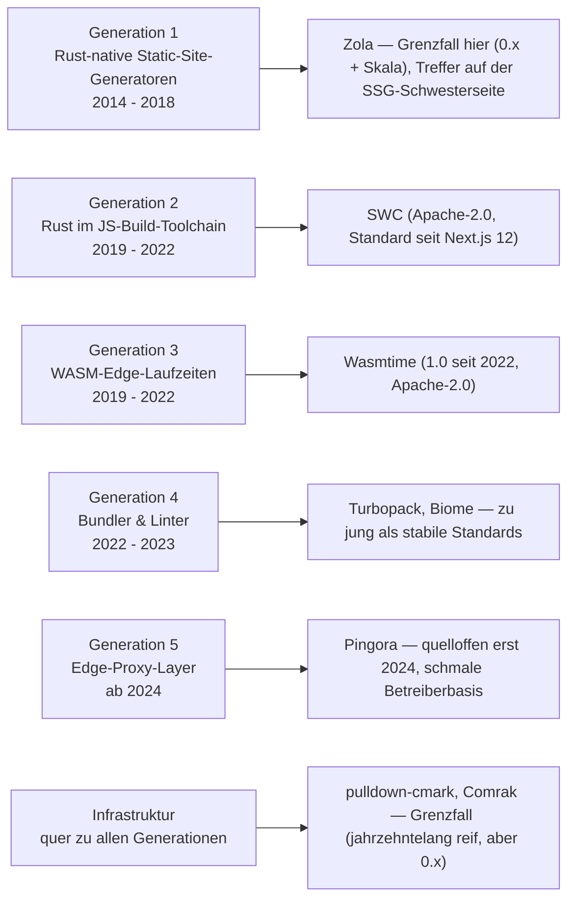
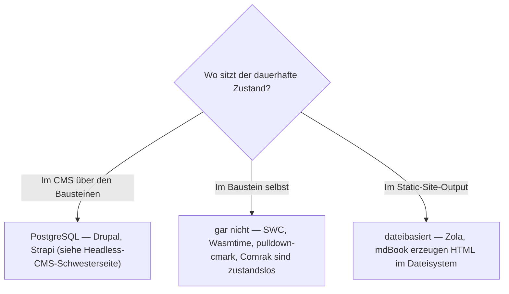

# Produktionsreife Rust-Bausteine für CMS nach Generation — Reifegrad, Evaluation & Betriebs-Skala (Top 2 + Markdown-Parser-Infrastruktur)

Die [Evolution und Architekturen digitaler Rust-CMS](evolution-digitaler-rust-cms.md) verfolgt Rust nicht als eigene CMS-Produktklasse, sondern als **quer zu allen fünf CMS-Generationen liegende Implementierungsachse** — Rust-native Static-Site-Generatoren (1), Rust im JavaScript-Build-Toolchain (2), WASM-Edge-Laufzeiten für Composable-Commerce (3), Bundler & Linter (4), Edge-Proxy-Layer (5). Die [Topliste bester Rust-Bausteine für CMS 2026](rust-cms-2026-topliste.md) rankt diese Achse, die [Speicherbackend-Variante](rust-cms-postgresql-dateiformat-2026-topliste.md) filtert nach Lizenz und Persistenz. Diese Seite legt das **konservative** Fünf-Filter-Sieb an — produktionsreif · jahrelang stabil · große Betreiberbasis · sehr große Betriebs-Skala · Speicher dateibasiert oder PostgreSQL — und ist die CMS-Parallele zur [Rust-LMS-](../e-learning/produktionsreife-rust-lms-generationen-2026-topliste.md) und der [Rust-Webframework-Seite](../../entwicklung/webentwicklung/produktionsreife-rust-webframeworks-generationen-2026-topliste.md). Sortiert nach Generation.

!!! warning "Achtung: Zwei klare Treffer — beide geteilte Infrastruktur, kein CMS-eigener Rust-Baustein"
    Dasselbe Muster wie bei [Rust-LMS](../e-learning/produktionsreife-rust-lms-generationen-2026-topliste.md): Was das Sieb besteht, ist **quer genutzte Infrastruktur**, nicht ein *für* CMS entstandener Baustein. **SWC** (Rust-JS/TS-Compiler, Generation 2) trägt seit Next.js 12 praktisch jede Headless-CMS-Frontend-Kompilierung; **Wasmtime** (WASM-Laufzeit, Generation 3) trägt Shopify Functions und Fastly Compute. Beide seit Jahren stabil und in gigantischer Skala. Dazu besteht als **Grenzfall** die Markdown-Parser-Infrastruktur (**pulldown-cmark**, **Comrak**) — jahrzehntelang produktiv, aber konservativ bei `0.x` versioniert. **Zola** (Generation 1) besteht auf der [Static-Site-Generatoren-Schwesterseite](produktionsreife-static-site-generatoren-generationen-2026-topliste.md) als eigenständiger Treffer, hier scheitert es an `0.x` und Betriebs-Skala. **Turbopack**, **Biome**, **Pingora** (Generationen 4–5) sind zu jung; **Shopify Functions** und **Fastly Compute** sind proprietäre Cloud-Plattformen. Der Speicherfilter ist — wie bei [Compilern und Interpretern](../../entwicklung/system/produktionsreife-compiler-werkzeuge-generationen-2026-topliste.md) — strukturell bedeutungslos; die siebende Achse ist **stabile Version plus fünf Jahre Produktion** ([Speicher-Fazit](#dateibasiert-oder-postgresql)).

---

## Die fünf harten Filter

!!! note "Hinweis: „Baustein für CMS" ist weit gefasst, nur OSI-Lizenzen"
    Aufgenommen wird, was 2026 produktiv in CMS-/Content-Pipelines eingebettet ist — auch wenn der Baustein ursprünglich für JavaScript-Toolchains oder Serverless-Computing entstand. Alle Kandidaten stehen unter permissiver Lizenz (MIT, Apache-2.0, MPL-2.0, BSD-2-Clause). Fertige CMS-Produkte ranken die [CMS-Toplisten](produktionsreife-cms-generationen-2026-topliste.md); diese Seite bleibt auf der Bauteil-Ebene.

---

## Ergebnis: zwei Treffer plus Parser-Infrastruktur über fünf Generationsstufen

---

## Systeme nach Generation

### Generation 2 — Rust im JavaScript-Build-Toolchain für Headless-/JAMstack-Frontends (2019 – 2022)

| # | System | Speicher | Lizenz | Major seit | Skala-Nachweis |
|---|---|---|---|---|---|
| 1 | **[SWC](evolution-digitaler-rust-cms.md#generation-2-rust-im-javascript-build-toolchain-fur-headless-jamstack-frontends-2019-2022)** | keine Persistenzschicht — Compiler, „Code rein, Code raus" | Apache-2.0 | erste Releases 2019, `@swc/core` bei stabiler 1.x | Standard-Kompilierungs- und Minifizierungs-Engine seit Next.js 12 (2021) — praktisch jede Next.js-basierte Headless-CMS-Frontend-Instanz weltweit; dazu Deno, Parcel und viele Einzel-Toolchains |

**SWC** ist der klare Treffer: Rust-nativer JavaScript-/TypeScript-Compiler, seit 2019 in Produktion, seit Next.js 12 (Ende 2021) die Standard-Engine hinter der häufigsten Frontend-Wahl für Headless-CMS. Der Speicherfilter greift nicht — ein Compiler hält keinen Zustand. Die siebende Achse ist erfüllt: über ein halbes Jahrzehnt Produktion, größte Rust-Reichweite überhaupt im CMS-Umfeld, aktives Maintainer-Team (Vercel-gestützt). Meist unsichtbar unter dem Next.js-Namen.

### Generation 3 — WASM-Edge-Laufzeiten für Composable-/MACH-Commerce (2019 – 2022)

| # | System | Speicher | Lizenz | Major seit | Skala-Nachweis |
|---|---|---|---|---|---|
| 2 | **[Wasmtime](evolution-digitaler-rust-cms.md#generation-3-wasm-edge-laufzeiten-fur-composable-mach-commerce-2019-2022)** (Bytecode Alliance) | keine Persistenzschicht — Bytecode-Laufzeit | Apache-2.0 (mit LLVM-Ausnahme) | 1.0 im September 2022, aktuell jährliche Major-Zyklen | Treibt Shopify Functions und Fastly Compute; dieselbe Laufzeit hinter Checkout-/Personalisierungslogik vieler Composable-Commerce-Setups |

**Wasmtime** besteht dasselbe Sieb wie schon auf der [Rust-LMS-Schwesterseite](../e-learning/produktionsreife-rust-lms-generationen-2026-topliste.md#generation-4-wasm-sandboxes-fur-browserbasierte-code-ausfuhrung-2022-2023): stabile 1.0 seit 2022, Produktion seit den Lucet-Anfängen um 2020, sehr große Skala über Fastly und Shopify. Für Composable-CMS ist der Nutzen die sichere Ausführung von fremdem (oft ebenfalls in Rust geschriebenem) Anpassungscode direkt am Edge, ohne VM oder Container pro Kunde.

### Infrastruktur (quer zu allen Generationen) — Markdown-Parser als Grenzfall

| System | Speicher | Lizenz | Version | Anmerkung |
|---|---|---|---|---|
| **pulldown-cmark** | keine | MIT | `0.x` (seit ~2015) | CommonMark-Referenzimplementierung in Rust, Fundament von Zola, mdBook und der Cargo-Doc-Pipeline |
| **Comrak** | keine | BSD-2-Clause | `0.x` (seit ~2017) | GitHub-Flavored-Markdown-Parser, Basis der docs.rs-Rendering-Pipeline |

Beide Parser sind seit rund einem Jahrzehnt in Produktion und tragen einen Großteil aller Rust-basierten Markdown-Verarbeitung — Reife und Skala sind unstrittig. Der einzige Vorbehalt ist die **konservative `0.x`-Versionierung**: Anders als bei [Candle auf der Rust-LMS-Seite](../e-learning/produktionsreife-rust-lms-generationen-2026-topliste.md) bedeutet `0.x` hier nicht „jung und in Bewegung", sondern nur zurückhaltende Semver-Politik bei einem ansonsten stabilen Kern. Deshalb Grenzfall statt voller Treffer.

### Generation 1, 4 & 5 — warum hier nichts steht

- **Generation 1 (Zola, Cobalt.rs)**: **Zola** ist reif (seit 2018), MIT-lizenziert und dateibasiert — und besteht das Sieb auf der [Static-Site-Generatoren-Schwesterseite](produktionsreife-static-site-generatoren-generationen-2026-topliste.md) als eigenständiger Treffer neben Hugo und Jekyll. *Als CMS-Baustein* fehlen ihm die Betriebs-Skala (technische Nischennutzung, weit hinter Hugo/Jekyll) und eine stabile 1.0. **Cobalt.rs** ist noch nischiger.
- **Generation 4 (Turbopack, Biome)**: **Turbopack** ist erst seit Next.js 15 (Oktober 2024) stabiler Standard-Bundler — unter zwei Jahre. **Biome** ist ein 2023 entstandener Fork des eingestellten Rome-Projekts. Beide qualifiziert bei Skala und Aktivität, aber klar unter der Fünf-Jahres-Marke.
- **Generation 5 (Pingora)**: Cloudflare betreibt Pingora intern seit ~2022 in gigantischer Skala, hat es aber erst im Februar 2024 quelloffen gestellt. Die **Betreiberbasis außerhalb von Cloudflare** ist noch schmal (River-Proxy u. a.). Grenzfall an Reifezeit und Betreiberbasis.
- **Shopify Functions, Fastly Compute**: proprietäre Cloud-Plattform-Features ohne eigenständig betreibbaren Quellcode — dieselbe Begründung wie in der [Speicherbackend-Topliste](rust-cms-postgresql-dateiformat-2026-topliste.md). Das quelloffene Fundament darunter *ist* Wasmtime.
- **Oxc/Oxlint, Rolldown, Turborepo (Rust-Rewrite)**: alle seit 2023/24 in ihrer Rust-Form — zu jung.

---

## Dateibasiert oder PostgreSQL?

Die Frage verschiebt sich wie auf der [Rust-LMS-Schwesterseite](../e-learning/produktionsreife-rust-lms-generationen-2026-topliste.md#dateibasiert-oder-postgresql): Die Bausteine **haben keine Persistenzschicht** — sie kompilieren, führen aus oder parsen.

- Das **CMS über** SWC/Wasmtime braucht weiterhin eine Datenbank für Inhalte, Nutzer und Workflows — konkret PostgreSQL, siehe [Headless-CMS-Schwesterseite](produktionsreife-headless-cms-generationen-2026-topliste.md) und [CMS nach Generation](produktionsreife-cms-generationen-2026-topliste.md).
- Die **Build- und Sandbox-Bausteine selbst** sind zustandslos — genau das macht sie schnell und sicher.
- Die einzige echte „dateibasiert"-Linie ist der **Static-Site-Zweig** (Zola, Cobalt.rs) — dort ist der gesamte „Datenbestand" Markdown plus Templates im Git-Repository.

Vertiefung zur Datenbankschicht: [PostgreSQL DBA Praxis-Handbuch](../../entwicklung/infrastruktur/postgresql-dba-praxis.md).

!!! warning "Achtung: Momentaufnahme, Stand August 2026"
    Die jüngeren Generationen bewegen sich schnell — erreicht **Turbopack** oder **Pingora** die Fünf-Jahres-Marke als stabiler, breit betriebener Standard, wächst diese Liste. **SWC** und **Wasmtime** sind die stabilen Konstanten.

---

## Was bewusst nicht auf dieser Liste steht

| Baustein | Erfüllt nicht | Anmerkung |
|---|---|---|
| **Zola** | 1.0 + Betriebs-Skala | Reif und dateibasiert, aber technische Nischennutzung; voller Treffer auf der Static-Site-Generatoren-Schwesterseite |
| **Cobalt.rs** | Betreiberbasis | Nischen-SSG mit deutlich geringerer Aktivität als Zola |
| **Turbopack** | Reifezeit | Stabiler Next.js-Standard erst seit Oktober 2024 |
| **Biome** | Reifezeit | 2023 als Rome-Fork entstanden |
| **Pingora** | Reifezeit + Betreiberbasis | Quelloffen erst 2024; außerhalb Cloudflares noch schmale Nutzung |
| **Lightning CSS** | Reifezeit | 2022, an Parcel 2 / Tailwind v4 gebunden — Betriebs-Skala wächst noch |
| **Oxc/Oxlint, Rolldown, Turborepo** | Reifezeit | Alle seit 2023/24 in ihrer heutigen Rust-Form |
| **Shopify Functions, Fastly Compute** | Lizenz / Kategorie | Proprietäre Cloud-Plattformen; das quelloffene Fundament ist Wasmtime |
| **pulldown-cmark, Comrak** | stabile Major-Version | Jahrzehntelang reif und in großer Skala, aber konservativ bei `0.x` — als Grenzfall geführt |

---

## 🔗 Verwandte Themen

- [Evolution und Architekturen digitaler Rust-CMS](evolution-digitaler-rust-cms.md) — das Generationenmodell der Rust-Implementierungsachse, nach dem diese Liste sortiert ist
- [Beste Rust-Bausteine für CMS 2026 (Top 15)](rust-cms-2026-topliste.md) — breitere Basis-Topliste inklusive junger und punktueller Bausteine
- [Rust-Bausteine für CMS mit PostgreSQL-/Dateiformat-Speicherung (Top 12)](rust-cms-postgresql-dateiformat-2026-topliste.md) — mittlere Filterstufe: Lizenz, Speicher, Aktivität, aber ohne die Fünf-Jahres-/Skala-Härte dieser Seite
- [Produktionsreife Rust-Bausteine für LMS nach Generation (Top 2)](../e-learning/produktionsreife-rust-lms-generationen-2026-topliste.md) — dieselbe Beobachtung für LMS: die reife Rust-Schicht ist geteilte Infrastruktur (Firecracker, Wasmtime)
- [Produktionsreife Rust-Bausteine für KI-Anwendungen nach Generation (Top 1)](../../künstliche-intelligenz/produktionsreife-rust-ki-anwendungen-generationen-2026-topliste.md) — jüngste Achse der Familie: nur Hugging Face `tokenizers` besteht
- [Produktionsreife Rust-Web-Frameworks nach Generation](../../entwicklung/webentwicklung/produktionsreife-rust-webframeworks-generationen-2026-topliste.md) — Schwesterseite; dort besteht mit Actix-web ein domäneneigenes Framework
- [Produktionsreife Rust-Bausteine für Wissenssysteme nach Generation](produktionsreife-rust-wissenssysteme-generationen-2026-topliste.md) — dieselbe Bauteil-Ebene für Wissenssysteme
- [Produktionsreife Open-Source-Headless-CMS nach Generation (Top 3)](produktionsreife-headless-cms-generationen-2026-topliste.md) — die Produktebene über SWC/Lightning CSS
- [Produktionsreife Compiler-Werkzeuge nach Generation](../../entwicklung/system/produktionsreife-compiler-werkzeuge-generationen-2026-topliste.md) — dieselbe Beobachtung: bei Compiler-Bausteinen ist der Speicherfilter strukturell bedeutungslos
- [PostgreSQL DBA Praxis-Handbuch](../../entwicklung/infrastruktur/postgresql-dba-praxis.md) — Datenbankschicht des CMS über den Bausteinen
