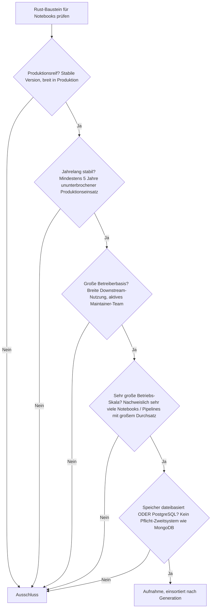
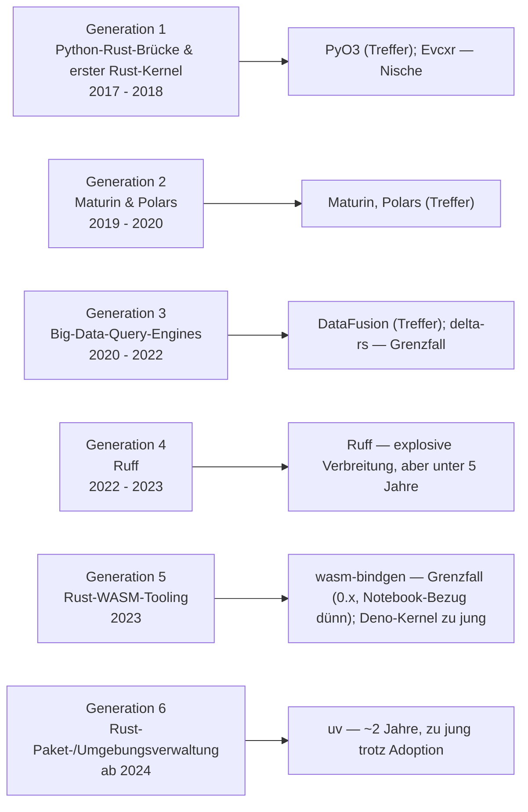
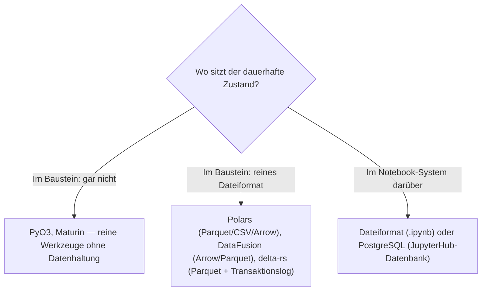

# Produktionsreife Rust-Bausteine für Notebooks nach Generation — Reifegrad, Evaluation & Betriebs-Skala (Top 4 — die Rust-Python-Datenpipeline, keine notebook-eigene)

Die [Evolution und Architekturen digitaler Rust-Notebooks](evolution-digitaler-rust-notebooks.md) verfolgt Rust nicht als eigene Notebook-Systemklasse, sondern als **quer zu allen sechs Notebook-Generationen liegende Implementierungsachse** — die Python-Rust-Brücke & der erste Rust-Kernel (1), Maturin & Polars (2), Big-Data-Query-Engines (3), Ruff (4), Rust-WASM-Tooling für reaktive Notebooks (5), Rust-gestützte Paket-/Umgebungsverwaltung (6). Die [Topliste bester Rust-Bausteine für Notebooks 2026](rust-notebooks-2026-topliste.md) rankt diese Achse, die [Speicherbackend-Variante](rust-notebooks-postgresql-dateiformat-2026-topliste.md) filtert nach Lizenz und Persistenz. Diese Seite legt das **konservative** Fünf-Filter-Sieb an — produktionsreif · jahrelang stabil · große Betreiberbasis · sehr große Betriebs-Skala · Speicher dateibasiert oder PostgreSQL — und ist die Notebook-Parallele zur [Rust-Wissenssysteme-](produktionsreife-rust-wissenssysteme-generationen-2026-topliste.md) und der [Rust-CMS-Seite](produktionsreife-rust-cms-generationen-2026-topliste.md). Sortiert nach Generation.

!!! warning "Achtung: Vier Treffer — die Rust-Python-Datenpipeline, kein notebook-eigener Baustein"
    Dasselbe Muster wie bei [Rust-LMS](../e-learning/produktionsreife-rust-lms-generationen-2026-topliste.md), [Rust-CMS](produktionsreife-rust-cms-generationen-2026-topliste.md) und [Rust-Wissenssystemen](produktionsreife-rust-wissenssysteme-generationen-2026-topliste.md): Was das Sieb besteht, ist **die geteilte Rust-Python-Werkzeugkette der Datenverarbeitung** — **PyO3** (FFI-Brücke, Generation 1), **Maturin** (Build-Pipeline, Generation 2), **Polars** (DataFrame-Engine, Generation 2) und **DataFusion** (SQL-Query-Engine, Generation 3). Keiner davon ist *für* Notebooks entstanden; sie laufen in der Python-Zelle, weil sie die schnelle Alternative zu pandas/SQLite sind. **Ruff** und **uv** haben explosive Verbreitung, sind aber erst seit 2022 bzw. 2024 — unter fünf Jahre. **Evcxr** (der Rust-Jupyter-Kernel) ist reif, aber Nische. Der Speicherfilter ist bei diesen Werkzeug-Bausteinen strukturell bedeutungslos; die siebende Achse ist **stabile Version plus fünf Jahre plus große Betreiberbasis** ([Speicher-Fazit](#dateibasiert-oder-postgresql)).

---

## Die fünf harten Filter

!!! note "Hinweis: „Baustein für Notebooks" ist weit gefasst, nur OSI-Lizenzen"
    Aufgenommen wird, was 2026 produktiv in Notebook-Zellen oder deren Umgebung läuft — auch wenn der Baustein für die allgemeine Python-Datenverarbeitung entstand und nicht notebook-spezifisch ist. Alle Kandidaten stehen unter permissiver Lizenz (MIT, Apache-2.0). Fertige Notebook-Systeme ranken die [Notebook-Toplisten](produktionsreife-notebook-systeme-generationen-2026-topliste.md); diese Seite bleibt auf der Bauteil-Ebene.

---

## Ergebnis: vier Treffer über sechs Generationsstufen

---

## Systeme nach Generation

### Generation 1 — Die Python-Rust-Brücke (2017 – 2018)

| # | System | Speicher | Lizenz | Seit | Skala-Nachweis |
|---|---|---|---|---|---|
| 1 | **PyO3** | keine | Apache-2.0 / MIT | 2017 | Technisches Fundament praktisch jeder Rust-beschleunigten Python-Bibliothek — Polars, Ruff, uv, `pydantic-core`, `tokenizers`, `cryptography` bauen darauf |

**PyO3** ist der Treffer der Gründergeneration: rund neun Jahre Produktion, unter jeder Rust-Python-Bibliothek dieser Seite. Konservativ bei `0.x` versioniert — wie bei [Tantivy und den Markdown-Parsern der Schwesterseiten](produktionsreife-rust-wissenssysteme-generationen-2026-topliste.md) ist das zurückhaltende Semver-Politik, keine Instabilität. **Evcxr**, der Rust-Jupyter-Kernel derselben Generation, ist reif und aktiv gepflegt, aber Rust-Code direkt in Notebook-Zellen bleibt eine kleine Nische — keine große Betreiberbasis.

### Generation 2 — Maturin & Polars (2019 – 2020)

| # | System | Speicher | Lizenz | Seit | Skala-Nachweis |
|---|---|---|---|---|---|
| 2 | **Maturin** | keine | Apache-2.0 / MIT | 2019 | Standard-Build-/Publish-Werkzeug für PyO3-Wheels — baut die `pip`-Pakete von Polars, Ruff, `pydantic-core` und tausenden weiteren |
| 3 | **Polars** | arbeitet auf Parquet-/CSV-/Arrow-Dateien — dateibasiert | MIT | 2020, stabile 1.0 seit Juli 2024 | In sehr vielen Data-Science-Notebooks als direkter `import polars`-Ersatz für pandas; verbreitetste Rust-Datenbibliothek überhaupt |

**Maturin** und **Polars** sind die reifen Treffer der zweiten Generation. Maturin ist die unsichtbare Pipeline hinter fast jeder Rust-Python-Bibliothek. Polars ist seit 2020 in Produktion, die 1.0 (Mitte 2024) war eine Formalie nach jahrelanger produktiver Nutzung — dieselbe großzügige Einordnung wie bei jung-nummerierten, aber lange stabilen Bausteinen der Familie. Der Speicherfilter greift günstig: Polars arbeitet direkt auf Dateien, kein Datenbankserver.

### Generation 3 — Rust-native Big-Data-Query-Engines (2020 – 2022)

| # | System | Speicher | Lizenz | Seit | Skala-Nachweis |
|---|---|---|---|---|---|
| 4 | **DataFusion** (Apache Arrow) | arbeitet auf Arrow-/Parquet-Dateien — dateibasiert | Apache-2.0 | 2019/2020, Teil von Apache Arrow mit regulären Major-Zyklen | Query-Engine-Fundament analytiklastiger Systeme (u. a. InfluxDB 3.0); in Notebooks über Python-Bindings für SQL auf großen Datenmengen |

**DataFusion** besteht das Sieb als eingebettete SQL-Query-Engine: sechs Jahre Produktion, Apache-Governance, reguläre Major-Versionen, dateibasiert auf Arrow/Parquet. **delta-rs** (Generation 3, Delta-Lake-Format ohne JVM) ist an der Fünf-Jahres-Marke und `0.x` — Grenzfall.

### Generation 4 – 6 — warum hier nichts steht

- **Generation 4 (Ruff)**: Rust-Linter/Formatter von Astral, seit 2022 — **explosive Verbreitung** (u. a. bei pandas, FastAPI, Apache Airflow), aber unter der Fünf-Jahres-Marke. Der wahrscheinlichste nächste Treffer dieser Seite.
- **Generation 5 (wasm-bindgen/wasm-pack, Deno-Jupyter-Kernel)**: **wasm-bindgen** existiert seit 2018 und ist das Fundament aller Rust-zu-WASM-Kompilierung — aber `0.x`, und der *Notebook*-Bezug ist dünn (wenige Rust-native WASM-Notebook-Kernel in nennenswerter Nutzung). Der **Deno-Jupyter-Kernel** kam 2023 — zu jung.
- **Generation 6 (uv)**: Rust-Paketmanager von Astral, 2024 — rasante Adoption als `pip`/`virtualenv`-Ersatz, aber erst ~2 Jahre alt. Reißt die Fünf-Jahres-Marke klar.

---

## Dateibasiert oder PostgreSQL?

Eindeutig **dateibasiert** — und zwar strukturell: Alle vier Treffer haben entweder keine Persistenzschicht oder arbeiten auf reinen Dateiformaten.

- Die Rust-Datenbausteine sind der **Grund**, warum die moderne Notebook-Datenverarbeitung *ohne* Datenbankserver auskommt: Polars und DataFusion rechnen direkt auf Parquet und Arrow, delta-rs bringt sogar ACID-Garantien und Zeitreisen auf reine Dateien.
- Das **Notebook selbst** ist eine `.ipynb`-Datei; erst eine Mehrbenutzer-Umgebung (JupyterHub) braucht eine relationale Datenbank, siehe [Notebook-Systeme nach Generation](produktionsreife-notebook-systeme-generationen-2026-topliste.md).

Vertiefung zur Datenbankschicht: [PostgreSQL DBA Praxis-Handbuch](../../entwicklung/infrastruktur/postgresql-dba-praxis.md).

!!! warning "Achtung: Momentaufnahme, Stand August 2026"
    Erreicht **Ruff** (2027) oder **uv** (2029) die Fünf-Jahres-Marke, wächst diese Liste voraussichtlich um zwei weitere Treffer. **PyO3**, **Maturin**, **Polars** und **DataFusion** sind die stabilen Konstanten.

---

## Was bewusst nicht auf dieser Liste steht

| Baustein | Erfüllt nicht | Anmerkung |
|---|---|---|
| **Ruff** | Reifezeit | Seit 2022, explosive Adoption — wahrscheinlichster nächster Treffer |
| **uv** | Reifezeit | Seit 2024 (~2 Jahre), rasante Adoption |
| **delta-rs** | 1.0 + Reifezeit | Delta-Lake-Format ohne JVM, aber `0.x` und an der Fünf-Jahres-Marke |
| **wasm-bindgen / wasm-pack** | 1.0 + Kategorie | Seit 2018 Fundament aller Rust-WASM-Kompilierung, aber `0.x` und nur dünner Notebook-Bezug |
| **Deno-Jupyter-Kernel** | Reifezeit | Nativer Jupyter-Support seit 2023 |
| **Evcxr** | Betreiberbasis | Reifer Rust-Jupyter-Kernel, aber Rust-in-Notebook bleibt Nische |
| **Candle, fastembed-rs** | Reifezeit | Rust-ML-Inferenz in Notebook-Zellen, aber seit 2023 — siehe Rust-Wissenssysteme-Schwesterseite |

---

## 🔗 Verwandte Themen

- [Evolution und Architekturen digitaler Rust-Notebooks](evolution-digitaler-rust-notebooks.md) — das Generationenmodell der Rust-Implementierungsachse, nach dem diese Liste sortiert ist
- [Beste Rust-Bausteine für Notebooks 2026 (Top 10)](rust-notebooks-2026-topliste.md) — breitere Basis-Topliste inklusive junger und punktueller Bausteine
- [Rust-Bausteine für Notebooks mit PostgreSQL-/Dateiformat-Speicherung (Top 10)](rust-notebooks-postgresql-dateiformat-2026-topliste.md) — mittlere Filterstufe: Lizenz und Speicher, aber ohne die Fünf-Jahres-/Skala-Härte dieser Seite
- [Produktionsreife Rust-Bausteine für Wissenssysteme nach Generation (Top 3)](produktionsreife-rust-wissenssysteme-generationen-2026-topliste.md) — Polars und DataFusion dort als geteilte Infrastruktur-Bausteine
- [Produktionsreife Rust-Bausteine für CMS nach Generation (Top 2)](produktionsreife-rust-cms-generationen-2026-topliste.md) — dieselbe Beobachtung: die reife Rust-Schicht ist geteilte Infrastruktur
- [Produktionsreife Rust-Bausteine für LMS nach Generation (Top 2)](../e-learning/produktionsreife-rust-lms-generationen-2026-topliste.md) — dieselbe Beobachtung für LMS (Firecracker, Wasmtime)
- [Produktionsreife Open-Source-Notebook-Systeme nach Generation (Top 4)](produktionsreife-notebook-systeme-generationen-2026-topliste.md) — die Produktebene über diesen Bausteinen
- [Produktionsreife Paketmanager nach Generation (Top 13)](../../entwicklung/system/produktionsreife-paketmanager-generationen-2026-topliste.md) — dort wird uv im allgemeinen Paketmanager-Kontext bewertet
- [PostgreSQL DBA Praxis-Handbuch](../../entwicklung/infrastruktur/postgresql-dba-praxis.md) — Datenbankschicht einer Mehrbenutzer-Notebook-Umgebung
