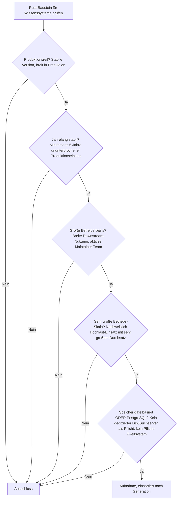
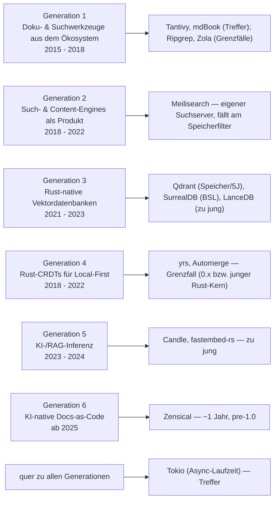
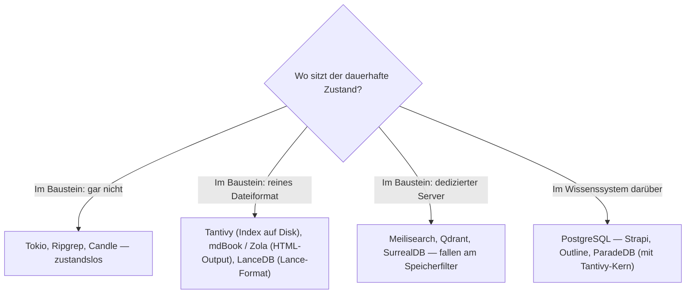

# Produktionsreife Rust-Bausteine für Wissenssysteme nach Generation — Reifegrad, Evaluation & Betriebs-Skala (Top 3, alle geteilte Infrastruktur)

Die [Evolution und Architekturen digitaler Rust-Wissenssysteme](evolution-digitaler-rust-wissenssysteme.md) verfolgt Rust nicht als eigene Systemklasse neben Wikis, PKM-Tools oder RAG-Plattformen, sondern als **quer zu allen sechs Wissenssystem-Generationen liegende Implementierungsachse** — Doku- & Suchwerkzeuge aus dem Rust-Ökosystem (1), Such- & Content-Engines als Produkt (2), Rust-native Vektordatenbanken (3), Rust-CRDTs für Local-First (4), KI-/RAG-Inferenz (5), KI-native Docs-as-Code-Plattformen (6). Die [Topliste bester Rust-Bausteine für Wissenssysteme 2026](rust-wissenssysteme-2026-topliste.md) rankt diese Achse, die [Speicherbackend-Variante](rust-wissenssysteme-postgresql-dateiformat-2026-topliste.md) filtert nach Lizenz und Persistenz. Diese Seite legt das **konservative** Fünf-Filter-Sieb an — produktionsreif · jahrelang stabil · große Betreiberbasis · sehr große Betriebs-Skala · Speicher dateibasiert oder PostgreSQL — und ist die Wissenssystem-Parallele zur [Rust-CMS-](produktionsreife-rust-cms-generationen-2026-topliste.md) und der [Rust-LMS-Seite](../e-learning/produktionsreife-rust-lms-generationen-2026-topliste.md). Sortiert nach Generation.

!!! warning "Achtung: Drei Treffer — alle geteilte Infrastruktur, kein domänenspezifischer Rust-Baustein"
    Dasselbe Muster wie bei [Rust-LMS](../e-learning/produktionsreife-rust-lms-generationen-2026-topliste.md) und [Rust-CMS](produktionsreife-rust-cms-generationen-2026-topliste.md): Was das Sieb besteht, ist **quer genutzte Basis-Infrastruktur** — **Tantivy** (eingebettete Volltextsuche, Generation 1), **Tokio** (Async-Laufzeit, quer) und **mdBook** (Doku-Build-Engine, Generation 1). Alle drei seit rund einem Jahrzehnt in Produktion, mit riesiger Downstream-Nutzung. Die **domänenspezifischen Rust-Systeme scheitern je an einem Filter**: **Qdrant** an Speicher (dedizierter Server) und der knappen Fünf-Jahres-Marke, **SurrealDB** an der BSL-Lizenz, **LanceDB**, **Candle** und **fastembed-rs** an der Reifezeit, **Meilisearch** am Speicherfilter (eigener Suchserver). **Ripgrep** ist reif und allgegenwärtig, aber „kein Wissenssystem im engeren Sinn" (so die Evolution-Seite selbst) — Grenzfall an der Kategorie. Der Speicherfilter ist bei den Werkzeug-Bausteinen strukturell bedeutungslos; die siebende Achse ist **stabile Version plus fünf Jahre plus große Betreiberbasis** ([Speicher-Fazit](#dateibasiert-oder-postgresql)).

---

## Die fünf harten Filter

!!! note "Hinweis: nur OSI-Lizenzen — und die BSL zählt nicht dazu"
    Aufgenommen wird nur, was unter einer OSI-anerkannten Lizenz steht (MIT, Apache-2.0, MPL-2.0). Die **Business Source License** von SurrealDB ist keine Open-Source-Lizenz im OSI-Sinn — dieselbe Begründung wie beim Ausschluss von Sentry auf der [Debugger-Schwesterseite](../../entwicklung/system/produktionsreife-debugger-werkzeuge-generationen-2026-topliste.md). Fertige Wissenssystem-Produkte ranken die [Wissenssysteme-Toplisten](produktionsreife-wissenssysteme-generationen-2026-topliste.md); diese Seite bleibt auf der Bauteil-Ebene.

---

## Ergebnis: drei Infrastruktur-Treffer über sechs Generationsstufen

---

## Systeme nach Generation

### Generation 1 — Doku- & Suchwerkzeuge aus dem eigenen Rust-Ökosystem (2015 – 2018)

| # | System | Speicher | Lizenz | Seit | Skala-Nachweis |
|---|---|---|---|---|---|
| 1 | **Tantivy** | eigener invertierter Index auf Disk — dateibasiert | MIT | 2016 | Meistgenutzte eingebettete Volltextsuche in Rust; Kern von Quickwit und ParadeDB (`pg_search`), damit auch in PostgreSQL-Deployments in großer Skala |
| 2 | **mdBook** | Markdown-Quellen + statischer HTML-Output — dateibasiert | MPL-2.0 | 2015 | Offizielles Rust-Team-Werkzeug; baut „The Rust Programming Language" und die Doku tausender Crates |

**Tantivy** und **mdBook** sind die klaren Treffer der Gründergeneration: rund ein Jahrzehnt Produktion, dateibasiert, breite Downstream-Nutzung. Beide sind konservativ bei `0.x` versioniert — anders als bei jungen, in Bewegung befindlichen Bausteinen ist das hier nur zurückhaltende Semver-Politik bei einem stabilen Kern (dieselbe Einordnung wie [pulldown-cmark/Comrak auf der Rust-CMS-Seite](produktionsreife-rust-cms-generationen-2026-topliste.md#infrastruktur-quer-zu-allen-generationen-markdown-parser-als-grenzfall)). Bei Tantivy überwiegt die produktive Verbreitung über Quickwit/ParadeDB.

### Quer zu allen Generationen — die Async-Laufzeit

| # | System | Speicher | Lizenz | Major seit | Skala-Nachweis |
|---|---|---|---|---|---|
| 3 | **Tokio** | keine eigene Datenpersistenz | MIT | 1.0 im Dezember 2020, seither strikte Stabilitätsgarantie | Fundament praktisch jedes asynchronen Rust-Dienstes — von Meilisearch und Qdrant über Rust-Webframeworks bis zu großen Teilen der Cloud-Infrastruktur |

**Tokio** trägt fast alles, was in dieser Kategorie einen Server hat. 1.0 seit Ende 2020, seither ununterbrochene Rückwärtskompatibilität, größte denkbare Betreiberbasis im Rust-Ökosystem. Kein Wissenssystem-Baustein im engeren Sinn, aber die Schicht, ohne die keiner der anderen läuft.

### Generation 2 – 6 — warum hier nichts steht

- **Generation 2 (Meilisearch, Wikijump/ftml)**: **Meilisearch** ist reif (seit 2018), MIT-lizenziert und breit betrieben — läuft aber als **eigenständiger Suchserver mit eigenem Speicherformat**, nicht auf PostgreSQL oder in reinem Dateiformat. Damit fällt es am Speicherfilter, dieselbe Begründung wie in der [Speicherbackend-Topliste](rust-wissenssysteme-postgresql-dateiformat-2026-topliste.md#was-bewusst-nicht-in-dieser-liste-steht). **Wikijump/ftml** ist an das Wikijump-Gesamtsystem (AGPL, PostgreSQL) gebunden und außerhalb der SCP-Foundation kaum verbreitet.
- **Generation 3 (Qdrant, SurrealDB, LanceDB)**: **Qdrant** (seit 2021) ist an der Fünf-Jahres-Marke gerade eben, läuft aber als dedizierter Vektordatenbank-Server mit eigenem Speicher — Grenzfall an Reifezeit *und* Speicherfilter, konsistent mit der [Vektordatenbanken-Schwesterseite](../daten/datenbanken/produktionsreife-vektordatenbanken-generationen-2026-topliste.md). **SurrealDB** steht unter der **Business Source License** — keine OSI-Lizenz. **LanceDB** ist erst seit 2023 (~3 Jahre).
- **Generation 4 (yrs, Automerge, diamond-types)**: **yrs** (Y-CRDT) ist die reifste Rust-CRDT-Bibliothek, seit ~2020 in Produktion hinter vielen kollaborativen Editoren — aber `0.x` und an der Fünf-Jahres-Marke. **Automerges** Rust-Kern kam erst mit v2 (~2022). **diamond-types** ist im Wesentlichen Ein-Personen-Forschungsarbeit. Alle drei Grenzfälle, keiner ein voller Treffer.
- **Generation 5 (Candle, fastembed-rs)**: **Candle** steht bei `0.x` und ist erst seit 2023 relevant — reißt die Fünf-Jahres- und 1.0-Marke klar, wie schon auf der [Rust-LMS-Seite](../e-learning/produktionsreife-rust-lms-generationen-2026-topliste.md). **fastembed-rs** ist noch jünger.
- **Generation 6 (Zensical)**: Nachfolger von MkDocs + Material, erst seit 2025, vor 1.0. Dieses Repository baut selbst damit — aber produktionsreif im Filtersinn ist es 2026 noch nicht.
- **Ripgrep (Generation 1b)**: seit 2016, MIT/Unlicense, mit echten Major-Versionen, in VS Code und zahllosen Toolchains — bei Reife und Skala unstrittig. Aber die Evolution-Seite ordnet es selbst als „kein Wissenssystem im engeren Sinn" ein: ein CLI-Suchwerkzeug ohne Index-Persistenz, kein Baustein, den man in ein Wissenssystem *einbettet*. Grenzfall an der Kategorie.
- **Zola (Generation 1c)**: voller Treffer auf der [Static-Site-Generatoren-Schwesterseite](produktionsreife-static-site-generatoren-generationen-2026-topliste.md), hier Grenzfall an `0.x` und Betriebs-Skala — dieselbe Einordnung wie auf der [Rust-CMS-Seite](produktionsreife-rust-cms-generationen-2026-topliste.md).

---

## Dateibasiert oder PostgreSQL?

Zweigeteilt: Die reinen Werkzeug-Bausteine haben **keine Persistenzschicht**, die Datenbank-Bausteine sind genau der Grund, warum die Generation-3-Systeme am Speicherfilter fallen.

- Die **Treffer** sind entweder zustandslos (**Tokio**) oder dateibasiert (**Tantivy**, **mdBook**) — sie bestehen den Speicherfilter im günstigsten Fall.
- Die **Generation-3-Vektordatenbanken** sind das Gegenbeispiel: eigener Serverprozess mit eigenem Speicherformat. Wer PostgreSQL-nah bleiben will, nimmt **pgvector** oder **ParadeDB** (Letzteres mit Tantivy-Kern), siehe [Vektordatenbanken-Schwesterseite](../daten/datenbanken/produktionsreife-vektordatenbanken-generationen-2026-topliste.md).
- Das **Wissenssystem über** diesen Bausteinen hält seinen Zustand relational — konkret PostgreSQL, siehe [Wissenssysteme nach Generation](produktionsreife-wissenssysteme-generationen-2026-topliste.md).

Vertiefung zur Datenbankschicht: [PostgreSQL DBA Praxis-Handbuch](../../entwicklung/infrastruktur/postgresql-dba-praxis.md).

!!! warning "Achtung: Momentaufnahme, Stand August 2026"
    Erreicht **yrs** oder **Qdrant** die Fünf-Jahres-Marke mit dann breiter Betreiberbasis, oder wechselt SurrealDB zurück zu einer OSI-Lizenz, wächst diese Liste. **Tantivy**, **Tokio** und **mdBook** sind die stabilen Konstanten.

---

## Was bewusst nicht auf dieser Liste steht

| Baustein | Erfüllt nicht | Anmerkung |
|---|---|---|
| **Meilisearch** | Speicherfilter | Eigenständiger Suchserver mit eigenem Format; ansonsten voll qualifiziert |
| **Qdrant** | Speicherfilter + Reifezeit | Dedizierter Vektordatenbank-Server, seit 2021 — Grenzfall an der Fünf-Jahres-Marke |
| **SurrealDB** | Lizenzfilter | Business Source License, keine OSI-Lizenz |
| **LanceDB, Candle, fastembed-rs** | Reifezeit | Alle seit 2023 (~3 Jahre) |
| **yrs, Automerge, diamond-types** | 1.0 / Reifezeit / Betreiberbasis | Reifste Rust-CRDTs, aber `0.x`, junger Rust-Kern bzw. Ein-Personen-Projekt |
| **Zensical** | Reifezeit + 1.0 | Seit 2025, pre-1.0 — trotz Eigennutzung in diesem Repository |
| **Ripgrep** | Kategorie | Reif und allgegenwärtig, aber „kein Wissenssystem im engeren Sinn" (Evolution-Seite) |
| **Zola** | 1.0 + Betriebs-Skala | Voller Treffer auf der Static-Site-Generatoren-Schwesterseite |
| **Wikijump / ftml** | Betreiberbasis | An das Wikijump-Gesamtsystem gebunden, außerhalb der SCP-Foundation kaum verbreitet |

---

## 🔗 Verwandte Themen

- [Evolution und Architekturen digitaler Rust-Wissenssysteme](evolution-digitaler-rust-wissenssysteme.md) — das Generationenmodell der Rust-Implementierungsachse, nach dem diese Liste sortiert ist
- [Beste Rust-Bausteine für Wissenssysteme 2026 (Top 20)](rust-wissenssysteme-2026-topliste.md) — breitere Basis-Topliste inklusive junger und punktueller Bausteine
- [Rust-Bausteine für Wissenssysteme mit PostgreSQL-/Dateiformat-Speicherung (Top 15)](rust-wissenssysteme-postgresql-dateiformat-2026-topliste.md) — mittlere Filterstufe: Lizenz, Speicher, Aktivität, aber ohne die Fünf-Jahres-/Skala-Härte dieser Seite
- [Produktionsreife Rust-Bausteine für CMS nach Generation (Top 2)](produktionsreife-rust-cms-generationen-2026-topliste.md) — dieselbe Beobachtung für CMS: die reife Rust-Schicht ist geteilte Infrastruktur (SWC, Wasmtime)
- [Produktionsreife Rust-Bausteine für LMS nach Generation (Top 2)](../e-learning/produktionsreife-rust-lms-generationen-2026-topliste.md) — dieselbe Beobachtung für LMS (Firecracker, Wasmtime)
- [Produktionsreife Vektordatenbanken nach Generation (Top 5)](../daten/datenbanken/produktionsreife-vektordatenbanken-generationen-2026-topliste.md) — dort werden Qdrant/LanceDB im Datastore-Kontext bewertet
- [Produktionsreife Open-Source-Wissenssysteme nach Generation (Top 12)](produktionsreife-wissenssysteme-generationen-2026-topliste.md) — die Produktebene über diesen Bausteinen
- [Produktionsreife Debugger-Werkzeuge nach Generation](../../entwicklung/system/produktionsreife-debugger-werkzeuge-generationen-2026-topliste.md) — dieselbe Lizenz-Beobachtung (BSL ist keine OSI-Lizenz)
- [PostgreSQL DBA Praxis-Handbuch](../../entwicklung/infrastruktur/postgresql-dba-praxis.md) — Datenbankschicht des Wissenssystems über den Bausteinen
