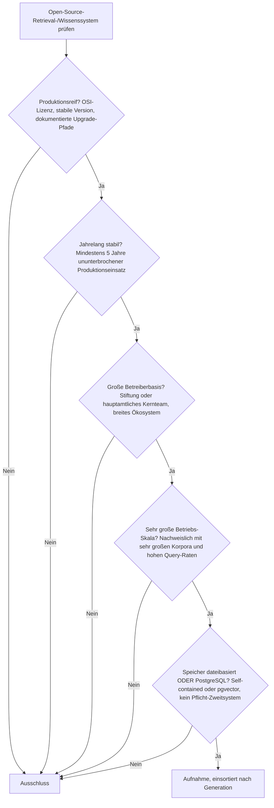
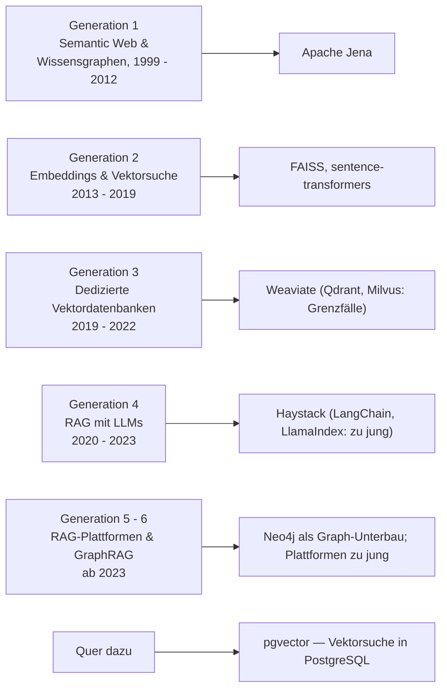

# Produktionsreife Open-Source-semantische & RAG-Wissenssysteme nach Generation — Reifegrad, Evaluation & Betriebs-Skala (Top 7)

Die [Evolution und Architekturen digitaler Semantischer & RAG-Wissenssysteme](evolution-digitaler-semantische-rag-wissenssysteme.md) ordnet die Retrieval- und Wissensrepräsentations-Infrastruktur chronologisch in sechs Generationen — von symbolischen Wissensgraphen über Embeddings und Vektordatenbanken bis GraphRAG. Die [Basis-Topliste](semantische-rag-wissenssysteme-2026-topliste.md) rankt die Kategorie, die [PostgreSQL-/Dateiformat-Variante](semantische-rag-wissenssysteme-postgresql-dateiformat-2026-topliste.md) siebt nach Speicherbackend. Diese Seite kombiniert alle Achsen — parallel zur [Wissenssysteme-](produktionsreife-wissenssysteme-generationen-2026-topliste.md), [CMS-](produktionsreife-cms-generationen-2026-topliste.md) und [LMS-Schwesterseite](../e-learning/produktionsreife-lms-generationen-2026-topliste.md) sowie den KI-Varianten für [RAG- & Werkzeug-Anwendungen](../../künstliche-intelligenz/produktionsreife-rag-werkzeug-anwendungen-generationen-2026-topliste.md) und [autonome KI-Agenten](../../künstliche-intelligenz/produktionsreife-autonome-ki-agenten-generationen-2026-topliste.md) — zu einem bewusst **konservativen** Fünf-Filter-Sieb: produktionsreif · jahrelang stabil · große Betreiberbasis · sehr große Betriebs-Skala · Speicher dateibasiert oder PostgreSQL. Sortiert nach Generation.

!!! warning "Achtung: Die Infrastruktur ist reif — anders als die Anwendungen darauf"
    Die [RAG-*Anwendungen*](../../künstliche-intelligenz/produktionsreife-rag-werkzeug-anwendungen-generationen-2026-topliste.md) (AnythingLLM, Onyx, Open WebUI) sind alle 2023 entstanden und bestehen das Sieb nicht. Die *Infrastruktur* darunter dagegen hat echte Reife: Die Semantic-Web-Schicht (**Apache Jena**, **Neo4j**) ist zwei Jahrzehnte alt, die Vektor-Such-Bibliothek **FAISS** ein Jahrzehnt, und mit **Weaviate**, **Haystack**, **sentence-transformers** und **pgvector** haben je ein Vektorspeicher, ein RAG-Framework, die Embedding-Bibliothek und die PostgreSQL-Erweiterung die Fünf-Jahres-Marke überschritten. Die LLM-RAG-Ära selbst — LangChain, LlamaIndex, GraphRAG — ist noch nicht so weit. Speicher-Einordnung: [pgvector, dateibasiert oder dedizierter Vektorserver](#dateibasiert-oder-postgresql-drei-legitime-wege).

---

## Die fünf harten Filter

!!! note "Hinweis: Nur OSI-anerkannte Lizenzen"
    Das kostet die Liste **Pinecone** und **Amazon Neptune** (proprietäre Managed-Dienste). **Neo4j** zählt über seine GPL-3.0-lizenzierte Community Edition; der Enterprise-Tier ist kommerziell.

---

## Ergebnis: sieben Systeme über vier Generationen plus die PostgreSQL-Erweiterung

---

## Systeme nach Generation

### Generation 1 — Semantic Web & symbolische Wissensgraphen (1999 – 2012)

| # | System | Rolle | Speicher | Lizenz | Seit | Skala-Nachweis |
|---|---|---|---|---|---|---|
| 1 | **Apache Jena** | RDF-/SPARQL-Framework, Triplestore | **Jena TDB dateibasiert** (nativer Tripel-Store auf Platte) | Apache-2.0 | ~2000 | Etablierteste Open-Source-Basis für SPARQL-Wissensgraphen; bis heute in Enterprise-Einsätzen |

**Apache Jena** unter dem Dach der Apache Software Foundation ist die durchgehend gepflegte Referenz für klassische, tripelbasierte Wissensgraphen. TDB legt den Store dateibasiert ab — kein separater Datenbankdienst. **Blazegraph** ging in Amazon Neptune auf; **Virtuoso** hat eine Open-Source-Edition, ist aber Einzelanbieter-getrieben.

### Generation 2 — Neuronale Embeddings & Vektorsuche (2013 – 2019)

| # | System | Rolle | Speicher | Lizenz | Seit | Skala-Nachweis |
|---|---|---|---|---|---|---|
| 2 | **FAISS** (Meta) | Bibliothek für approximative Nächste-Nachbarn-Suche | dateibasiert (serialisierter Index) | MIT | 2015 | Der De-facto-Standard für Vektor-Ähnlichkeitssuche; steckt unter vielen Vektordatenbanken |
| 3 | **sentence-transformers** | Embedding-Modell-Bibliothek (Chunk-Embeddings) | keine — Modelle über Hugging Face | Apache-2.0 | 2019 | Die Standard-Bibliothek für Satz-/Absatz-Embeddings; heute bei Hugging Face gepflegt |

**FAISS** ist mit über einem Jahrzehnt die reifste Komponente der gesamten RAG-Landschaft — eine reine Bibliothek, im eigenen Prozess, Index-Persistenz als Datei. **sentence-transformers** liefert die Embedding-Modelle; word2vec und GloVe sind historische Vorläufer.

### Generation 3 — Dedizierte Vektordatenbanken (2019 – 2022)

| # | System | Speicher | Lizenz | Seit | Status im Sieb |
|---|---|---|---|---|---|
| 4 | **Weaviate** | eigener, self-contained LSM-Store (dateibasiert) | BSD-3-Clause | 2019 | **besteht** — sieben Jahre, eingebaute Hybrid-Suche, kein Pflicht-Zweitsystem |
| — | **Qdrant** | eigener, self-contained Store | Apache-2.0 | 2021 | **Grenzfall** — erreicht 2026 gerade die Fünf-Jahres-Marke; Rust, häufigste Wahl für performancekritische Setups |
| — | **Milvus** | Segmente + `etcd` + Objektspeicher im Cluster-Modus | Apache-2.0 | 2019 | **Grenzfall** — reif und für sehr große Mengen ausgelegt, aber der verteilte Betrieb bringt `etcd` als Zweitsystem mit |
| — | **Pinecone** | — | proprietär | 2019 | Lizenzfilter |
| — | **Chroma** | SQLite-gestützt, eingebettet | Apache-2.0 | 2022 | **Grenzfall** — vier Jahre; die schlanke dateibasierte Option für Prototypen |

### Generation 4 — Retrieval-Augmented Generation mit LLMs (2020 – 2023)

| # | System | Rolle | Speicher | Lizenz | Seit | Skala-Nachweis |
|---|---|---|---|---|---|---|
| 5 | **Haystack** (deepset) | RAG-Orchestrierungs-Framework | speicher-agnostisch (Document Stores für pgvector, Weaviate, FAISS …) | MIT | November 2019 | Stärkster Enterprise-/Produktions-Fokus der RAG-Frameworks; Haystack 2.x seit 2024 |

**Haystack** ist mit gut sechs Jahren das einzige RAG-Framework über der Reifezeit-Marke — von deepset getragen, auf Produktionseinsätze ausgelegt, mit über 130 Integrationen. **LangChain** und **LlamaIndex** (beide 2022) haben die größte Verbreitung, aber erst vier Jahre und mehrere Breaking-Change-Zyklen hinter sich. Das RAG-Papier selbst (Lewis et al., 2020) ist Forschung, kein System.

### Generation 5 — Selbst gehostete RAG-Plattformen (ab 2023) — warum hier nichts steht

**AnythingLLM**, **Onyx**, **Open WebUI**, **Dify**, **Flowise** — allesamt 2023 entstanden, also unter der Fünf-Jahres-Marke. Ausführlich auf der [RAG- & Werkzeug-Anwendungen-Seite](../../künstliche-intelligenz/produktionsreife-rag-werkzeug-anwendungen-generationen-2026-topliste.md).

### Generation 6 — GraphRAG & agentische Wissenssysteme (ab 2024)

| # | System | Rolle | Speicher | Lizenz | Seit | Skala-Nachweis |
|---|---|---|---|---|---|---|
| 6 | **Neo4j Community Edition** | Property-Graph-Datenbank, Unterbau vieler GraphRAG-Stacks | eigener nativer Graph-Store (dateibasiert), self-contained | GPL-3.0 | 2007 | Meistgenutzte Graph-Datenbank; ~19 Jahre Produktionshistorie |

**Neo4j** ist der reife Baustein dieser jungen Generation — die Graph-Schicht, über die GraphRAG-Retrieval läuft. **Microsoft GraphRAG** (2024) selbst ist die meistzitierte Referenzimplementierung, aber erst zwei Jahre alt; **Graphiti** (temporaler Wissensgraph für Agenten-Gedächtnis) ebenfalls. **Amazon Neptune** ist proprietär.

### Quer zu den Generationen — die PostgreSQL-Erweiterung

| # | System | Speicher | Lizenz | Seit | Einordnung |
|---|---|---|---|---|---|
| 7 | **pgvector** | PostgreSQL-Erweiterung — Vektoren neben den relationalen Daten | PostgreSQL-Lizenz | April 2021 | Fünf Jahre; Releases von der PostgreSQL Global Development Group angekündigt |

---

## Dateibasiert oder PostgreSQL? — Drei legitime Wege

Diese Kategorie ist die einzige der Familie, in der **mehrere** Vertreter den Speicherfilter sauber bestehen — weil Retrieval-Systeme von Natur aus um Speicher herum gebaut sind:

| Weg | Vertreter | Wann |
|---|---|---|
| **PostgreSQL** | **pgvector** | Wenn ohnehin eine relationale Datenbank läuft — Embeddings und Metadaten in einem System, ein Backup, ein Migrationspfad |
| **Dateibasiert / eingebettet** | **FAISS**, **Chroma**, **Jena TDB**, **txtai** | Kleine bis mittlere Korpora, lokale Setups, Edge — kein Datenbankdienst nötig |
| **Self-contained Vektorserver** | **Weaviate**, **Qdrant** | Wenn dedizierte Vektor-Features (Hybrid-Suche, Filter-Performance, Sharding) gebraucht werden — eigener Dienst, aber ohne Pflicht-Zweitsystem |

Nicht auf dieser Achse: **Milvus** im Cluster-Modus (`etcd`-Abhängigkeit), **Pinecone** (proprietär). Vertiefung: [PostgreSQL + pgvector](../daten/datenbanken/pgvector-anleitung.md), [Semantische & RAG-Wissenssysteme mit PostgreSQL-/Dateiformat-Speicherung](semantische-rag-wissenssysteme-postgresql-dateiformat-2026-topliste.md).

!!! warning "Achtung: Momentaufnahme, Stand August 2026"
    Qdrant überschreitet 2026 die Fünf-Jahres-Marke; LangChain und LlamaIndex folgen 2027. Die GraphRAG-Generation (Generation 6) wird frühestens 2029 einen eigenständigen Treffer über Neo4j hinaus liefern.

---

## Was bewusst nicht auf dieser Liste steht

| System | Erfüllt nicht | Anmerkung |
|---|---|---|
| **Pinecone, Amazon Neptune** | Lizenzfilter | Proprietäre Managed-Dienste |
| **LangChain, LlamaIndex** | Reifezeit | Größte Verbreitung, aber erst 2022 und mehrere Breaking-Change-Zyklen |
| **Qdrant** | Reifezeit | Erreicht 2026 gerade fünf Jahre — Grenzfall |
| **Milvus** | Speicherfilter (Cluster) | Reif und skalierbar, aber `etcd` als Zweitsystem im verteilten Betrieb |
| **Chroma** | Reifezeit | Vier Jahre; die dateibasierte Prototyp-Option |
| **Microsoft GraphRAG, Graphiti** | Reifezeit | Referenzarchitekturen der GraphRAG-Generation, aber erst 2024 |
| **AnythingLLM, Onyx, Open WebUI, Dify, Flowise** | Reifezeit | RAG-Plattformen, alle 2023 — siehe [RAG-Anwendungen-Seite](../../künstliche-intelligenz/produktionsreife-rag-werkzeug-anwendungen-generationen-2026-topliste.md) |
| **txtai** | Betreiberbasis | Sechs Jahre und sehr schlank, aber sehr kleines Kernteam |
| **Blazegraph, Virtuoso** | Aktivität / Betreiberbasis | Blazegraph in Neptune aufgegangen; Virtuoso Einzelanbieter-getrieben |

---

## 🔗 Verwandte Themen

- [Evolution und Architekturen digitaler Semantischer & RAG-Wissenssysteme](evolution-digitaler-semantische-rag-wissenssysteme.md) — das sechsstufige Generationenmodell, nach dem diese Liste sortiert ist
- [Beste semantische & RAG-Wissenssysteme 2026 (Top 20)](semantische-rag-wissenssysteme-2026-topliste.md) — breiteste Basis-Topliste
- [Produktionsreife Open-Source-Frameworks & -Bibliotheken für Wissenssysteme nach Generation (Top 8)](produktionsreife-wissenssystem-frameworks-generationen-2026-topliste.md) — Bauteil-Ebene statt Endprodukt; Haystack und Sentence-Transformers erscheinen bewusst auf beiden Seiten
- [Semantische & RAG-Wissenssysteme mit PostgreSQL-/Dateiformat-Speicherung (Top 15)](semantische-rag-wissenssysteme-postgresql-dateiformat-2026-topliste.md) — derselbe Speicherfilter, nach Rang statt nach Generation
- [Wissensdatenbanken mit KI & semantischer Suche](wissensdatenbanken-ki-semantische-suche.md) — die technischen Mechanismen (Chunking, Embeddings, Pipeline) hinter diesem Modell
- [Produktionsreife Open-Source-RAG- & Werkzeug-Anwendungen nach Generation](../../künstliche-intelligenz/produktionsreife-rag-werkzeug-anwendungen-generationen-2026-topliste.md) — die Anwendungsschicht auf dieser Infrastruktur; dort kein Treffer
- [Produktionsreife Open-Source-Wissenssysteme nach Generation (Top 12)](produktionsreife-wissenssysteme-generationen-2026-topliste.md) — die übergeordnete Wissenssysteme-Variante
- [Produktionsreife Open-Source-Notebook-Systeme nach Generation (Top 4)](produktionsreife-notebook-systeme-generationen-2026-topliste.md) — Schwesterseite mit demselben Sieb für interaktive Notebooks
- [PostgreSQL + pgvector](../daten/datenbanken/pgvector-anleitung.md) — Vektorsuche in der bestehenden relationalen Datenbank
