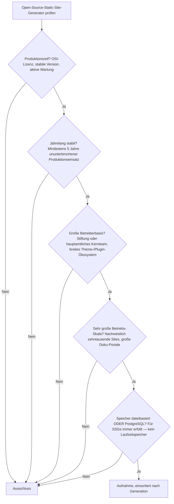
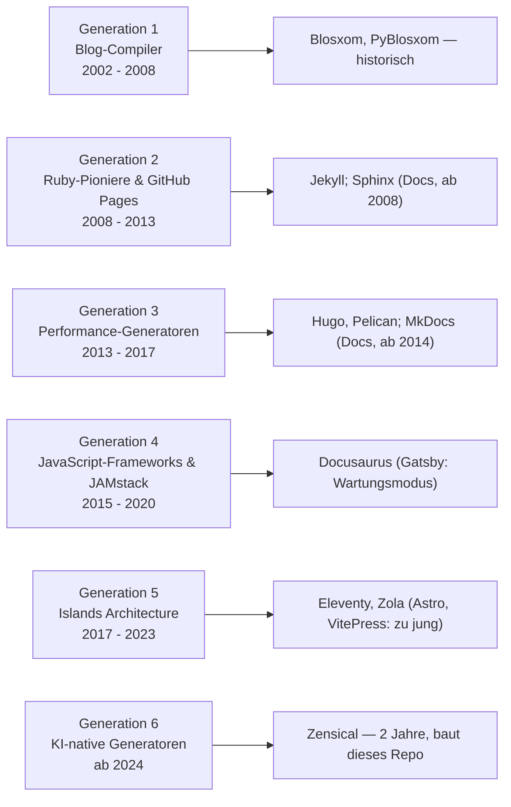

# Produktionsreife Open-Source-Static-Site-Generatoren nach Generation — Reifegrad, Evaluation & Betriebs-Skala (Top 8)

Die [Evolution und Architekturen digitaler Static-Site-Generatoren](evolution-digitaler-static-site-generatoren.md) ordnet die Kategorie chronologisch in sechs Generationen — von Perl-Blog-Compilern über Jekyll, Hugo und die JAMstack-Bewegung bis zu Islands-Architektur und KI-nativen Generatoren. Die [Topliste bester Static-Site- & Docs-Generatoren 2026](static-site-generatoren-2026-topliste.md) rankt die gesamte Kategorie, die [PostgreSQL-/Dateiformat-Variante](static-site-generatoren-postgresql-dateiformat-2026-topliste.md) nach Speicherbackend. Diese Seite kombiniert alle Achsen — parallel zur [Wissenssysteme-](produktionsreife-wissenssysteme-generationen-2026-topliste.md), [CMS-](produktionsreife-cms-generationen-2026-topliste.md), [Notebook-](produktionsreife-notebook-systeme-generationen-2026-topliste.md), [Semantische-&-RAG-](produktionsreife-semantische-rag-wissenssysteme-generationen-2026-topliste.md) und [LMS-Schwesterseite](../e-learning/produktionsreife-lms-generationen-2026-topliste.md) — zu einem bewusst **konservativen** Fünf-Filter-Sieb: produktionsreif · jahrelang stabil · große Betreiberbasis · sehr große Betriebs-Skala · Speicher dateibasiert oder PostgreSQL. Sortiert nach Generation.

!!! warning "Achtung: Eine überreif besetzte Liste — und der Speicherfilter ist bedeutungslos"
    Acht Generatoren über vier Generationen bestehen alle fünf Filter; die ältesten (**Jekyll**, **Sphinx**) sind 18 Jahre alt. Der Speicherfilter greift hier gar nicht: Ein Static-Site-Generator *hat* keine Laufzeit-Datenbank — er verwandelt Dateien in Dateien ([Speicher-Fazit](#dateibasiert-oder-postgresql-es-gibt-keine-laufzeit-datenbank)). Die einzigen echten Ausfälle sind **Gatsby** (nach der Netlify-Übernahme im Wartungsmodus) und die junge Riege (**Astro**, **VitePress**, **Zensical**). Bemerkenswert: Dieses Repository selbst wird mit **Zensical** gebaut — Generation 6 —, dem Rust-Kern-Nachfolger von MkDocs.

---

## Die fünf harten Filter

!!! note "Hinweis: Meta-Frameworks werden getrennt geführt"
    **Next.js** (Static Export), **Nuxt** und **SvelteKit** (Static Adapter) sind Hybrid-Meta-Frameworks — sie erscheinen auf der [Meta-Framework-Seite](../../entwicklung/webentwicklung/produktionsreife-meta-frameworks-generationen-2026-topliste.md), nicht hier. **Docsify** rendert Markdown zur Laufzeit im Browser und hat gar keinen Build-Schritt — kein Generator im Sinne dieser Liste.

---

## Ergebnis: acht Generatoren über vier Generationen

---

## Systeme nach Generation

### Generation 2 — Ruby-Pioniere & GitHub-Pages-Integration (2008 – 2013)

| # | System | Sprache | Speicher | Lizenz | Seit | Skala-Nachweis |
|---|---|---|---|---|---|---|
| 1 | **Jekyll** | Ruby | dateibasiert (Markdown + Front-Matter → HTML) | MIT | 2008 | Größte installierte Basis der Kategorie durch native GitHub-Pages-Integration; von GitHub gepflegt |
| 2 | **Sphinx** | Python | dateibasiert (reStructuredText/Markdown → HTML) | BSD-2-Clause | 2008 | Standard für Python-API-Dokumentation aus Docstrings; die Python-Doku selbst, Read the Docs |

**Jekyll** definierte den Begriff „Static Site Generator" neu und wurde durch kostenloses GitHub-Pages-Hosting zum Einstiegspunkt einer Entwicklergeneration. **Sphinx** aus demselben Jahr ist die Referenz für strukturierte technische Dokumentation mit Querverweisen und API-Autodoc.

### Generation 3 — Performance-Generatoren jenseits von Ruby (2013 – 2017)

| # | System | Sprache | Speicher | Lizenz | Seit | Skala-Nachweis |
|---|---|---|---|---|---|---|
| 3 | **Hugo** | Go | dateibasiert | Apache-2.0 | 2013 | Bis heute eine der schnellsten Build-Zeiten überhaupt; Millionen Sites, sehr aktive Entwicklung |
| 4 | **Pelican** | Python | dateibasiert | AGPL-3.0 | 2010 | Etablierte Python-Alternative zu Jekyll, stark im wissenschaftlich-technischen Umfeld |
| 5 | **MkDocs** (+ Material) | Python | dateibasiert (Markdown → HTML) | BSD-2-Clause | 2014 | De-facto-Standard für Projekt-Dokumentation im Python-Lager; Material for MkDocs als Ökosystem-Treiber |

**Hugo** löste Rubys Interpreter-Flaschenhals mit kompiliertem Go und nativer Nebenläufigkeit — Sekunden statt Minuten bei tausenden Seiten. **MkDocs** mit **Material** ist der Weg, auf dem die meisten Teams Dokumentation ausliefern; sein Rust-Kern-Nachfolger **Zensical** steht in Generation 6.

### Generation 4 — JavaScript-Frameworks & die JAMstack-Bewegung (2015 – 2020)

| # | System | Sprache | Speicher | Lizenz | Seit | Skala-Nachweis |
|---|---|---|---|---|---|---|
| 6 | **Docusaurus** | React/Node.js | dateibasiert (MDX → HTML) | MIT | 2017 | Dominant für versionierte Open-Source-Projekt-Dokumentation; von Meta initiiert, sehr breite Nutzung |

**Docusaurus** brachte komponentenbasierte, versionierte Doku mit MDX in die React-Welt. **Gatsby** (2015) erfüllte lange alle Filter, ist aber nach der Netlify-Übernahme 2023 in den Wartungsmodus gefallen — der Filter „aktive Weiterentwicklung" ist nicht mehr erfüllt. **VuePress** wurde von VitePress abgelöst.

### Generation 5 — Islands Architecture & Partial Hydration (2017 – 2023)

| # | System | Sprache | Speicher | Lizenz | Seit | Skala-Nachweis |
|---|---|---|---|---|---|---|
| 7 | **Eleventy (11ty)** | Node.js/JavaScript | dateibasiert | MIT | 2017 | Zero-Config, keine feste Templating-Sprache; solide Verbreitung, community-getragen |
| 8 | **Zola** | Rust | dateibasiert (Single-Binary, keine Abhängigkeiten) | MIT | 2018 | Rust-Pendant zu Hugos Ansatz — schnelle Builds, ein Binary; etablierte Nische |

**Eleventy** und **Zola** sind acht bzw. neun Jahre alt und decken die framework-agnostische, performante Ecke ab. **Astro** (2021) ist mit der größten Ökosystem-Dynamik der Kategorie unterwegs, aber 1.0 erschien erst August 2022 → [Grenzfall](#was-bewusst-nicht-auf-dieser-liste-steht) (Reifezeit, Nachrücker ~2027). **VitePress** (2021) erreicht 2026 gerade fünf Jahre.

### Generation 1 & 6 — warum hier nichts steht

- **Generation 1**: **Blosxom**, **PyBlosxom**, **webgen** — historische Blog-Compiler, nicht mehr im Neubau relevant.
- **Generation 6**: **[Zensical](evolution-digitaler-rust-wissenssysteme.md)** (Rust-Kern-Nachfolger von MkDocs, baut dieses Repository) ist erst zwei Jahre alt. In der Praxis erreicht man Generation 6 heute, indem man einen reifen Generator (MkDocs, Hugo) mit KI-Werkzeugen für Content-Pflege kombiniert — siehe [Agentische Docs-as-Code](evolution-digitaler-docs-as-code.md).

---

## Dateibasiert oder PostgreSQL? — Es gibt keine Laufzeit-Datenbank

Diese Kategorie ist der **Endpunkt der „dateibasiert"-Achse** der ganzen Familie:

- Ein Static-Site-Generator liest Quelltexte (Markdown, reStructuredText, YAML, TOML) und schreibt eine reine HTML-/CSS-/JS-Datei-Hierarchie. **Zur Laufzeit läuft nichts** — kein Anwendungsserver, keine Datenbank, kein Prozess.
- Der Content lebt im **Git-Repository** (der Normalfall) oder wird zur Build-Zeit aus einem **[Headless-CMS](headless-cms-2026-topliste.md)** über dessen API gezogen. In beiden Fällen ist das Auslieferungsartefakt datenbankfrei.
- Eine „PostgreSQL-Variante" gibt es nicht — der Filter ist strukturell immer auf der „dateibasiert"-Seite erfüllt.

Das ist zugleich die größte Stärke der Kategorie: maximale Betriebsdisziplin (ein CDN, ein Git-Repo), keine Angriffsfläche eines Laufzeit-Systems, triviale Skalierung. Vertiefung: [Static-Site-Generatoren mit PostgreSQL-/Dateiformat-Speicherung](static-site-generatoren-postgresql-dateiformat-2026-topliste.md).

!!! warning "Achtung: Momentaufnahme, Stand August 2026"
    Astro und VitePress überschreiten 2026/2027 die Fünf-Jahres-Marke; Zensical folgt später. Gatsbys Wartungsmodus kann sich verfestigen oder ein Fork kann übernehmen. Jekyll, Hugo, Sphinx und MkDocs sind die stabilen Konstanten.

---

## Was bewusst nicht auf dieser Liste steht

| System | Erfüllt nicht | Anmerkung |
|---|---|---|
| **Gatsby** | Aktive Weiterentwicklung | Nach der Netlify-Übernahme 2023 Kernteam abgewandert, Wartungsmodus |
| **Astro** | Reifezeit | 1.0 erst August 2022 — der aussichtsreichste Nachrücker (2027) |
| **VitePress** | Reifezeit | Erreicht 2026 gerade fünf Jahre |
| **Zensical** | Reifezeit | Rust-Kern-Nachfolger von MkDocs, erst 2024 — baut aber bereits dieses Repository |
| **Next.js / Nuxt / SvelteKit (Static)** | Kategorie | Hybrid-Meta-Frameworks — siehe [Meta-Framework-Seite](../../entwicklung/webentwicklung/produktionsreife-meta-frameworks-generationen-2026-topliste.md) |
| **VuePress** | Kontinuität | Von VitePress als offizielles Vue-Docs-Tool abgelöst |
| **Docsify** | Kategorie | Rendert zur Laufzeit im Browser, kein Build-Schritt |
| **Publii** | Betreiberbasis | Electron-Desktop-GUI, Einzelanbieter-Nische |
| **Middleman, Nanoc, Metalsmith** | Betreiberbasis | Weiter gepflegt, aber stark geschrumpfte Nutzung |
| **Blosxom, PyBlosxom, webgen** | Produktionsreife | Historische Generation-1-Blog-Compiler |

---

## 🔗 Verwandte Themen

- [Evolution und Architekturen digitaler Static-Site-Generatoren](evolution-digitaler-static-site-generatoren.md) — das sechsstufige Generationenmodell, nach dem diese Liste sortiert ist
- [Beste Static-Site- & Docs-Generatoren 2026 (Top 20)](static-site-generatoren-2026-topliste.md) — breiteste Basis-Topliste
- [Static-Site-Generatoren mit PostgreSQL-/Dateiformat-Speicherung (Top 16)](static-site-generatoren-postgresql-dateiformat-2026-topliste.md) — derselbe Speicherfilter, nach Rang statt nach Generation
- [Evolution und Architekturen digitaler Docs-as-Code](evolution-digitaler-docs-as-code.md) — die Kollaborations-/Review-Perspektive auf dieselben Werkzeuge
- [Evolution und Architekturen digitaler Rust-Wissenssysteme](evolution-digitaler-rust-wissenssysteme.md) — vertiefend zu Generation 6 (Zensical)
- [Produktionsreife Open-Source-Full-Stack-Meta-Frameworks nach Generation](../../entwicklung/webentwicklung/produktionsreife-meta-frameworks-generationen-2026-topliste.md) — Next.js/Nuxt in ihrer Hybrid-Rolle
- [Produktionsreife Open-Source-Notebook-Systeme nach Generation (Top 4)](produktionsreife-notebook-systeme-generationen-2026-topliste.md) — Schwesterseite, ebenfalls dateibasiert
