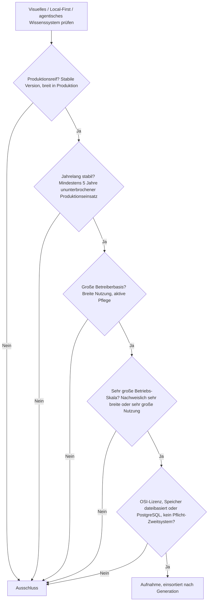
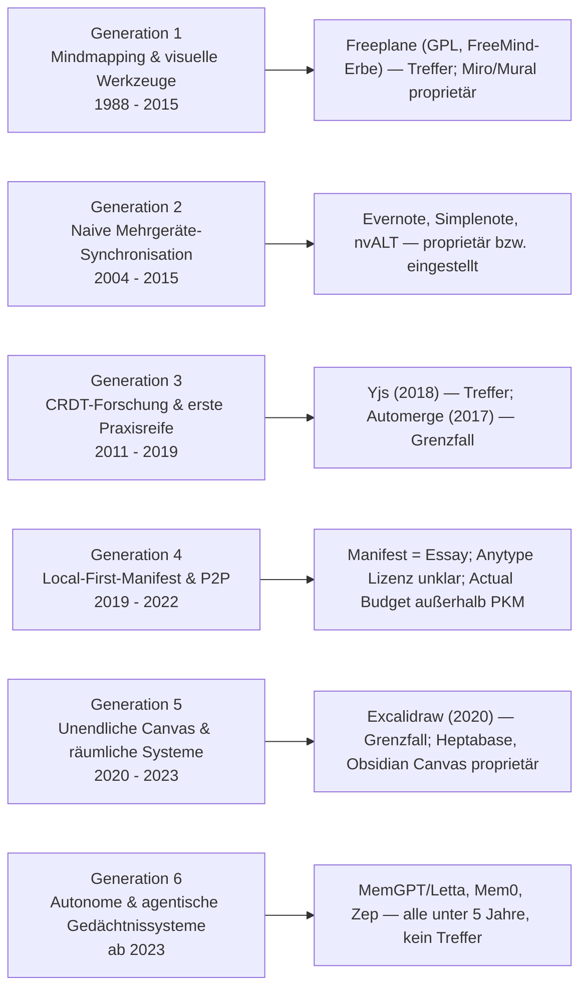
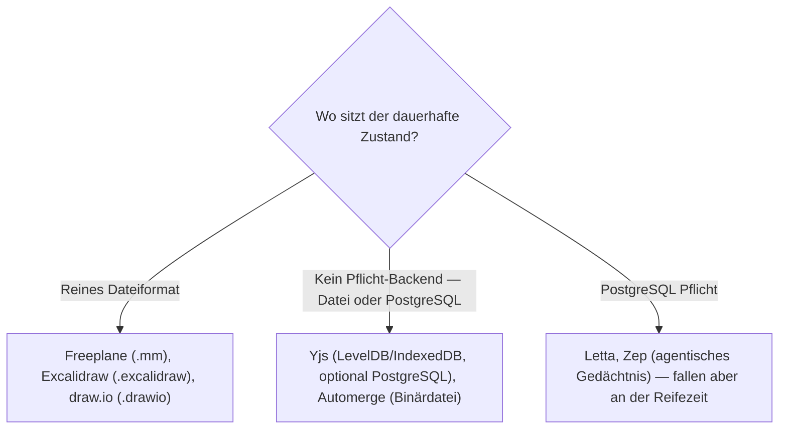

# Produktionsreife visuelle, Local-First & agentische Wissenssysteme nach Generation — Reifegrad, Lizenz & Betriebs-Skala (Top 3 — die alten zwei Drittel der Kategorie bestehen, das agentische nicht)

Die [Evolution und Architekturen digitaler Visueller, Local-First & Agentischer Wissenssysteme](evolution-digitaler-visuell-agentische-wissenssysteme.md) verfolgt drei zunächst getrennte Stränge als Generation 5 der [übergeordneten Wissenssysteme-Zeitachse](evolution-digitaler-wissenssysteme.md): frühe Mindmapping- & visuelle Werkzeuge (1), naive Mehrgeräte-Synchronisation (2), CRDT-Forschung & erste Praxisreife (3), Local-First-Manifest & P2P-Systeme (4), unendliche Canvas- & räumliche Wissenssysteme (5), autonome & agentische Gedächtnissysteme (6). Die [Basis-Topliste](visuell-agentische-wissenssysteme-2026-topliste.md) und die [Speicherbackend-Variante](visuell-agentische-wissenssysteme-postgresql-dateiformat-2026-topliste.md) ranken die drei Stränge gemeinsam. Diese Seite legt das **konservative** Fünf-Filter-Sieb der Familie an und sortiert nach Generation.

!!! warning "Achtung: Das Sieb trennt die drei Stränge nach Alter — der agentische hat keinen Treffer"
    Die Kategorie bündelt bewusst drei Linien, und das Fünf-Jahres-Kriterium schneidet sie sehr unterschiedlich: Der **visuelle Strang** (Freeplane, seit dem FreeMind-Erbe; Excalidraw; draw.io) und der **CRDT-Infrastruktur-Strang** (Yjs, Automerge — beide seit ~2017/18) haben reife quelloffene Treffer. Der **agentische Gedächtnis-Strang** — das „agentisch", das diese Kategorie zukunftsorientiert macht — hat **kein System, das älter als ~3 Jahre ist**: MemGPT/Letta (2023), Mem0 (2024), Zep (2023). Es bestehen also die **älteren zwei Drittel** der Kategorie; das jüngste Drittel hat 2026 keinen produktionsreifen Vertreter. Ergebnis: **Top 3** — **Freeplane** (Gen 1), **Yjs** (Gen 3), **Excalidraw** (Gen 5, Grenzfall) — plus **draw.io** und **Automerge** als weitere Grenzfälle.

---

## Die fünf harten Filter

!!! note "Hinweis: nur OSI-Lizenzen"
    Aufgenommen wird nur, was unter einer OSI-anerkannten Lizenz steht. Das schließt die proprietären Marktführer der Basis-Topliste aus — **Miro**, **Heptabase**, **Obsidian** (proprietäre Freeware), **Mural**, **XMind**, **MindManager**, **Evernote**, **Simplenote** — sowie **Anytype** (Lizenzstatus 2026 uneinheitlich) und **tldraw** (eigene, nicht vollständig permissive Lizenz für den Sync-Dienst).

---

## Ergebnis: drei Treffer über sechs Generationsstufen

---

## Systeme nach Generation

### Generation 1 — Mindmapping- & visuelle Organisationswerkzeuge (1988 – 2015)

| # | System | Speicher | Lizenz | Seit | Skala-Nachweis |
|---|---|---|---|---|---|
| 1 | **Freeplane** | reines Dateiformat (`.mm`-XML) | GPL-2.0 | 2008 (Fork von FreeMind, 2000) | Aktivst gepflegter FreeMind-Nachfolger, breite Basis in Bildung und persönlicher Wissensorganisation über zwei Jahrzehnte Ökosystem-Kontinuität |

**Freeplane** ist der Treffer der Mindmapping-Generation: über 25 Jahre FreeMind-/Freeplane-Kontinuität, GPL, rein dateibasiert, solide statt rasante Pflege. **Miro** und **Mural** (Generation 1c, Team-Whiteboards) sind proprietär und cloud-zentriert.

### Generation 3 — CRDT-Forschung & erste Praxisreife (2011 – 2019)

| # | System | Speicher | Lizenz | Seit | Skala-Nachweis |
|---|---|---|---|---|---|
| 2 | **Yjs** | kein Pflicht-Backend — typisch LevelDB-Datei / IndexedDB, optional PostgreSQL | MIT | 2018 | Häufigste CRDT-Grundlage moderner Block-Editoren — steckt als Unterbau in AFFiNE, HedgeDoc, Docmost, TipTap, BlockNote und zahllosen weiteren Kollaborationssystemen |

**Yjs** ist der Infrastruktur-Treffer: seit 2018 die dominante CRDT-Bibliothek für konfliktfreie Echtzeit-Kollaboration, MIT-lizenziert, ohne Pflicht-Backend. **Automerge** (2017) ist die erste breit nutzbare CRDT-Bibliothek und weiterhin aktiv, hat aber deutlich geringere Downstream-Verbreitung als Yjs — Grenzfall an der Skala. Auf Bibliotheksebene entsprechen beide **yrs/Automerge** auf der [Rust-Wissenssysteme-Schwesterseite](produktionsreife-rust-wissenssysteme-generationen-2026-topliste.md).

### Generation 5 — Unendliche Canvas- & räumliche Wissenssysteme (2020 – 2023)

| # | System | Speicher | Lizenz | Seit | Skala-Nachweis |
|---|---|---|---|---|---|
| 3 | **Excalidraw** | reines Dateiformat (`.excalidraw`-JSON) | MIT | 2020 | Meistgenutzte quelloffene Canvas-Engine — als Bibliothek in zahllose Anwendungen eingebettet, plus millionenfach genutzte gehostete Instanz |

**Excalidraw** ist ein Grenzfall an der Fünf-Jahres-Marke (seit 2020, ~6 Jahre), aber mit einer Adoption, die den Treffer rechtfertigt: MIT, rein dateibasiert, die Standard-OSS-Canvas. **draw.io / diagrams.net** (Apache-2.0, seit ~2012) ist älter und ebenfalls dateibasiert, aber stärker Diagramm- als Wissens-Canvas — zweiter Grenzfall. **Heptabase** und **Obsidian Canvas** sind proprietär.

### Generation 2, 4 & 6 — warum hier nichts steht

- **Generation 2 (naive Mehrgeräte-Sync)**: **Evernote** (früh) und **Simplenote** sind proprietär, **nvALT/Notational Velocity** ist seit Jahren ohne Pflege. Die Last-Write-Wins-Ära hinterließ kein reifes quelloffenes System.
- **Generation 4 (Local-First-Manifest & P2P)**: Das **„Local-first software"-Manifest** (2019) ist ein Essay. **Anytype** (2021) hat einen 2026 uneinheitlichen Lizenzstatus. **Actual Budget** ist eine reife Local-First-Referenzimplementierung, aber ein Budgetierungs-Tool außerhalb der Wissenssystem-Kategorie.
- **Generation 6 (autonome & agentische Gedächtnissysteme)**: **MemGPT/Letta** (2023), **Mem0** (2024), **Zep** (2023) — die gesamte agentische Gedächtnis-Linie ist unter fünf Jahre. Das ist der jüngste der drei Stränge und hat 2026 keinen produktionsreifen Vertreter; dieselbe Einordnung wie auf der [Multi-Agenten-Schwesterseite](produktionsreife-multiagenten-wissensoekosysteme-generationen-2026-topliste.md) und der [semantische-RAG-Seite](produktionsreife-semantische-rag-wissenssysteme-generationen-2026-topliste.md).

---

## Dateibasiert oder PostgreSQL?

Die Treffer sind durchweg **dateibasiert** oder **backend-agnostisch** — das ist keine Zufall, sondern das Local-First-Prinzip in Reinform.

- Die visuellen Treffer speichern als gewöhnliche Dateien — Backup, Git-Versionierung und Rechnerwechsel sind trivial, anders als bei den cloud-zentrierten proprietären Whiteboards.
- Die CRDT-Bibliotheken erzwingen kein Backend — Datei-Persistenz genügt, PostgreSQL ist Option.
- Die agentischen Gedächtnis-Systeme *würden* meist PostgreSQL/pgvector nutzen (siehe [semantische-RAG-Seite](produktionsreife-semantische-rag-wissenssysteme-generationen-2026-topliste.md)) — sie scheitern hier aber schon an der Reifezeit, bevor der Speicherfilter greift.

Vertiefung zur Datenbankschicht: [PostgreSQL DBA Praxis-Handbuch](../../entwicklung/infrastruktur/postgresql-dba-praxis.md).

!!! warning "Achtung: Momentaufnahme, Stand August 2026"
    Erreicht **Excalidraw** (2025) formal die Fünf-Jahres-Marke als voller Treffer, oder **Letta/Mem0** (2028/2029) im agentischen Strang, wächst diese Liste. **Freeplane** und **Yjs** sind die stabilen Konstanten.

---

## Was bewusst nicht auf dieser Liste steht

| System | Erfüllt nicht | Anmerkung |
|---|---|---|
| **Automerge** | Betriebs-Skala | Erste breit nutzbare CRDT-Bibliothek, aber geringere Downstream-Verbreitung als Yjs — Grenzfall |
| **draw.io / diagrams.net** | Kategorie (Grenzfall) | Apache-2.0, dateibasiert, älter als Excalidraw — aber stärker Diagramm- als Wissens-Canvas |
| **Penpot, AFFiNE, Loro, Rnote, Xournal++** | Reifezeit bzw. Skala | Alle quelloffen, aber unter fünf Jahre (Loro, AFFiNE, Penpot) oder mit Nischen-Betreiberbasis (Rnote, Xournal++) |
| **Letta/MemGPT, Mem0, Zep** | Reifezeit | Agentisches Gedächtnis, alle seit 2023/24 — der jüngste der drei Stränge |
| **Anytype** | Lizenzfilter | Lizenzstatus 2026 uneinheitlich |
| **tldraw** | Lizenzfilter | Eigene, nicht vollständig permissive Lizenz für den gehosteten Sync-Dienst |
| **Miro, Heptabase, Obsidian, Mural, XMind** | Lizenzfilter | Proprietäre Marktführer der Basis-Topliste |

---

## 🔗 Verwandte Themen

- [Evolution und Architekturen digitaler Visueller, Local-First & Agentischer Wissenssysteme](evolution-digitaler-visuell-agentische-wissenssysteme.md) — das Generationenmodell der drei Stränge, nach dem diese Liste sortiert ist
- [Beste visuelle, Local-First & agentische Wissenssysteme 2026 (Top 20)](visuell-agentische-wissenssysteme-2026-topliste.md) — breiteste Basis-Topliste inklusive proprietärer Marktführer
- [Visuelle, Local-First & agentische Wissenssysteme mit PostgreSQL-/Dateiformat-Speicherung (Top 15)](visuell-agentische-wissenssysteme-postgresql-dateiformat-2026-topliste.md) — mittlere Filterstufe: Lizenz und Speicher, ohne die Fünf-Jahres-/Skala-Härte dieser Seite
- [Produktionsreife Rust-Bausteine für Wissenssysteme nach Generation (Top 3)](produktionsreife-rust-wissenssysteme-generationen-2026-topliste.md) — yrs/Automerge als CRDT-Infrastruktur auf Bibliotheksebene
- [Produktionsreife Multi-Agenten-Wissensökosysteme nach Generation (Top 2)](produktionsreife-multiagenten-wissensoekosysteme-generationen-2026-topliste.md) — dieselbe „agentische Linie zu jung"-Beobachtung aus Orchestrierungssicht
- [Produktionsreife semantische & RAG-Wissenssysteme nach Generation (Top 7)](produktionsreife-semantische-rag-wissenssysteme-generationen-2026-topliste.md) — die reife Infrastruktur (pgvector) hinter agentischem Gedächtnis
- [Produktionsreife PKM-Wissensgraphen nach Generation (Top 3)](produktionsreife-pkm-wissensgraphen-generationen-2026-topliste.md) — überlappende Werkzeug-Geschichte entlang des Verlinkungs-Paradigmas
- [PostgreSQL DBA Praxis-Handbuch](../../entwicklung/infrastruktur/postgresql-dba-praxis.md) — Datenbankschicht des agentischen Gedächtnis-Strangs
