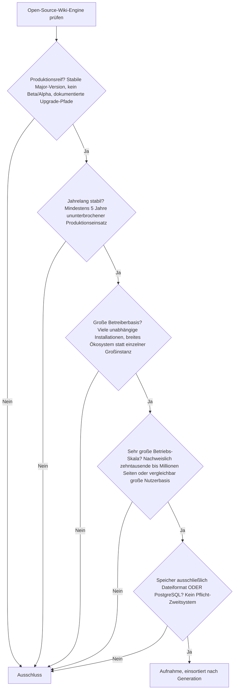
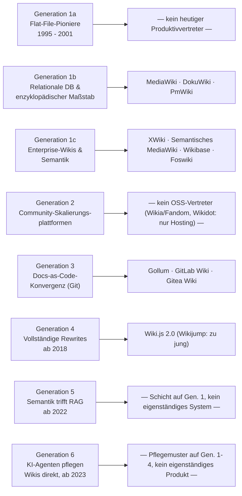
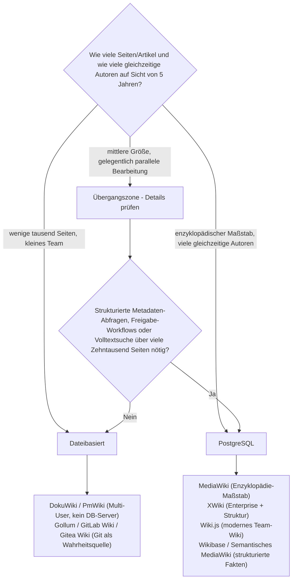

# Produktionsreife Open-Source-Wiki-Engines nach Generation — Reifegrad, Evaluation & Betriebs-Skala (Top 11)

Die [Evolution und Architekturen digitaler Wiki-Engines](evolution-digitaler-wiki-engines.md) zoomt in Generation 1 der [Wissenssysteme-Chronologie](evolution-digitaler-wissenssysteme.md) hinein und zerlegt sie in acht eigene Entwicklungsstufen (1a – 6), die [Topliste bester Wiki-Engines 2026](wiki-engines-2026-topliste.md) rankt die gesamte Kategorie, die [PostgreSQL-/Dateiformat-Variante](wiki-engines-postgresql-dateiformat-2026-topliste.md) siebt bereits nach Lizenz, Speicherbackend und Aktivität. Diese Seite kombiniert alle Achsen — parallel zur [Wissenssysteme-](produktionsreife-wissenssysteme-generationen-2026-topliste.md), [CMS-](produktionsreife-cms-generationen-2026-topliste.md), [Notebook-](produktionsreife-notebook-systeme-generationen-2026-topliste.md), [Semantische-&-RAG-](produktionsreife-semantische-rag-wissenssysteme-generationen-2026-topliste.md), [Static-Site-Generator-](produktionsreife-static-site-generatoren-generationen-2026-topliste.md) und [LMS-Schwesterseite](../e-learning/produktionsreife-lms-generationen-2026-topliste.md) — zu einem bewusst **konservativen** Fünf-Filter-Sieb: produktionsreif · jahrelang stabil · große Betreiberbasis · sehr große Betriebs-Skala · Speicher dateibasiert oder PostgreSQL. Sortiert nach Generation.

!!! warning "Achtung: Feineres Modell als die Wissenssysteme-Schwesterseite — plus Git-Forge-Module, die dort fehlen"
    Die [Wissenssysteme-Topliste](produktionsreife-wissenssysteme-generationen-2026-topliste.md) fasst alle Wiki-Engines in ihrer groben Generation 1 zusammen (1b/1c) plus Wiki.js in Generation 2. Diese Seite nutzt stattdessen das **achtstufige, wiki-eigene Generationenmodell** aus der [Evolution-Zeitachse](evolution-digitaler-wiki-engines.md) — dadurch rücken Git-native Forge-Wiki-Module (**GitLab Wiki**, **Gitea Wiki**) und der eigenständige Rewrite **Wiki.js 2.0** in eigene Generationen (3 bzw. 4), die dort nicht sichtbar sind. Ergebnis bleibt ähnlich konzentriert: elf Systeme über vier von acht Generationen, der Rest (1a, 2, 5, 6) ist entweder historisch, proprietär oder (noch) keine eigenständige Produktkategorie.

---

## Die fünf harten Filter

!!! note "Hinweis: Nur OSI-anerkannte Lizenzen, Wiki-Modul zählt als vollwertiges System"
    Wie in der [Gesamtübersicht](open-source-llm-agent-mcp-systeme.md) zählen ausschließlich OSI-anerkannte Lizenzen — das kostet die Liste **Confluence** (proprietär) und **Outline** (Business Source License). **Wikia/Fandom** und **Wikidot** sind reine Hosting-Plattformen ohne selbst betreibbaren, offen lizenzierten Quellcode und fallen ebenfalls am Lizenzfilter heraus. Wiki-Module größerer Forge-Plattformen (GitLab, Gitea) zählen dagegen als vollwertige Systeme dieser Liste — sie sind technisch eigenständige, kollaborative, versionierte Wiki-Engines, auch wenn sie nicht separat vermarktet werden.

---

## Ergebnis: Elf Systeme über vier von acht Generationen

---

## Systeme nach Generation

### Generation 1b — Relationale Datenbanken & enzyklopädischer Maßstab (2001 – 2008)

| # | System | Speicher | Lizenz | Seit | Skala-Nachweis | Betreiberbasis |
|---|---|---|---|---|---|---|
| 1 | **[MediaWiki](mediawiki/evolution-digitaler-mediawiki.md)** | PostgreSQL offiziell unterstützt, Standard MySQL/MariaDB | GPL-2.0 | 2002 | Englische Wikipedia: > 60 Mio. Seiten, zehntausende gleichzeitige Leser | Zehntausende öffentliche Wikis, hauptamtliches Team der Wikimedia Foundation |
| 2 | **[DokuWiki](dokuwiki/evolution-digitaler-dokuwiki.md)** | Reines Dateiformat, kein Datenbankserver | GPL-2.0 | 2004 | Zehntausende Seiten pro Instanz produktiv im Einsatz | Sehr breite Selfhosting-Basis in Vereinen, Behörden und Firmen-Intranets |
| 3 | **PmWiki** | Reines Dateiformat (eine Datei pro Seite) | GPL-3.0 | 2002 | Tausende bis niedrige zehntausende Seiten pro Instanz stabil | Kleinere, aber seit über 20 Jahren loyale Betreibergemeinde |

**MediaWiki** ist auch für die enger gefasste Wiki-Engine-Kategorie der unangefochtene Referenzpunkt: zwei Jahrzehnte Betrieb im zweistelligen Millionenbereich an Artikeln, PostgreSQL als offiziell unterstütztes (wenn auch selten gewähltes) Backend. Details: [Evolution und Architekturen von MediaWiki](mediawiki/evolution-digitaler-mediawiki.md), Installation: [MediaWiki installieren](mediawiki/index.md).

**DokuWiki** bleibt das reifste Flat-File-Wiki dieser Liste — Backup ist ein `rsync` des `data/`-Verzeichnisses, kein Datenbankdienst zu betreiben. **PmWiki** rangiert knapp über der Aufnahmeschwelle: kleinere Betreiberbasis, aber ungewöhnlich lange, ruhige Betriebshistorie.

!!! tip "Tipp: TikiWiki scheitert allein am Speicherfilter"
    **TikiWiki** (LGPL-2.1, seit ca. 2002, breiter Funktionsumfang) unterstützt PostgreSQL zwar technisch, in der Praxis läuft die überwältigende Mehrheit produktiver Instanzen auf MySQL/MariaDB — ohne belastbare PostgreSQL-Produktionshistorie fällt es am fünften Filter heraus, siehe [Speicher-Fazit](#dateibasiert-oder-postgresql-empfehlung-mit-klarem-umschlagpunkt).

### Generation 1c — Enterprise-Wikis & Semantik (2005 – 2015)

| # | System | Speicher | Lizenz | Seit | Skala-Nachweis | Betreiberbasis |
|---|---|---|---|---|---|---|
| 4 | **[XWiki](xwiki/evolution-digitaler-xwiki.md)** | PostgreSQL offiziell unterstützt, auch MySQL/MariaDB | LGPL-2.1 | 2003 | Enterprise-Instanzen mit hunderttausenden Seiten und strukturierten Datenobjekten | Kommerziell getragenes Kernteam (XWiki SAS), breite Behörden- und Konzernnutzung in Europa |
| 5 | **[Semantisches MediaWiki](semantische-mediawiki/installieren.md)** | PostgreSQL via MediaWiki-Datenbankschicht | GPL-2.0+ | 2005 | Erbt die MediaWiki-Skala, zusätzlich abfragbare strukturierte Attribute | Große Ökosystem-Basis über die MediaWiki-Installationen, seit professional.wiki-Sponsoring (ab 2023) wieder deutlich aktiver |
| 6 | **Wikibase** (Wikidata-Basis) | PostgreSQL via MediaWiki-Datenbankschicht | GPL-2.0 | 2012 | Wikidata: > 115 Mio. strukturierte Datenobjekte | Professionell von Wikimedia Deutschland weiterentwickelt, wachsende Zahl institutioneller Instanzen |
| 7 | **Foswiki** | Reines Dateiformat (Plain-Text/RCS), optional relationale DB | GPL-3.0 | 2008 (TWiki-Linie ab 1998) | Enterprise-Instanzen mit zehntausenden Themen über viele Jahre | Kleiner als früher, aber mehrjährig stabile, sicherheitsgepflegte Enterprise-Community |

**XWiki** ist das reifste PostgreSQL-fähige Enterprise-Wiki: monatliche Releases, strukturierte Datenfelder direkt in Wiki-Seiten, tiefe LDAP-/SSO-Integration. Installation: [XWiki installieren](xwiki/installieren.md).

**Semantisches MediaWiki** und **Wikibase** erben beide MediaWikis Datenbankschicht und damit auch deren PostgreSQL-Unterstützung — Wikibase betreibt mit Wikidata die größte offene strukturierte Wissensbasis überhaupt. **Foswiki** erfüllt die Filter knapp: reines Dateiformat, TWiki-Erbe zurück bis 1998, seit dem Split kleinere, aber weiterhin aktive Enterprise-Community.

### Generation 2 — warum hier nichts steht

**Community-Skalierungsplattformen** (2004 – 2016) lösen das Problem „ein Engine, tausende unabhängige Communities" — aber beide bekannten Vertreter scheitern am Lizenzfilter: **Wikia/Fandom** (2004, MediaWiki-basiert) und **Wikidot** (2006, eigenständig) sind reine Hosting-Plattformen ohne selbst betreibbaren, offen lizenzierten Quellcode. Wer dasselbe Multi-Tenant-Prinzip selbst hosten will, betreibt stattdessen mehrere Instanzen eines Generation-1-Systems (z. B. MediaWiki-Farm).

### Generation 3 — Docs-as-Code-Konvergenz: Git statt eigener Versionshistorie (ca. 2010 – 2018)

| # | System | Speicher | Lizenz | Seit | Skala-Nachweis | Betreiberbasis |
|---|---|---|---|---|---|---|
| 8 | **Gollum** | Git-Dateiformat — jede Änderung ein Commit | MIT | 2010 | Backend hinter der GitHub-Wiki-Funktion, millionenfach im Hintergrund im Einsatz | Kontinuierlich gepflegt, extrem breite passive Nutzerbasis über GitHub |
| 9 | **GitLab Wiki** (GitLab CE) | Git-Dateiformat je Wiki-Seite (Markdown/AsciiDoc im Repo) | MIT | 2011 | Wiki-Feature auf Millionen von GitLab-Instanzen und -Projekten | Extrem aktive Gesamtentwicklung, sehr große Contributor-Basis |
| 10 | **Gitea Wiki** | Git-Dateiformat je Wiki-Seite | MIT | 2016 | Wiki-Feature auf einer sehr großen Zahl selbst gehosteter Forge-Instanzen | Sehr aktive Community, häufige Releases |

**Gollum** definierte das Muster „Wiki-Seite = Datei im Git-Repo, Versionshistorie = Commit-Historie" und trägt bis heute unsichtbar jede GitHub-Wiki-Nutzung. **GitLab Wiki** und **Gitea Wiki** übernehmen dasselbe Prinzip als Feature einer größeren Forge-Plattform — weil diese Plattformen insgesamt eine deutlich größere Entwicklermannschaft haben als klassische Standalone-Wiki-Projekte, ist ihr Wiki-Modul faktisch aktiver gepflegt als so manche „reine" Wiki-Engine.

!!! warning "Achtung: Forgejo Wiki knapp draußen — zu jung als eigenständiges Projekt"
    **Forgejo Wiki** erfüllt technisch dieselben Kriterien wie Gitea Wiki (Go, MIT, Git-Dateiformat, sehr hohe Entwicklungsdynamik), ist aber erst 2022 als Community-Fork von Gitea entstanden — als **eigenständiges Projekt** unterschreitet es 2026 knapp die Fünf-Jahres-Marke ununterbrochener Produktionshistorie. Nachrücker ~2027.

### Generation 4 — Vollständige Rewrites auf modernen Web-Stacks (ab 2018)

| # | System | Speicher | Lizenz | Seit | Skala-Nachweis | Betreiberbasis |
|---|---|---|---|---|---|---|
| 11 | **[Wiki.js](klassische-wiki-systeme-llm-integration.md)** (2.x) | PostgreSQL empfohlenes Standard-Backend, auch MySQL/SQLite | AGPL-3.0 | 2018 | Instanzen mit zehntausenden Seiten, v2-Serie seit Jahren stabil im Produktivbetrieb | Sehr große Selfhosting-Basis, eines der meistgenutzten modernen Wikis |

**Wiki.js 2.0** ist der einzige vollständige Rewrite dieser Liste, der alle fünf Filter besteht: kompletter Umbau auf Node.js-Backend und Vue.js-SPA-Oberfläche, PostgreSQL nicht nur unterstützt, sondern empfohlenes Standard-Backend. Der laufende Rewrite auf v3 ist noch nicht am Reife-Ziel — für Produktivsysteme heute die v2-Serie einsetzen. Installation: [Wiki.js native Linux-Installation](wikijs-linux-installation.md).

!!! warning "Achtung: Wikijump/ftml scheitert doppelt"
    **Wikijump** (ftml-Parser, Rust-Rewrite der Wikidot-Engine für die SCP-Foundation-Community, 2021 – 2022) ist mit vier Jahren Produktionshistorie noch zu jung **und** dient bislang praktisch nur einer einzigen großen Community statt vieler unabhängiger Betreiber — beide Filter greifen gleichzeitig.

### Generation 5 & 6 — warum hier nichts eigenständiges steht

- **Generation 5** (Semantische Anreicherung trifft RAG, ab ca. 2022): Kein neues eigenständiges System — bestehende Generation-1-Engines bleiben Wahrheitsquelle, ein zusätzlicher Indexierungs-/Retrieval-Layer macht Inhalte per natürlicher Sprache auffindbar. Konkrete Nachrüstungs-Patterns: [Klassische Wiki-Systeme mit LLM-Integration](klassische-wiki-systeme-llm-integration.md).
- **Generation 6** (KI-Agenten pflegen bestehende Wiki-Engines direkt, ab 2023): Ebenfalls kein eigenständiges, separat installierbares Produkt mit eigener Release-/Betreiberhistorie, sondern ein Betriebsmuster auf Generation-1-/4-Engines — siehe [Wiki.js-KI-Agent](wikijs-ki-agent.md) und [MediaWiki-KI-Agent](mediawiki/mediawiki-ki-agent.md). In der Praxis erreicht man Generation 6 durch Kombination eines Systems dieser Liste mit einem Agenten-Framework (z. B. Pywikibot + LLM).

---

## Dateibasiert oder PostgreSQL? — Empfehlung mit klarem Umschlagpunkt

**Kurzfassung:** Dateibasiert bis zur mittleren Team-Größe — kein Datenbankdienst zu betreiben, zu patchen, zu sichern; Backup und Restore sind Dateisystem- bzw. Git-Operationen. PostgreSQL ab Enzyklopädie-Skala, vielen gleichzeitigen Autoren oder dem Bedarf an strukturierten, indizierten Abfragen über den gesamten Bestand — dann führt an [MediaWiki](mediawiki/evolution-digitaler-mediawiki.md), [XWiki](xwiki/evolution-digitaler-xwiki.md) oder [Wiki.js](klassische-wiki-systeme-llm-integration.md) kein Weg vorbei. Vertiefung zur Datenbankschicht: [PostgreSQL DBA Praxis-Handbuch](../../entwicklung/infrastruktur/postgresql-dba-praxis.md), zum Suchvorteil: [PostgreSQL-Volltextsuche](../../entwicklung/infrastruktur/postgresql-fulltext-search.md).

!!! warning "Achtung: Momentaufnahme, Stand August 2026"
    Forgejo Wiki überschreitet die Fünf-Jahres-Marke 2027, Wikijump/ftml erst später — beide können bei anhaltender Dynamik nachrücken. Welches Backend ein Projekt „empfiehlt" oder „standardmäßig" nutzt, ändert sich zudem mit Major-Releases — vor dem Produktivstart die aktuelle Installationsdokumentation prüfen.

---

## Was bewusst nicht auf dieser Liste steht

| System | Erfüllt nicht | Anmerkung |
|---|---|---|
| **TikiWiki** | Speicherfilter | PostgreSQL technisch wählbar, produktiv fast ausschließlich MySQL/MariaDB |
| **BookStack** | Speicherfilter | Nur MySQL/MariaDB, kein offizieller PostgreSQL-Support |
| **Wikia/Fandom** | Lizenzfilter | Reine Hosting-Plattform, kein selbst betreibbarer offener Quellcode |
| **Wikidot** | Lizenzfilter | Dito — proprietäre Hosting-Plattform |
| **Confluence** | Lizenzfilter | Vollständig proprietär |
| **Outline** | Lizenzfilter | Business Source License, nicht OSI-anerkannt |
| **Forgejo Wiki** | „Jahrelang stabil" | Erst 2022 als eigenständiges Projekt entstanden, trotz hoher Dynamik noch unter 5 Jahren |
| **Wikijump / ftml** | „Jahrelang stabil" + Betreiberbasis | 2021/22, bislang praktisch nur eine Community (SCP Foundation) |
| **TWiki** | Aktive Weiterentwicklung | Von Foswiki-Fork überholt, seither kaum noch für Neuprojekte gewählt |
| **MoinMoin** | Reife/Stabilität | Python-3-Übergang hat die Betreiberbasis stark schrumpfen lassen |
| **Apache JSPWiki** | Betreiberbasis | Etablierte Java-Nische, aber deutlich kleiner als XWiki |
| **TiddlyWiki** | Betreiberbasis + Skala | Primär Einzelnutzer-Werkzeug (eine HTML-Datei) — keine „sehr große", mehrautorige Betriebs-Skala nachgewiesen; besteht dagegen die [PKM-Wissensgraphen-Schwesterseite](produktionsreife-pkm-wissensgraphen-generationen-2026-topliste.md), die genau für Einzelnutzer-Skala misst |

---

## 🔗 Verwandte Themen

- [Startseite](../../index.md) — zurück zur Dokumentations-Zentrale
- [Evolution und Architekturen digitaler Wiki-Engines](evolution-digitaler-wiki-engines.md) — das achtstufige Generationenmodell, nach dem diese Liste sortiert ist
- [Produktionsreife Open-Source-Wissenssysteme nach Generation (Top 12)](produktionsreife-wissenssysteme-generationen-2026-topliste.md) — dieselben Systeme im groben Generation-1-Block der breiteren Wissenssysteme-Klasse
- [Produktionsreife Open-Source-CMS nach Generation (Top 12)](produktionsreife-cms-generationen-2026-topliste.md) — Schwesterseite mit demselben Sieb für Content-Management-Systeme
- [Produktionsreife Open-Source-Notebook-Systeme nach Generation (Top 4)](produktionsreife-notebook-systeme-generationen-2026-topliste.md) — Schwesterseite, ebenfalls dateibasierte Kern-Kategorie
- [Produktionsreife Open-Source-semantische & RAG-Wissenssysteme nach Generation (Top 7)](produktionsreife-semantische-rag-wissenssysteme-generationen-2026-topliste.md) — Schwesterseite; Generation 5 dieser Liste baut technisch darauf auf
- [Produktionsreife Open-Source-Static-Site-Generatoren nach Generation (Top 8)](produktionsreife-static-site-generatoren-generationen-2026-topliste.md) — Schwesterseite, Speicherfilter dort strukturell bedeutungslos statt hier eng entscheidend
- [Beste Wiki-Engines 2026 (Top 20)](wiki-engines-2026-topliste.md) — breiteste Basis-Topliste
- [Wiki-Engines mit PostgreSQL- oder Dateiformat-Speicherung (Top 15)](wiki-engines-postgresql-dateiformat-2026-topliste.md) — derselbe Speicherfilter, nach Rang statt nach Generation und ohne den Skala-Filter
- [Klassische Wiki-Systeme mit LLM-Integration](klassische-wiki-systeme-llm-integration.md) — praktische Umsetzung von Generation 5 dieser Liste
- [Wiki.js-KI-Agent](wikijs-ki-agent.md), [MediaWiki-KI-Agent](mediawiki/mediawiki-ki-agent.md) — praktische Umsetzung von Generation 6 dieser Liste
- [Evolution und Architekturen von MediaWiki](mediawiki/evolution-digitaler-mediawiki.md), [Evolution und Architekturen von XWiki](xwiki/evolution-digitaler-xwiki.md) — vertiefende Produkt-Geschichten zu Rang 1 und 4
- [PostgreSQL DBA Praxis-Handbuch](../../entwicklung/infrastruktur/postgresql-dba-praxis.md) — Datenbankschicht hinter den PostgreSQL-Rängen
