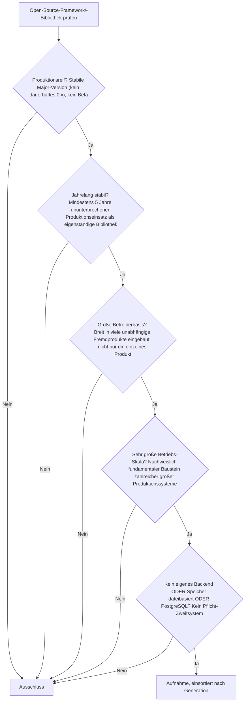
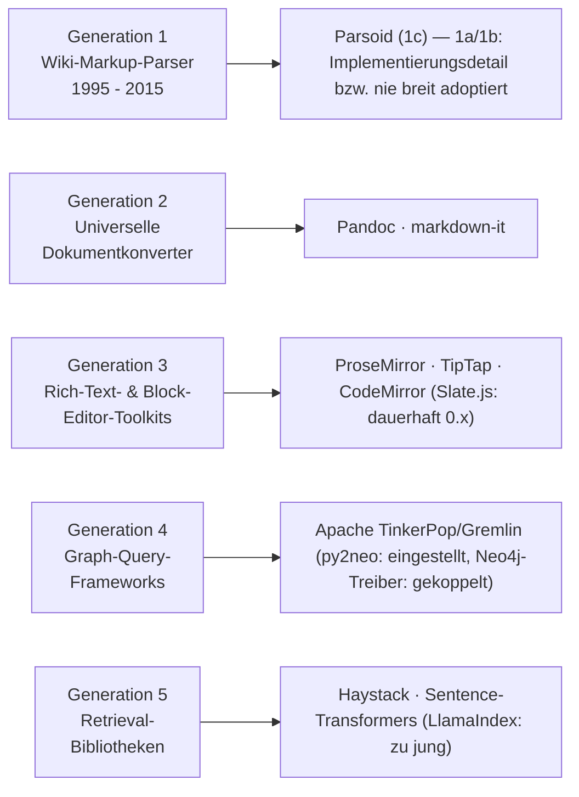

# Produktionsreife Open-Source-Frameworks & -Bibliotheken für Wissenssysteme nach Generation — Reifegrad, Evaluation & Betriebs-Skala (Top 8)

Die [Evolution und Architekturen digitaler Frameworks & Bibliotheken für Wissenssysteme](evolution-digitaler-wissenssystem-frameworks.md) ordnet die **Bauteil-Schicht** hinter fertigen Wikis, PKM-Tools und Docs-Plattformen — Parser, Editor-Toolkits, Graph-Treiber, Retrieval-Bibliotheken — chronologisch in fünf Generationen, die [Topliste bester Frameworks & Bibliotheken 2026](wissenssystem-frameworks-2026-topliste.md) rankt die gesamte Kategorie, die [PostgreSQL-/Dateiformat-Variante](wissenssystem-frameworks-postgresql-dateiformat-2026-topliste.md) siebt bereits nach Lizenz, Speicherbackend und Aktivität. Diese Seite kombiniert alle Achsen — parallel zur [Wissenssysteme-](produktionsreife-wissenssysteme-generationen-2026-topliste.md), [CMS-](produktionsreife-cms-generationen-2026-topliste.md), [Notebook-](produktionsreife-notebook-systeme-generationen-2026-topliste.md), [Semantische-&-RAG-](produktionsreife-semantische-rag-wissenssysteme-generationen-2026-topliste.md), [Static-Site-Generator-](produktionsreife-static-site-generatoren-generationen-2026-topliste.md), [Wiki-Engine-](produktionsreife-wiki-engines-generationen-2026-topliste.md), [PKM-](produktionsreife-pkm-wissensgraphen-generationen-2026-topliste.md) und [LMS-Schwesterseite](../e-learning/produktionsreife-lms-generationen-2026-topliste.md) — zu einem bewusst **konservativen** Fünf-Filter-Sieb: produktionsreif · jahrelang stabil · große Betreiberbasis · sehr große Betriebs-Skala · Speicher dateibasiert oder PostgreSQL. Sortiert nach Generation.

!!! note "Hinweis: Bausteine statt Endprodukte — Überschneidung mit der Semantische-&-RAG-Schwesterseite ist beabsichtigt"
    Diese Seite bewertet **Entwickler-Bausteine**, nicht fertige Endanwendungen — ein Framework besteht das Sieb, wenn es als eigenständige, wiederverwendbare Bibliothek über Jahre stabil und breit eingesetzt wird, unabhängig davon, ob damit gebaute Endprodukte selbst das Sieb bestehen. **Haystack** und **Sentence-Transformers** erscheinen deshalb bewusst auch auf der [Semantische-&-RAG-Schwesterseite](produktionsreife-semantische-rag-wissenssysteme-generationen-2026-topliste.md) — dort als Teil eines vollständigen Wissenssystems, hier als eigenständiger, in viele verschiedene Systeme eingebauter Baustein.

---

## Die fünf harten Filter

!!! tip "Tipp: Nur OSI-anerkannte Lizenzen, reine Spezifikationen zählen nicht als Software"
    Wie in der [Gesamtübersicht](open-source-llm-agent-mcp-systeme.md) zählen ausschließlich OSI-anerkannte Lizenzen. Zusätzlich gilt hier: eine **Abfragesprachen-Spezifikation** (Cypher, openCypher) ist kein installierbares System und wird nicht mitgezählt — bewertet wird die jeweilige Implementierung, nicht der Standard selbst.

---

## Ergebnis: Acht Bausteine über vier von fünf Generationen

---

## Bausteine nach Generation

### Generation 1c — Parsoid: formale Grammatik & DOM-Brücke (2011 – 2015)

| # | Baustein | Rolle | Speicher | Lizenz | Seit | Skala-Nachweis | Betreiberbasis |
|---|---|---|---|---|---|---|---|
| 1 | **[Parsoid](mediawiki/evolution-digitaler-mediawiki.md#generation-3-visualeditor-die-parsoid-brucke-2011-2015)** | Parser/Konverter (Wikitext ↔ DOM) | Kein Backend | GPL-2.0 | 2011 | Verarbeitet Wikitext im Wikipedia-Maßstab für jede VisualEditor-Bearbeitung | Von der Wikimedia Foundation hauptamtlich gepflegt, Kernbestandteil aller modernen MediaWiki-Installationen |

**Parsoid** ist der einzige Vertreter der Parser-Generation, der als eigenständige, formal spezifizierte Bibliothek zählt statt als Implementierungsdetail eines einzelnen Produkts. **Handgeschriebene Regex-Parser** (Generation 1a) sind eng an ihre jeweilige Wiki-Engine gekoppelt und nicht als wiederverwendbare Bibliothek gedacht — kein eigenständiges System im Sinne dieses Siebs. **WikiCreole** (Generation 1b) hat sich als Standard nie breit durchgesetzt und scheitert damit an der Betreiberbasis.

### Generation 2 — Universelle Dokumentkonverter (2001 – 2012)

| # | Baustein | Rolle | Speicher | Lizenz | Seit | Skala-Nachweis | Betreiberbasis |
|---|---|---|---|---|---|---|---|
| 2 | **[Pandoc](../tools/pandoc.md)** | Parser/Konverter | Kein Backend — arbeitet auf Dateien | GPL-2.0-or-later | 2006 | Technische Grundlage von R Markdown/Quarto und zahlreicher Wiki-Migrations-Workflows, „Schweizer Taschenmesser" der Kategorie | In unzählige fremde Toolchains eingebaut, extrem breite Nutzerbasis über 20 Jahre |
| 3 | **markdown-it** | Parser/Konverter | Kein Backend | MIT | 2014 | Meistgenutzter erweiterbarer Markdown-Parser im JavaScript-Ökosystem | Kernbaustein zahlreicher Docs-/PKM-Produkte, sehr breite Verbreitung |

**Pandoc** ist der Referenzpunkt der gesamten Bauteil-Schicht: Ein einziges AST als Drehscheibe zwischen Dutzenden Formaten, seit 2006 praktisch unverändert im Kernprinzip. **markdown-it** übernimmt dieselbe Rolle im JavaScript-Ökosystem und ist Kernbaustein zahlreicher moderner Docs- und PKM-Produkte. **txt2tags** (2001) gilt bereits in der [Basis-Topliste](wissenssystem-frameworks-2026-topliste.md) als historisch und scheitert an der aktiven Weiterentwicklung.

### Generation 3 — Rich-Text- & Block-Editor-Toolkits (2012 – 2020)

| # | Baustein | Rolle | Speicher | Lizenz | Seit | Skala-Nachweis | Betreiberbasis |
|---|---|---|---|---|---|---|---|
| 4 | **ProseMirror** | Editor-Toolkit | Kein Backend | MIT | 2015 | Architektonisches Fundament, auf dem zahlreiche spätere Editoren (inkl. TipTap) aufbauen | Sehr breite indirekte Verbreitung über abgeleitete Produkte |
| 5 | **TipTap** | Editor-Toolkit | Kein Backend | MIT | 2019 | Praktische Grundlage vieler Notion-artiger Block-Editor-Oberflächen in Produktion | Meistgenutzter ProseMirror-Wrapper, sehr breite kommerzielle Nutzung |
| 6 | **CodeMirror** (6.x) | Editor-Toolkit (Code) | Kein Backend | MIT | 2020 (Generation 6, Vorgänger seit 2007) | Eingebettet in Produkte wie Observable-Notebooks und zahlreiche Browser-IDEs | Von Marijn Haverbeke (auch ProseMirror), sehr aktiv und breit eingesetzt |

**ProseMirror** definierte das schema-getriebene Dokumentmodell, das fast jeder spätere Block-Editor übernimmt. **TipTap** macht es als Headless-Wrapper praktisch nutzbar und ist die faktische Standardwahl für neue kommerzielle Editor-Oberflächen. **CodeMirror** deckt dieselbe Rolle für Quelltext statt Rich-Text ab — beide Toolkits stammen vom selben Entwickler-Umfeld.

!!! warning "Achtung: Slate.js und Lexical scheitern — aus zwei verschiedenen Gründen"
    **Slate.js** (seit 2016, React-natives Rich-Text-Framework) verharrt trotz breiter Nutzung seit Jahren in einer **0.x-Versionierung** ohne stabilen 1.0-Release — „produktionsreif, stabile Major-Version" ist damit nicht sauber erfüllt, ein Grenzfall analog zu Axum in der [Rust-Webframework-Topliste](../../entwicklung/webentwicklung/produktionsreife-rust-webframeworks-generationen-2026-topliste.md). **Lexical** (Meta-gestützt, öffentlich seit 2022) ist technisch ausgereift, aber als eigenständig veröffentlichtes Open-Source-Projekt noch keine fünf Jahre alt — Nachrücker ~2027. **Editor.js** ist beliebt in Headless-CMS-Integrationen, aber mit kleinerer Nutzerbasis als die drei gelisteten Toolkits.

### Generation 4 — Graph-Query-Frameworks & Property-Graph-Treiber (2009 – 2020)

| # | Baustein | Rolle | Speicher | Lizenz | Seit | Skala-Nachweis | Betreiberbasis |
|---|---|---|---|---|---|---|---|
| 7 | **Apache TinkerPop / Gremlin** | Query-Framework | Kein Pflicht-Backend — auch dateibasiertes In-Memory-TinkerGraph | Apache-2.0 | 2009 | Dieselbe Gremlin-Abfrage läuft gegen Neo4j, JanusGraph oder Amazon Neptune | Reif seit 2009, einzige wirklich engine-unabhängige Wahl der Kategorie |

**Apache TinkerPop/Gremlin** ist der einzige Baustein dieser Generation, der nicht an eine einzelne, bereits an anderer Stelle ausgeschlossene dedizierte Datenbank gekoppelt ist. **py2neo** ist seit einigen Jahren offiziell eingestellt, die **Neo4j-Bolt-Treiber** sind untrennbar an Neo4j gebunden — dieselbe Ausschlussbegründung wie bei Neo4j selbst in der [Semantische-RAG-Speicherbackend-Topliste](semantische-rag-wissenssysteme-postgresql-dateiformat-2026-topliste.md). **Apache AGE** (PostgreSQL-natives openCypher, seit ca. 2019, seit 2024 Apache-Top-Level-Projekt) ist technisch die naheliegendste Postgres-native Alternative — dem pgvector-Prinzip auf Graphdaten übertragen —, hat aber noch keine ebenso breit nachgewiesene Produktions-Skala wie die übrigen Systeme dieser Liste. Aussichtsreichster Nachrücker.

### Generation 5 — Retrieval-Bibliotheken speziell für Wissenssuche (2019 – 2022)

| # | Baustein | Rolle | Speicher | Lizenz | Seit | Skala-Nachweis | Betreiberbasis |
|---|---|---|---|---|---|---|---|
| 8 | **[Haystack](semantische-rag-wissenssysteme-2026-topliste.md)** (deepset) | Retrieval-Bibliothek | Kein Pflicht-Backend | Apache-2.0 | 2019 | Enterprise-Suche und Frage-Antwort-Pipelines in Produktion, entstand vor dem breiten LLM-Hype | Enterprise-Fokus, sehr aktiv, seit 7 Jahren stabil |
| 9 | **Sentence-Transformers** | Embedding-Bibliothek | Kein Backend — erzeugt nur Vektoren | Apache-2.0 | 2019 | Erzeugt im Hintergrund einen Großteil aller Embeddings, auf denen RAG-Systeme der [Semantische-RAG-Schwesterseite](produktionsreife-semantische-rag-wissenssysteme-generationen-2026-topliste.md) aufbauen | Fundament fast aller Retrieval-Pipelines, extrem breite indirekte Verbreitung |

**Haystack** entstand als dedizierte Such-/QA-Pipeline-Bibliothek noch vor dem generischen RAG-Orchestrierungs-Hype und bleibt bis heute auf Wissenssuche statt allgemeine Agenten fokussiert. **Sentence-Transformers** ist die unsichtbarste, aber am weitesten verbreitete Bibliothek dieser Liste — kaum ein Endnutzer kennt sie namentlich, aber ein Großteil der Embedding-Erzeugung in der gesamten Wissenssysteme-Familie läuft durch sie hindurch. **LlamaIndex** (2022) ist technisch stark, aber als eigenständiges Datenframework noch keine fünf Jahre alt — dieselbe Alterslogik, die auch [RAG-Werkzeug-Anwendungen](../../künstliche-intelligenz/produktionsreife-rag-werkzeug-anwendungen-generationen-2026-topliste.md) fast vollständig ausschließt. **txtai** (2020, Dateiformat via SQLite + Faiss) ist technisch qualifiziert, bleibt aber „kompakt" und deutlich kleiner verbreitet als Haystack oder Sentence-Transformers.

---

## Dateibasiert oder PostgreSQL? — auch hier strukturell fast bedeutungslos

Sieben der acht Bausteine dieser Liste haben **gar kein eigenes Speicherbackend** — Parser, Konverter und Editor-Toolkits verarbeiten, was die einbindende Anwendung ihnen übergibt, und geben es zurück, ohne selbst etwas zu persistieren. Nur **Apache TinkerPop** kann optional dateibasiert (In-Memory-/Datei-TinkerGraph) arbeiten. Der einzige Baustein mit **PostgreSQL als echtem Primärspeicher** wäre Apache AGE — der aber (noch) nicht die Skala-Schwelle dieser Liste erreicht. Das ist derselbe strukturelle Befund wie bei den [Static-Site-Generatoren](produktionsreife-static-site-generatoren-generationen-2026-topliste.md): Auf der reinen Bauteil-Ebene ist der Speicherfilter der Familie weitgehend bedeutungslos — er wird erst relevant, sobald ein Framework in ein vollständiges System mit eigener Persistenzschicht eingebaut wird, siehe die produktseitigen Schwesterseiten dieser Familie.

!!! warning "Achtung: Momentaufnahme, Stand August 2026"
    Lexical überschreitet die Fünf-Jahres-Marke als eigenständiges Open-Source-Projekt 2027, Apache AGE kann seine Produktions-Skala mit wachsender PostgreSQL-Adoption schnell nachweisen. Vor einer Produktiv-Entscheidung den aktuellen Entwicklungsstand des jeweiligen Projekts prüfen.

---

## Was bewusst nicht auf dieser Liste steht

| Baustein | Erfüllt nicht | Anmerkung |
|---|---|---|
| **Handgeschriebene Wiki-Parser** (MediaWiki-, DokuWiki-eigene) | Kategorie | Implementierungsdetail einzelner Produkte, keine eigenständige, wiederverwendbare Bibliothek |
| **WikiCreole** | Betreiberbasis | Standardisierungsversuch, hat sich nie breit durchgesetzt |
| **txt2tags, Quill.js** | Aktive Weiterentwicklung | Von der Basis-Topliste selbst bereits als historisch eingestuft |
| **Slate.js** | Produktionsreife | Verharrt trotz breiter Nutzung seit Jahren in 0.x-Versionierung |
| **Lexical** | „Jahrelang stabil" | Öffentlich erst seit 2022, als eigenständiges Projekt noch keine 5 Jahre |
| **Editor.js** | Betreiberbasis | Beliebt in Headless-CMS-Nischen, aber kleinere Skala als ProseMirror/TipTap/CodeMirror |
| **py2neo** | Aktive Weiterentwicklung + Speicherfilter | Offiziell eingestellt, zudem untrennbar an Neo4j gekoppelt |
| **Neo4j-Bolt-Treiber, FalkorDB-Client-Bibliotheken** | Speicherfilter | Untrennbar an eine bereits ausgeschlossene dedizierte Graph-/Redis-Datenbank gekoppelt |
| **Cypher, openCypher** | Kategorie | Abfragesprachen-Spezifikation, kein installierbares System |
| **Apache AGE** | Betriebs-Skala | Technisch qualifiziert (PostgreSQL-nativ), aber noch keine ebenso breit nachgewiesene Produktions-Skala |
| **txtai** | Betreiberbasis | Solide, aber deutlich kleinere Nutzerbasis als Haystack/Sentence-Transformers |
| **LlamaIndex** | „Jahrelang stabil" | Als eigenständiges Datenframework erst seit 2022 |

---

## 🔗 Verwandte Themen

- [Startseite](../../index.md) — zurück zur Dokumentations-Zentrale
- [Evolution und Architekturen digitaler Frameworks & Bibliotheken für Wissenssysteme](evolution-digitaler-wissenssystem-frameworks.md) — das fünfstufige Generationenmodell, nach dem diese Liste sortiert ist
- [Produktionsreife Open-Source-semantische & RAG-Wissenssysteme nach Generation (Top 7)](produktionsreife-semantische-rag-wissenssysteme-generationen-2026-topliste.md) — Schwesterseite auf Endprodukt-Ebene; Haystack und Sentence-Transformers erscheinen bewusst auf beiden Seiten
- [Produktionsreife Open-Source-Wissenssysteme mit vollständigem pgvector-Support nach Generation (Top 2)](produktionsreife-pgvector-wissenssysteme-generationen-2026-topliste.md) — der pgvector-Ausschnitt: Haystacks `PgvectorDocumentStore` ist einer von nur zwei Treffern
- [Produktionsreife Open-Source-Wiki-Engines nach Generation (Top 11)](produktionsreife-wiki-engines-generationen-2026-topliste.md) — die Produkte, die Parsoid (Rang 1 dieser Liste) einsetzen
- [Produktionsreife Open-Source-PKM-Wissensgraphen & Block-Editoren nach Generation (Top 3)](produktionsreife-pkm-wissensgraphen-generationen-2026-topliste.md) — Produkte, die auf den Editor-Toolkits aus Generation 3 dieser Liste aufbauen
- [Beste Frameworks & Bibliotheken für Wissenssysteme 2026 (Top 20)](wissenssystem-frameworks-2026-topliste.md) — breiteste Basis-Topliste ohne Lizenz-/Speicherbackend-/Aktivitätsfilter
- [Frameworks & Bibliotheken für Wissenssysteme mit PostgreSQL-/Dateiformat-Speicherung (Top 16)](wissenssystem-frameworks-postgresql-dateiformat-2026-topliste.md) — derselbe Speicher-/Lizenzfilter, nach Rang statt nach Generation und ohne den Skala-Filter
- [Rust-Bausteine für Wissenssysteme mit PostgreSQL-/Dateiformat-Speicherung (Top 15)](rust-wissenssysteme-postgresql-dateiformat-2026-topliste.md) — sprachspezifische Schwester-Topliste derselben Bauteil-Ebene
- [Pandoc installieren & nutzen](../tools/pandoc.md) — vertiefend zu Rang 2 dieser Liste
- [Evolution und Architekturen von MediaWiki](mediawiki/evolution-digitaler-mediawiki.md) — vertiefende Produktgeschichte zu Parsoid (Rang 1 dieser Liste)
