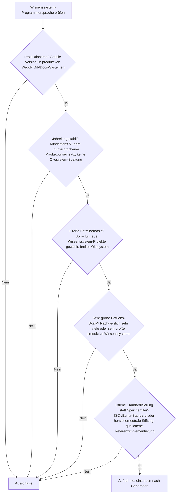
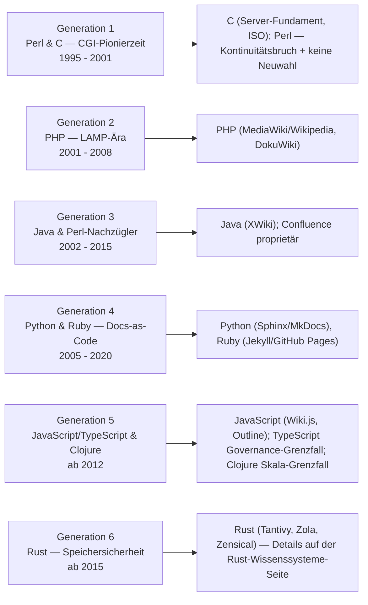
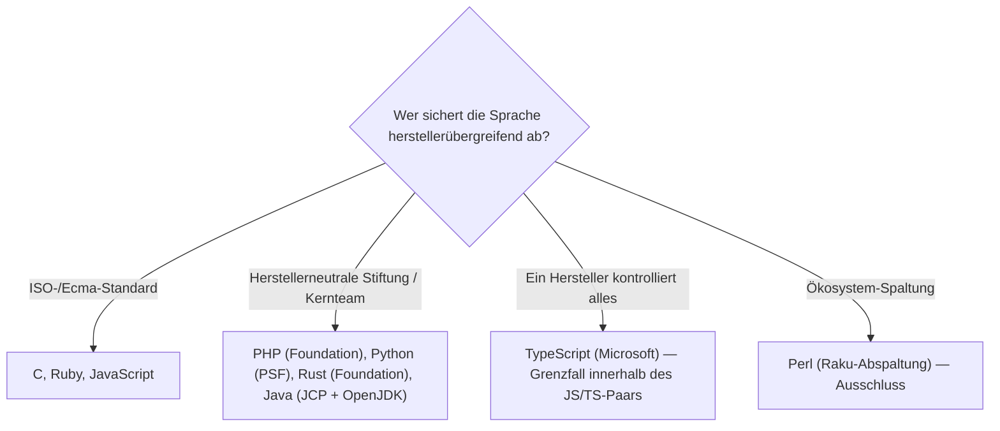

# Produktionsreife Programmiersprachen für Wissenssysteme nach Generation — Reifegrad, Standardisierung & Betriebs-Skala (Top 7)

Die [Evolution und Architekturen digitaler Programmiersprachen für Wissenssysteme](evolution-digitaler-wissenssystem-programmiersprachen.md) ordnet die Sprachökosysteme, die Wiki-, PKM- und Docs-Plattformen tragen, nach Generation: Perl & C — CGI-Pionierzeit (1), PHP — LAMP-Ära (2), Java & Perl-Nachzügler — Enterprise-Wikis (3), Python & Ruby — Docs-as-Code (4), JavaScript/TypeScript & Clojure — moderne PKM-Web-Apps (5), Rust — Speichersicherheit unter Performance-Last (6). Die Toplisten rankt die [Eignungs-](programmiersprachen-wissenssysteme-topliste.md) und die [Lizenz-/Reife-Seite](programmiersprachen-wissenssysteme-aktive-reife-topliste.md). Diese Seite legt das **konservative** Fünf-Filter-Sieb der Familie an — mit dem Speicherfilter ersetzt durch offene Standardisierung (siehe [allgemeine Sprach-Schwesterseite](../../entwicklung/produktionsreife-programmiersprachen-generationen-2026-topliste.md#standardisierung-statt-speicherbackend)) — und ist die Wissenssysteme-Vertiefung neben der [Enterprise-Sprach-Seite](../../entwicklung/produktionsreife-enterprise-programmiersprachen-generationen-2026-topliste.md).

!!! warning "Achtung: Jede Generation ab 2 trifft — Wiki-/Docs-Tooling greift zur langweiligsten Sprache seiner Ära"
    Anders als auf der [allgemeinen Sprach-Schwesterseite](../../entwicklung/produktionsreife-programmiersprachen-generationen-2026-topliste.md) (dort hat Generation 5 keinen Volltreffer) besteht hier **jede Generation ab Generation 2** sauber: **PHP** (Gen 2 — MediaWiki hinter Wikipedia, DokuWiki), **Java** (Gen 3 — XWiki), **Python** und **Ruby** (Gen 4 — Sphinx/MkDocs, Jekyll), **JavaScript** (Gen 5 — Wiki.js, Outline), **Rust** (Gen 6 — Tantivy, Zola, Zensical). Dazu **C** als Server-Fundament der Gen 1. Das einzige Opfer ist **Perl** — die Sprache, die die Kategorie 1995 mit WikiWikiWeb *gründete*: Raku-Spaltung, stark schrumpfende Nutzung, keine Neuwahl für Wiki-Projekte mehr (Foswiki/TWiki laufen weiter, werden aber nicht mehr gewählt). **Clojure** (Gen 5, Logseq-Kern) ist Grenzfall an der Skala, **TypeScript** Grenzfall an der Governance (Microsoft-kontrolliert). Der Speicherfilter läuft für eine Sprache leer und wird durch **offene Standardisierung / herstellerneutrale Stewardship** ersetzt.

---

## Die fünf harten Filter

!!! note "Hinweis: Neuwahl zählt — anders als auf der Enterprise-Sprach-Seite"
    Auf der [Enterprise-Schwesterseite](../../entwicklung/produktionsreife-enterprise-programmiersprachen-generationen-2026-topliste.md) besteht COBOL rein über Bestandsvolumen. Hier ist die Betreiberbasis-Frage strenger gefasst: Eine Sprache muss 2026 noch *aktiv für neue* Wiki-/PKM-/Docs-Projekte gewählt werden. Genau daran scheitert Perl — das Bestandsvolumen (Foswiki, TWiki, ältere CGI-Wikis) ist real, aber die Neuwahl praktisch null.

---

## Ergebnis: sieben Treffer über sechs Generationsstufen

---

## Sprachen nach Generation

### Generation 1 — Perl & C, CGI-Pionierzeit (1995 – 2001)

| # | Sprache | Standardisierung | Referenzimpl. | Seit | Skala-Nachweis |
|---|---|---|---|---|---|
| 1 | **C** | ISO/IEC 9899 (C23) | GCC, Clang u. v. m. (quelloffen) | 1972 | Trägt den Webserver-Prozess selbst (Apache HTTP Server, nginx) unter praktisch jedem klassischen Wiki |

**C** besteht als Server-Fundament der Gründergeneration: Der Apache HTTP Server (in C) übernahm die HTTP-Kommunikation, über CGI startete jede Wiki-Anfrage ein eigenes Skript. C ist hier nicht die Wiki-*Sprache*, aber die Schicht, ohne die keine der frühen Wiki-Engines lief — und bis heute die Sprache der Webserver darunter. **Perl** war die Wiki-Sprache der Gen 1 (WikiWikiWeb 1995, UseModWiki 2000) — siehe die Grenzfall-Diskussion unten.

### Generation 2 — PHP, die LAMP-Ära (2001 – 2008)

| # | Sprache | Standardisierung/Stewardship | Referenzimpl. | Seit | Skala-Nachweis |
|---|---|---|---|---|---|
| 2 | **PHP** | PHP Foundation (seit 2021), offener RFC-Prozess | Zend/PHP (quelloffen) | 1995 | **MediaWiki** hinter Wikipedia (eine der meistbesuchten Websites der Welt), dazu DokuWiki und TikiWiki auf zahllosen Shared-Hosting-Installationen |

**PHP** ist der stärkste Wiki-Sprach-Treffer: Das eingebettete HTML-Modell und die massenhafte Shared-Hosting-Verfügbarkeit machten Wiki-Betrieb erstmals für Einzelpersonen praktikabel, und MediaWiki gab der Sprache eine Betriebs-Skala, an die keine andere Wiki-Sprache heranreicht. Herstellerneutrale Foundation seit 2021, quelloffene Referenzimplementierung, jährliche Major-Releases.

### Generation 3 — Java & Perl-Nachzügler, Enterprise-Wikis (2002 – 2015)

| # | Sprache | Standardisierung | Referenzimpl. | Seit | Skala-Nachweis |
|---|---|---|---|---|---|
| 3 | **Java** | Java Language Specification, JCP; OpenJDK unter GPL-2.0-with-Classpath-Exception | OpenJDK (quelloffen) | 1995 | **XWiki** als quelloffenes Enterprise-Wiki mit strukturierten Datenfeldern, LDAP/SSO-Integration, großen Konzern-Installationen |

**Java** besteht: OpenJDK als quelloffene Referenz, JCP-Prozess mit mehreren Beteiligten, und mit XWiki ein reifes quelloffenes Enterprise-Wiki-Produkt. **Atlassian Confluence** (ebenfalls Java) ist proprietär und zählt nicht. Die parallelen Perl-Wikis dieser Generation (Foswiki, 2008) gehören zur Perl-Grenzfall-Diskussion.

### Generation 4 — Python & Ruby, Docs-as-Code (2005 – 2020)

| # | Sprache | Standardisierung/Stewardship | Referenzimpl. | Seit | Skala-Nachweis |
|---|---|---|---|---|---|
| 4 | **Python** | Python Software Foundation, PEP-Prozess (herstellerneutral) | CPython (quelloffen) | 1991 | **Sphinx** und **MkDocs** hinter der Dokumentation der meisten Python-Projekte, Read the Docs, unzähligen technischen Wissensportalen |
| 5 | **Ruby** | ISO/IEC 30170:2012, Matz + Kernteam | CRuby/MRI (quelloffen) | 1995 | **Jekyll** ist der native Generator von GitHub Pages — damit eine der größten installierten Basen jedes Docs-Werkzeugs überhaupt |

**Python** und **Ruby** bestehen beide. Ruby erreicht die „sehr große Skala" fast ausschließlich über **Jekyll/GitHub Pages** — als allgemeine Wiki-Sprache wäre Rubys Reichweite grenzwertig, aber die GitHub-Pages-Integration gibt ihr in der Docs-Sub-Nische eine gewaltige, dateibasierte Betriebs-Skala.

### Generation 5 — JavaScript/TypeScript & Clojure, moderne PKM-Web-Apps (ab 2012)

| # | Sprache | Standardisierung | Referenzimpl. | Seit | Skala-Nachweis |
|---|---|---|---|---|---|
| 6 | **JavaScript / ECMAScript** | Ecma-262, TC39 (mehrere Browser-Hersteller) | V8, SpiderMonkey, JavaScriptCore (quelloffen) | 1995 | **Wiki.js**, **Outline** und praktisch jeder moderne Block-Editor; isomorpher Vollstack (Browser + Node.js) |

**JavaScript** besteht über den Ecma-Standard und die isomorphe Vollstack-Rolle in modernen PKM-Werkzeugen. **TypeScript** (das viele dieser Systeme tatsächlich nutzen — Outline z. B.) ist der Governance-Grenzfall: Apache-2.0, aber vollständig Microsoft-kontrolliert, kein externer Standard. **Clojure/ClojureScript** ist der Skala-Grenzfall: **Logseq** (ClojureScript + Datascript-Datalog) ist die eine namhafte PKM-Anwendung, und die steckt mitten in einer Datenbank-Migration — der architektonische Fit (Datalog für Graphen) ist real, die Betreiberbasis der Sprache aber klein.

### Generation 6 — Rust, Speichersicherheit unter Performance-Last (ab 2015)

| # | Sprache | Stewardship | Referenzimpl. | Seit | Skala-Nachweis |
|---|---|---|---|---|---|
| 7 | **Rust** | Rust Foundation (2021, mehrere Trägerunternehmen) | rustc (MIT/Apache-2.0, quelloffen) | 2015 (1.0) | Suche (Tantivy), Static-Site-Build (Zola, Zensical), Vektor-/CRDT-Kerne — meist unsichtbar hinter einer Python-/JS-/Web-Oberfläche |

**Rust** besteht: herstellerneutrale Foundation, quelloffene Referenz, und eine wachsende Zahl produktionsreifer Wissenssystem-Bausteine. Die Detail-Einordnung dieser Bausteine nach Generation liefert die eigene [Rust-Wissenssysteme-Schwesterseite](produktionsreife-rust-wissenssysteme-generationen-2026-topliste.md) (dort Top 3: Tantivy, Tokio, mdBook).

### Perl & Clojure — die Grenzfälle

- **Perl (Generation 1)**: die Sprache, die die Kategorie *gründete* — WikiWikiWeb (1995), UseModWiki, TWiki, Foswiki. Quelloffen, mit CPAN ein reifes Paket-Ökosystem, kein ISO-Standard aber ein stabiler Sprachkern. Sie scheitert an **zwei** Filtern zugleich: **Kontinuität** (die Raku-Abspaltung und der steckengebliebene „Perl 7"-Plan fragmentierten die Weiterentwicklung) und **Neuwahl-Betreiberbasis** (Perl-Wikis laufen weiter, aber niemand startet 2026 ein neues Wiki-Projekt in Perl). Dieselbe Einordnung wie auf der [allgemeinen Sprach-Schwesterseite](../../entwicklung/produktionsreife-programmiersprachen-generationen-2026-topliste.md) — hier besonders sichtbar, weil Perl am Anfang der ganzen Geschichte steht.
- **Clojure (Generation 5)**: EPL-lizenziert, quelloffen, kontinuierlich (wenn auch bewusst gemächlich) gepflegt — aber die Betreiberbasis ist klein, und mit Logseq gibt es nur *eine* namhafte Wissenssystem-Anwendung, die zudem gerade ihr Datenmodell umbaut. Grenzfall an der Betriebs-Skala.

---

## Standardisierung statt Speicherbackend

Die Familien-Frage „dateibasiert oder PostgreSQL?" hat für eine Sprache keine Entsprechung — sie legt sich nicht fest (DokuWiki ist dateibasiert, MediaWiki nutzt MySQL/MariaDB, beide sind PHP). Die ersetzende Achse:

- Der Speicherfilter läuft leer: Jede Sprache dieser Liste trägt sowohl dateibasierte (DokuWiki, Jekyll, Zola) als auch PostgreSQL-/MySQL-gestützte (MediaWiki, XWiki, Outline) Wissenssysteme — das ist Framework-, nicht Sprachwahl.
- Die ersetzende Standardisierungs-Achse siebt real: Sie trennt Perl (Spaltung) klar aus und markiert TypeScript als Grenzfall — bei sonst durchweg standard- oder stiftungsgesicherten Treffern.

Vertiefung zur Datenbankschicht der Wissenssysteme selbst: [PostgreSQL DBA Praxis-Handbuch](../../entwicklung/infrastruktur/postgresql-dba-praxis.md).

!!! warning "Achtung: Momentaufnahme, Stand August 2026"
    Sollte Logseq seine Datenbank-Migration abschließen und die ClojureScript-PKM-Nische festigen, rückt Clojure näher an einen Volltreffer. Für Perl ist keine Trendwende in Sicht.

---

## Was bewusst nicht auf dieser Liste steht

| Sprache | Erfüllt nicht | Anmerkung |
|---|---|---|
| **Perl** | Kontinuität + Neuwahl-Betreiberbasis | Gründete die Kategorie; Raku-Spaltung, keine Neuwahl für Wiki-Projekte mehr |
| **Clojure / ClojureScript** | Betriebs-Skala | Nur eine namhafte PKM-Anwendung (Logseq), mitten in der Datenmodell-Migration |
| **TypeScript** | Herstellerneutrale Stewardship | Microsoft-kontrolliert, kein externer Standard — innerhalb des JS/TS-Paars als Grenzfall geführt |
| **Kotlin, Elixir, Go, C#** | Kategorie / Betriebs-Skala im Wissenssystem-Bau | Bestehen das Sieb allgemein (siehe [Enterprise-Schwesterseite](../../entwicklung/produktionsreife-enterprise-programmiersprachen-generationen-2026-topliste.md)), tragen aber keine große eigenständige Wissenssystem-Betreiberbasis |
| **Atlassian Confluence (Java)** | Lizenz | Proprietäres Enterprise-Wiki; die *Sprache* Java besteht über XWiki |

---

## 🔗 Verwandte Themen

- [Evolution und Architekturen digitaler Programmiersprachen für Wissenssysteme](evolution-digitaler-wissenssystem-programmiersprachen.md) — das Generationenmodell, nach dem diese Liste sortiert ist
- [Beste Programmiersprachen für moderne Wissenssysteme (Top 10)](programmiersprachen-wissenssysteme-topliste.md) — Basis-Topliste nach Eignung für RAG/Performance/Kollaboration
- [Programmiersprachen für Wissenssysteme: Lizenz, Aktivität & Reife (Top 10)](programmiersprachen-wissenssysteme-aktive-reife-topliste.md) — mittlere Filterstufe: Lizenz und Aktivität, ohne die Fünf-Jahres-/Skala-/Neuwahl-Härte dieser Seite
- [Produktionsreife Programmiersprachen nach Generation (Top 9)](../../entwicklung/produktionsreife-programmiersprachen-generationen-2026-topliste.md) — allgemeine Schwesterseite; erklärt die Standardisierungs-Achse ausführlich
- [Produktionsreife Enterprise-Programmiersprachen nach Generation (Top 8)](../../entwicklung/produktionsreife-enterprise-programmiersprachen-generationen-2026-topliste.md) — die dritte Domänen-Vertiefung der Sprach-Achse
- [Produktionsreife Rust-Bausteine für Wissenssysteme nach Generation (Top 3)](produktionsreife-rust-wissenssysteme-generationen-2026-topliste.md) — die Detail-Einordnung von Generation 6 dieser Seite
- [Produktionsreife Open-Source-Wissenssysteme nach Generation (Top 12)](produktionsreife-wissenssysteme-generationen-2026-topliste.md) — die Produktebene über diesen Sprachen
- [Produktionsreife Docs-as-Code-Werkzeuge nach Generation (Top 10)](produktionsreife-docs-as-code-generationen-2026-topliste.md) — Sphinx/MkDocs/Jekyll (Generation 4) im Werkzeug-Kontext
- [PostgreSQL DBA Praxis-Handbuch](../../entwicklung/infrastruktur/postgresql-dba-praxis.md) — Datenbankschicht der Wissenssysteme, die diese Sprachen tragen
