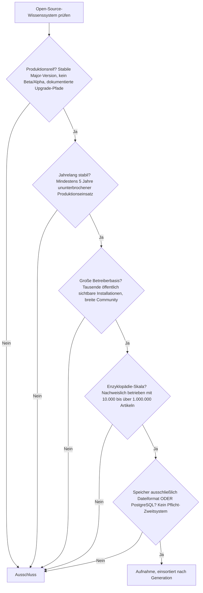
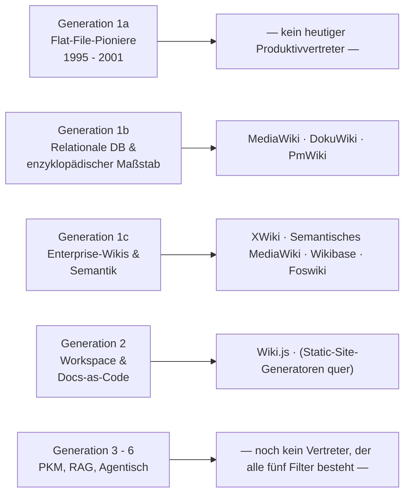
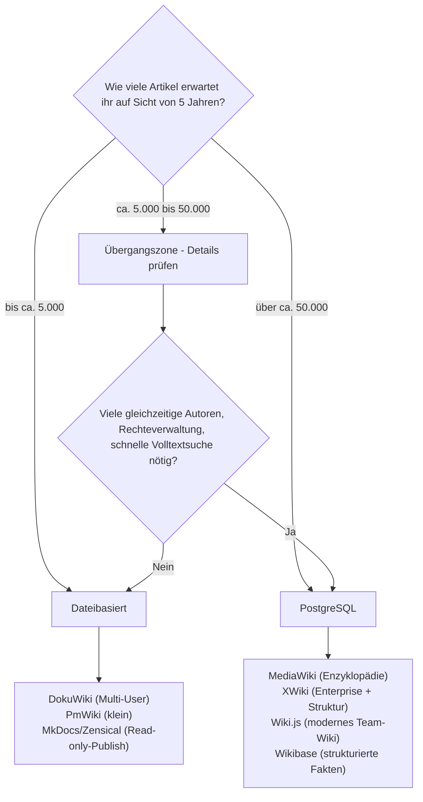

# Produktionsreife Open-Source-Wissenssysteme nach Generation — Reifegrad, Evaluation & Enzyklopädie-Skala (Top 12)

Die [Evolution und Architekturen digitaler Wissenssysteme](evolution-digitaler-wissenssysteme.md) ordnet die Systemklasse chronologisch in sechs technologische Generationen, die [Topliste aktiver & reifer Systeme](aktive-reife-opensource-wissenssysteme-2026-topliste.md) siebt nach Lizenz, Aktivität und Reife, die [PostgreSQL-/Dateiformat-Topliste](postgresql-dateiformat-wissenssysteme-2026-topliste.md) zusätzlich nach einfachem Speicherbackend. Diese Seite kombiniert beide Achsen und legt ein bewusst **konservatives** Sieb an: Aufgenommen wird nur, was **alle** der folgenden Kriterien gleichzeitig erfüllt — anschließend **nach Generation sortiert** statt nach Rang, damit sichtbar wird, in welcher Architektur-Ära die produktionshärtesten Systeme entstanden sind.

!!! note "Hinweis: Nur OSI-anerkannte Lizenzen"
    Wie in der [Gesamtübersicht](open-source-llm-agent-mcp-systeme.md) zählen hier ausschließlich Systeme unter einer OSI-anerkannten Open-Source-Lizenz (MIT, GPL, LGPL, AGPL, BSD, Apache-2.0). Source-available-Sonderfälle wie Outline (BSL) oder Confluence (proprietär) fallen unabhängig von Reife und Skala heraus.

---

## Die fünf harten Filter

!!! tip "Tipp: Warum diese Kombination so streng ist"
    Jeder Filter für sich lässt viele Systeme durch. Erst die **Schnittmenge** ist eng: „Jahrelang stabil" schließt fast die gesamte RAG-/Agenten-Welle ab 2022 aus, „Enzyklopädie-Skala" schließt die meisten Personal-Knowledge-Management-Werkzeuge aus (sie sind für Einzelpersonen optimiert, nicht für hunderttausende Artikel mit vielen gleichzeitigen Autoren), und „nur Datei oder PostgreSQL" schließt Systeme mit Pflicht-MongoDB, -Elasticsearch oder -Vektordatenbank aus.

---

## Ergebnis: Die produktionsreifen Systeme sind fast alle Generation 1

---

## Systeme nach Generation

### Generation 1b — Relationale Datenbanken & enzyklopädischer Maßstab (ca. 2001 – 2008)

| # | System | Speicher | Lizenz | Seit | Skala-Nachweis | Betreiberbasis |
|---|---|---|---|---|---|---|
| 1 | **[MediaWiki](mediawiki/evolution-digitaler-mediawiki.md)** | PostgreSQL (offiziell), Standard MySQL/MariaDB | GPL-2.0 | 2002 | Englische Wikipedia: > 60 Mio. Seiten, zehntausende gleichzeitige Leser | Zehntausende öffentliche Wikis, hauptamtliches Team der Wikimedia Foundation |
| 2 | **[DokuWiki](dokuwiki/evolution-digitaler-dokuwiki.md)** | Reines Dateiformat, kein Datenbankserver | GPL-2.0 | 2004 | Betrieben mit zehntausenden Seiten pro Instanz; Suche wird jenseits davon zum Engpass | Sehr breite Selfhosting-Basis, Standard-Wiki vieler Vereine, Behörden und Firmen-Intranets |
| 3 | **PmWiki** | Reines Dateiformat (eine Datei pro Seite) | GPL-3.0 | 2004 | Tausende bis niedrige zehntausende Seiten pro Instanz stabil | Kleinere, aber seit über 20 Jahren loyale Betreibergemeinde |

**MediaWiki** ist der Referenzpunkt jeder Skalierungsdiskussion für Wissenssysteme: Kein anderes Open-Source-System hat den Betrieb im zweistelligen Millionenbereich an Artikeln über zwei Jahrzehnte bewiesen. PostgreSQL ist ein offiziell unterstütztes Backend (Standard ist MySQL/MariaDB); für Neuinstallationen mit PostgreSQL-Präferenz ist der Pfad dokumentiert, aber weniger begangen — vor dem Produktivstart die aktuelle Kompatibilitätsmatrix prüfen. Details zur eigenen Versions- und Architekturgeschichte: [Evolution und Architekturen von MediaWiki](mediawiki/evolution-digitaler-mediawiki.md), Installation unter [MediaWiki installieren](mediawiki/index.md).

**DokuWiki** ist die dateibasierte Ausnahme dieser Ära und bis heute das reifste Flat-File-Wiki mit großer Betreiberbasis: Backup ist ein `rsync` oder `git commit` des `data/`-Verzeichnisses, Restore ein Zurückkopieren. Der Preis ist eine grep-artige Volltextsuche, die jenseits einiger zehntausend Seiten spürbar langsamer wird, und fehlendes echtes gleichzeitiges Editieren derselben Seite. Vertiefend: [Evolution und Architekturen von DokuWiki](dokuwiki/evolution-digitaler-dokuwiki.md).

**PmWiki** rangiert knapp über der Aufnahmeschwelle: kleinere Betreiberbasis als DokuWiki, aber über 20 Jahre ununterbrochene Pflege, reines Dateiformat und ein Ruf für außergewöhnliche Betriebsstabilität bei kleinen bis mittleren Beständen.

### Generation 1c — Enterprise-Wikis & Semantik (ca. 2005 – 2015)

| # | System | Speicher | Lizenz | Seit | Skala-Nachweis | Betreiberbasis |
|---|---|---|---|---|---|---|
| 4 | **[XWiki](xwiki/evolution-digitaler-xwiki.md)** | PostgreSQL (offiziell), auch MySQL/MariaDB | LGPL-2.1 | 2003 | Enterprise-Instanzen mit hunderttausenden Seiten und strukturierten Datenobjekten | Kommerziell getragenes Kernteam (XWiki SAS), breite Behörden- und Konzern-Nutzung in Europa |
| 5 | **[Semantisches MediaWiki](semantische-mediawiki/installieren.md)** | PostgreSQL (via MediaWiki-Datenbankschicht) | GPL-2.0+ | 2005 | Erbt die MediaWiki-Skala; zusätzlich abfragbare strukturierte Attribute | Große Ökosystem-Basis über die MediaWiki-Installationen, seit professional.wiki-Sponsoring (ab 2023) wieder deutlich aktiver |
| 6 | **Wikibase** (Wikidata-Basis) | PostgreSQL (via MediaWiki-Datenbankschicht) | GPL-2.0 | 2012 | Wikidata: > 115 Mio. strukturierte Datenobjekte — der größtmögliche Skala-Nachweis | Professionell von Wikimedia Deutschland weiterentwickelt, wachsende Zahl institutioneller Instanzen |
| 7 | **Foswiki** | Reines Dateiformat (Plain-Text/RCS), optional relationale DB | GPL-3.0 | 2008 (TWiki-Linie ab 1998) | Enterprise-Instanzen mit zehntausenden Themen über viele Jahre | Kleiner als früher, aber mehrjährig stabile, sicherheitsgepflegte Enterprise-Community |

**XWiki** ist das reifste PostgreSQL-fähige Enterprise-Wiki: monatliche Releases, strukturierte Datenfelder direkt in Wiki-Seiten, tiefe Rechte- und LDAP-Integration. Für Organisationen, die MediaWikis Wikitext-Modell zu sperrig finden, aber dieselbe Datenbank-Robustheit brauchen, ist es die erste Wahl. Installation: [XWiki installieren](xwiki/installieren.md).

**Semantisches MediaWiki** und **Wikibase** erben beide die MediaWiki-Datenbankschicht (also auch deren PostgreSQL-Unterstützung) und fügen strukturierte, abfragbare Daten hinzu. Wikibase betreibt mit Wikidata die größte offene strukturierte Wissensbasis überhaupt — wer Fakten statt Fließtext im Enzyklopädie-Maßstab verwalten will, findet hier den einzigen bewiesenen Pfad.

**Foswiki** erfüllt die Filter knapp: reines Dateiformat, TWiki-Erbe zurück bis 1998, langjährige Enterprise-Nutzung. Die Betreiberbasis ist seit dem TWiki/Foswiki-Split kleiner geworden, bleibt aber groß und aktiv genug für die Aufnahme.

### Generation 2 — Workspace- & Docs-as-Code-Plattformen (ca. 2015 – 2021)

| # | System | Speicher | Lizenz | Seit | Skala-Nachweis | Betreiberbasis |
|---|---|---|---|---|---|---|
| 8 | **[Wiki.js](klassische-wiki-systeme-llm-integration.md)** | PostgreSQL (empfohlenes Standard-Backend), auch MySQL/SQLite | AGPL-3.0 | 2016 | Instanzen mit zehntausenden Seiten; v2 seit Jahren stabil im Produktivbetrieb | Sehr große Selfhosting-Basis, eines der meistgenutzten modernen Wikis |

**Wiki.js** ist das einzige Generation-2-System, das alle fünf Filter besteht: PostgreSQL ist hier nicht nur unterstützt, sondern das empfohlene Standard-Backend, die v2-Serie ist seit Jahren produktionsstabil, und die Betreiberbasis ist groß. Der laufende Rewrite auf v3 ist noch nicht am Reife-Ziel — für Produktivsysteme heute die v2-Serie einsetzen. Vertiefend: [Klassische Wiki-Systeme mit LLM-Integration](klassische-wiki-systeme-llm-integration.md).

!!! warning "Achtung: BookStack scheitert allein am Speicherfilter"
    [BookStack](evolution-digitaler-wissenssysteme.md) (MIT, seit 2015, große Betreiberbasis, reif) unterstützt ausschließlich MySQL/MariaDB — trotz wiederholter Community-Nachfrage kein offizieller PostgreSQL-Support. Es erfüllt vier der fünf Filter und fällt nur am fünften heraus.

### Quer zu den Generationen — Static-Site- & Docs-Generatoren

Eine eigene Kategorie, die nicht in das Generationen-Raster passt, aber alle fünf Filter erfüllt: Generatoren, die aus reinen Markdown-/reStructuredText-Dateien statische Wissensportale kompilieren.

| System | Speicher | Betreiberbasis & Skala |
|---|---|---|
| **MkDocs** (+ Material for MkDocs, + Zensical) | Reine Markdown-Dateien, Git-versioniert | Extrem große Basis; Docs-Bestände mit zehntausenden Seiten üblich |
| **Sphinx** | reStructuredText/Markdown-Dateien | Industriestandard für technische Großdokumentation seit 2008 |
| **Hugo** | Markdown-Dateien | Sehr schnelle Builds auch bei zehntausenden Seiten |
| **Docusaurus** | Markdown/MDX-Dateien | Große Basis, von Meta getragen, Versionierung eingebaut |

Diese Systeme sind **Read-only-Publish** statt Multi-User-Wiki: Redaktion lokal in Dateien, Veröffentlichung als statische Website. Für ein von wenigen Personen gepflegtes, öffentlich gelesenes Wissensportal im Enzyklopädie-Maßstab sind sie die betriebsärmste Option überhaupt — dieses Repository selbst wird mit **Zensical** (MkDocs-Nachfolger) gebaut. Vollständige Chronologie und Topliste: [Evolution und Architekturen digitaler Static-Site-Generatoren](evolution-digitaler-static-site-generatoren.md) und [Beste Static-Site- & Docs-Generatoren 2026 (Top 20)](static-site-generatoren-2026-topliste.md).

### Generation 3 – 6 — PKM, RAG, agentische Systeme

**Kein Vertreter besteht aktuell alle fünf Filter.** Die Gründe, nach Filter geordnet:

- **„Jahrelang stabil" (≥ 5 Jahre)**: Die RAG- und Agenten-Plattformen der Welle ab 2022 ([Dify](dify-agenten-workflow-plattform.md), [AnythingLLM](anythingllm-rag-plattform.md), [Onyx](onyx-danswer-rag-plattform.md), AFFiNE, Docmost) sind zu jung. Sie sind aktiv und teils schon reif, haben aber noch keine belastbare Fünf-Jahres-Produktionshistorie.
- **„Enzyklopädie-Skala" + „große Betreiberbasis"**: PKM-Werkzeuge (Logseq, Zettlr, SilverBullet, Joplin, TriliumNext) sind für einzelne Personen oder kleine Teams optimiert. Sie verwalten persönliche Wissensbestände zuverlässig, aber nicht hunderttausende Artikel mit vielen gleichzeitigen Autoren. Logseq befindet sich zusätzlich mitten in der Migration auf eine neue DB-Engine — also gerade nicht „stabil". Mit einem für die Kategorie passenderen Skala-Maßstab bestehen einige davon dennoch ein eigenes Sieb — siehe [Produktionsreife Open-Source-PKM-Wissensgraphen & Block-Editoren nach Generation](produktionsreife-pkm-wissensgraphen-generationen-2026-topliste.md).
- **„Nur Datei oder PostgreSQL"**: [Dify](dify-agenten-workflow-plattform.md) und [Onyx](onyx-danswer-rag-plattform.md) benötigen zwingend eine dedizierte Vektordatenbank bzw. einen Suchindex (Weaviate/Milvus, Vespa) neben PostgreSQL; Growi setzt auf MongoDB.

Sobald eine dieser Plattformen die Fünf-Jahres-Marke im stabilen Produktivbetrieb überschreitet und eine Enzyklopädie-Skala nachweist, gehört sie auf diese Liste.

---

## Dateibasis oder PostgreSQL? — Empfehlung mit klarem Umschlagpunkt

**Kurzfassung:** Dateibasiert bis zur mittleren Team-Größe, PostgreSQL ab Enzyklopädie- oder Mehrautoren-Skala. Beide Pfade kommen mit **einem einzigen Datenspeicher** aus — kein Dritt-Backend nötig.

**Der Umschlagpunkt liegt dort, wo mindestens eines davon zutrifft:**

1. **Parallele Schreibzugriffe** auf dieselbe Seite werden zum Alltag — Datei-Locking (DokuWiki) reicht dann nicht mehr, PostgreSQLs Transaktionsmodell schon.
2. **Volltextsuche über Dateien wird zu langsam** — die grep-artige Suche flacher Wikis skaliert nicht über einige zehntausend Seiten; PostgreSQL bringt indizierte Volltextsuche (`tsvector`/GIN) mit, siehe [PostgreSQL-Volltextsuche](../../entwicklung/infrastruktur/postgresql-fulltext-search.md).
3. **Strukturierte Metadaten-Abfragen** werden gebraucht („alle Seiten mit Attribut X, sortiert nach Y") — das ist die Domäne von Semantischem MediaWiki, Wikibase und XWikis Datenobjekten auf PostgreSQL.

**Solange keiner der drei Punkte zutrifft, ist dateibasiert die betriebsärmere Wahl:** kein Datenbankserver zu betreiben, zu patchen, zu sichern; Backup und Migration sind Dateisystem-Operationen. Für ein öffentlich gelesenes, von wenigen Personen gepflegtes Portal ist ein Static-Site-Generator (Zensical/MkDocs) noch eine Stufe betriebsärmer als ein Flat-File-Wiki.

**Sobald einer der drei Punkte zutrifft, führt an PostgreSQL kein Weg vorbei** — und dann ist MediaWiki (ggf. mit Semantischem MediaWiki) der einzige im echten Enzyklopädie-Maßstab bewiesene Pfad. Vertiefung zur Datenbankschicht: [PostgreSQL DBA Praxis-Handbuch](../../entwicklung/infrastruktur/postgresql-dba-praxis.md).

!!! warning "Achtung: Momentaufnahme, Stand August 2026"
    Welches Backend ein Projekt „empfiehlt" oder „standardmäßig" nutzt, ändert sich mit Major-Releases. Vor dem Aufsetzen eines Produktivsystems die aktuelle Installationsdokumentation des jeweiligen Projekts prüfen — insbesondere bei MediaWiki (PostgreSQL ist unterstützt, aber nicht Standard) und Wiki.js (v2 stabil, v3 im Rewrite).

---

## Was bewusst nicht auf dieser Liste steht

| System | Erfüllt nicht | Anmerkung |
|---|---|---|
| **BookStack** | Speicherfilter | Nur MySQL/MariaDB, kein PostgreSQL-Support — sonst voll qualifiziert |
| **Tiki Wiki** | Speicherfilter | Nur MySQL/MariaDB |
| **Growi** | Speicherfilter | MongoDB-basiert |
| **Outline** | Lizenzfilter | BSL (source-available), kein OSI-Open-Source |
| **Confluence** | Lizenzfilter | Proprietär |
| **MoinMoin** | Reife/Stabilität | Dateibasiert und einst große Basis, aber der 2.0-/Python-3-Übergang hat die Betreiberbasis stark schrumpfen lassen |
| **Logseq, Zettlr, Joplin, SilverBullet, TriliumNext** | Enzyklopädie-Skala + teils Stabilität | Personal Knowledge Management — für Einzelpersonen ausgelegt, nicht für hunderttausende Artikel mit vielen Autoren |
| **Dify, Onyx, AnythingLLM, AFFiNE, Docmost** | „Jahrelang stabil" (≥ 5 Jahre) | Welle ab 2022 — teils schon reif, aber ohne Fünf-Jahres-Produktionshistorie; Dify/Onyx zusätzlich mit Pflicht-Vektor-DB |
| **Obsidian, Notion, Confluence** | Lizenzfilter | Nicht Open Source |

---

## 🔗 Verwandte Themen

- [Startseite](../../index.md) — zurück zur Dokumentations-Zentrale
- [Evolution und Architekturen digitaler Wissenssysteme](evolution-digitaler-wissenssysteme.md) — das sechsstufige Generationenmodell, nach dem diese Liste sortiert ist
- [Produktionsreife Open-Source-CMS nach Generation (Top 12)](produktionsreife-cms-generationen-2026-topliste.md) — die Schwester-Topliste mit demselben Fünf-Filter-Sieb für Content-Management-Systeme statt Wissenssysteme
- [Produktionsreife Open-Source-LMS nach Generation](../e-learning/produktionsreife-lms-generationen-2026-topliste.md) — dasselbe Sieb für Lernmanagement-Systeme; Ergebnis: nur Moodle und Canvas bestehen alle Filter
- [Produktionsreife Open-Source-Web-Frameworks & -Bibliotheken nach Generation](../../entwicklung/webentwicklung/produktionsreife-webframeworks-generationen-2026-topliste.md) — dasselbe Sieb für Web-Frameworks; dort besteht die Mehrheit den Speicherfilter, weil Frameworks kein Datenbanksystem erzwingen
- [Open-Source-Wissenssysteme mit aktiver Weiterentwicklung & hoher Reife (Top 20)](aktive-reife-opensource-wissenssysteme-2026-topliste.md) — Basis-Sieb nach Lizenz, Aktivität und Reife, ohne Skala- und Speicherfilter
- [Open-Source-Wissenssysteme mit PostgreSQL- oder Dateiformat-Speicherung (Top 22)](postgresql-dateiformat-wissenssysteme-2026-topliste.md) — derselbe Speicherfilter, aber nach Rang statt nach Generation und ohne den Enzyklopädie-Skala-Filter
- [Wiki-Engines mit PostgreSQL- oder Dateiformat-Speicherung (Top 15)](wiki-engines-postgresql-dateiformat-2026-topliste.md) — enger auf reine Wiki-Engines gefasst
- [Produktionsreife Open-Source-Wiki-Engines nach Generation (Top 11)](produktionsreife-wiki-engines-generationen-2026-topliste.md) — dieselbe Kategorie mit dem feineren, achtstufigen Wiki-Engine-Generationenmodell statt der groben Generation-1-Zusammenfassung hier
- [Die führenden Open-Source-Wissenssysteme 2026 (Top 20)](fuehrende-opensource-wissenssysteme-2026-topliste.md) — breiteste Schwester-Topliste nach Verbreitung
- [Beste Open-Source-Wissenssysteme für den eigenen Selfhosting-Server (Top 20)](wissenssysteme-selfhosting-server-topliste.md) — Ranking nach Betriebstauglichkeit auf dem eigenen Server
- [Evolution und Architekturen digitaler Wiki-Engines](evolution-digitaler-wiki-engines.md) — vertiefendes Generationenmodell speziell für Generation 1
- [Migrationswege zwischen Wissenssystemen (Top 20)](migrationswege-wissenssysteme-topliste.md) — relevant beim Wechsel vom Datei- ins PostgreSQL-Lager (oder umgekehrt)
- [Evolution und Architekturen von MediaWiki](mediawiki/evolution-digitaler-mediawiki.md) — vertiefend zu Rang 1
- [Evolution und Architekturen von DokuWiki](dokuwiki/evolution-digitaler-dokuwiki.md) — vertiefend zu Rang 2
- [Evolution und Architekturen von XWiki](xwiki/evolution-digitaler-xwiki.md) — vertiefend zu Rang 4
- [Semantisches MediaWiki installieren](semantische-mediawiki/installieren.md) — vertiefend zu Rang 5
- [PostgreSQL DBA Praxis-Handbuch](../../entwicklung/infrastruktur/postgresql-dba-praxis.md) — Datenbankschicht hinter den PostgreSQL-Rängen
- [PostgreSQL-Volltextsuche](../../entwicklung/infrastruktur/postgresql-fulltext-search.md) — der Skalierungsvorteil, ab dem sich der Umstieg vom Dateiformat lohnt
- [Beste Static-Site- & Docs-Generatoren 2026 (Top 20)](static-site-generatoren-2026-topliste.md) — die betriebsärmste Datei-Option für Read-only-Publish-Portale
