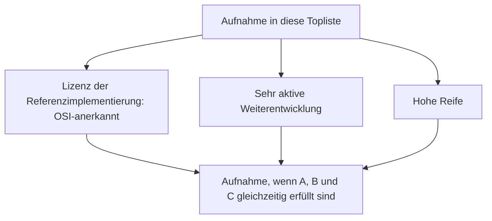
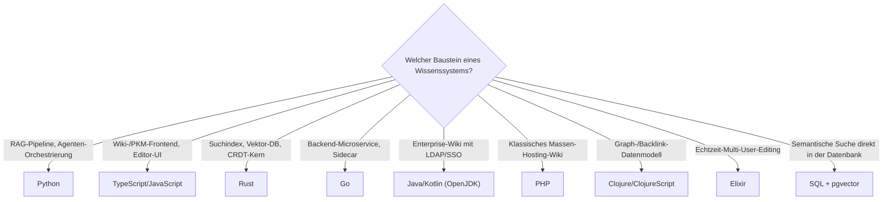

# Programmiersprachen für Wissenssysteme: Lizenz, aktive Weiterentwicklung & hohe Reife — Top-10-Topliste

Die [Beste Programmiersprachen für moderne Wissenssysteme (Top 10)](programmiersprachen-wissenssysteme-topliste.md) rankt Sprachen nach Eignung für RAG-Orchestrierung, Performance und Echtzeit-Kollaboration. Diese Seite wendet zwei der drei Kriterien an, die auch die übrigen Speicherbackend-Toplisten dieser Dokumentation strukturieren — **OSI-anerkannte Lizenz der Referenzimplementierung** und **sehr aktive Weiterentwicklung bei hoher Reife** — auf genau dieselben zehn Sprachen. Das dritte Kriterium, Speicherbackend (PostgreSQL oder Dateiformat), lässt sich auf eine Programmiersprache selbst nicht sinnvoll anwenden und entfällt hier bewusst.

!!! note "Hinweis: Diese Liste verliert keine einzige Sprache — und das ist die eigentliche Erkenntnis"
    Anders als bei den übrigen Speicherbackend-Toplisten dieser Reihe fällt hier kein einziger Kandidat heraus. Das ist kein Zufall: Eine „Top 10 der Sprachen für Wissenssysteme" filtert implizit bereits auf genau die Eigenschaften, die diese Seite explizit prüft — eine Sprache, die es überhaupt erst in eine solche Top-10-Liste schafft, ist praktisch immer OSI-lizenziert, aktiv gepflegt und ausgereift. Der Wert dieser Seite liegt deshalb nicht im Aussortieren, sondern im **expliziten Beleg** dieser Eigenschaften pro Sprache.

---

## Bewertungskriterien

---

## Top 10 im Überblick

| Rang | Sprache | Referenzimplementierung | Lizenz | Aktivität/Reife |
|---|---|---|---|---|
| 1 | **Python** | CPython | PSF License | Extrem aktiv, extrem reif seit 1991 |
| 2 | **TypeScript/JavaScript** | TypeScript-Compiler (Microsoft) / V8 (Google) | Apache-2.0 / BSD-3-Clause | Beide extrem aktiv, TypeScript reif seit 2012, JavaScript seit 1995 |
| 3 | **Rust** | rustc | MIT/Apache-2.0 (Dual-Lizenz) | Extrem aktiv, stabil seit 2015 |
| 4 | **Go** | Go-Toolchain (Google) | BSD-3-Clause | Sehr aktiv, reif seit 2009 |
| 5 | **Java/Kotlin** | OpenJDK / Kotlin-Compiler (JetBrains) | GPL-2.0 mit Classpath-Exception / Apache-2.0 | Beide sehr aktiv, Java reif seit 1995, Kotlin seit 2011 |
| 6 | **PHP** | Zend Engine | PHP License (OSI-anerkannt) | Regelmäßige jährliche Major-Releases, reif seit 1995 |
| 7 | **C#/.NET** | .NET-Runtime & Roslyn-Compiler (Microsoft) | MIT | Sehr aktiv seit vollständiger Öffnung 2014, reif |
| 8 | **Clojure/ClojureScript** | Clojure-Compiler (Cognitect/Community) | EPL-1.0 | Bewusst gemächliche, aber kontinuierliche Release-Kadenz seit 2007 |
| 9 | **Elixir** | Elixir-Compiler (auf BEAM/OTP) | Apache-2.0 | Sehr aktiv, stabil seit 2014 |
| 10 | **SQL** (+ PL/pgSQL) | PostgreSQL-Implementierung | PostgreSQL-Lizenz (OSI-anerkannt) | Extrem aktiv, extrem reif seit 1996 |

---

## Highlights im Detail

### Java/Kotlin: OpenJDK statt Oracle JDK zählt
„Java" ist lizenzrechtlich zweideutig — neben dem quelloffenen OpenJDK (GPL-2.0 mit Classpath-Exception, OSI-anerkannt) vertreibt Oracle auch eine eigene, kommerziell lizenzierte JDK-Distribution. Für diese Topliste zählt ausschließlich die OpenJDK-Referenzimplementierung, auf der praktisch alle in der Basis-Topliste genannten Wissenssystem-Projekte tatsächlich aufbauen.

### Clojure: die einzige Sprache mit bewusst gedrosseltem Tempo
Clojure hält als einzige Sprache dieser Liste keine „sehr aktive" Release-Kadenz im Sinne häufiger Versionssprünge — das Kernteam um Rich Hickey verfolgt explizit einen konservativen, stabilitätsorientierten Release-Rhythmus. Das erfüllt die Reife- und Kontinuitätsanforderung dieser Liste trotzdem vollständig, ähnlich wie DokuWiki oder TiddlyWiki in den produktorientierten Speicherbackend-Toplisten dieser Dokumentation — „aktiv" bedeutet auch hier Kontinuität ohne Wartungslücke, nicht zwingend hohe Versionsfrequenz.

### Warum diese Liste keine einzige Sprache verliert
In allen bisherigen Speicherbackend-Toplisten dieser Reihe (Wiki-Engines, PKM, RAG, Multi-Agenten, Rust-Bausteine, Frameworks) fiel jeweils ein erheblicher Teil der Basisliste heraus — meist wegen proprietärer Lizenz oder eines Pflicht-Zweitbackends. Bei Programmiersprachen tritt dieser Effekt nicht auf, weil bereits die Aufnahme in die ursprüngliche Top-10-Auswahl voraussetzt, dass eine Sprache breit produktiv im Wissenssystem-Bau eingesetzt wird — und das ist ohne offene Lizenz und kontinuierliche Pflege in der Praxis kaum möglich.

---

## Entscheidungshilfe nach Anwendungsfall

---

## 🔗 Verwandte Themen

- [Startseite](../../index.md) — zurück zur Dokumentations-Zentrale
- [Beste Programmiersprachen für moderne Wissenssysteme (Top 10)](programmiersprachen-wissenssysteme-topliste.md) — Basis-Topliste nach RAG-/Performance-/Kollaborationseignung statt Lizenz/Aktivität
- [Evolution und Architekturen digitaler Programmiersprachen für Wissenssysteme](evolution-digitaler-wissenssystem-programmiersprachen.md) — chronologisches Generationenmodell als Hintergrund
- [Produktionsreife Programmiersprachen für Wissenssysteme nach Generation (Top 7)](produktionsreife-wissenssystem-programmiersprachen-generationen-2026-topliste.md) — härtestes Sieb: zusätzlich fünf Jahre, große Neuwahl-Betreiberbasis und sehr große Betriebs-Skala; von diesen 10 fällt Perl (Kontinuität), Clojure und TypeScript werden Grenzfälle
- [Open-Source-Wissenssysteme mit aktiver Weiterentwicklung & hoher Reife (Top 20)](aktive-reife-opensource-wissenssysteme-2026-topliste.md) — dieselben Kriterien für fertige Produkte statt Sprachen
- [Rust-Bausteine für Wissenssysteme mit PostgreSQL-/Dateiformat-Speicherung (Top 15)](rust-wissenssysteme-postgresql-dateiformat-2026-topliste.md) — vertiefend zu Rang 3 auf Bausteinebene
- [Frameworks & Bibliotheken für Wissenssysteme mit PostgreSQL-/Dateiformat-Speicherung (Top 16)](wissenssystem-frameworks-postgresql-dateiformat-2026-topliste.md) — sprachübergreifende Bausteinebene, auf der diese Sprachen typisch eingesetzt werden
- [PostgreSQL + pgvector](../daten/datenbanken/pgvector-anleitung.md) — vertiefend zu Rang 10
- [Rust in der Praxis](../../entwicklung/system/rust-praxis.md) — Praxis-Handbuch zu Rang 3
