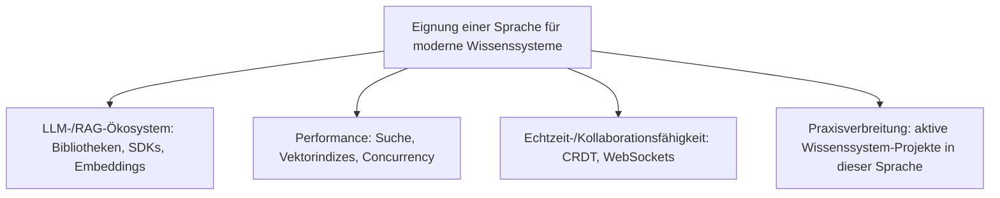
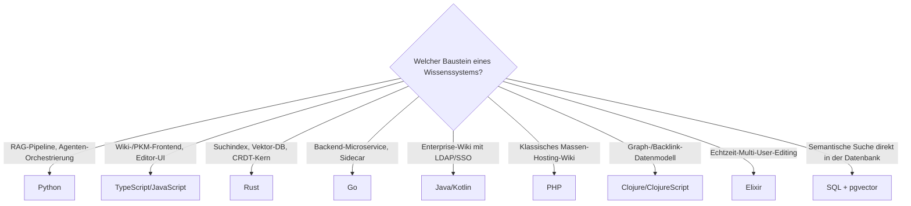

# Beste Programmiersprachen für moderne Wissenssysteme — Top-10-Topliste

Die [Evolution und Architekturen digitaler Programmiersprachen für Wissenssysteme](evolution-digitaler-wissenssystem-programmiersprachen.md) ordnet Sprachökosysteme chronologisch nach Generationen. Diese Seite dreht die Perspektive um: Sie rankt die zehn Sprachen, die **heute (Stand: August 2026)** beim Bau eines neuen Wiki-, PKM-, RAG- oder Agenten-Wissenssystems tatsächlich die erste Wahl sind — unabhängig davon, in welcher historischen Generation sie entstanden. Bewertet wird nach Eignung für die drei zentralen modernen Anforderungen: **LLM-/RAG-Orchestrierung**, **Performance bei Suche & Vektordaten** und **Echtzeit-Kollaboration**.

!!! note "Hinweis: Rang ≠ „beste Sprache allgemein""
    Die Reihenfolge bewertet Eignung **für Wissenssysteme**, nicht Popularität oder Qualität der Sprache generell. Eine Sprache kann in einem anderen Domänenranking (z. B. [Enterprise-Programmiersprachen](../../entwicklung/evolution-digitaler-enterprise-programmiersprachen.md)) anders platziert sein.

---

## Bewertungskriterien

!!! warning "Achtung: Sprachen koexistieren im selben Stack"
    Die meisten modernen Wissenssysteme sind polyglott — ein TypeScript-Frontend spricht mit einem Python-RAG-Backend, das wiederum einen Rust-Suchindex ansteuert. Der Rang einer Sprache beschreibt ihre **typische Rolle**, nicht einen exklusiven Alleinvertretungsanspruch im Stack.

---

## Top 10 im Überblick

| Rang | Sprache | Typsystem | Typische Rolle im Wissenssystem-Stack | Beispielsysteme | Besondere Stärke |
|---|---|---|---|---|---|
| 1 | **Python** | dynamisch (optional: Type Hints) | LLM-/RAG-Orchestrierung, Embedding-Pipelines, Agenten-Frameworks | LangChain, [AnythingLLM](anythingllm-rag-plattform.md)-Backend, [Onyx](onyx-danswer-rag-plattform.md) | Größtes ML-/LLM-SDK-Ökosystem, De-facto-Standard für RAG-Glue-Code |
| 2 | **TypeScript/JavaScript** | statisch (TS) / dynamisch (JS) | Full-Stack PKM- & Wiki-Frontends, Node.js-Backends | [Wiki.js](klassische-wiki-systeme-llm-integration.md), Outline, Logseq-UI | Eine Sprache für Browser + Server, riesiges npm-Ökosystem für Editor-Komponenten |
| 3 | **Rust** | statisch, ownership-basiert | Performance-kritische Suche, Vektorindizes, CRDT-Sync | Tantivy, Qdrant, Meilisearch, [Zensical](evolution-digitaler-rust-wissenssysteme.md#generation-6-rust-im-kern-ki-nativer-docs-as-code-plattformen-ab-2025) | Speichersicherheit ohne GC-Pausen — entscheidend bei latenzkritischer Vektorsuche, siehe [Evolution digitaler Rust-Wissenssysteme](evolution-digitaler-rust-wissenssysteme.md) |
| 4 | **Go** | statisch | Cloud-native Backend-Services, Such-Engines, CLI-Tools | Bleve (Such-Engine), viele selbstgehostete Wissenssystem-Sidecars | Einfache Concurrency (Goroutines), statisch gelinkte Binärdateien, schnelle Kompilierzeit |
| 5 | **Java/Kotlin** | statisch | Enterprise-Wikis, JVM-basierte Such-Engines | [XWiki](xwiki/installieren.md), Confluence, Elasticsearch/Solr (Java-Kern) | Reifste Enterprise-Middleware (LDAP, Servlet-Container), Elasticsearch als De-facto-Suchstandard basiert auf Java |
| 6 | **PHP** | dynamisch | Klassische Wiki-Engines im Massenbetrieb | [MediaWiki](mediawiki/evolution-digitaler-mediawiki.md), [DokuWiki](klassische-wiki-systeme-llm-integration.md#dokuwiki-aichat-ai-agent-plugin) | Größte installierte Basis aller Wiki-Systeme weltweit (Wikipedia), Shared-Hosting-tauglich |
| 7 | **C#/.NET** | statisch | Enterprise-Integration, Microsoft-365-nahe Wissenssysteme | Azure AI Search-Clients, SharePoint-Erweiterungen | Tiefe Integration in Microsoft-Unternehmensumgebungen, ML.NET für lokale Inferenz |
| 8 | **Clojure/ClojureScript** | dynamisch, funktional | Graph-/Datalog-native PKM-Kernlogik | Logseq (Datascript-Engine) | Unveränderliche Datenstrukturen und eingebaute Datalog-Abfragen passen direkt zum Backlink-Wissensgraph-Modell |
| 9 | **Elixir** | dynamisch, funktional (BEAM/OTP) | Echtzeit-Kollaboration bei sehr hoher Concurrency | Phoenix-basierte Realtime-Layer für kollaborative Editoren | BEAM-VM verträgt Millionen leichtgewichtiger Prozesse — ideal für WebSocket-lastige Multi-User-Editing-Sessions |
| 10 | **SQL** (+ PL/pgSQL) | deklarativ | Strukturierte & semantische Abfragen über Wissensbasen | [PostgreSQL + pgvector](../daten/datenbanken/pgvector-anleitung.md), SPARQL-Endpoints in [Semantischem MediaWiki](semantische-mediawiki/smw-sparql-queries.md) | Vektor-Ähnlichkeitssuche und relationale Fakten in derselben Abfragesprache — kein separates Vektor-DB-System nötig |

---

## Entscheidungshilfe nach Anwendungsfall

!!! tip "Tipp: Polyglotter Stack statt Einzelsprache"
    Ein realistisches modernes Wissenssystem kombiniert typischerweise Rang 1–3: **Python** für die RAG-/Agenten-Schicht, **TypeScript** für das Frontend, **Rust** für den performancekritischen Suchkern — siehe dieses Muster bereits umgesetzt bei [Onyx](onyx-danswer-rag-plattform.md) (Python-Backend, TypeScript-Frontend) und Zensical (Rust-Kern, Python-Konfigurationsschicht) als Referenz dieses Repositories, siehe [Generation 6 der Rust-Wissenssysteme-Zeitachse](evolution-digitaler-rust-wissenssysteme.md#generation-6-rust-im-kern-ki-nativer-docs-as-code-plattformen-ab-2025).

---

## 🔗 Verwandte Themen

- [Startseite](../../index.md) — zurück zur Dokumentations-Zentrale
- [Evolution und Architekturen digitaler Programmiersprachen für Wissenssysteme](evolution-digitaler-wissenssystem-programmiersprachen.md) — chronologisches Generationenmodell, dessen aktuellen Stand diese Topliste zusammenfasst
- [Programmiersprachen für Wissenssysteme: Lizenz, Aktivität & Reife (Top 10)](programmiersprachen-wissenssysteme-aktive-reife-topliste.md) — dieselben zehn Sprachen, geprüft nach Lizenz der Referenzimplementierung und Entwicklungsaktivität statt RAG-/Performance-Eignung
- [Evolution und Architekturen digitaler Rust-Wissenssysteme](evolution-digitaler-rust-wissenssysteme.md) — vertiefend zu Rang 3
- [Evolution und Architekturen digitaler PKM-Wissensgraphen & Block-Editoren](evolution-digitaler-pkm-wissensgraphen.md) — vertiefend zu Rang 8 (Logseq/Clojure)
- [PostgreSQL + pgvector](../daten/datenbanken/pgvector-anleitung.md) — vertiefend zu Rang 10
- [Rust in der Praxis](../../entwicklung/system/rust-praxis.md) — Praxis-Handbuch zu Rang 3
- [Die führenden Open-Source-Wissenssysteme 2026 (Top 20)](fuehrende-opensource-wissenssysteme-2026-topliste.md) — produktorientiertes Pendant zu dieser sprachorientierten Topliste
- [Beste Wissensmanagement-Systeme (Open Source) mit MCP-Server (Top 20)](wissensmanagement-mcp-server-topliste.md) — produktorientierte Nachbar-Topliste
- [Onyx (ehem. Danswer): RAG-Plattform](onyx-danswer-rag-plattform.md) — Beispiel für den polyglotten Python/TypeScript-Stack aus Rang 1/2
- [Beste Programmiersprachen für Enterprise-Software (Top 10)](../../entwicklung/enterprise-programmiersprachen-topliste.md) — analoges Ranking-Thema für allgemeine Unternehmenssoftware statt Wissenssysteme im Speziellen
