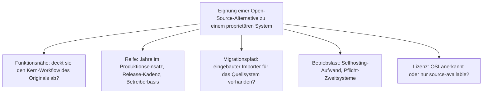
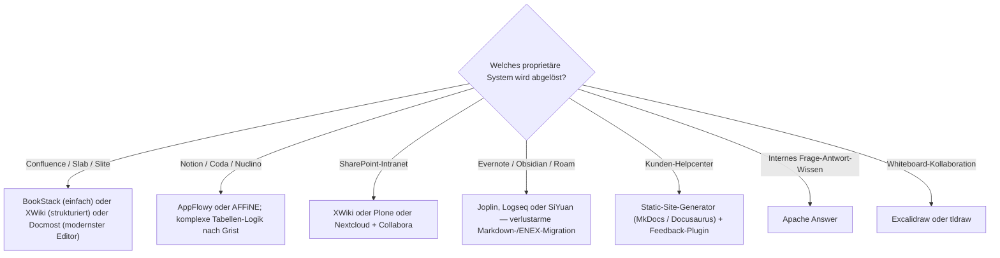

# Alternativen zu proprietären Wissensmanagement-Systemen — Top-15-Topliste

Die [führenden Open-Source-Wissenssysteme 2026](fuehrende-opensource-wissenssysteme-2026-topliste.md) ranken das quelloffene Feld für sich; die [Migrationswege-Topliste](migrationswege-wissenssysteme-topliste.md) bewertet den technischen Umzugsaufwand. Diese Seite setzt davor an: Sie ordnet den **15 verbreitetsten proprietären Wissensmanagement-Systemen** jeweils die tragfähigste quelloffene Alternative zu — mit ehrlicher Angabe, wo die Alternative funktional (noch) nicht heranreicht.

!!! note "Hinweis: „Open Source" hier im OSI-Sinn"
    Als Alternative zählt bevorzugt, was unter einer **OSI-anerkannten Lizenz** steht (MIT, GPL, LGPL, AGPL, BSD, Apache-2.0). Source-available-Systeme wie **Outline** (Business Source License) werden genannt, aber als solche gekennzeichnet — konsistent mit den [Lizenz-Sonderfällen der MCP-Topliste](wissensmanagement-mcp-server-topliste.md#lizenz-sonderfall).

---

## Bewertungskriterien

---

## Die 15 proprietären Systeme und ihre Open-Source-Alternativen

| # | Proprietäres System | Kategorie | Beste Open-Source-Alternative(n) | Lizenz | Migrationspfad |
|---|---|---|---|---|---|
| 1 | **Confluence** (Atlassian) | Team- & Enterprise-Wiki | **BookStack**, **XWiki**, **Wiki.js**, **Docmost** | MIT / LGPL-2.1 / AGPL-3.0 | XWiki & Wiki.js & Docmost haben Confluence-Importer; Space-/Rechte-Mapping ist der eigentliche Aufwand |
| 2 | **Notion** | All-in-One-Workspace | **AppFlowy**, **AFFiNE**, **Docmost** | AGPL-3.0 / MIT | Markdown-/CSV-Export aus Notion; Datenbank-Relations lassen sich nicht 1:1 übertragen |
| 3 | **Microsoft SharePoint / Viva** | Intranet & Dokumenten-Management | **XWiki**, **Plone**, **Nextcloud** (+ Collabora) | LGPL-2.1 / GPL-2.0 / AGPL-3.0 | Kein direkter Importer; Umzug über Datei-Export + Struktur-Neuaufbau, hoher Aufwand |
| 4 | **Guru** | Verifizierte Karten-Wissensbasis | **BookStack** (+ Review-Prozess), **Onyx** (für den Suchfall) | MIT | API-Export aus Guru; der „Verification"-Workflow muss organisatorisch nachgebaut werden |
| 5 | **Slab** | Slack-nahes Team-Wiki | **Docmost**, **BookStack**, **Outline** (BSL) | AGPL-3.0 / MIT / *BSL* | Markdown-Export; Docmost kommt dem Editor-Erlebnis am nächsten |
| 6 | **Slite** | Team-Docs mit KI-Assistent | **Docmost**, **AppFlowy** | AGPL-3.0 | Markdown-Export; KI-Assistent separat (z. B. via [Dify](dify-agenten-workflow-plattform.md)) ergänzen |
| 7 | **Nuclino** | Leichtgewichtiges Wiki mit Graph-Ansicht | **AFFiNE**, **Logseq**, **SiYuan** | MIT / AGPL-3.0 | Markdown-Export; Graph-Ansicht ist bei Logseq/SiYuan Kernfunktion |
| 8 | **Coda** | Doc + No-Code-App-Builder | **AppFlowy**, **AFFiNE**, **Grist** (Tabellen-Logik) | AGPL-3.0 / MIT / Apache-2.0 | Hoher Aufwand — Formeln, Automationen und „Packs" müssen neu modelliert werden |
| 9 | **Obsidian** (lokal, aber proprietär) | Personal Knowledge Management | **Logseq**, **SiYuan**, **Trilium Notes**, **SilverBullet** | AGPL-3.0 / AGPL-3.0 / AGPL-3.0 / MIT | Sehr gering — alle arbeiten auf lokalen Markdown-Dateien; nur das Plugin-Ökosystem ist kleiner |
| 10 | **Evernote** | Notizen & Web-Clipping | **Joplin**, **Trilium Notes**, **Notesnook** | MIT / AGPL-3.0 / GPL-3.0 | Joplin & Trilium haben eingebaute Evernote-Importer (ENEX) |
| 11 | **Roam Research** | Netzwerk-Notizen / Outliner | **Logseq**, **SiYuan** | AGPL-3.0 | Logseq ist der bewusste offene Roam-Nachbau; Roam-JSON-Import via Community-Skripte |
| 12 | **GitBook** (Hosted) | Doku-Publishing | **MkDocs** (Material), **Docusaurus**, **Starlight**, **HonKit** | BSD-2-Clause / MIT | Markdown-Export; GitBook-Legacy-CLI entspricht direkt HonKit |
| 13 | **Document360 / KnowledgeOwl / Helpjuice** | Kunden-Helpcenter / KB | **BookStack**, **MkDocs** (+ Feedback-Plugin), **Docusaurus** | MIT / BSD-2-Clause / MIT | HTML-/Markdown-Export; Analytics- und Feedback-Widgets separat nachrüsten |
| 14 | **Stack Overflow for Teams** | Internes Frage-Antwort-Wissen | **Apache Answer**, **Question2Answer**, **Discourse** (Q&A-Modus) | Apache-2.0 / GPL-2.0 / GPL-2.0 | Apache Answer hat einen Stack-Overflow-for-Teams-Importer |
| 15 | **Miro / Confluence Whiteboards** | Visuelle Kollaboration | **Excalidraw**, **tldraw**, **AFFiNE** (Whiteboard) | MIT / MIT / MIT | Kaum migrierbar — Boards im Zielsystem neu aufbauen (siehe [„Struktur ist nicht Text"](migrationswege-wissenssysteme-topliste.md)) |

---

## Kategorien-Muster

### Der Confluence-Cluster (1, 4, 5, 6): reifste Alternativen-Auswahl
Für das klassische Team-Wiki gibt es die dichteste Auswahl reifer, OSI-lizenzierter Alternativen. **BookStack** (MIT, seit 2015) ist die risikoärmste Wahl mit der niedrigsten Einstiegshürde, **XWiki** (LGPL, seit 2003) die Wahl bei strukturierten Datenfeldern und tiefer Rechteverwaltung. **Docmost** (AGPL) ist funktional am nächsten am modernen Confluence-Editor, aber erst seit 2024 — vor dem Produktivstart die Roadmap prüfen.

### Der Notion-Cluster (2, 7, 8): die schwierigste Migration
**AppFlowy** (AGPL, Rust/Flutter) und **AFFiNE** (MIT) zielen bewusst auf Notion, erreichen 2026 aber noch nicht dessen Politur bei Datenbank-Views, Relations und Formeln. Wer Notion primär als Dokument-Tool nutzt, migriert leicht; wer die relationalen Datenbanken intensiv nutzt, hat ein Modellierungs-, kein Transport-Problem.

### Der Helpcenter-Cluster (13): Docs-as-Code schlägt KB-SaaS
Die Kunden-Wissensbasis lässt sich fast immer auf einen [Static-Site-Generator](static-site-generatoren-2026-topliste.md) plus Feedback-Plugin umstellen — mit dem Nebeneffekt, dass der Content danach versionierbar und agenten-lesbar im Git-Repo liegt ([LLM-Wiki-Pattern](llm-wiki-pattern-karpathy.md)).

### Der Q&A-Cluster (14): eigene Kategorie
Internes Frage-Antwort-Wissen ist kein Wiki — **Apache Answer** (Apache-2.0, aktiv entwickelt) ist hier 2026 die erste quelloffene Wahl, mit dediziertem Importer für Stack Overflow for Teams.

### Der PKM-Cluster (9, 10, 11): Migration ist ein Kopiervorgang
Wo das Quellsystem lokale Markdown-Dateien nutzt (**Obsidian**) oder ein offenes Export-Format hat (**Evernote** ENEX, **Roam** JSON), ist der Wechsel zu **Logseq**, **SiYuan** oder **Joplin** verlustarm und in Stunden statt Wochen erledigt.

---

## Wo die Open-Source-Alternative (noch) nicht heranreicht

| Proprietäres System | Funktionslücke der offenen Alternative | Praktische Umgehung |
|---|---|---|
| **Confluence** | WYSIWYG-Parität, Jira-Verknüpfung, Marketplace-App-Tiefe | XWiki-Makros bzw. BookStack + eigene Integrationen |
| **Notion** | Datenbank-Views, Relations, Rollups, Automationen | AppFlowy deckt Grundfälle; komplexe Logik in **Grist** auslagern |
| **SharePoint** | Microsoft-365-Integration, Compliance-Zertifizierungen (eDiscovery) | Nextcloud + Collabora für die Office-Nähe, Compliance separat prüfen |
| **Guru** | „Trust/Verified"-Workflow, Browser-Extension im Arbeitskontext | Review-Pflicht organisatorisch + Content-Ablaufdaten in BookStack |
| **Coda** | Formel-Engine, Packs-Ökosystem | Hoher Neuaufbau-Aufwand — Migration nur bei klarem Nutzen |
| **Stack Overflow for Teams** | Reife des Reputations-/Badge-Systems | Apache Answer deckt den Kern; Gamification ist schlanker |
| **Miro** | Echtzeit-Skalierung auf sehr großen Boards, Vorlagen-Galerie | tldraw/Excalidraw für kleine Teams; große Boards aufteilen |

!!! warning "Achtung: Momentaufnahme, Stand August 2026"
    Besonders die jungen Notion-/Confluence-Alternativen (**AppFlowy**, **AFFiNE**, **Docmost**) entwickeln sich schnell. Vor einer Entscheidung aktuelle Release-Historie, Importer-Stand und — bei AGPL-Systemen mit kommerziellem Sponsor — die Lizenz-Roadmap prüfen.

---

## Entscheidungshilfe

!!! tip "Tipp: Erst den Kern-Workflow testen, dann migrieren"
    Vor dem Content-Umzug eine Woche mit einer kleinen Redaktionsgruppe im Kandidatensystem arbeiten — mit **echten** Aufgaben, nicht mit Testdaten. Die meisten gescheiterten Migrationen scheitern nicht am Datentransport (siehe [Migrationswege-Topliste](migrationswege-wissenssysteme-topliste.md)), sondern an einem im SaaS selbstverständlichen Workflow, den die offene Alternative anders löst.

---

## 🔗 Verwandte Themen

- [Startseite](../../index.md) — zurück zur Dokumentations-Zentrale
- [Die führenden Open-Source-Wissenssysteme 2026 (Top 20)](fuehrende-opensource-wissenssysteme-2026-topliste.md) — das quelloffene Feld für sich gerankt
- [Migrationswege zwischen Wissenssystemen (Top 20)](migrationswege-wissenssysteme-topliste.md) — technischer Umzugsaufwand und Export-/Import-Reife der Zielsysteme
- [Open-Source-Wissenssysteme mit aktiver Weiterentwicklung & hoher Reife (Top 20)](aktive-reife-opensource-wissenssysteme-2026-topliste.md) — strengere Reife-Sicht auf dieselben Alternativen
- [Produktionsreife Open-Source-Wissenssysteme nach Generation (Top 12)](produktionsreife-wissenssysteme-generationen-2026-topliste.md) — konservatives Fünf-Filter-Sieb
- [Beste Wiki-Engines 2026 (Top 20)](wiki-engines-2026-topliste.md) · [Beste PKM-Wissensgraphen & Block-Editoren 2026 (Top 20)](pkm-wissensgraphen-2026-topliste.md) — Vertiefung der jeweiligen Kategorie
- [Klassische Wissensmanagement-, KB- & CMS-Systeme mit LLM-Integration](klassische-wissensmanagement-cms-llm-integration.md) — dieselben Systeme unter dem KI-Integrations-Blickwinkel
- [Personal Knowledge Management (PKM) & Second Brain](pkm-second-brain-methoden.md) — methodischer Hintergrund zum PKM-Cluster
