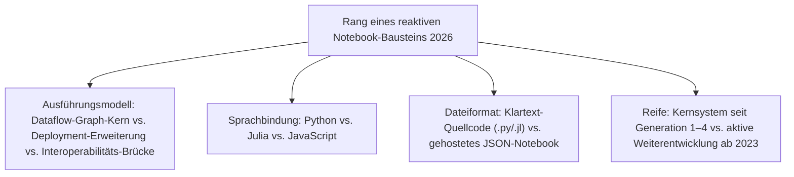
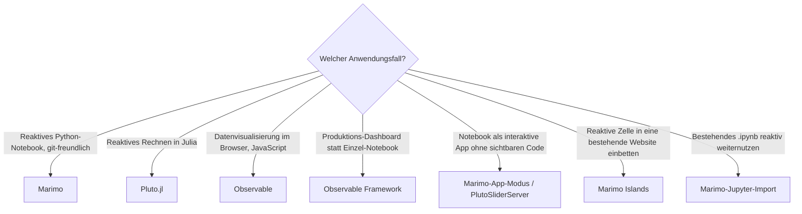

# Beste reaktive Notebooks 2026 — Top-10-Topliste

Die [Evolution und Architekturen digitaler Reaktiver Notebooks](evolution-digitaler-reaktive-notebooks.md) ordnet diese Kategorie chronologisch nach Architektur-Generation — von der Erkenntnis des Hidden-State-Problems klassischer Jupyter-Notebooks über Observables Dataflow-Runtime und Pluto.jl für Julia bis zu Marimo für Python und reaktiven Notebooks als eigenständigem App-Deployment-Ziel. Diese Seite übersetzt die Chronologie in eine **Momentaufnahme 2026**: 10 Systeme und Bausteine, mit denen automatische, versteckte-Zustands-freie Zellneuberechnung heute tatsächlich betrieben wird.

!!! note "Hinweis: die kleinste Kategorie im Notebook-Cluster"
    Reaktive Notebooks bleiben 2026 bewusst eine Nische neben dem weiterhin dominanten `.ipynb`-Ökosystem, siehe [Generation 6 der Reaktive-Notebooks-Zeitachse](evolution-digitaler-reaktive-notebooks.md#generation-6-koexistenz-statt-ablosung-ab-2023). [Beste Notebook-Systeme 2026](notebook-systeme-2026-topliste.md) rankt bereits die drei Kernsysteme (Marimo, Pluto.jl, Observable) innerhalb der Gesamtliste — diese Seite ergänzt sieben weitere Bausteine und Erweiterungen aus demselben, überschaubaren Ökosystem, statt die Liste künstlich auf 20 Einträge zu strecken.

---

## Bewertungskriterien

!!! warning "Achtung: reaktiv ≠ Ersatz für klassisches Jupyter"
    Keines dieser Systeme strebt an, `.ipynb` und die dahinterstehende [IPython-/Jupyter-Infrastruktur](ipython-jupyter-2026-topliste.md) zu verdrängen — automatische Dataflow-Neuberechnung löst gezielt das Hidden-State-Problem, verlangt dafür aber ein Notebook-Design ohne beliebige manuelle Zellreihenfolge. **Stand: August 2026.**

---

## Top 10 im Überblick

| Rang | System/Baustein | Generation | Sprache | Besondere Stärke |
|---|---|---|---|---|
| 1 | **Marimo** | 4 (Marimo — reaktive Python-Notebooks als reine .py-Dateien) | Python | Speichert das gesamte Notebook als reine `.py`-Datei statt JSON, dadurch git-diff-freundlich und direkt als reguläres Python-Modul importierbar — führendes reaktives Notebook-System 2026 |
| 2 | **Pluto.jl** | 3 (Pluto.jl — Reaktivität für wissenschaftliches Rechnen) | Julia | Referenzimplementierung für Reaktivität im wissenschaftlichen Rechnen, inklusive integrierter Paketverwaltung pro Notebook-Datei |
| 3 | **Observable** | 1c (Observable — erstes reaktives Notebook) | JavaScript | Erstes breit genutztes reaktives Notebook, von D3.js-Schöpfer Mike Bostock — weiterhin stärkste Verbreitung für Datenvisualisierung im Browser |
| 4 | **Observable Runtime** (`@observablehq/runtime`) | 2 (Der Dataflow-Graph als Kernarchitektur) | JavaScript | Berechnet aus Variablenreferenzen zwischen Zellen den Abhängigkeitsgraphen — technisches Fundament, auf dem Observable-Notebooks laufen |
| 5 | **Observable Framework** | Ergänzung 2026 | JavaScript | Open-Source-Static-Site-Generator für Datenanwendungen vom selben Team — löst gehostete Einzel-Notebooks für Produktions-Dashboards ab |
| 6 | **Marimo-App-Modus** | 5 (Reaktive Notebooks als App-Deployment-Ziel) | Python | Rendert dasselbe Notebook wahlweise als Entwicklungsansicht mit sichtbarem Code oder als bereinigte, interaktive App-Oberfläche |
| 7 | **PlutoSliderServer** | Ergänzung 2026 | Julia | Leichtgewichtiger Server, der interaktive Pluto.jl-Notebooks mit Live-Slider-Steuerung ausliefert, ohne vollständige Julia-Session pro Nutzer |
| 8 | **Observable Plot** | Ergänzung 2026 | JavaScript | D3-basierte Grammar-of-Graphics-Visualisierungsbibliothek, Standardwerkzeug innerhalb von Observable-Notebooks |
| 9 | **Marimo Islands** | Ergänzung 2026 | Python | Bettet einzelne reaktive Marimo-Zellen per WebAssembly direkt in statische Websites/Dokumentationsseiten ein |
| 10 | **Marimo-Jupyter-Import** | 6 (Koexistenz statt Ablösung) | Python | Erlaubt den Import bestehender `.ipynb`-Dateien in das reaktive Marimo-Format statt eines kompletten Neustarts |

---

## Highlights im Detail

### Rang 1–3: drei Sprachen, ein gemeinsames Grundprinzip
Marimo, Pluto.jl und Observable lösen alle dasselbe Grundproblem — eine Zelle kann Zustand hinterlassen, den eine spätere Zelle stillschweigend voraussetzt — durch einen Dataflow-Graphen statt linearer Ausführung, jeweils für eine eigene Sprach-Community, siehe [Generation 1 der Reaktive-Notebooks-Zeitachse](evolution-digitaler-reaktive-notebooks.md#generation-1-das-hidden-state-problem-wird-erkannt-2011-2018).

### Rang 4–5, 8: das Observable-Ökosystem wächst über das ursprüngliche Notebook hinaus
Observable Runtime, Observable Framework und Observable Plot zeigen, dass sich das Observable-Team seit der ursprünglichen Notebook-Plattform (Rang 3) zunehmend auf produktionstaugliche Datenanwendungen statt reiner Einzeldokumente verlagert.

### Rang 6–7, 9: die Deployment-Schicht der beiden Kernsysteme
Marimo-App-Modus, PlutoSliderServer und Marimo Islands zeigen dasselbe Grundmuster aus zwei unabhängigen Ökosystemen: Weil Zellreihenfolge und Datenfluss bei reaktiven Notebooks bereits eindeutig definiert sind, lässt sich dasselbe Notebook ohne separates Dashboard-Tool direkt als interaktive Anwendung ausliefern, siehe [Generation 5](evolution-digitaler-reaktive-notebooks.md#generation-5-reaktive-notebooks-als-app-deployment-ziel-ab-2023).

---

## Entscheidungshilfe nach Anwendungsfall

!!! tip "Tipp: klassische Kernel-Frontend-Architektur separat prüfen"
    Wer keinen Bruch mit dem etablierten `.ipynb`-Format will, findet die passenderen Kandidaten in [Beste IPython- & Jupyter-Systeme 2026](ipython-jupyter-2026-topliste.md); den generationenübergreifenden Gesamtüberblick bietet [Beste Notebook-Systeme 2026](notebook-systeme-2026-topliste.md).

---

## 🔗 Verwandte Themen

- [Startseite](../../index.md) — zurück zur Dokumentations-Zentrale
- [Evolution und Architekturen digitaler Reaktiver Notebooks](evolution-digitaler-reaktive-notebooks.md) — chronologisches Generationenmodell, dessen aktuellen Stand diese Topliste zusammenfasst
- [Reaktive Notebooks mit PostgreSQL-/Dateiformat-Speicherung (Top 9)](reaktive-notebooks-postgresql-dateiformat-2026-topliste.md) — dieselbe Kategorie, strenger gefiltert nach Lizenz, Speicherbackend und Entwicklungsaktivität
- [Produktionsreife Open-Source-Reaktive-Notebooks nach Generation (Top 1)](produktionsreife-reaktive-notebooks-generationen-2026-topliste.md) — dieselben Kriterien plus Skala- und Kontinuitätsfilter, sortiert nach Generation
- [Beste Notebook-Systeme 2026 (Top 20)](notebook-systeme-2026-topliste.md) — Gesamtmarkt-Topliste über alle sechs Notebook-Generationen hinweg
- [Beste IPython- & Jupyter-Systeme 2026 (Top 20)](ipython-jupyter-2026-topliste.md) — Vorgänger-Architektur, deren Hidden-State-Problem diese Kategorie adressiert
- [Beste Rust-Bausteine für Notebooks 2026 (Top 10)](rust-notebooks-2026-topliste.md) — wasm-bindgen/wasm-pack dort als geteiltes WASM-Fundament, u. a. für Marimos Browser-Modus
- [Evolution und Architekturen digitaler KI-nativer Notebook-Umgebungen](evolution-digitaler-ki-native-notebooks.md) — nachfolgende Generation
