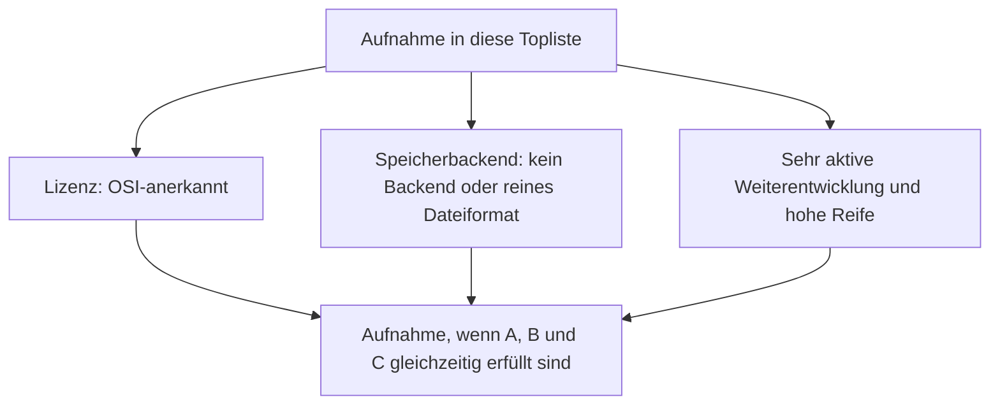
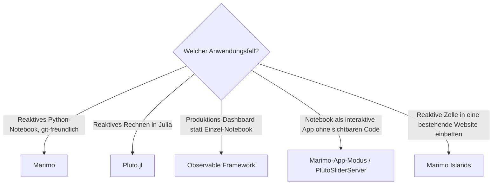

# Reaktive Notebooks mit PostgreSQL- oder Dateiformat-Speicherung, aktiver Weiterentwicklung & hoher Reife — Top-9-Topliste

Die [Beste reaktive Notebooks 2026 (Top 10)](reaktive-notebooks-2026-topliste.md) rankt die kleine, überschaubare Kategorie der Dataflow-Graph-Notebooks unabhängig von Lizenz. Diese Seite wendet die inzwischen etablierten strengeren Kriterien an — nur OSI-Open-Source, Persistenz ausschließlich in PostgreSQL oder einem reinen Dateiformat, sehr aktive Weiterentwicklung, hohe Reife.

!!! note "Hinweis: Nur ein einziger Kandidat fällt heraus"
    Von den zehn Systemen der Basis-Topliste ist genau ein Eintrag betroffen — **Observable**, die gehostete Notebook-Plattform selbst, ist ein proprietäres SaaS-Produkt (Observable Inc.). Die drei eigenständigen Open-Source-Bausteine desselben Teams — Observable Runtime, Observable Framework und Observable Plot — bleiben davon unberührt und stehen weiterhin in dieser Liste.

---

## Bewertungskriterien

---

## Top 9 im Überblick

| Rang | System/Baustein | Sprache | Lizenz | Speicherbackend |
|---|---|---|---|---|
| 1 | **Marimo** | Python | Apache-2.0 | Reine `.py`-Datei, kein Datenbankserver |
| 2 | **Pluto.jl** | Julia | MIT | Reine `.jl`-Datei |
| 3 | **Observable Runtime** (`@observablehq/runtime`) | JavaScript | ISC | Kein Backend — reine Laufzeitbibliothek |
| 4 | **Observable Framework** | JavaScript | ISC | Reines Dateiformat (Static-Site-Generator) |
| 5 | **Marimo-App-Modus** | Python | Apache-2.0 | Reine `.py`-Datei |
| 6 | **PlutoSliderServer** | Julia | MIT | Reine `.jl`-Datei |
| 7 | **Observable Plot** | JavaScript | ISC | Kein Backend — Visualisierungsbibliothek |
| 8 | **Marimo Islands** | Python | Apache-2.0 | Reine `.py`-Datei, WASM-Export |
| 9 | **Marimo-Jupyter-Import** | Python | Apache-2.0 | Reine `.py`-Datei |

---

## Highlights im Detail

### Observable: eine Plattform proprietär, drei Bausteine offen
Der einzige Ausschluss dieser Liste zeigt ein interessantes Muster: Die kommerzielle Hosting-Plattform observablehq.com ist proprietär, aber das Team hat die technischen Kernbausteine — den Dataflow-Runtime-Kern, den Static-Site-Generator für Datenanwendungen und die Visualisierungsbibliothek — konsequent unter einer permissiven Open-Source-Lizenz (ISC) veröffentlicht. Wer Observable-Prinzipien selbst hosten will, kann auf Observable Framework aufsetzen, ohne die SaaS-Plattform zu nutzen.

### Marimo dominiert diese Liste zahlenmäßig
Vier der neun Ränge (Marimo, Marimo-App-Modus, Marimo Islands, Marimo-Jupyter-Import) gehören zu einem einzigen Projekt — ein Beleg dafür, wie stark sich das reaktive-Notebook-Ökosystem 2026 um Marimo als führenden Python-Vertreter konsolidiert hat, während Pluto.jl die entsprechende Rolle für Julia einnimmt.

---

## Entscheidungshilfe nach Anwendungsfall

---

## 🔗 Verwandte Themen

- [Startseite](../../index.md) — zurück zur Dokumentations-Zentrale
- [Beste reaktive Notebooks 2026 (Top 10)](reaktive-notebooks-2026-topliste.md) — Basis-Topliste ohne Lizenz-/Speicherbackend-Filter
- [Produktionsreife Open-Source-Reaktive-Notebooks nach Generation (Top 1)](produktionsreife-reaktive-notebooks-generationen-2026-topliste.md) — dieselben Kriterien plus Skala- und Kontinuitätsfilter, sortiert nach Generation statt nach Rang — dort besteht nur Pluto.jl
- [IPython- & Jupyter-Systeme mit PostgreSQL-/Dateiformat-Speicherung (Top 20)](ipython-jupyter-postgresql-dateiformat-2026-topliste.md) — Vorgänger-Architektur, deren Hidden-State-Problem diese Kategorie adressiert
- [R-Markdown- & Quarto-Werkzeuge mit PostgreSQL-/Dateiformat-Speicherung](rmarkdown-quarto-postgresql-dateiformat-2026-topliste.md) — Schwester-Kategorie im Notebook-Cluster
- [Open-Source-Wissenssysteme mit PostgreSQL- oder Dateiformat-Speicherung (Top 22)](postgresql-dateiformat-wissenssysteme-2026-topliste.md) — dieselben Speicherkriterien für die breitere Wissenssysteme-Klasse
