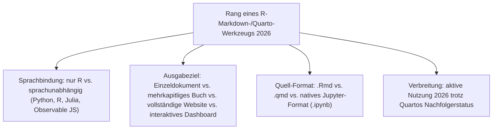
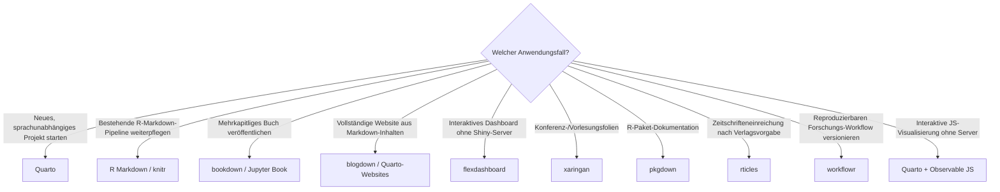

# Beste R-Markdown- & Quarto-Werkzeuge 2026 — Top-15-Topliste

Die [Evolution und Architekturen digitaler R-Markdown- & Quarto-Publishing-Systeme](evolution-digitaler-rmarkdown-quarto.md) ordnet diese Kategorie chronologisch nach Architektur-Generation — von Sweave über knitr und R Markdown selbst, Buch- und Website-Publishing, Enterprise-Reporting bis zu Quarto als sprachunabhängigem Nachfolger und der Konvergenz mit dem Jupyter-Ökosystem. Diese Seite übersetzt die Chronologie in eine **Momentaufnahme 2026**: 15 Werkzeuge, mit denen reproduzierbare Berichte, Bücher, Websites und wissenschaftliche Publikationen aus R-Markdown- und Quarto-Quelldateien heute tatsächlich gebaut werden.

!!! note "Hinweis: kleinerer, aber tieferer Kreis als bei Cloud-Notebooks oder Jupyter"
    Anders als das breite Cloud-Notebook- oder Kernel-Ökosystem bleibt die R-Markdown-/Quarto-Welt überwiegend im Posit-Umfeld (vormals RStudio) konzentriert — [Beste Notebook-Systeme 2026](notebook-systeme-2026-topliste.md) rankt daher nur drei Vertreter (Quarto, R Markdown, Jupyter Book) innerhalb der Gesamtliste. Diese Seite geht dort in die Tiefe und ergänzt sieben aktuelle Werkzeuge, die in der historischen Chronologie selbst nicht einzeln benannt sind.

---

## Bewertungskriterien

!!! warning "Achtung: R Markdown ist nicht abgekündigt"
    Quarto führt diese Liste als aktueller Standard, aber R Markdown wird von Posit weiterhin aktiv gepflegt und bleibt in bestehenden Enterprise-Reporting-Pipelines die größere installierte Basis — Migration auf Quarto ist empfohlen für neue Projekte, aber kein erzwungener Bruch. **Stand: August 2026.**

---

## Top 15 im Überblick

| Rang | Werkzeug | Generation | Besondere Stärke |
|---|---|---|---|
| 1 | **Quarto** | 4 (Quarto löst R Markdown als sprachunabhängiger Nachfolger ab) | Sprachunabhängiger Nachfolger von R Markdown, rendert Python, R, Julia und Observable JS im selben Dokument — aktueller Publishing-Standard bei Posit |
| 2 | **R Markdown** (`rmarkdown`-Paket) | 1c (R Markdown wird eigenständiges Format) | Etablierter Enterprise-Reporting-Standard mit der größten installierten Basis im R-Ökosystem, trotz Quarto weiterhin aktiv gepflegt |
| 3 | **knitr** | 1b (knitr löst Sweave ab) | Chunk-Engine, auf der sowohl R Markdown als auch weite Teile von Quartos R-Rendering aufbauen |
| 4 | **bookdown** | 2 (bookdown & blogdown — Buch- und Website-Publishing) | Verknüpft mehrere R-Markdown-Kapitel zu einem zusammenhängenden Buch mit Querverweisen und Bibliografie |
| 5 | **Jupyter Book** | 5 (Jupyter Book — dieselbe Philosophie für die Jupyter-Welt) | Veröffentlicht `.ipynb`-Sammlungen als durchsuchbares Online-Buch, Sphinx-basiertes Pendant zu bookdown für die Jupyter-Welt |
| 6 | **blogdown** | 2 (bookdown & blogdown — Buch- und Website-Publishing) | Baut vollständige Websites aus R-Markdown-Inhalten auf Basis des Static-Site-Generators Hugo |
| 7 | **flexdashboard** | 3 (R Markdown als Enterprise-Reporting-Standard) | Erzeugt interaktive Dashboards direkt aus R-Markdown-Dokumenten, ohne separate Shiny-Server-Infrastruktur |
| 8 | **xaringan** | Ergänzung 2026 | R-Markdown-basiertes Präsentationsframework auf remark.js-Basis, verbreitet für Konferenz- und Vorlesungsfolien im R-Ökosystem |
| 9 | **distill** | Ergänzung 2026 | Wissenschaftliche Artikel- und Blog-Publishing-Vorlage, direkter konzeptioneller Vorläufer von Quartos Website-Rendering |
| 10 | **pkgdown** | Ergänzung 2026 | Baut R-Paket-Dokumentations-Websites aus Roxygen-Kommentaren und R-Markdown-Vignetten |
| 11 | **rticles** | Ergänzung 2026 | Sammlung von R-Markdown-Vorlagen für Zeitschrifteneinreichungen nach Verlagsvorgaben |
| 12 | **workflowr** | Ergänzung 2026 | Git-integrierter, reproduzierbarer Forschungs-Workflow auf R-Markdown-Basis, verbreitet in der Bioinformatik |
| 13 | **Quarto Pub** | 4 (Ergänzung 2026) | Kostenloses Hosting für Quarto-Websites direkt aus der Quarto-CLI heraus, ohne eigene Infrastruktur |
| 14 | **Quarto + Observable JS** | 4 (Ergänzung 2026) | Native Einbettung interaktiver JavaScript-Visualisierungen ohne separaten Server, direkt im `.qmd`-Dokument |
| 15 | **Typst-Backend in Quarto** | 4 (Ergänzung 2026) | Moderne PDF-Rendering-Alternative zu LaTeX, deutlich schnellere Kompilierzeiten bei wissenschaftlichen Dokumenten |

---

## Highlights im Detail

### Rang 1–3: der aktuelle Kern — Quarto, R Markdown, knitr
Quarto führt als sprachunabhängiger Nachfolger, doch beide Vorgänger bleiben aktiv relevant: R Markdown wegen seiner installierten Enterprise-Basis, knitr als tatsächlich ausführende Chunk-Engine dahinter, siehe [Generation 1 der R-Markdown-/Quarto-Zeitachse](evolution-digitaler-rmarkdown-quarto.md#generation-1-von-sweave-zu-r-markdown-2002-2014).

### Rang 4–7: die Publishing-Zielformate der klassischen R-Markdown-Linie
bookdown, Jupyter Book, blogdown und flexdashboard zeigen die vier Grundziele jenseits des Einzeldokuments — Buch, Website, Dashboard —, wobei Jupyter Book dieselbe Philosophie eigenständig für die Jupyter- statt R-Welt umsetzt, siehe [Generation 2 und 5](evolution-digitaler-rmarkdown-quarto.md#generation-2-bookdown-blogdown-buch-und-website-publishing-2016).

### Rang 8–12: das R-Markdown-Ökosystem jenseits der benannten Chronologie
xaringan, distill, pkgdown, rticles und workflowr begründen keine eigene Architektur-Generation, decken aber reale, häufig genutzte Anwendungsfälle ab — Präsentationen, wissenschaftliche Websites, Paketdokumentation, Zeitschrifteneinreichungen und reproduzierbare Forschungs-Pipelines.

### Rang 13–15: Quartos aktive Weiterentwicklung seit 2022
Quarto Pub, die native Observable-JS-Integration und der Typst-Backend zeigen, dass Quarto sich seit seiner Veröffentlichung nicht auf den reinen R-Markdown-Nachfolgestatus beschränkt, sondern eigenständig neue Publishing-Fähigkeiten ergänzt, die R Markdown selbst nie hatte.

---

## Entscheidungshilfe nach Anwendungsfall

!!! tip "Tipp: Jupyter- und Notebook-Gesamtperspektive separat prüfen"
    Wer primär im klassischen Kernel-Frontend-Ökosystem statt in der Publishing-Pipeline arbeitet, findet die passenderen Kandidaten in [Beste IPython- & Jupyter-Systeme 2026](ipython-jupyter-2026-topliste.md); den generationenübergreifenden Gesamtüberblick bietet [Beste Notebook-Systeme 2026](notebook-systeme-2026-topliste.md).

---

## 🔗 Verwandte Themen

- [Startseite](../../index.md) — zurück zur Dokumentations-Zentrale
- [Evolution und Architekturen digitaler R-Markdown- & Quarto-Publishing-Systeme](evolution-digitaler-rmarkdown-quarto.md) — chronologisches Generationenmodell, dessen aktuellen Stand diese Topliste zusammenfasst
- [R-Markdown- & Quarto-Werkzeuge mit PostgreSQL-/Dateiformat-Speicherung (Top 13)](rmarkdown-quarto-postgresql-dateiformat-2026-topliste.md) — dieselbe Kategorie, geprüft nach Lizenz, Speicherbackend und Entwicklungsaktivität
- [Beste Notebook-Systeme 2026 (Top 20)](notebook-systeme-2026-topliste.md) — Gesamtmarkt-Topliste über alle sechs Notebook-Generationen hinweg
- [Beste IPython- & Jupyter-Systeme 2026 (Top 20)](ipython-jupyter-2026-topliste.md) — Schwester-Zeitachse, konvergiert in Generation 6 dieser Kategorie
- [Beste Cloud-Notebook-Plattformen 2026 (Top 20)](cloud-notebooks-2026-topliste.md) — Databricks Notebooks dort mit R-Markdown-Unterstützung im Enterprise-Kontext
- [Evolution und Architekturen digitaler Notebook-Vorläufer](evolution-digitaler-notebook-vorlaeufer.md) — Sweave als Ursprung von Generation 1 dieser Kategorie
- [Evolution und Architekturen digitaler Docs-as-Code](evolution-digitaler-docs-as-code.md) — direkte Schnittmenge bei Hugo (blogdown) und Sphinx (Jupyter Book)
