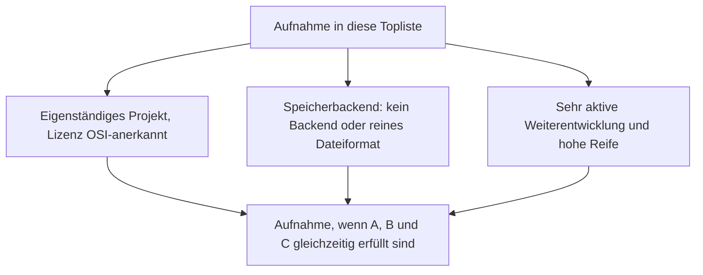
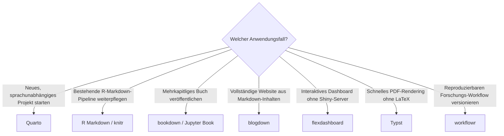

# R-Markdown- & Quarto-Werkzeuge mit PostgreSQL- oder Dateiformat-Speicherung, aktiver Weiterentwicklung & hoher Reife — Top-13-Topliste

Die [Beste R-Markdown- & Quarto-Werkzeuge 2026 (Top 15)](rmarkdown-quarto-2026-topliste.md) rankt Publishing-Werkzeuge für reproduzierbare Berichte, Bücher und Websites unabhängig von Lizenz. Diese Seite wendet die inzwischen etablierten strengeren Kriterien an — nur OSI-Open-Source, Persistenz ausschließlich in PostgreSQL oder einem reinen Dateiformat, sehr aktive Weiterentwicklung, hohe Reife.

!!! note "Hinweis: Fast das gesamte Ökosystem qualifiziert sich"
    Alle Kernwerkzeuge dieser Kategorie sind quelloffen und dateibasiert — R-Markdown-/Quarto-Publishing ist von Grund auf ein Klartext-zu-Dokument-Workflow ohne Datenbankdienst. Zwei Einträge der Basis-Topliste sind allerdings keine eigenständigen Produkte, sondern Funktionen innerhalb von Quarto selbst (siehe unten), und ein dritter, unabhängig lizenzierter Baustein wurde entsprechend direkt als eigenständiges Projekt aufgenommen.

---

## Bewertungskriterien

!!! warning "Achtung: zwei Basis-Einträge sind keine eigenständigen Produkte"
    „Quarto Pub" (kostenloses Hosting direkt aus der Quarto-CLI) und „Quarto + Observable JS" (native Einbettung, ein Feature von Quarto selbst) besitzen keine eigene Lizenz oder Speicherarchitektur getrennt von Quarto — sie sind hier durch **Typst** ersetzt, das eigentliche unabhängige Open-Source-Projekt hinter dem in Quarto integrierten PDF-Rendering-Backend.

---

## Top 13 im Überblick

| Rang | Werkzeug | Lizenz | Speicherbackend | Besonderheit |
|---|---|---|---|---|
| 1 | **Quarto** | MIT | Reines Dateiformat (`.qmd`) | Sprachunabhängiger Nachfolger von R Markdown, sehr aktiv |
| 2 | **R Markdown** (`rmarkdown`-Paket) | GPL-3.0 | Reines Dateiformat (`.Rmd`) | Größte installierte Basis im R-Ökosystem, weiterhin aktiv gepflegt |
| 3 | **knitr** | GPL-3.0 | Reines Dateiformat | Chunk-Engine hinter R Markdown und Quartos R-Rendering |
| 4 | **bookdown** | GPL-3.0 | Reines Dateiformat | Mehrkapitliges Buch-Publishing mit Querverweisen |
| 5 | **Jupyter Book** | BSD-3-Clause | Reines Dateiformat (`.ipynb`/MyST) | Sphinx-basiertes Pendant zu bookdown für die Jupyter-Welt |
| 6 | **blogdown** | MIT | Reines Dateiformat | Baut Websites aus R-Markdown auf Basis von Hugo |
| 7 | **flexdashboard** | MIT | Reines Dateiformat | Interaktive Dashboards ohne separate Shiny-Server-Infrastruktur |
| 8 | **Typst** | Apache-2.0 | Reines Dateiformat | Moderne, deutlich schnellere PDF-Rendering-Alternative zu LaTeX, extrem aktiv |
| 9 | **xaringan** | MIT | Reines Dateiformat | Präsentationsframework auf remark.js-Basis |
| 10 | **distill** | Apache-2.0 | Reines Dateiformat | Wissenschaftliche Artikel-/Blog-Vorlage, Vorläufer von Quartos Website-Rendering |
| 11 | **pkgdown** | MIT | Reines Dateiformat | R-Paket-Dokumentations-Websites aus Roxygen-Kommentaren |
| 12 | **rticles** | MIT | Reines Dateiformat | R-Markdown-Vorlagen für Zeitschrifteneinreichungen |
| 13 | **workflowr** | GPL-3.0 | Reines Dateiformat (Git) | Git-integrierter, reproduzierbarer Forschungs-Workflow |

---

## Highlights im Detail

### Typst statt „Quarto + Observable JS" und „Quarto Pub"
Diese Liste tauscht zwei Zeilen der Basis-Topliste, die genau genommen keine eigenständigen Produkte sind, gegen den tatsächlich unabhängigen Baustein dahinter: Typst ist ein eigenständiges Open-Source-Satzsystem (Apache-2.0), das Quarto als eines von mehreren PDF-Rendering-Backends einbindet — mit deutlich kürzeren Kompilierzeiten als der klassische LaTeX-Pfad.

### Ein Ökosystem, das die Speicherkriterien praktisch geschenkt bekommt
Wie schon bei den [IPython-/Jupyter-Systemen](ipython-jupyter-postgresql-dateiformat-2026-topliste.md) liegt der Grund für die geringe Ausschlussquote in der Natur der Kategorie selbst: R-Markdown- und Quarto-Werkzeuge sind von Grund auf Compiler für Klartext-Quelldateien zu Dokumenten — ein Datenbankdienst kommt in diesem Workflow architektonisch gar nicht vor.

---

## Entscheidungshilfe nach Anwendungsfall

---

## 🔗 Verwandte Themen

- [Startseite](../../index.md) — zurück zur Dokumentations-Zentrale
- [Beste R-Markdown- & Quarto-Werkzeuge 2026 (Top 15)](rmarkdown-quarto-2026-topliste.md) — Basis-Topliste ohne Lizenz-/Speicherbackend-Filter
- [IPython- & Jupyter-Systeme mit PostgreSQL-/Dateiformat-Speicherung (Top 20)](ipython-jupyter-postgresql-dateiformat-2026-topliste.md) — Schwester-Kategorie, konvergiert bei Jupyter Book
- [Reaktive Notebooks mit PostgreSQL-/Dateiformat-Speicherung (Top 9)](reaktive-notebooks-postgresql-dateiformat-2026-topliste.md) — Schwester-Kategorie im Notebook-Cluster
- [Open-Source-Wissenssysteme mit PostgreSQL- oder Dateiformat-Speicherung (Top 22)](postgresql-dateiformat-wissenssysteme-2026-topliste.md) — dieselben Speicherkriterien für die breitere Wissenssysteme-Klasse
