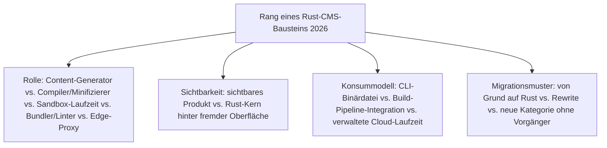
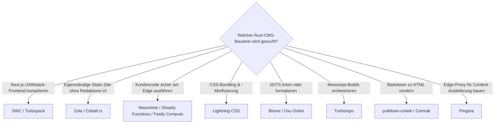

# Beste Rust-Bausteine für CMS 2026 — Top-15-Topliste

Die [Evolution und Architekturen digitaler Rust-CMS](evolution-digitaler-rust-cms.md) verfolgt Rust als **quer zu allen fünf Generationen von Content-Management-Systemen liegende Implementierungsachse** — nicht als eigene CMS-Produktklasse. Diese Seite übersetzt diese Achse in eine **Momentaufnahme 2026**: 15 Rust-Bausteine, mit denen Static-Site-Generatoren, JavaScript-/CSS-Build-Toolchains, WASM-Edge-Sandboxes und Content-Auslieferung für CMS-Frontends heute tatsächlich gebaut werden.

!!! note "Hinweis: Bausteine, nicht Endprodukte"
    Wie schon bei [Beste Headless-CMS 2026](headless-cms-2026-topliste.md) rankt diese Seite **Entwickler-Bausteine**, keine fertigen CMS-Produkte — die meisten dieser Rust-Kerne laufen unsichtbar hinter einem Next.js-, Parcel- oder Cloudflare-Namen, siehe [Sichtbarkeit für Redakteure und Entwickler](evolution-digitaler-rust-cms.md#2-sichtbarkeit-fur-redakteure-und-entwickler). Diese Liste ergänzt außerdem fünf grundlegende, in der Chronologie nicht einzeln benannte Rust-Werkzeuge (Oxc/Oxlint, Rolldown, Turborepo, pulldown-cmark, Comrak), die an denselben Build- und Content-Pipelines mitwirken.

---

## Bewertungskriterien

---

## Top 15 im Überblick

| Rang | Baustein | Generation | Rolle | Besondere Stärke |
|---|---|---|---|---|
| 1 | **SWC** | 2 (JS-Build-Toolchain für Headless-/JAMstack-Frontends) | Compiler/Minifizierer | Standard-Kompilierungs-Engine seit Next.js 12, größte Rust-Reichweite überhaupt im CMS-Umfeld — praktisch jede Next.js-basierte Headless-CMS-Frontend-Instanz nutzt SWC |
| 2 | **Turbopack** | 4 (Bundler & Linter) | Bundler | Rust-Nachfolge-Bundler von Webpack-Schöpfer Tobias Koppers, seit Next.js 15 stabiler Standard-Bundler |
| 3 | **Zola** | 1 (Rust-native Static-Site-Generatoren) | Content-Generator | Eigenständige Binärdatei ohne Laufzeitabhängigkeiten, sichtbares Produkt statt verstecktem Kern |
| 4 | **Wasmtime** (Bytecode Alliance) | 3 (WASM-Edge-Laufzeiten für Composable-/MACH-Commerce) | Sandbox-Laufzeit | Technisches WASM-Fundament, auf dem Shopify Functions und Fastly Compute aufbauen |
| 5 | **Pingora** (Cloudflare) | 5 (Edge-Proxy-Layer für KI-gestützte Content-Auslieferung) | Edge-Proxy | Ersetzt intern große Teile der NGINX-Infrastruktur, trägt Content-Auslieferung vieler DXP-/Composable-CMS-Setups |
| 6 | **Lightning CSS** | 2 (JS-Build-Toolchain für Headless-/JAMstack-Frontends) | Compiler/Minifizierer | Rust-CSS-Parser, -Bundler und -Minifizierer, integriert in Parcel 2 |
| 7 | **Biome** (Fork von Rome) | 4 (Bundler & Linter) | Linter/Formatter | Community-Fork nach Einstellung von Rome, etablierter Rust-Linter/Formatter für JS/TS |
| 8 | **Shopify Functions** | 3 (WASM-Edge-Laufzeiten für Composable-/MACH-Commerce) | Sandbox-Laufzeit | Sichtbarste Produktionsanwendung von Rust/WASM im Commerce — Checkout-/Rabattlogik als Rust-Code |
| 9 | **Fastly Compute** (vormals Compute@Edge) | 3 (WASM-Edge-Laufzeiten für Composable-/MACH-Commerce) | Sandbox-Laufzeit | Edge-Compute-Plattform mit Rust als First-Class-Sprache, häufig für Personalisierung am CDN-Edge |
| 10 | **Cobalt.rs** | 1 (Rust-native Static-Site-Generatoren) | Content-Generator | Einer der ersten Static-Site-Generatoren überhaupt in Rust, nach Jekyll-Vorbild |
| 11 | **Oxc / Oxlint** | Infrastruktur (quer zu allen Generationen) | Linter/Parser | Schnell wachsende Rust-JS/TS-Toolchain, zunehmend als Alternative zu Biome in JAMstack-Frontends eingesetzt |
| 12 | **Rolldown** (VoidZero) | Infrastruktur (quer zu allen Generationen) | Bundler | Rust-Bundler-Kern für Vite, entwickelt vom Vite-Schöpfer-Team als künftiger Vite-Standard-Bundler |
| 13 | **Turborepo** (Vercel) | Infrastruktur (quer zu allen Generationen) | Build-Orchestrierung | Von Go zu Rust umgeschriebener Monorepo-Build-Orchestrator, verbreitet in großen Headless-CMS-/JAMstack-Monorepos |
| 14 | **pulldown-cmark** | Infrastruktur (quer zu allen Generationen) | Markdown-Parser | CommonMark-Referenzimplementierung in Rust, Fundament von Zola, mdBook und vieler weiterer Rust-Content-Tools |
| 15 | **Comrak** | Infrastruktur (quer zu allen Generationen) | Markdown-Parser | GitHub-Flavored-Markdown-Parser in Rust, u. a. Basis der docs.rs-Rendering-Pipeline |

---

## Highlights im Detail

### Rang 1–2: Next.js als Rust-Trojanisches-Pferd
SWC und Turbopack erreichen die mit Abstand größte Verbreitung dieser Liste, ohne dass die meisten Redakteure oder selbst viele Entwickler es bewusst wahrnehmen — beide sind Standardbestandteil von Next.js, der häufigsten Frontend-Wahl für Headless-CMS-Setups aus [Generation 2 der CMS-Zeitachse](evolution-digitaler-cms.md#generation-2-headless-decoupled-cms-api-first-ca-2015-2021).

### Rang 4, 8–9: WASM-Sandbox als Composable-Commerce-Fundament
Wasmtime bildet das technische Fundament, auf dem Shopify Functions und Fastly Compute aufsetzen — alle drei zusammen zeigen das charakteristische Muster von [Generation 3](evolution-digitaler-rust-cms.md#generation-3-wasm-edge-laufzeiten-fur-composable-mach-commerce-2019-2022): eine in Rust geschriebene Sandbox-Laufzeit, die häufig auch selbst in Rust geschriebenen Kundencode sicher am Edge ausführt.

### Rang 11–15: die unsichtbare Ergänzungs-Infrastruktur
Oxc/Oxlint, Rolldown, Turborepo, pulldown-cmark und Comrak tauchen in der Evolution-Chronologie selbst nicht als eigenständige Generation auf, weil sie **keine** CMS-spezifischen Bausteine sind — sie liegen eine Ebene tiefer in der allgemeinen JS-Toolchain- bzw. Markdown-Parser-Infrastruktur, auf der mehrere der explizit benannten Systeme und Frameworks aufbauen.

---

## Entscheidungshilfe nach Baustellen-Typ

---

## 🔗 Verwandte Themen

- [Startseite](../../index.md) — zurück zur Dokumentations-Zentrale
- [Evolution und Architekturen digitaler Rust-CMS](evolution-digitaler-rust-cms.md) — chronologisches Generationenmodell, dessen aktuellen Stand diese Topliste zusammenfasst
- [Rust-Bausteine für CMS mit PostgreSQL-/Dateiformat-Speicherung (Top 12)](rust-cms-postgresql-dateiformat-2026-topliste.md) — dieselbe Kategorie, strenger gefiltert nach Lizenz, Speicherbackend und Entwicklungsaktivität
- [Produktionsreife Rust-Bausteine für CMS nach Generation (Top 2)](produktionsreife-rust-cms-generationen-2026-topliste.md) — härtestes Sieb der drei: zusätzlich fünf Jahre Produktion und sehr große Betriebs-Skala; übrig bleiben nur SWC und Wasmtime
- [Beste Rust-Bausteine für Wissenssysteme 2026 (Top 20)](rust-wissenssysteme-2026-topliste.md) — Zola als geteilter Baustein, analoge Topliste derselben Bauteil-Ebene für Wissenssysteme
- [Beste Headless-CMS 2026 (Top 20)](headless-cms-2026-topliste.md) — SWC/Lightning CSS dort im Produktkontext der Next.js-/Parcel-basierten Frontends
- [Beste Composable-CMS & MACH-Systeme 2026 (Top 20)](composable-cms-2026-topliste.md) — Wasmtime/Shopify Functions/Fastly Compute dort im DXP-Produktkontext
- [Beste Static-Site- & Docs-Generatoren 2026 (Top 20)](static-site-generatoren-2026-topliste.md) — Zola und Cobalt.rs dort im generatorübergreifenden Vergleich
- [Rust in der Praxis](../../entwicklung/system/rust-praxis.md) — allgemeine Rust-Werkzeuglandschaft jenseits von CMS
