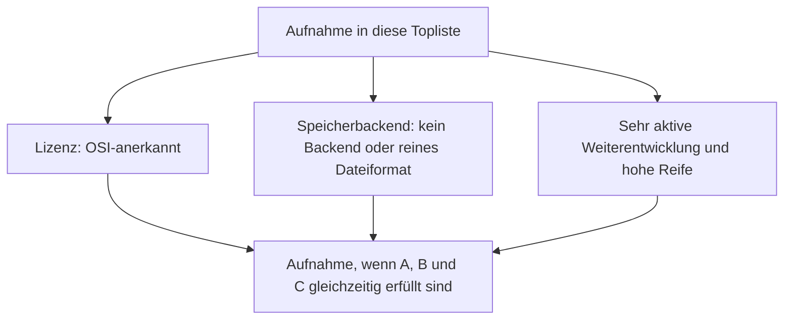
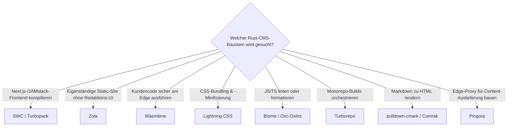

# Rust-Bausteine für CMS mit PostgreSQL- oder Dateiformat-Speicherung, aktiver Weiterentwicklung & hoher Reife — Top-12-Topliste

Die [Beste Rust-Bausteine für CMS 2026 (Top 15)](rust-cms-2026-topliste.md) rankt Entwickler-Bausteine — Compiler, Sandbox-Laufzeiten, Bundler und Content-Generatoren — unabhängig von Lizenz und Speicherarchitektur. Diese Seite wendet die inzwischen etablierten strengeren Kriterien an: nur OSI-Open-Source, Persistenz ausschließlich in PostgreSQL oder einem reinen Dateiformat, sehr aktive Weiterentwicklung, hohe Reife.

!!! note "Hinweis: Die meisten Bausteine haben ohnehin kein eigenes Speicherbackend"
    Wie bereits bei den [Rust-Bausteinen für Wissenssysteme](rust-wissenssysteme-postgresql-dateiformat-2026-topliste.md) besitzen Compiler, Bundler, Linter und Sandbox-Laufzeiten grundsätzlich keine eigene Datenhaltung — sie verarbeiten Code oder Content, den die einbindende Anwendung ihnen übergibt.

---

## Bewertungskriterien

!!! warning "Achtung: Momentaufnahme, Stand August 2026 — bewusst kürzer als 15"
    Von den 15 Bausteinen der [Basis-Topliste](rust-cms-2026-topliste.md) fallen drei heraus: Shopify Functions und Fastly Compute sind proprietäre Cloud-Plattform-Features ohne eigenständigen, selbst hostbaren Quellcode; Cobalt.rs hat gegenüber Zola aus derselben Generation deutlich geringere Aktivität, siehe [Rust-Bausteine für Wissenssysteme, Ausschluss-Abschnitt](rust-wissenssysteme-postgresql-dateiformat-2026-topliste.md).

---

## Top 12 im Überblick

| Rang | Baustein | Rolle | Lizenz | Speicherbackend | Aktivität/Reife |
|---|---|---|---|---|---|
| 1 | **SWC** | Compiler/Minifizierer | Apache-2.0 | Kein Backend | Standard-Kompilierungs-Engine seit Next.js 12, extrem aktiv |
| 2 | **Turbopack** | Bundler | MIT/Apache-2.0 | Kein Backend | Seit Next.js 15 stabiler Standard-Bundler |
| 3 | **Zola** | Content-Generator | MIT | Reines Dateiformat | Single-Binary ohne Laufzeitabhängigkeiten |
| 4 | **Wasmtime** (Bytecode Alliance) | Sandbox-Laufzeit | Apache-2.0 | Kein Backend | Technisches WASM-Fundament, sehr aktiv |
| 5 | **Pingora** (Cloudflare) | Edge-Proxy | Apache-2.0 | Kein Backend | Ersetzt große Teile der NGINX-Infrastruktur intern |
| 6 | **Lightning CSS** | Compiler/Minifizierer | MPL-2.0 | Kein Backend | Integriert in Parcel 2, aktiv |
| 7 | **Biome** (Fork von Rome) | Linter/Formatter | MIT | Kein Backend | Etablierter Community-Fork, sehr aktiv |
| 8 | **Oxc / Oxlint** | Linter/Parser | MIT | Kein Backend | Schnell wachsende Alternative zu Biome |
| 9 | **Rolldown** (VoidZero) | Bundler | MIT | Kein Backend | Künftiger Vite-Standard-Bundler, sehr aktiv |
| 10 | **Turborepo** (Vercel) | Build-Orchestrierung | MIT | Kein Backend | Verbreitet in großen JAMstack-Monorepos |
| 11 | **pulldown-cmark** | Markdown-Parser | MIT | Kein Backend | CommonMark-Referenzimplementierung, Fundament von Zola/mdBook |
| 12 | **Comrak** | Markdown-Parser | BSD-2-Clause | Kein Backend | GitHub-Flavored-Markdown-Parser, Basis der docs.rs-Pipeline |

---

## Highlights im Detail

### SWC & Turbopack: Next.js als Rust-Trojanisches-Pferd
Rang 1–2 erreichen die mit Abstand größte Verbreitung dieser Liste, ohne dass die meisten Entwickler es bewusst wahrnehmen — beide sind Standardbestandteil von Next.js, der häufigsten Frontend-Wahl für Headless-CMS-Setups aus der [Headless-CMS-Speicherbackend-Topliste](headless-cms-postgresql-dateiformat-2026-topliste.md).

### Wasmtime & Pingora: Sandbox und Edge-Proxy ganz ohne Datenhaltung
Beide Bausteine zeigen, dass sich das „kein Pflicht-Backend"-Prinzip auch auf hochkritische Infrastruktur anwenden lässt — Wasmtime führt fremden Code sicher aus, Pingora liefert Content an der Edge aus, keines von beiden hält dabei einen eigenen persistenten Zustand.

---

## Entscheidungshilfe nach Baustellen-Typ

---

## 🔗 Verwandte Themen

- [Startseite](../../index.md) — zurück zur Dokumentations-Zentrale
- [Beste Rust-Bausteine für CMS 2026 (Top 15)](rust-cms-2026-topliste.md) — Basis-Topliste ohne Lizenz-/Speicherbackend-/Aktivitätsfilter
- [Produktionsreife Rust-Bausteine für CMS nach Generation (Top 2)](produktionsreife-rust-cms-generationen-2026-topliste.md) — noch strenger: zusätzlich fünf Jahre Produktion und sehr große Betriebs-Skala, nach Generation sortiert
- [Rust-Bausteine für Wissenssysteme mit PostgreSQL-/Dateiformat-Speicherung (Top 15)](rust-wissenssysteme-postgresql-dateiformat-2026-topliste.md) — Zola als geteilter Baustein, analoge Topliste für Wissenssysteme
- [Headless-CMS mit PostgreSQL-/Dateiformat-Speicherung (Top 9)](headless-cms-postgresql-dateiformat-2026-topliste.md) — SWC/Lightning CSS dort im Produktkontext der Next.js-Frontends
- [Static-Site-Generatoren mit PostgreSQL-/Dateiformat-Speicherung](static-site-generatoren-postgresql-dateiformat-2026-topliste.md) — Zola dort im generatorübergreifenden Vergleich
- [Rust in der Praxis](../../entwicklung/system/rust-praxis.md) — allgemeine Rust-Werkzeuglandschaft jenseits von CMS
