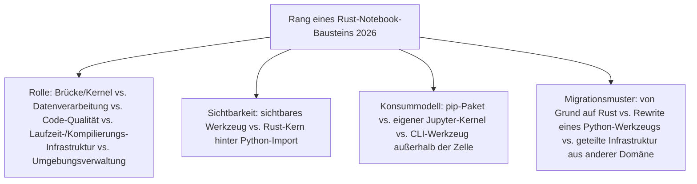
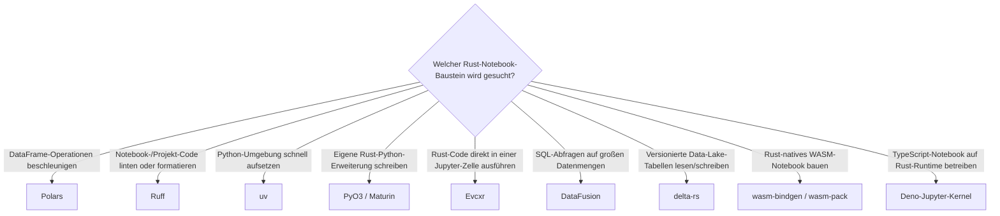

# Beste Rust-Bausteine für Notebooks 2026 — Top-10-Topliste

Die [Evolution und Architekturen digitaler Rust-Notebooks](evolution-digitaler-rust-notebooks.md) verfolgt Rust als **quer zu allen sechs Generationen von Notebook-Systemen liegende Implementierungsachse** — nicht als eigene Notebook-Produktklasse. Diese Seite übersetzt diese Achse in eine **Momentaufnahme 2026**: 10 Rust-Bausteine, mit denen DataFrame-Verarbeitung, Code-Qualitätsprüfung, Umgebungsverwaltung, Python-Rust-Brücken und WASM-Notebook-Kernel heute tatsächlich gebaut werden.

!!! note "Hinweis: Bausteine, nicht Endprodukte"
    Wie schon bei [Beste Rust-Bausteine für CMS 2026](rust-cms-2026-topliste.md) und [Beste Rust-Bausteine für Wissenssysteme 2026](rust-wissenssysteme-2026-topliste.md) rankt diese Seite **Entwickler-Bausteine**, keine fertigen Notebook-Produkte — die meisten dieser Rust-Kerne laufen unsichtbar hinter einem `import polars`, einem `pip install` oder einer Kernel-Auswahl, siehe [Sichtbarkeit für Data Scientists](evolution-digitaler-rust-notebooks.md#2-sichtbarkeit-fur-data-scientists). Anders als bei CMS und Wissenssystemen deckt die Chronologie hier bereits alle zehn Bausteine vollständig ab — diese Liste ergänzt keine zusätzliche, in der Chronologie nicht einzeln benannte Infrastruktur.

---

## Bewertungskriterien

---

## Top 10 im Überblick

| Rang | Baustein | Generation | Rolle | Besondere Stärke |
|---|---|---|---|---|
| 1 | **Polars** | 2 (Maturin & Polars — Rust-Python-Paket-Pipeline reift) | Datenverarbeitung | Rust-native DataFrame-Bibliothek, in tausenden Notebooks direkter `import polars`-Ersatz für Pandas |
| 2 | **Ruff** (Astral) | 4 (Ruff erobert die Python-/Notebook-Tooling-Kette) | Code-Qualität | 10- bis 100-fach schnellerer Linter/Formatter als etablierte Python-Werkzeuge, per Jupyter-/JupyterLab-Erweiterung direkt in Notebook-Zellen nutzbar |
| 3 | **uv** (Astral) | 6 (Rust-gestützte Paket-/Umgebungsverwaltung für KI-native Workflows) | Umgebungsverwaltung | Ersetzt `pip`/`venv`/`conda`, reduziert die Rüstzeit neu gestarteter Notebook-Umgebungen von Minuten auf Sekunden — Grundlage spontan von KI-Agenten gestarteter Sessions |
| 4 | **PyO3** | 1 (Python-Rust-Brücke & erster Rust-Kernel) | Brücke/Kernel | Fundament, auf dem praktisch jede spätere Rust-beschleunigte Python-Bibliothek dieser Liste aufbaut |
| 5 | **Evcxr** | 1 (Python-Rust-Brücke & erster Rust-Kernel) | Brücke/Kernel | Eigener Jupyter-Kernel, führt Rust-Code direkt in Notebook-Zellen aus — trotz Rusts eigentlich statischem Kompilierungsmodell |
| 6 | **Maturin** | 2 (Maturin & Polars — Rust-Python-Paket-Pipeline reift) | Build-/Publish-Werkzeug | Macht „Rust-Bibliothek als `pip`-Paket" zum praktikablen Standardweg, Fundament der Build-Pipeline hinter Polars und Ruff |
| 7 | **DataFusion** (Apache Arrow) | 3 (Rust-native Big-Data-Query-Engines) | Datenverarbeitung | Rust-natives SQL-Query-Engine-Framework, meist eingebettet in größere Datenverarbeitungs-Notebooks statt als eigenständiges Produkt genutzt |
| 8 | **delta-rs** | 3 (Rust-native Big-Data-Query-Engines) | Datenverarbeitung | Rust-Implementierung des Delta-Lake-Tabellenformat-Protokolls, direkter Notebook-Zugriff auf versionierte Data-Lake-Tabellen ohne JVM-Abhängigkeit |
| 9 | **wasm-bindgen / wasm-pack** | 5 (Rust-WASM-Tooling für browserbasierte reaktive Notebooks) | Laufzeit-/Kompilierungs-Infrastruktur | Kompiliert Rust-Code zu WebAssembly für Rust-native WASM-Notebook-Kernel, dieselbe Bytecode-Alliance-nahe Infrastruktur wie Wasmtime |
| 10 | **Deno-Jupyter-Kernel** | 5 (Rust-WASM-Tooling für browserbasierte reaktive Notebooks) | Laufzeit-/Kompilierungs-Infrastruktur | Nativer Jupyter-Kernel-Support für Deno — TypeScript-Notebooks laufen damit auf einer Rust-gestützten Runtime statt Node.js |

---

## Highlights im Detail

### Rang 1–3: die spürbaren Geschwindigkeitsgewinne im Notebook-Alltag
Polars, Ruff und uv sind die einzigen drei Bausteine dieser Liste, deren Rust-Herkunft Data Scientists tatsächlich als konkreten Geschwindigkeitssprung erleben, ohne selbst Rust zu schreiben oder eine Kernel-Auswahl zu treffen — ein einfacher `import`, `pip install` oder Editor-Aufruf genügt, siehe [Generation 2, 4 und 6 der Rust-Notebook-Zeitachse](evolution-digitaler-rust-notebooks.md).

### Rang 4–6: die unsichtbare Brücken- und Build-Infrastruktur aus Generation 1–2
PyO3, Evcxr und Maturin tauchen selbst kaum in einer Notebook-Zelle sichtbar auf, tragen aber die gesamte Pipeline: PyO3 als FFI-Fundament, Maturin als Build-/Publish-Werkzeug, Evcxr als eigenständiger Kernel für Rust-Notebooks selbst — siehe [Generation 1: Die Python-Rust-Brücke & der erste Rust-Kernel](evolution-digitaler-rust-notebooks.md#generation-1-die-python-rust-brucke-der-erste-rust-kernel-2017-2018).

### Rang 9–10: geteilte WASM-Infrastruktur aus Generation 5
wasm-bindgen/wasm-pack und der Deno-Jupyter-Kernel nutzen dieselbe Bytecode-Alliance-nahe WASM-Toolchain, die auch [Generation 3 der Rust-CMS-Zeitachse](evolution-digitaler-rust-cms.md#generation-3-wasm-edge-laufzeiten-fur-composable-mach-commerce-2019-2022) antreibt — anders als Marimos vollständiger Browser-Modus, der über die separate, Rust-freie Pyodide/Emscripten-Toolchain läuft, siehe [Generation 5: Rust-WASM-Tooling](evolution-digitaler-rust-notebooks.md#generation-5-rust-wasm-tooling-ermoglicht-browserbasierte-reaktive-notebooks-2023).

---

## Entscheidungshilfe nach Baustellen-Typ

---

## 🔗 Verwandte Themen

- [Startseite](../../index.md) — zurück zur Dokumentations-Zentrale
- [Evolution und Architekturen digitaler Rust-Notebooks](evolution-digitaler-rust-notebooks.md) — chronologisches Generationenmodell, dessen aktuellen Stand diese Topliste zusammenfasst
- [Beste Notebook-Systeme 2026 (Top 20)](notebook-systeme-2026-topliste.md) — Produktebene, zu der diese Bausteine unsichtbar beitragen
- [Beste Rust-Bausteine für CMS 2026 (Top 15)](rust-cms-2026-topliste.md) — wasm-bindgen/wasm-pack dort im Wasmtime-Kontext, analoge Topliste derselben Bauteil-Ebene für CMS
- [Beste Rust-Bausteine für Wissenssysteme 2026 (Top 20)](rust-wissenssysteme-2026-topliste.md) — Polars/DataFusion als geteilte Bausteine, analoge Topliste derselben Bauteil-Ebene für Wissenssysteme
- [Evolution und Architekturen digitaler Reaktiver Notebooks](evolution-digitaler-reaktive-notebooks.md) — vertiefendes Generationenmodell zu Generation 5, in dem WASM-Tooling primär zum Einsatz kommt
- [Evolution und Architekturen digitaler KI-nativer Notebook-Umgebungen](evolution-digitaler-ki-native-notebooks.md) — vertiefendes Generationenmodell zu Generation 6, in dem uv primär zum Einsatz kommt
- [Rust in der Praxis](../../entwicklung/system/rust-praxis.md) — allgemeine Rust-Werkzeuglandschaft jenseits von Notebooks
