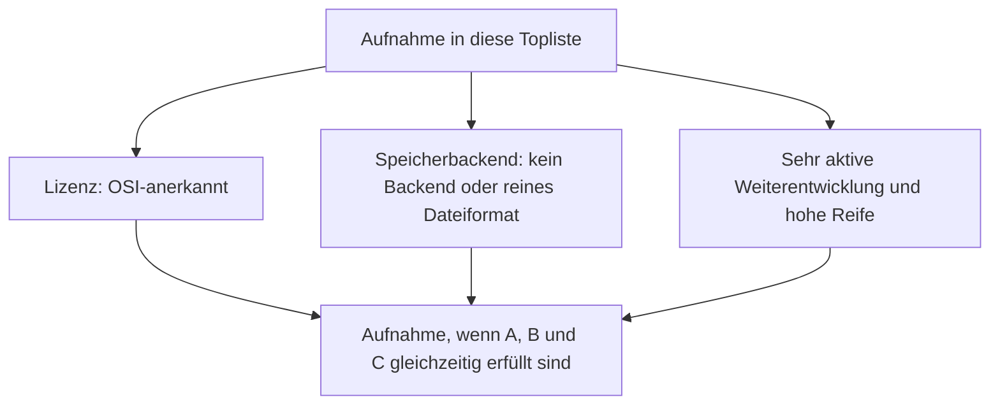
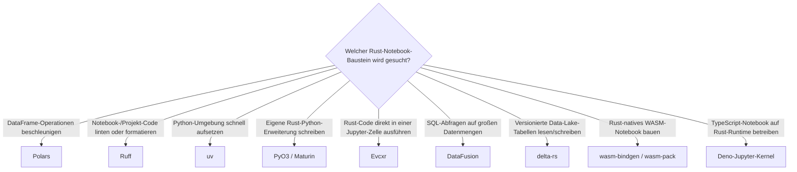

# Rust-Bausteine für Notebooks mit PostgreSQL- oder Dateiformat-Speicherung, aktiver Weiterentwicklung & hoher Reife — Top-10-Topliste

Die [Beste Rust-Bausteine für Notebooks 2026 (Top 10)](rust-notebooks-2026-topliste.md) rankt Entwickler-Bausteine — DataFrame-Verarbeitung, Code-Qualitätsprüfung, Umgebungsverwaltung, Python-Rust-Brücken und WASM-Notebook-Kernel — unabhängig von Lizenz und Speicherarchitektur. Diese Seite wendet die inzwischen etablierten strengeren Kriterien an: nur OSI-Open-Source, Persistenz ausschließlich in PostgreSQL oder einem reinen Dateiformat, sehr aktive Weiterentwicklung, hohe Reife.

!!! note "Hinweis: Diese Liste verliert keinen einzigen Baustein"
    Wie schon bei den [IPython-/Jupyter-Systemen](ipython-jupyter-postgresql-dateiformat-2026-topliste.md) und den [Static-Site-Generatoren](static-site-generatoren-postgresql-dateiformat-2026-topliste.md) fällt hier nichts heraus — Rust-Entwickler-Bausteine sind praktisch durchgängig unter MIT oder Apache-2.0 lizenziert und besitzen selbst keine eigene Datenhaltung, die ein Pflicht-Backend erzwingen könnte. Der Wert dieser Seite liegt im expliziten Beleg, nicht im Aussortieren.

---

## Bewertungskriterien

---

## Top 10 im Überblick

| Rang | Baustein | Rolle | Lizenz | Speicherbackend |
|---|---|---|---|---|
| 1 | **Polars** | Datenverarbeitung | MIT | Kein Backend — arbeitet auf Parquet-/CSV-/Arrow-Dateien |
| 2 | **Ruff** (Astral) | Code-Qualität | MIT | Kein Backend |
| 3 | **uv** (Astral) | Umgebungsverwaltung | MIT | Kein Backend — arbeitet auf lokalen venv-/Lockfile-Dateien |
| 4 | **PyO3** | Brücke/Kernel | Apache-2.0/MIT | Kein Backend |
| 5 | **Evcxr** | Brücke/Kernel | MIT | Kein Backend |
| 6 | **Maturin** | Build-/Publish-Werkzeug | Apache-2.0/MIT | Kein Backend |
| 7 | **DataFusion** (Apache Arrow) | Datenverarbeitung | Apache-2.0 | Kein Backend — arbeitet auf Arrow-/Parquet-Dateien |
| 8 | **delta-rs** | Datenverarbeitung | Apache-2.0 | Reines Dateiformat (Parquet + Transaktionslog) |
| 9 | **wasm-bindgen / wasm-pack** | Laufzeit-/Kompilierungs-Infrastruktur | MIT/Apache-2.0 | Kein Backend |
| 10 | **Deno-Jupyter-Kernel** | Laufzeit-/Kompilierungs-Infrastruktur | MIT | Kein Backend |

---

## Highlights im Detail

### Eine ganze Bauteil-Ebene, die die Speicherkriterien praktisch geschenkt bekommt
Wie schon bei den [Rust-Bausteinen für Wissenssysteme](rust-wissenssysteme-postgresql-dateiformat-2026-topliste.md) und den [Rust-Bausteinen für CMS](rust-cms-postgresql-dateiformat-2026-topliste.md) bestätigt sich dasselbe Muster: Entwickler-Bibliotheken ohne eigene Endnutzer-Oberfläche haben selten Grund, eine eigene Datenbank zu erzwingen — sie verarbeiten, was das Notebook oder die Pipeline ihnen übergibt, und geben Dateien oder In-Memory-Strukturen zurück.

### delta-rs: das einzige System dieser Liste mit echtem Dateiformat-Anspruch
Während die übrigen neun Bausteine schlicht kein Speicherbackend besitzen, implementiert delta-rs bewusst ein **versioniertes** Dateiformat — Parquet-Datendateien plus ein Transaktionslog, das Zeitreisen und ACID-Garantien direkt auf Objektspeicher-/Dateisystem-Ebene ermöglicht, ganz ohne separaten Datenbankserver.

---

## Entscheidungshilfe nach Baustellen-Typ

---

## 🔗 Verwandte Themen

- [Startseite](../../index.md) — zurück zur Dokumentations-Zentrale
- [Beste Rust-Bausteine für Notebooks 2026 (Top 10)](rust-notebooks-2026-topliste.md) — Basis-Topliste ohne Lizenz-/Speicherbackend-Filter
- [IPython- & Jupyter-Systeme mit PostgreSQL-/Dateiformat-Speicherung (Top 20)](ipython-jupyter-postgresql-dateiformat-2026-topliste.md) — Produktebene, zu der diese Bausteine unsichtbar beitragen
- [Rust-Bausteine für CMS mit PostgreSQL-/Dateiformat-Speicherung (Top 12)](rust-cms-postgresql-dateiformat-2026-topliste.md) — wasm-bindgen/wasm-pack dort im Wasmtime-Kontext, analoge Topliste derselben Bauteil-Ebene
- [Rust-Bausteine für Wissenssysteme mit PostgreSQL-/Dateiformat-Speicherung (Top 15)](rust-wissenssysteme-postgresql-dateiformat-2026-topliste.md) — Polars/DataFusion als geteilte Bausteine
- [Reaktive Notebooks mit PostgreSQL-/Dateiformat-Speicherung (Top 9)](reaktive-notebooks-postgresql-dateiformat-2026-topliste.md) — wasm-bindgen/wasm-pack dort im WASM-Notebook-Kontext
- [Rust in der Praxis](../../entwicklung/system/rust-praxis.md) — allgemeine Rust-Werkzeuglandschaft jenseits von Notebooks
