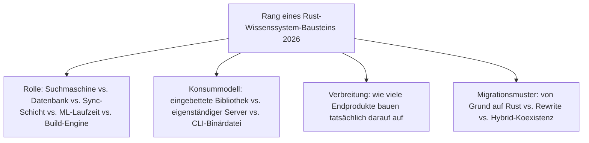
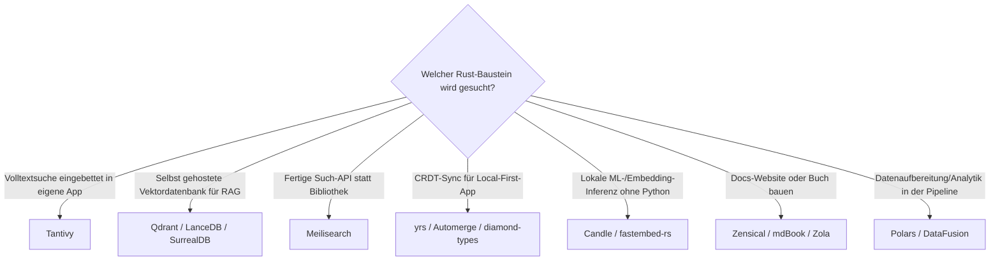

# Beste Rust-Bausteine für Wissenssysteme 2026 — Top-20-Topliste

Die [Evolution und Architekturen digitaler Rust-Wissenssysteme](evolution-digitaler-rust-wissenssysteme.md) verfolgt Rust als **quer zu allen sechs Generationen von Wissenssystemen liegende Implementierungsachse** — nicht als eigene Produktklasse. Diese Seite übersetzt diese Achse in eine **Momentaufnahme 2026**: 20 Rust-Bausteine, mit denen Suchmaschinen, Vektordatenbanken, CRDT-Synchronisation, ML-Inferenz und Build-Engines für Wissenssysteme heute tatsächlich gebaut werden.

!!! note "Hinweis: Bausteine, nicht Endprodukte"
    Wie schon bei [Beste Frameworks & Bibliotheken für Wissenssysteme 2026](wissenssystem-frameworks-2026-topliste.md) rankt diese Seite **Entwickler-Bausteine**, keine fertigen Wissenssystem-Produkte — viele dieser Rust-Kerne laufen unsichtbar hinter einer Python-, JavaScript- oder Web-Oberfläche, siehe [Sichtbarkeits-Klassifikation der Evolution-Chronologie](evolution-digitaler-rust-wissenssysteme.md#3-sichtbarkeit-fur-endnutzer). Diese Liste ergänzt außerdem vier grundlegende, in der Chronologie nicht einzeln benannte Infrastruktur-Crates (Tokio, Sled, Polars, DataFusion), auf denen mehrere der explizit dokumentierten Systeme aufbauen.

---

## Bewertungskriterien

---

## Top 20 im Überblick

| Rang | Baustein | Generation | Rolle | Besondere Stärke |
|---|---|---|---|---|
| 1 | **Tantivy** | 1c (Rust erreicht Praxisreife) | Suchmaschine/Index | Meistgenutzte eingebettete Volltextsuch-Bibliothek nach Lucene-Vorbild, invertierter Index in reinem Rust |
| 2 | **Qdrant** | 3 (Rust-native Vektordatenbanken) | Datenbank | Meistgenutzte eigenständige Rust-Vektordatenbank für RAG-Pipelines |
| 3 | **Meilisearch** | 2 (Such- & Content-Engines als Produkt) | Suchmaschine/Index | Typo-tolerante Such-API, meistgenutzte selbst gehostete Alternative zu Algolia DocSearch |
| 4 | **Ripgrep** | 1b (Schnelle CLI-Volltextsuche) | CLI-Binärdatei | Referenzimplementierung für „Rust macht Textsuche drastisch schneller", breiteste Verwendung jenseits von Wissenssystemen |
| 5 | **[Zensical](evolution-digitaler-wissenssysteme.md#generatoren-arten-fur-wissensportale-static-site-docs-generators)** | 6 (Rust im Kern KI-nativer Docs-Plattformen) | Build-Engine | Nachfolger von MkDocs + Material, Hybrid aus Rust-Kern und Python-Konfigurationsschicht — auch die Basis dieses Repositories |
| 6 | **mdBook** | 1a (Doku fürs eigene Ökosystem) | Build-Engine/CLI | Ursprünglich für „The Rust Programming Language" entstanden, längst generisches Docs-as-Code-Werkzeug |
| 7 | **Zola** | 1c (Such-Engine & Static-Site-Generator) | Build-Engine/CLI | Eigenständiger Rust-Static-Site-Generator als einzelne Binärdatei ohne Laufzeitabhängigkeiten |
| 8 | **yrs** (Y-CRDT) | 4 (Rust-CRDTs für Local-First-Systeme) | Synchronisationsschicht | Rust-Portierung von Yjs, treibt CRDT-Sync ohne JavaScript-Laufzeit-Overhead |
| 9 | **Candle** (Hugging Face) | 5 (Rust-gestützte KI-/RAG-Inferenz) | ML-Laufzeit | Meistgenutztes Rust-natives ML-Framework für lokale Embedding-/LLM-Inferenz ohne Python-Abhängigkeit |
| 10 | **LanceDB** | 3 (Rust-native Vektordatenbanken) | Datenbank | Eingebettete Vektordatenbank auf dem Rust-basierten Lance-Spaltenformat, keine externe Infrastruktur nötig |
| 11 | **SurrealDB** | 3 (Rust-native Vektordatenbanken) | Datenbank | Multi-Model-Kern — Dokument-, Graph- und Vektorsuche in einem einzigen Rust-System |
| 12 | **Automerge** (Rust-Kern ab v2) | 4 (Rust-CRDTs für Local-First-Systeme) | Synchronisationsschicht | Migrierte seinen Kern von JavaScript zu Rust für bessere Performance bei großen Dokumenten |
| 13 | **fastembed-rs** | 5 (Rust-gestützte KI-/RAG-Inferenz) | ML-Laufzeit | Leichtgewichtige, auf Embedding-Inferenz spezialisierte Bibliothek |
| 14 | **diamond-types** | 4 (Rust-CRDTs für Local-First-Systeme) | Synchronisationsschicht | Auf Textbearbeitungs-Performance bei sehr langer Bearbeitungshistorie spezialisiert |
| 15 | **Tokio** | Infrastruktur (quer zu allen Generationen) | Fundament (Async-Runtime) | Async-Runtime, auf der ein Großteil der server-seitigen Systeme dieser Liste aufbaut |
| 16 | **Sled** | Infrastruktur (quer zu allen Generationen) | Fundament (Embedded-KV-Store) | Eingebetteter Key-Value-Store, häufige Speicherschicht hinter kleineren Rust-Wissenssystem-Diensten |
| 17 | **Polars** | Infrastruktur (quer zu allen Generationen) | Fundament (DataFrame-Bibliothek) | Zunehmend in RAG-/Datenaufbereitungs-Pipelines statt Pandas eingesetzt, deutlich geringerer Speicher-Overhead |
| 18 | **DataFusion** | Infrastruktur (quer zu allen Generationen) | Fundament (Query-Engine) | Apache-Arrow-basierte Rust-Query-Engine, Fundament analytiklastiger Wissenssystem-Backends |
| 19 | **Wikijump / ftml** | 2 (Such- & Content-Engines als Produkt) | Parser/Konverter | Rust-Rewrite des Wikidot-Wikitext-Parsers, Kernstück der SCP-Foundation-Plattform |
| 20 | **Cobalt.rs** | 1c (Such-Engine & Static-Site-Generator) | Build-Engine/CLI | Früher Rust-Static-Site-Generator, Nischen-Alternative zu Zola aus derselben Generation |

---

## Highlights im Detail

### Rang 1–4: die etablierteste Rust-Such-Schicht
Tantivy, Qdrant, Meilisearch und Ripgrep bilden zusammen die reifste Teilkategorie dieser Liste — alle vier existieren seit mindestens 2016–2021 und haben sich als jeweilige Referenzimplementierung ihres Teilproblems durchgesetzt, statt von jüngeren Alternativen abgelöst zu werden.

### Rang 5–7: Rust als Build-Engine, vom Rewrite zum Hybrid
Zola (2018) zeigt noch den vollständigen Rewrite-Ansatz aus Generation 1c — Zensical (2025) verfolgt dagegen bewusst das Hybrid-Muster aus [Generation 6](evolution-digitaler-rust-wissenssysteme.md#generation-6-rust-im-kern-ki-nativer-docs-as-code-plattformen-ab-2025): ein Rust-Kern für performancekritische Datei-Verarbeitung, kombiniert mit einer bestehenden Konfigurationssprache (Python) statt eines kompletten Neuanfangs.

### Rang 15–18: die unsichtbare Infrastruktur-Ebene
Tokio, Sled, Polars und DataFusion tauchen in der Evolution-Chronologie selbst nicht als eigenständige Generation auf, weil sie **keine** Wissenssystem-spezifischen Bausteine sind — sie liegen eine Ebene tiefer und tragen mehrere der explizit benannten Systeme (Qdrant und Meilisearch nutzen Tokio, mehrere leichtgewichtige Sync-/Suchdienste nutzen Sled als Speicherschicht).

---

## Entscheidungshilfe nach Baustellen-Typ

---

## 🔗 Verwandte Themen

- [Startseite](../../index.md) — zurück zur Dokumentations-Zentrale
- [Evolution und Architekturen digitaler Rust-Wissenssysteme](evolution-digitaler-rust-wissenssysteme.md) — chronologisches Generationenmodell, dessen aktuellen Stand diese Topliste zusammenfasst
- [Rust-Bausteine für Wissenssysteme mit PostgreSQL-/Dateiformat-Speicherung (Top 15)](rust-wissenssysteme-postgresql-dateiformat-2026-topliste.md) — dieselbe Kategorie, strenger gefiltert nach Lizenz, Speicherbackend und Entwicklungsaktivität
- [Produktionsreife Rust-Bausteine für Wissenssysteme nach Generation (Top 3)](produktionsreife-rust-wissenssysteme-generationen-2026-topliste.md) — härtestes Sieb: zusätzlich fünf Jahre Produktion, große Betreiberbasis, sehr große Betriebs-Skala; übrig bleiben nur Tantivy, Tokio und mdBook
- [Beste Frameworks & Bibliotheken für Wissenssysteme 2026 (Top 20)](wissenssystem-frameworks-2026-topliste.md) — sprachübergreifende Schwester-Topliste derselben Bauteil-Ebene
- [Beste semantische & RAG-Wissenssysteme 2026 (Top 20)](semantische-rag-wissenssysteme-2026-topliste.md) — Qdrant, LanceDB, SurrealDB und Candle dort im RAG-Stack-Kontext
- [Beste Sprachen zur Umsetzung der Programmierparadigmen (Top 10)](../../entwicklung/programmierparadigmen-sprachen-topliste.md) — Rang 1 dort (Rust) im allgemeinen Paradigmen-Kontext
- [Rust in der Praxis](../../entwicklung/system/rust-praxis.md) — allgemeine Rust-Werkzeuglandschaft jenseits von Wissenssystemen
- [Wissensdatenbanken mit KI & semantischer Suche](wissensdatenbanken-ki-semantische-suche.md) — technische Mechanismen hinter Rang 2, 9–10, 13
- [Evolution und Architekturen digitaler Visueller, Local-First & Agentischer Wissenssysteme](evolution-digitaler-visuell-agentische-wissenssysteme.md) — yrs, diamond-types und Automerge im Local-First-Produktkontext
