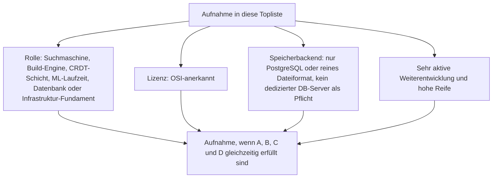
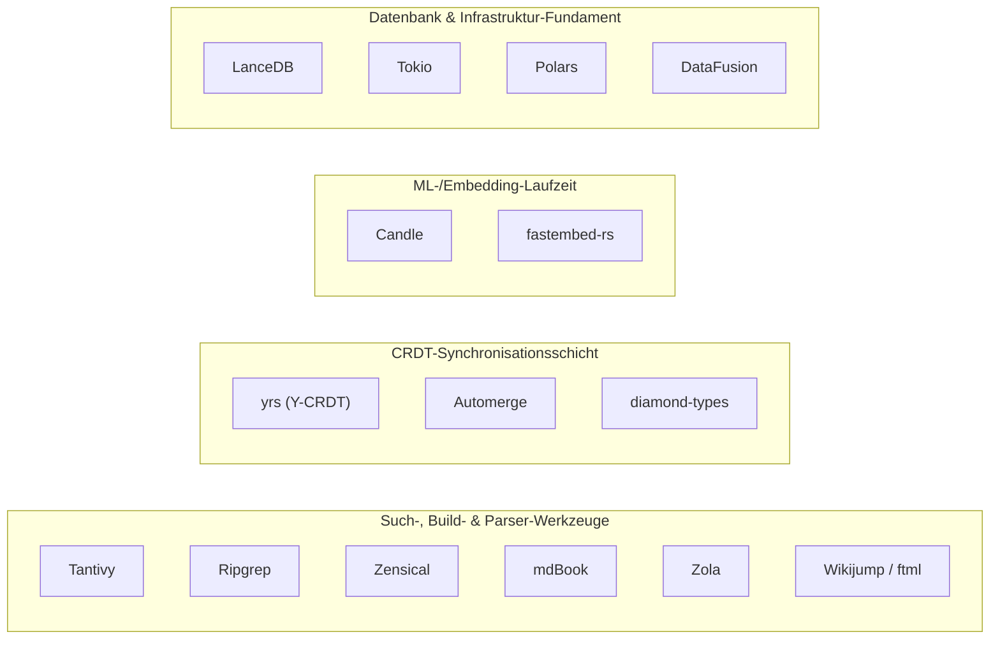
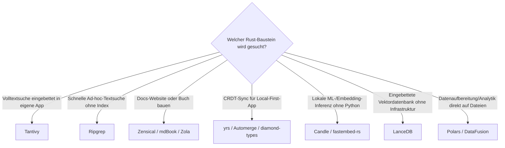

# Rust-Bausteine für Wissenssysteme mit PostgreSQL- oder Dateiformat-Speicherung, aktiver Weiterentwicklung & hoher Reife — Top-15-Topliste

Die [Beste Rust-Bausteine für Wissenssysteme 2026 (Top 20)](rust-wissenssysteme-2026-topliste.md) rankt Entwickler-Bausteine — Suchmaschinen, Vektordatenbanken, CRDT-Synchronisation, ML-Inferenz und Build-Engines — unabhängig von Lizenz und Speicherarchitektur. Diese Seite wendet auf genau dieselbe Kategorie die inzwischen etablierten strengeren Kriterien an: nur OSI-Open-Source, Persistenz ausschließlich in PostgreSQL oder einem reinen Dateiformat, sehr aktive Weiterentwicklung, hohe Reife.

!!! note "Hinweis: Bausteine, nicht Endprodukte"
    Wie die Basis-Topliste rankt auch diese Seite **Entwickler-Bausteine**, keine fertigen Wissenssystem-Produkte. Viele dieser Rust-Kerne haben — anders als fertige Plattformen — überhaupt kein eigenes Speicherbackend, sondern lassen es dem einbindenden Programm offen; das macht die Speicherfrage bei ihnen tendenziell einfacher zu beantworten als bei fertigen Systemen.

!!! tip "Tipp: Bibliotheken ohne eigene Persistenz zählen als datei-/postgres-kompatibel"
    Tokio, Candle, fastembed-rs, yrs, Automerge und diamond-types besitzen keine eigene Datenhaltung — sie verarbeiten, was das einbindende Programm ihnen übergibt, und persistieren höchstens optional in lokale Dateien. Dieselbe Logik wie bei den RAG-/Agenten-Frameworks in den [Speicherbackend-Toplisten](semantische-rag-wissenssysteme-postgresql-dateiformat-2026-topliste.md) dieser Dokumentation.

---

## Bewertungskriterien

!!! warning "Achtung: Momentaufnahme, Stand August 2026 — bewusst kürzer als 20"
    Von den 20 Bausteinen der [Basis-Topliste](rust-wissenssysteme-2026-topliste.md) fallen fünf heraus: Qdrant, Meilisearch und SurrealDB laufen typischerweise als eigenständiger Datenbank-/Suchserver mit eigenem Speicherformat statt PostgreSQL oder Dateiformat; Sled hat seit dem Umbau Richtung „Sled 1.0" spürbar an Release-Tempo verloren; Cobalt.rs ist ein Nischen-Static-Site-Generator mit deutlich geringerer Aktivität als Zola aus derselben Generation.

---

## Top 15 im Überblick

| Rang | Baustein | Rolle | Lizenz | Speicherbackend | Aktivität/Reife |
|---|---|---|---|---|---|
| 1 | **Tantivy** | Suchmaschine/Index | MIT | Dateiformat (eigener invertierter Index auf Disk) | Meistgenutzte eingebettete Volltextsuche, sehr aktiv seit 2016 |
| 2 | **Ripgrep** | CLI-Suchwerkzeug | MIT/Unlicense | Kein Backend — keine dauerhafte Indexpersistenz | Referenzimplementierung für schnelle Rust-Textsuche, extrem verbreitet |
| 3 | **[Zensical](evolution-digitaler-wissenssysteme.md#generatoren-arten-fur-wissensportale-static-site-docs-generators)** | Build-Engine | — | Dateiformat (Markdown/YAML im Git-Repository) | Basis dieses Repositorys, aktiv weiterentwickelt |
| 4 | **mdBook** | Build-Engine/CLI | MPL-2.0 | Dateiformat | Mature seit „The Rust Programming Language", weiterhin aktiv |
| 5 | **Zola** | Build-Engine/CLI | MIT | Dateiformat | Single-Binary ohne Laufzeitabhängigkeiten, aktiv |
| 6 | **yrs** (Y-CRDT) | Synchronisationsschicht | MIT | Kein Pflicht-Backend — typisch Datei-Snapshot | Rust-Portierung von Yjs, sehr aktiv |
| 7 | **Candle** (Hugging Face) | ML-Laufzeit | Apache-2.0/MIT | Kein Backend — lädt Modell-Dateien | Hugging-Face-gestützt, sehr aktiv |
| 8 | **LanceDB** | Datenbank (eingebettet) | Apache-2.0 | Dateiformat (Lance-Spaltenformat auf Disk) | Keine externe Infrastruktur nötig, sehr aktiv |
| 9 | **Automerge** (Rust-Kern seit v2) | Synchronisationsschicht | MIT | Kein Pflicht-Backend | Performance-Migration von JavaScript zu Rust, aktiv |
| 10 | **fastembed-rs** | ML-Laufzeit | Apache-2.0 | Kein Backend | Leichtgewichtige, auf Embedding-Inferenz spezialisierte Bibliothek |
| 11 | **diamond-types** | Synchronisationsschicht | MIT | Kein Pflicht-Backend | Spezialisiert auf Textbearbeitung mit sehr langer Historie |
| 12 | **Tokio** | Fundament (Async-Runtime) | MIT | Keine eigene Datenpersistenz | Grundlage eines Großteils dieser Liste, extrem aktiv und reif |
| 13 | **Polars** | Fundament (DataFrame) | MIT | Dateiformat (Parquet/CSV/Arrow) | Starkes Momentum als Pandas-Alternative, sehr aktiv |
| 14 | **DataFusion** | Fundament (Query-Engine) | Apache-2.0 | Dateiformat (Apache Arrow/Parquet) | Fundament analytiklastiger Backends, aktiv |
| 15 | **Wikijump / ftml** | Parser/Konverter | AGPL-3.0 | PostgreSQL (Wikijump-Gesamtsystem) | Kernstück der SCP-Foundation-Plattform, aktiv |

---

## Highlights im Detail

### Ripgrep & Tokio: Bausteine ohne jede Speicherfrage
Zwei der 15 Ränge lösen das Speicherkriterium auf die radikalste Art — sie halten überhaupt keine dauerhaften Daten. Ripgrep durchsucht Dateien direkt, ohne je einen Index zu persistieren; Tokio ist reine Async-Laufzeit ohne jeden Datenhaltungs-Anspruch. Beide zeigen, dass „kein Pflicht-Zweitsystem" im Extremfall auch „gar kein Speicherbackend" bedeuten kann.

### yrs, Automerge & diamond-types: derselbe CRDT-Dreiklang wie in der visuellen Topliste
Diese drei Rust-CRDT-Bibliotheken sind die technische Grundlage für dieselben Systeme, die bereits in der [Visuell-/Local-First-Speicherbackend-Topliste](visuell-agentische-wissenssysteme-postgresql-dateiformat-2026-topliste.md) auftauchen (Yjs/yrs hinter AFFiNE, HedgeDoc, Docmost) — dort auf Produktebene, hier auf Bibliotheksebene.

### Polars & DataFusion: Dateiformat statt Datenbank in der Analytik-Pipeline
Beide Bausteine verarbeiten RAG-/Datenaufbereitungs-Pipelines direkt auf Parquet-, CSV- und Arrow-Dateien, ohne dass ein Datenbank-Server dazwischengeschaltet werden muss — dasselbe Architekturprinzip, das Microsoft GraphRAG in der [Semantische-RAG-Speicherbackend-Topliste](semantische-rag-wissenssysteme-postgresql-dateiformat-2026-topliste.md#top-15-im-uberblick) für Wissensgraphen nutzt, hier auf tabellarische Daten angewendet.

---

## Was bewusst nicht in dieser Liste steht

!!! warning "Achtung: Ausschluss trotz Reife oder Verbreitung"
    - **Dedizierter Datenbank-/Suchserver statt Postgres/Datei**: Qdrant, Meilisearch und SurrealDB laufen in ihrer typischen Nutzung als eigenständiger Server mit eigenem Speicherformat — dieselbe Begründung wie bei den entsprechenden Ausschlüssen in der [Semantische-RAG-Speicherbackend-Topliste](semantische-rag-wissenssysteme-postgresql-dateiformat-2026-topliste.md#was-bewusst-nicht-in-dieser-liste-steht).
    - **Deutlich verlangsamte Weiterentwicklung**: Sled — der Umbau Richtung „Sled 1.0" hat die Release-Kadenz seit einigen Jahren spürbar verlangsamt.
    - **Geringere Aktivität als vergleichbare Alternative**: Cobalt.rs — von der Basis-Topliste selbst als „Nischen-Alternative zu Zola" eingeordnet, mit entsprechend geringerer Entwicklungsdynamik.

---

## Entscheidungshilfe nach Baustellen-Typ

---

## 🔗 Verwandte Themen

- [Startseite](../../index.md) — zurück zur Dokumentations-Zentrale
- [Beste Rust-Bausteine für Wissenssysteme 2026 (Top 20)](rust-wissenssysteme-2026-topliste.md) — Basis-Topliste ohne Lizenz-/Speicherbackend-/Aktivitätsfilter
- [Produktionsreife Rust-Bausteine für Wissenssysteme nach Generation (Top 3)](produktionsreife-rust-wissenssysteme-generationen-2026-topliste.md) — noch strenger: zusätzlich fünf Jahre Produktion und sehr große Betriebs-Skala, nach Generation sortiert
- [Evolution und Architekturen digitaler Rust-Wissenssysteme](evolution-digitaler-rust-wissenssysteme.md) — chronologisches Generationenmodell als Hintergrund
- [Open-Source-Wissenssysteme mit PostgreSQL- oder Dateiformat-Speicherung (Top 22)](postgresql-dateiformat-wissenssysteme-2026-topliste.md) — dieselben Speicherkriterien für die breitere Wissenssysteme-Klasse
- [Semantische & RAG-Wissenssysteme mit PostgreSQL-/Dateiformat-Speicherung (Top 15)](semantische-rag-wissenssysteme-postgresql-dateiformat-2026-topliste.md) — Überschneidung bei LanceDB und Candle als RAG-Bausteine
- [Visuelle, Local-First & agentische Wissenssysteme mit PostgreSQL-/Dateiformat-Speicherung (Top 15)](visuell-agentische-wissenssysteme-postgresql-dateiformat-2026-topliste.md) — Überschneidung bei yrs/Automerge als CRDT-Infrastruktur
- [Wiki-Engines mit PostgreSQL- oder Dateiformat-Speicherung (Top 15)](wiki-engines-postgresql-dateiformat-2026-topliste.md) — Überschneidung bei Wikijump/ftml
- [Rust in der Praxis](../../entwicklung/system/rust-praxis.md) — allgemeine Rust-Werkzeuglandschaft jenseits von Wissenssystemen
- [Wissensdatenbanken mit KI & semantischer Suche](wissensdatenbanken-ki-semantische-suche.md) — technische Mechanismen hinter Rang 8, 7, 10
- [Frameworks & Bibliotheken für Wissenssysteme mit PostgreSQL-/Dateiformat-Speicherung (Top 16)](wissenssystem-frameworks-postgresql-dateiformat-2026-topliste.md) — sprachübergreifende Schwester-Topliste derselben Bauteil-Ebene
