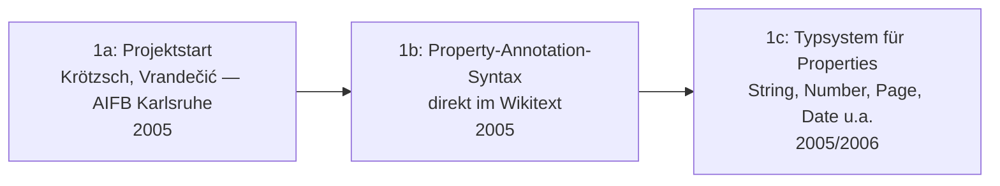

# Evolution und Architekturen von Semantisches MediaWiki

Semantisches MediaWiki (SMW) bildet Generation 1c der [Evolution digitaler Wiki-Engines](../evolution-digitaler-wiki-engines.md#1c-enterprise-wikis-semantik-2005-2015) und taucht dort zusätzlich in [Generation 5 (Semantische Anreicherung trifft RAG)](../evolution-digitaler-wiki-engines.md#generation-5-semantische-anreicherung-trifft-rag-ab-ca-2022) wieder auf — als Extension setzt es direkt auf [MediaWiki](../mediawiki/evolution-digitaler-mediawiki.md) auf, statt eine eigenständige Engine zu sein. Diese eigenständige Zeitachse zoomt — analog zu den Produkt-Spezialartikeln [Evolution und Architekturen von XWiki](../xwiki/evolution-digitaler-xwiki.md) und [Evolution und Architekturen von DokuWiki](../dokuwiki/evolution-digitaler-dokuwiki.md) — in genau SMWs eigene Architekturlinie hinein: vom Property-Annotation-Modell direkt im Wikitext über Inline-Abfragen, strukturierte Formular-Eingabe und RDF-/SPARQL-Anbindung bis zum Einfluss auf Wikidata und der aktuellen, professionell gepflegten RAG-Ära. Die praktische Installation behandelt [Semantic MediaWiki mit Composer installieren](installieren.md), Praxis-Guides zu [SMW Inline Queries](smw-inline-queries.md) und [SMW SPARQL Endpoint](smw-sparql-queries.md).

!!! note "Hinweis: Generationen überlappen sich"
    Die Zeiträume sind grobe Orientierung, keine scharfen Grenzen — das ursprüngliche Property-Annotation-Modell aus Generation 1 trägt bis heute jede SMW-Installation, parallel zur RDF-/SPARQL-Anbindung aus Generation 4 und der RAG-Ära aus Generation 6. Entscheidend ist die **Architektur** (Datenmodell, Abfragemechanismus, Speicher-Engine), nicht allein das Versionsjahr.

---

## Generation 1: Projektstart & Property-Annotation-Modell, 2005

Die Gründergeneration eint drei Prinzipien: **strukturierte Daten direkt im Wikitext annotiert** statt in einer separaten Datenbank gepflegt, ein **typisiertes Property-System** und der Anspruch, MediaWiki ohne Architektur-Bruch um echte Semantik zu erweitern.

### 1a. Projektstart, 2005

- **Hintergrund:** Markus Krötzsch und Denny Vrandečić entwickeln SMW am AIFB der Universität Karlsruhe mit dem Ziel, Wikipedia-artige Wikis um maschinenlesbare Semantik zu erweitern, ohne die vertraute Wikitext-Bearbeitung aufzugeben.
- **Bedeutung:** direkte Fortsetzung von [Generation 1b der Wiki-Engines-Zeitachse](../evolution-digitaler-wiki-engines.md#1b-relationale-datenbanken-enzyklopadischer-mastab-2001-2008) (MediaWiki), aber mit explizitem Semantik-Anspruch, der SMW in Generation 1c einordnet.

### 1b. Property-Annotation-Syntax direkt im Wikitext, 2005

- **Architektur:** Eigenschaften werden als `[[Hat Eigenschaft::Wert]]` direkt in den Fließtext einer Seite eingebettet — dieselbe Seite bleibt für Menschen lesbar und wird gleichzeitig maschinenlesbar.
- **Bedeutung:** kein separates Datenmodell wie bei [XWikis XObjects](../xwiki/evolution-digitaler-xwiki.md#generation-1-projektstart-xobjects-datenmodell-2003-2006) — Struktur entsteht als Nebenprodukt der normalen Seitenbearbeitung.

### 1c. Typsystem für Properties, 2005/2006

- **Architektur:** jede Property erhält einen deklarierten Datentyp (String, Number, Page, Date, Geographic Coordinate u. a.), der Eingaben validiert und Sortierung/Vergleiche ermöglicht.
- **Bedeutung:** Grundlage für alle späteren Abfrage- und Exportfunktionen — ohne Typsystem wären weder Inline-Queries noch RDF-Export sinnvoll möglich.

---

## Generation 2: Inline-Abfragen — #ask & strukturierte Ausgabe, ab 2006

Statt annotierte Daten nur zu speichern, macht diese Generation sie direkt im Wikitext **abfragbar** — eine Wiki-Seite wird zur lebenden Datenbankabfrage.

**Architektur:** die Parser-Funktion **`#ask`** formuliert Abfragen über annotierte Properties direkt im Wikitext, `#show` zeigt einzelne Werte gezielt an — siehe [SMW Inline Queries](smw-inline-queries.md) für konkrete Syntaxbeispiele.

!!! tip "Bedeutung für spätere Generationen"
    `#ask` bleibt bis heute der Standard-Abfrageweg für die meisten SMW-Installationen — RDF/SPARQL aus Generation 4 ergänzt diesen Weg für komplexere Graph-Abfragen, ersetzt ihn aber nicht.

---

## Generation 3: Ausgabeformate & strukturierte Dateneingabe, ab 2007/2008

Reine Text-/Tabellen-Ausgabe reicht für viele Anwendungsfälle nicht — diese Generation ergänzt sowohl die Darstellung als auch die Dateneingabe um dedizierte Werkzeuge.

| Baustein | Rolle |
|---|---|
| **Semantic Result Formats** | Erweitert `#ask`-Ergebnisse um zusätzliche Ausgabeformate (Karten, Diagramme, Zeitleisten) statt reiner Listen/Tabellen. |
| **Semantic Forms / Page Forms** | Formulargestützte Dateneingabe statt manueller `[[Property::Wert]]`-Syntax — reduziert Tippfehler und Einstiegshürde für nicht-technische Redakteure. |

---

## Generation 4: RDF-Export & SPARQL-Anbindung, ab ca. 2010

Annotierte Properties werden als echtes **RDF-Tripel-Modell** exportierbar — SMW wird zum Frontend eines vollwertigen Triple-Stores statt einer reinen MediaWiki-Erweiterung.

**Architektur:** jede annotierte Seite exportiert Subjekt-Prädikat-Objekt-Tripel nach RDF, ein optionaler **SPARQL-Endpoint** (über Graph-Stores wie Apache Jena oder Blazegraph) erlaubt komplexe Graph-Abfragen über den gesamten Dokumentenbestand hinweg, siehe [SMW SPARQL Endpoint](smw-sparql-queries.md).

---

## Generation 5: Wikidata-Einfluss & alternative Speicher-Engines, ab 2012

SMWs Grundidee — strukturierte, maschinenlesbare Fakten direkt aus Wiki-Bearbeitung heraus — prägt die Konzeption von Wikidata mit, während parallel eine leichtgewichtigere Alternative für Nutzer entsteht, die kein volles RDF-Modell benötigen.

| Baustein | Rolle |
|---|---|
| **Wikidata / Wikibase** | Eigenständiges, spezialisiertes Nachfolgeprojekt mit eigenem Datenmodell (Items, Properties, Statements) statt Wikitext-Annotation — siehe [Generation 4 der MediaWiki-Zeitachse](../mediawiki/evolution-digitaler-mediawiki.md#generation-4-wikidata-strukturierte-daten-2012-2015). SMW bleibt davon unabhängig eigenständig weiterentwickelt. |
| **Cargo** | Alternative MediaWiki-Extension für strukturierte Daten auf Basis klassischer SQL-Tabellen statt RDF-Tripeln — geringere Einstiegshürde, aber ohne SPARQL-/Graph-Fähigkeiten von SMW. |

---

## Generation 6: Professionalisierte Wartung & RAG-Ära, ab den 2020er-Jahren

Die aktuelle Generation sichert die Kompatibilität mit modernen MediaWiki-Versionen professionell ab und macht die seit Generation 1 gesammelten strukturierten Daten zusätzlich für Sprachmodelle nutzbar.

**Architektur:** kommerzielle Pflege (u. a. durch **Professional Wiki**) hält SMW mit aktuellen MediaWiki-Kernversionen synchron; die bereits vorhandenen typisierten Properties aus Generation 1 dienen zusätzlich als strukturierter Retrieval-Layer für RAG-Systeme, ohne dass eine separate Vektordatenbank die vorhandene Semantik ersetzen müsste, siehe [Generation 5 der Wiki-Engines-Zeitachse](../evolution-digitaler-wiki-engines.md#generation-5-semantische-anreicherung-trifft-rag-ab-ca-2022).

---

## Alternative Sortier- & Klassifikationskriterien für Semantisches MediaWiki

### 1. Datenmodell

- **RDF-Tripel** (Subjekt-Prädikat-Objekt) — SMWs nativer Ansatz seit Generation 1.
- **Klassische SQL-Tabellen** — Cargo als Alternative aus Generation 5, ohne Graph-/SPARQL-Fähigkeiten.

### 2. Abfrageweg

- **`#ask`-Parser-Funktion** — Standardweg direkt im Wikitext seit Generation 2.
- **SPARQL** — Graph-Abfragen über einen externen Triple-Store seit Generation 4, für komplexere Anwendungsfälle.

### 3. Dateneingabe

- **Rohe Wikitext-Annotation** (`[[Property::Wert]]`) — seit Generation 1.
- **Formulargestützt** (Page Forms) — seit Generation 3, für nicht-technische Redakteure.

---

## Verwandte Themen

- [Semantic MediaWiki mit Composer installieren](installieren.md) — Installationsanleitung
- [Kurzform: Semantisches MediaWiki](kurzform.md) — kompakte Übersicht
- [Wichtige Erweiterungen](wichtige-erweiterungen.md) — Companion-Extensions wie Cargo, Wikibase, Semantic Result Formats
- [SMW Inline Queries](smw-inline-queries.md) — Vertiefung zu Generation 2
- [SMW SPARQL Endpoint](smw-sparql-queries.md) — Vertiefung zu Generation 4
- [Evolution und Architekturen von MediaWiki](../mediawiki/evolution-digitaler-mediawiki.md) — Basis-System, auf dem SMW als Extension aufsetzt
- [Evolution und Architekturen digitaler Wiki-Engines](../evolution-digitaler-wiki-engines.md) — übergeordnetes Generationenmodell, in dem SMW Generation 1c und 5 bildet
- [Evolution und Architekturen von XWiki](../xwiki/evolution-digitaler-xwiki.md) — analoger Produkt-Spezialartikel, natives Datenmodell statt Wikitext-Annotation
- [Dokumentationsübersicht](../index.md)
