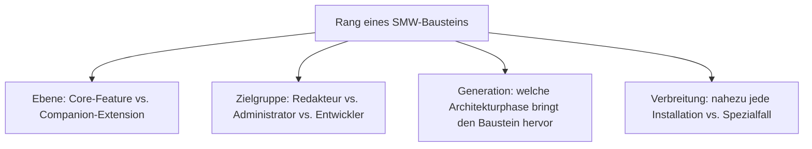
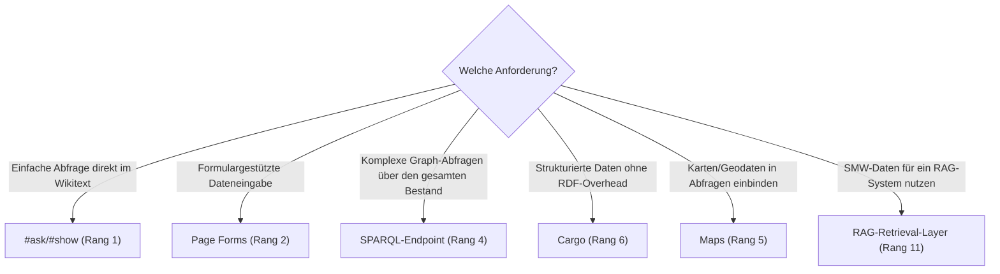

# Beste Semantic-MediaWiki-Erweiterungen 2026 — Top-15-Topliste

Die [Evolution und Architekturen von Semantisches MediaWiki](evolution-digitaler-semantisches-mediawiki.md) ordnet die Produktgeschichte chronologisch nach sechs Generationen — vom Property-Annotation-Modell direkt im Wikitext über Inline-Abfragen und strukturierte Formular-Eingabe bis zur RDF-/SPARQL-Anbindung und der aktuellen RAG-Ära. Da SMW selbst eine Extension für MediaWiki ist, übersetzt diese Seite die Chronologie in eine **nach 2026-Relevanz gerankte Top-15-Liste konkreter Core-Features und Companion-Extensions**, mit denen dieses Erweiterungs-Ökosystem tatsächlich betrieben wird.

!!! note "Hinweis: Core-SMW-Feature und Companion-Extension gemeinsam gerankt"
    Diese Liste mischt bewusst zwei Ebenen — die im SMW-Core enthaltenen Grundfunktionen (`#ask`, RDF-/SPARQL-Export) und die weiterhin unverzichtbaren Begleit-Extensions aus dem MediaWiki-Ökosystem (Page Forms, Semantic Result Formats, Cargo) — weil beide zusammen bestimmen, wie eine SMW-Installation 2026 tatsächlich aufgebaut wird.

---

## Bewertungskriterien

---

## Top 15 im Überblick

| Rang | Baustein | Ebene | Generation | Bedeutung |
|---|---|---|---|---|
| 1 | **`#ask`/`#show`** (Inline-Queries) | Core-Feature | 2 (Inline-Abfragen) | Standard-Abfrageweg direkt im Wikitext, siehe [SMW Inline Queries](smw-inline-queries.md) |
| 2 | **Page Forms** (ex-Semantic Forms) | Extension | 3 (Ausgabeformate & Eingabe) | Formulargestützte Dateneingabe statt roher `[[Property::Wert]]`-Syntax |
| 3 | **Semantic Result Formats** | Extension | 3 (Ausgabeformate & Eingabe) | Zusätzliche `#ask`-Ausgabeformate — Karten, Diagramme, Zeitleisten statt reiner Tabellen |
| 4 | **SPARQL-Endpoint** (Apache Jena/Blazegraph) | Core-Feature | 4 (RDF-Export & SPARQL) | Graph-Abfragen über den gesamten Dokumentenbestand hinweg, siehe [SMW SPARQL Endpoint](smw-sparql-queries.md) |
| 5 | **Maps** | Extension | 3 (Ausgabeformate & Eingabe) | Integration von Karten und Geodaten direkt in semantische Abfragen |
| 6 | **Cargo** | Extension (Alternative) | 5 (Wikidata-Einfluss & Speicher-Engines) | SQL-basierte Alternative zum RDF-Modell — geringere Einstiegshürde, ohne SPARQL-Fähigkeiten |
| 7 | **Wikibase** | Extension (verwandt) | 5 (Wikidata-Einfluss & Speicher-Engines) | Eigenständiges, von SMW inspiriertes Nachfolgeprojekt mit eigenem Datenmodell (Basis von Wikidata) |
| 8 | **Scribunto** | Extension | 3 (Logik-Ökosystem) | Lua-Skripting für komplexe Templates rund um SMW-Daten |
| 9 | **DynamicPageList** (DPL) | Extension | 2 (Ergänzung zu Inline-Abfragen) | Dynamische Listen mit logischen Bedingungen, ergänzt `#ask` um zusätzliche Filterlogik |
| 10 | **ParserFunctions** | Extension | 2 (Ergänzung zu Inline-Abfragen) | Erweiterte Bedingungen/Schleifen in Vorlagen — Grundvoraussetzung vieler SMW-Templates |
| 11 | **RAG-Retrieval-Layer auf SMW-Basis** | Muster | 6 (Professionalisierte Wartung & RAG-Ära) | Nutzt vorhandene typisierte Properties als strukturierten Retrieval-Layer für Sprachmodelle |
| 12 | **InputBox** | Extension | 3 (Ausgabeformate & Eingabe) | Einfache Such-/Erstellungsformulare ohne vollständiges Page-Forms-Setup |
| 13 | **FormWizard** | Extension | 3 (Ausgabeformate & Eingabe) | Geführte Seitenerstellung auf Basis von Page Forms |
| 14 | **CategoryTree** | Extension | 1 (Property-Annotation-Modell, Ergänzung) | Visuelle Kategorie-Hierarchie neben der Property-basierten Struktur |
| 15 | **SubPageList** | Extension | 1 (Property-Annotation-Modell, Ergänzung) | Listet Unterseiten anhand der Namensraum-Struktur, ergänzt Property-Abfragen |

---

## Highlights im Detail

### Rang 1, 4: die beiden Kern-Abfragewege
`#ask`/`#show` und der SPARQL-Endpoint zeigen die zwei parallelen Abfrage-Architekturen von SMW — der einfache, direkt im Wikitext lebende Weg gegenüber dem mächtigeren, aber aufwendigeren Graph-Abfrage-Weg, siehe [Generation 2](evolution-digitaler-semantisches-mediawiki.md#generation-2-inline-abfragen-ask-strukturierte-ausgabe-ab-2006) und [Generation 4](evolution-digitaler-semantisches-mediawiki.md#generation-4-rdf-export-sparql-anbindung-ab-ca-2010).

### Rang 2–3, 5, 12–13: Eingabe und Ausgabe jenseits von Rohtext
Page Forms, Semantic Result Formats, Maps, InputBox und FormWizard zeigen gemeinsam, wie stark SMW über die reine Annotations-Syntax aus Generation 1 hinausgewachsen ist, siehe [Generation 3](evolution-digitaler-semantisches-mediawiki.md#generation-3-ausgabeformate-strukturierte-dateneingabe-ab-20072008).

### Rang 6–7: zwei Antworten auf dieselbe Fragestellung
Cargo und Wikibase lösen dasselbe Grundproblem — strukturierte Daten in einem Wiki — mit bewusst anderen architektonischen Kompromissen als SMW selbst, siehe [Generation 5](evolution-digitaler-semantisches-mediawiki.md#generation-5-wikidata-einfluss-alternative-speicher-engines-ab-2012).

---

## Wegweiser: von Anforderung zu passendem Baustein

!!! tip "Tipp: die Produkt-Chronologie separat prüfen"
    Diese Liste übersetzt alle sechs Generationen der Quell-Chronologie in eine gemeinsame 2026-Momentaufnahme — für die vollständige Versionsgeschichte siehe [Evolution und Architekturen von Semantisches MediaWiki](evolution-digitaler-semantisches-mediawiki.md).

---

## Verwandte Themen

- [Evolution und Architekturen von Semantisches MediaWiki](evolution-digitaler-semantisches-mediawiki.md) — chronologisches Generationenmodell, dessen aktuellen Stand diese Topliste zusammenfasst
- [Semantic MediaWiki mit Composer installieren](installieren.md) — Installationsanleitung
- [Wichtige Erweiterungen](wichtige-erweiterungen.md) — vollständige Liste der Companion-Extensions
- [SMW Inline Queries](smw-inline-queries.md) — Vertiefung zu Rang 1
- [SMW SPARQL Endpoint](smw-sparql-queries.md) — Vertiefung zu Rang 4
- [Evolution und Architekturen von MediaWiki](../mediawiki/evolution-digitaler-mediawiki.md) — Basis-System, auf dem SMW aufsetzt
- [Dokumentationsübersicht](../index.md)
