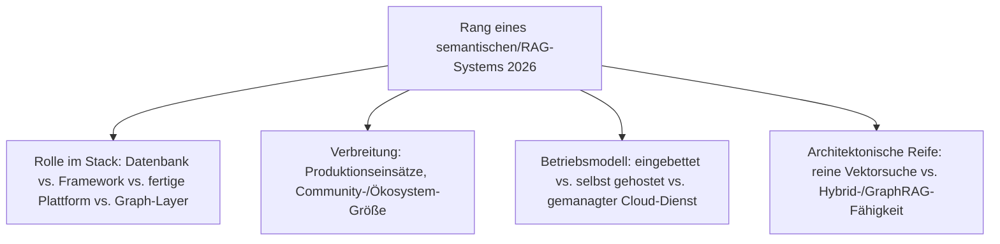
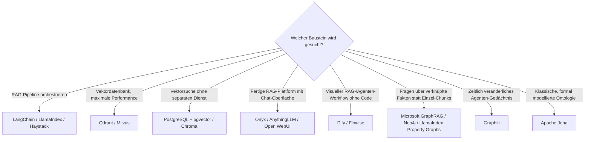

# Beste semantische & RAG-Wissenssysteme 2026 — Top-20-Topliste

Die [Evolution und Architekturen digitaler Semantischer & RAG-Wissenssysteme](evolution-digitaler-semantische-rag-wissenssysteme.md) ordnet diese Kategorie chronologisch nach der Architektur der Wissensrepräsentation — von expliziten Tripeln über gelernte Vektoren bis zu LLM-generierten Wissensgraphen. Diese Seite übersetzt die Chronologie in eine **Momentaufnahme 2026** — und rankt bewusst über eine einzelne Systemklasse hinaus: **Vektordatenbanken, RAG-Orchestrierungs-Frameworks, fertige RAG-Plattformen und Graph-/GraphRAG-Systeme** stehen hier nebeneinander, weil ein produktiver RAG-Stack 2026 typischerweise aus mehreren dieser Bausteine gleichzeitig besteht.

!!! note "Hinweis: Baustein-übergreifend statt Einzelkategorie"
    Anders als [Die führenden Open-Source-Wissenssysteme 2026](fuehrende-opensource-wissenssysteme-2026-topliste.md), die fertige Wissenssystem-**Produkte** rankt, mischt diese Seite bewusst Infrastruktur-Bausteine (Vektordatenbanken, Frameworks) mit fertigen Plattformen — die technischen Mechanismen dahinter (Chunking, Embeddings, RAG-Pipeline) erklärt [Wissensdatenbanken mit KI & semantischer Suche](wissensdatenbanken-ki-semantische-suche.md) im Detail.

---

## Bewertungskriterien

!!! warning "Achtung: GraphRAG-Systeme sind noch jung"
    Rang 14–17 und 19 (GraphRAG/Graph-Datenbank-Bausteine) haben deutlich kürzere Produktionsreife-Historie als klassische Vektordatenbanken (Rang 3–8) — vor einer Migration bestehender RAG-Pipelines die aktuelle Stabilität prüfen. **Stand: August 2026.**

---

## Top 20 im Überblick

| Rang | System | Kategorie | Betriebsmodell | Besondere Stärke |
|---|---|---|---|---|
| 1 | **LangChain** | RAG-Orchestrierungs-Framework | Bibliothek, self-hosted | Dominantes Framework für RAG-Pipelines, größtes Integrations-Ökosystem |
| 2 | **LlamaIndex** | RAG-Orchestrierungs-Framework | Bibliothek, self-hosted | Stärkster Fokus auf Retrieval selbst, führend bei Property-Graph-/GraphRAG-Integration |
| 3 | **Pinecone** | Vektordatenbank | gemanagter Cloud-Dienst | Größte gemanagte Vektordatenbank ohne eigene Infrastruktur |
| 4 | **Qdrant** | Vektordatenbank | self-hosted oder Cloud | Rust-basiert, häufigste Wahl für performancekritische selbst gehostete Setups |
| 5 | **Weaviate** | Vektordatenbank | self-hosted oder Cloud | Eingebaute Hybrid-Suche (Vektor + Schlagwort) im Kern statt als Zusatz |
| 6 | **Milvus** | Vektordatenbank | self-hosted, für Skalierung ausgelegt | Größte Bereitschaft für sehr große Vektormengen unter den Open-Source-Kandidaten |
| 7 | **Chroma** | Vektordatenbank | eingebettet, ohne externe Infrastruktur | Meistgenutzte Wahl für lokale RAG-Prototypen und kleinere Setups |
| 8 | **[PostgreSQL + pgvector](../daten/datenbanken/pgvector-anleitung.md)** | Vektordatenbank (Erweiterung) | self-hosted | Vektorsuche direkt in der bereits vorhandenen relationalen Datenbank, kein separater Dienst |
| 9 | **[Onyx](onyx-danswer-rag-plattform.md)** (ehem. Danswer) | RAG-Plattform | self-hosted | Verbindet sich mit bestehenden Datenquellen (Slack, Google Drive, Wikis), fest integrierter Hybrid-Index |
| 10 | **[AnythingLLM](anythingllm-rag-plattform.md)** | RAG-Plattform | self-hosted (Desktop/Docker) | All-in-One-Anwendung, lokale Dokumente in private Chat-Kontexte übersetzt |
| 11 | **[Open WebUI](open-webui-rag-agenten-plattform.md)** | RAG-Plattform | self-hosted | Web-Frontend für LLMs mit integriertem, konfigurierbarem RAG-System |
| 12 | **[Dify](dify-agenten-workflow-plattform.md)** | RAG-Plattform (Workflow) | self-hosted oder Cloud | RAG als ein Baustein unter mehreren in einer größeren Agenten-Pipeline |
| 13 | **[Flowise](flowise-visueller-flow-builder.md)** | RAG-Plattform (Workflow) | self-hosted | No-Code-Flow-Builder direkt auf LangChain aufgesetzt |
| 14 | **Microsoft GraphRAG** | GraphRAG-Referenzimplementierung | Bibliothek, self-hosted | Meistzitierte Referenzarchitektur für LLM-generierte Wissensgraphen aus Rohtext |
| 15 | **Neo4j** | Graph-Datenbank | self-hosted oder Cloud | Meistgenutzte Property-Graph-Datenbank als Unterbau für GraphRAG-Systeme |
| 16 | **Amazon Neptune** | Graph-Datenbank | gemanagter Cloud-Dienst | Führende gemanagte Graph-Datenbank für AWS-native GraphRAG-Stacks |
| 17 | **Apache Jena** | Triplestore/RDF-Framework | Bibliothek, self-hosted | Etablierteste Open-Source-Basis für klassische SPARQL-Wissensgraphen, bis heute in Enterprise-Einsätzen |
| 18 | **Haystack** (deepset) | RAG-Orchestrierungs-Framework | Bibliothek, self-hosted | Stärkster Enterprise-/Produktions-Fokus unter den RAG-Frameworks dieser Liste |
| 19 | **Graphiti** | Temporales Wissensgraph-Framework | Bibliothek, self-hosted | Speziell für Agenten-Gedächtnis konzipiert — Wissensgraph mit Zeitdimension statt statischem Snapshot |
| 20 | **txtai** | RAG-Orchestrierungs-Framework (leichtgewichtig) | Bibliothek, eingebettet | Kombiniert Embeddings, Suche und RAG-Pipeline in einer einzigen, sehr schlanken Bibliothek |

---

## Highlights im Detail

### Rang 1–2: die beiden dominanten RAG-Frameworks
LangChain und LlamaIndex teilen sich die Führung im Orchestrierungs-Layer, mit leicht unterschiedlichem Schwerpunkt: LangChain deckt das breitere Spektrum an Ketten/Agenten-Logik ab, LlamaIndex bleibt konsequenter auf Retrieval-Qualität fokussiert — sichtbar an seiner führenden Property-Graph-/GraphRAG-Integration (Rang 14 baut direkt darauf auf).

### Rang 3–8: Vektordatenbanken differenzieren sich über Betriebsmodell, nicht Grundfunktion
Alle sechs Kandidaten lösen dasselbe Kernproblem — Ähnlichkeitssuche über Embeddings —, aber mit klar unterschiedlichem Betriebskompromiss: Pinecone maximiert Bequemlichkeit (gemanagt), Milvus Skalierung, Chroma Einfachheit (eingebettet), und pgvector eliminiert einen separaten Dienst komplett, indem es Vektorsuche in eine ohnehin vorhandene PostgreSQL-Instanz integriert.

### Rang 14–17, 19: GraphRAG schließt den Kreis zur Generation 1
Microsoft GraphRAG, Neo4j, Amazon Neptune und Graphiti markieren die technische Rückkehr zu expliziten Wissensgraphen (vgl. [Generation 1 der Evolution-Chronologie](evolution-digitaler-semantische-rag-wissenssysteme.md#generation-1-semantic-web-symbolische-wissensgraphen-1999-2012)) — mit dem entscheidenden Unterschied, dass der Graph 2026 meist von einem LLM aus Rohtext extrahiert wird, statt manuell modelliert zu werden wie in den frühen Triplestores (Rang 17).

### Rang 19: das jüngste System dieser Liste löst ein neues Problem
Graphiti unterscheidet sich von den übrigen Graph-Systemen durch seine **Zeitdimension** — Fakten sind nicht nur wahr oder falsch, sondern zu einem bestimmten Zeitpunkt gültig gewesen, was speziell für persistentes Agenten-Gedächtnis (vgl. [Letta in der PKM-Topliste](pkm-wissensgraphen-2026-topliste.md)) relevant wird.

---

## Entscheidungshilfe nach Anwendungsfall

!!! tip "Tipp: Technische Mechanik separat nachlesen"
    Diese Topliste beantwortet **welches** System — **wie** Chunking, Embeddings und die RAG-Pipeline im Detail funktionieren, erklärt [Wissensdatenbanken mit KI & semantischer Suche](wissensdatenbanken-ki-semantische-suche.md).

---

## 🔗 Verwandte Themen

- [Startseite](../../index.md) — zurück zur Dokumentations-Zentrale
- [Evolution und Architekturen digitaler Semantischer & RAG-Wissenssysteme](evolution-digitaler-semantische-rag-wissenssysteme.md) — chronologisches Generationenmodell, dessen aktuellen Stand diese Topliste zusammenfasst
- [Wissensdatenbanken mit KI & semantischer Suche](wissensdatenbanken-ki-semantische-suche.md) — technische Mechanismen hinter Rang 1–8, 14, 20
- [Die führenden Open-Source-Wissenssysteme 2026 (Top 20)](fuehrende-opensource-wissenssysteme-2026-topliste.md) — produktorientierte Schwester-Topliste, Rang 9–13 dieser Liste dort ebenfalls vertreten
- [PostgreSQL + pgvector](../daten/datenbanken/pgvector-anleitung.md) — vertiefend zu Rang 8
- [Onyx (ehem. Danswer): RAG-Plattform](onyx-danswer-rag-plattform.md) — vertiefend zu Rang 9
- [AnythingLLM: All-in-One Desktop- & Docker-RAG-Plattform](anythingllm-rag-plattform.md) — vertiefend zu Rang 10
- [Beste PKM-Wissensgraphen & Block-Editoren 2026 (Top 20)](pkm-wissensgraphen-2026-topliste.md) — Letta (Rang 20 dort) als agentische Anwendung ähnlicher Graph-/Gedächtnis-Prinzipien wie Rang 19 dieser Liste
- [AI Agents – Das Praxis-Handbuch & Architektur-Leitfaden](../../künstliche-intelligenz/coding/ai-agents-praxis.md) — Vertiefung zu agentischer RAG (Generation 6)
