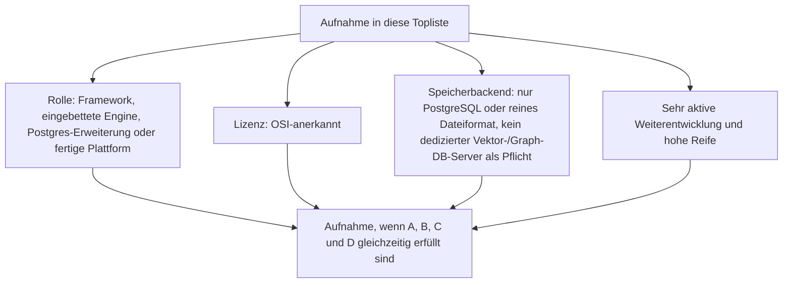
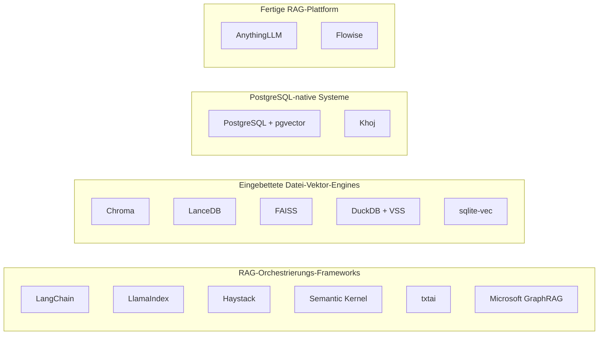
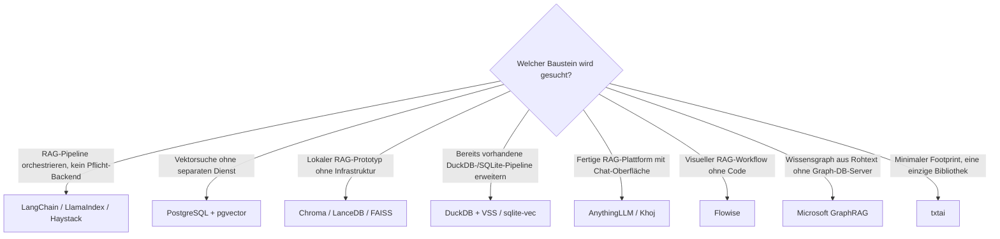

# Semantische & RAG-Wissenssysteme mit PostgreSQL- oder Dateiformat-Speicherung, aktiver Weiterentwicklung & hoher Reife — Top-15-Topliste

Die [Beste semantische & RAG-Wissenssysteme 2026 (Top 20)](semantische-rag-wissenssysteme-2026-topliste.md) rankt bewusst baustein-übergreifend — Vektordatenbanken, RAG-Frameworks, fertige Plattformen und Graph-/GraphRAG-Systeme nebeneinander, unabhängig von Lizenz und Betriebsmodell. Diese Seite wendet auf genau dieselbe Kategorie dieselben strengeren Kriterien an, die bereits mehrere Schwesterlisten etabliert haben: **nur OSI-Open-Source, Content-/Index-Persistenz ausschließlich in PostgreSQL oder einem reinen Dateiformat (kein separater Datenbankserver-Prozess für eine dedizierte Vektor- oder Graph-Datenbank), sehr aktive Weiterentwicklung, hohe Reife.**

!!! note "Hinweis: Frameworks zählen als Datei-/Postgres-kompatibel, wenn sie kein Pflicht-Backend erzwingen"
    RAG-Orchestrierungs-Frameworks (LangChain, LlamaIndex, Haystack, Semantic Kernel) besitzen kein eigenes Speicherbackend — sie binden ein beliebiges an. Sie zählen hier, weil sie in ihrer typischen Standardnutzung mit einer eingebetteten Datei-Vektor-DB (Chroma, FAISS) oder PostgreSQL/pgvector betrieben werden können, ohne ein Pflicht-Zweitsystem zu erzwingen — anders als Plattformen, die fest an eine dedizierte Vektor- oder Graph-Datenbank gekoppelt sind (siehe Ausschluss-Abschnitt).

!!! tip "Tipp: Warum diese Liste kürzer als 20 ist"
    Von den 20 Systemen der [Basis-Topliste](semantische-rag-wissenssysteme-2026-topliste.md) fallen elf heraus — dedizierte Vektor-Datenbanken mit eigenem Server-Prozess (Qdrant, Weaviate, Milvus), dedizierte Graph-Datenbanken (Neo4j, Amazon Neptune, Graphiti), proprietäre gemanagte Dienste (Pinecone, Amazon Neptune) und Systeme mit zusätzlichem Pflicht-Backend (Onyx, Dify, Open WebUI) sowie Apache Jena wegen geringer Release-Aktivität. Ergänzt um vier zusätzliche, bislang nicht gelistete Datei-/Postgres-native Bausteine (LanceDB, FAISS, DuckDB+VSS, sqlite-vec, Semantic Kernel, Khoj) reicht es dennoch nur zu 15 statt 20 Rängen.

---

## Bewertungskriterien

!!! warning "Achtung: Momentaufnahme, Stand August 2026"
    Microsoft GraphRAG (Rang 8) und sqlite-vec (Rang 15) sind die jüngsten Systeme dieser Liste — hohe Aktivität kompensiert hier noch kürzere Produktionshistorie als bei den übrigen Rängen. Vor einer Migration bestehender RAG-Pipelines die aktuelle Stabilität direkt im Repository prüfen.

---

## Top 15 im Überblick

| Rang | System | Kategorie | Lizenz | Speicherbackend | Aktivität/Reife |
|---|---|---|---|---|---|
| 1 | **LangChain** | RAG-Orchestrierungs-Framework | MIT | Kein Pflicht-Backend — typisch Chroma/pgvector | Dominantes Framework, extrem aktiv, größtes Ökosystem |
| 2 | **LlamaIndex** | RAG-Orchestrierungs-Framework | MIT | Kein Pflicht-Backend | Sehr aktiv, führend bei Property-Graph-/GraphRAG-Integration |
| 3 | **Haystack** (deepset) | RAG-Orchestrierungs-Framework | Apache-2.0 | Kein Pflicht-Backend — eingebauter `InMemoryDocumentStore` | Stärkster Enterprise-/Produktions-Fokus, reif seit 2019 |
| 4 | **[PostgreSQL + pgvector](../daten/datenbanken/pgvector-anleitung.md)** | Vektordatenbank (Erweiterung) | PostgreSQL-Lizenz | PostgreSQL direkt, kein separater Dienst | Extrem reif, kontinuierlich aktiv |
| 5 | **Chroma** | Eingebettete Vektor-Engine | Apache-2.0 | Reines Dateiformat (SQLite + Parquet, kein Server-Prozess) | Meistgenutzte Wahl für lokale RAG-Prototypen, sehr aktiv |
| 6 | **Semantic Kernel** | RAG-Orchestrierungs-Framework | MIT | Kein Pflicht-Backend | Microsoft-gestützt, sehr aktiv seit 2023 |
| 7 | **FAISS** | Eingebettete Vektor-Engine (Bibliothek) | MIT | Reines Dateiformat (Index-Datei auf Disk) | Meta-gestützt, extrem reif seit 2017, weiterhin aktiv |
| 8 | **Microsoft GraphRAG** | GraphRAG-Referenzimplementierung | MIT | Reines Dateiformat (Parquet-Output) | Meistzitierte Referenzarchitektur, sehr aktiv, jung seit 2024 |
| 9 | **LanceDB** | Eingebettete Vektor-Engine | Apache-2.0 | Reines Dateiformat (Lance-Spaltenformat auf Disk) | Sehr aktiv, u. a. Unterbau hinter Rang 10 |
| 10 | **[AnythingLLM](anythingllm-rag-plattform.md)** | RAG-Plattform | MIT | SQLite + eingebettete Datei-Vektordatenbank (LanceDB) | Aktive Discord-getriebene Entwicklung |
| 11 | **DuckDB + VSS** | Eingebettete Vektor-Engine (SQL-Erweiterung) | MIT | Reines Dateiformat (Einzeldatei-OLAP-DB) | Sehr aktiv, mature seit 2019 |
| 12 | **[Flowise](flowise-visueller-flow-builder.md)** | RAG-Plattform (Workflow) | Apache-2.0 | SQLite (Standard) oder PostgreSQL | Hohe Release-Kadenz im LangChain-Ökosystem |
| 13 | **[Khoj](khoj-ki-zweites-gehirn.md)** | RAG-Plattform (PKM-nah) | AGPL-3.0 | PostgreSQL mit pgvector | Sehr schnelle Integration neuer LLM-Fähigkeiten |
| 14 | **txtai** | RAG-Orchestrierungs-Framework (leichtgewichtig) | Apache-2.0 | Reines Dateiformat (SQLite + Faiss-Index) | Kompakt, aktiv gepflegt seit 2020 |
| 15 | **sqlite-vec** | Eingebettete Vektor-Engine (SQLite-Erweiterung) | MIT | Reines Dateiformat (direkt in SQLite) | Jung, aber sehr hohe Entwicklungsdynamik seit 2024 |

---

## Highlights im Detail

### Chroma, LanceDB, FAISS, DuckDB+VSS, sqlite-vec: der eingebettete Gegenentwurf zu Qdrant & Co.
Fünf der 15 Ränge lösen dasselbe Problem wie die aus dieser Liste ausgeschlossenen dedizierten Vektor-Datenbanken (Qdrant, Weaviate, Milvus) — Ähnlichkeitssuche über Embeddings —, aber ohne eigenen Server-Prozess: Die Daten liegen als gewöhnliche Dateien auf der Platte, das Backup ist ein Dateikopiervorgang statt eines Datenbank-Dumps. AnythingLLM (Rang 10) nutzt LanceDB (Rang 9) genau deshalb als Standard-Vektorspeicher.

### PostgreSQL + pgvector & Khoj: eine Datenbank für Relationen und Vektoren zugleich
Wie schon in der [Wiki-Engines-Speicherbackend-Topliste](wiki-engines-postgresql-dateiformat-2026-topliste.md) und der [Echtzeit-Kollaborations-Topliste](echtzeit-kollaboration-opensource-wissenssysteme-2026-topliste.md) zeigt sich dasselbe Prinzip: pgvector macht eine zweite, dedizierte Vektor-Datenbank überflüssig. Khoj (Rang 13) setzt dieses Prinzip in einer fertigen PKM-/RAG-Anwendung um, PostgreSQL + pgvector (Rang 4) ist der Baustein direkt.

### Microsoft GraphRAG: GraphRAG ohne Pflicht-Graph-Datenbank
Anders als Neo4j-basierte GraphRAG-Stacks (in der Basis-Topliste ausgeschlossen) schreibt Microsoft GraphRAG seine extrahierten Entitäten, Beziehungen und Communities standardmäßig als Parquet-Dateien — ein Wissensgraph komplett ohne separaten Graph-Datenbank-Server, solange keine Graph-Abfrage-API benötigt wird.

---

## Was bewusst nicht in dieser Liste steht

!!! warning "Achtung: Ausschluss trotz Open Source, Aktivität oder Reife"
    Von den 20 Systemen der [Basis-Topliste](semantische-rag-wissenssysteme-2026-topliste.md) fallen elf heraus:

    - **Dedizierte Vektor-Datenbank mit eigenem Server-Prozess**: Qdrant, Weaviate und Milvus lösen dasselbe Problem wie Chroma/LanceDB/FAISS, aber als zusätzlicher Pflicht-Dienst neben der eigentlichen Anwendung — Milvus benötigt zusätzlich noch etcd und MinIO.
    - **Dedizierte Graph-Datenbank als Pflicht-Backend**: Neo4j (Community Edition GPL-3.0) und Graphiti (setzt standardmäßig Neo4j oder FalkorDB voraus) fallen aus demselben Grund heraus wie MongoDB-basierte Systeme in der [breiteren Speicherbackend-Topliste](postgresql-dateiformat-wissenssysteme-2026-topliste.md#was-bewusst-nicht-in-dieser-liste-steht).
    - **Proprietär bzw. nicht selbst hostbar**: Pinecone (gemanagter Cloud-Dienst) und Amazon Neptune (proprietärer AWS-Dienst).
    - **Zusätzliches Pflicht-Backend jenseits Postgres/Datei**: Onyx (Postgres + Vespa als Suchindex) und Dify (Postgres + Redis + dedizierte Vektor-DB) — dieselbe Begründung wie in der [Speicherbackend-Topliste](postgresql-dateiformat-wissenssysteme-2026-topliste.md#was-bewusst-nicht-in-dieser-liste-steht).
    - **Lizenzausschluss**: Open WebUI (eigene Lizenz mit Branding-Pflicht, nicht OSI-anerkannt).
    - **Geringe Release-Aktivität trotz Reife**: Apache Jena — etablierteste Open-Source-Basis für klassische SPARQL-Wissensgraphen, aber deutlich ruhigere Release-Kadenz als die übrigen Ränge dieser Liste.

---

## Entscheidungshilfe nach Anwendungsfall

---

## 🔗 Verwandte Themen

- [Startseite](../../index.md) — zurück zur Dokumentations-Zentrale
- [Beste semantische & RAG-Wissenssysteme 2026 (Top 20)](semantische-rag-wissenssysteme-2026-topliste.md) — Basis-Topliste ohne Lizenz-/Speicherbackend-/Aktivitätsfilter
- [Evolution und Architekturen digitaler Semantischer & RAG-Wissenssysteme](evolution-digitaler-semantische-rag-wissenssysteme.md) — chronologisches Generationenmodell als Hintergrund
- [Open-Source-Wissenssysteme mit PostgreSQL- oder Dateiformat-Speicherung (Top 20)](postgresql-dateiformat-wissenssysteme-2026-topliste.md) — dieselben Speicherkriterien für die breitere Wissenssysteme-Klasse
- [Wiki-Engines mit PostgreSQL- oder Dateiformat-Speicherung (Top 15)](wiki-engines-postgresql-dateiformat-2026-topliste.md) — dieselben Kriterien, enger gefasst auf klassische Wiki-Engines
- [Bidirektionale Wissensgraphen & Real-time Block-Editoren (Top 15)](bidirektionale-wissensgraphen-realtime-block-editoren-2026-topliste.md) — dieselben Kriterien, enger gefasst auf PKM-Werkzeuge
- [PostgreSQL + pgvector](../daten/datenbanken/pgvector-anleitung.md) — vertiefend zu Rang 4
- [Khoj: KI-„Zweites Gehirn" für persönliche Wissenssuche](khoj-ki-zweites-gehirn.md) — vertiefend zu Rang 13
- [AnythingLLM: All-in-One Desktop- & Docker-RAG-Plattform](anythingllm-rag-plattform.md) — vertiefend zu Rang 10
- [Flowise: Visueller Flow-Builder für LangChain](flowise-visueller-flow-builder.md) — vertiefend zu Rang 12
- [Wissensdatenbanken mit KI & semantischer Suche](wissensdatenbanken-ki-semantische-suche.md) — technische Mechanismen hinter mehreren Rängen dieser Liste
- [Visuelle, Local-First & agentische Wissenssysteme mit PostgreSQL-/Dateiformat-Speicherung (Top 15)](visuell-agentische-wissenssysteme-postgresql-dateiformat-2026-topliste.md) — dieselbe Framework-Behandlung (kein Pflicht-Backend), Überschneidung bei Letta/Mem0/Zep als agentisches Gedächtnis
- [Frameworks & Bibliotheken für Wissenssysteme mit PostgreSQL-/Dateiformat-Speicherung (Top 16)](wissenssystem-frameworks-postgresql-dateiformat-2026-topliste.md) — Überschneidung bei Haystack, txtai, LlamaIndex und Sentence-Transformers auf Bibliotheksebene
- [Multi-Agenten-Wissensökosysteme mit PostgreSQL-/Dateiformat-Speicherung (Top 14)](multiagenten-wissensoekosysteme-postgresql-dateiformat-2026-topliste.md) — dieselbe Framework-Behandlung, enger auf Multi-Agenten-Orchestrierung statt RAG-Bausteine gefasst
- [Rust-Bausteine für Wissenssysteme mit PostgreSQL-/Dateiformat-Speicherung (Top 15)](rust-wissenssysteme-postgresql-dateiformat-2026-topliste.md) — Überschneidung bei LanceDB und Candle auf Bibliotheksebene
