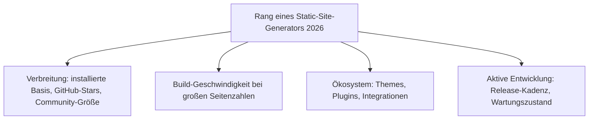
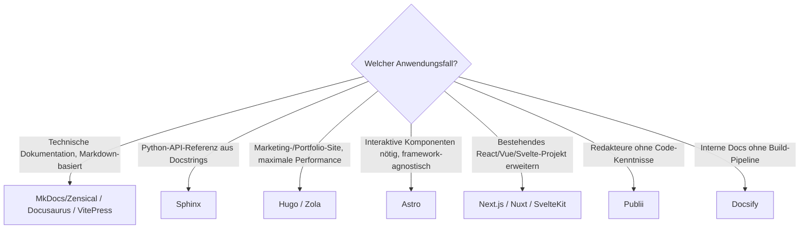

# Beste Static-Site- & Docs-Generatoren 2026 — Top-20-Topliste

Die [Evolution und Architekturen digitaler Static-Site-Generatoren](evolution-digitaler-static-site-generatoren.md) ordnet diese Werkzeuggattung chronologisch nach Rendering-Architektur. Diese Seite übersetzt die Chronologie in eine **Momentaufnahme 2026**: die 20 Static-Site- und Docs-Generatoren mit der größten Verbreitung, aktivsten Weiterentwicklung und breitesten Einsatzfähigkeit — sortiert nach Gesamteignung, nicht nach Erscheinungsjahr.

!!! note "Hinweis: Allgemeine SSGs und Docs-Generatoren gemeinsam gerankt"
    Anders als die [Docs-as-Code-Toplisten-Perspektive](evolution-digitaler-docs-as-code.md) filtert diese Seite nicht auf technische Dokumentation — sie rankt die gesamte Kategorie: Blog-/Marketing-Site-Generatoren (Hugo, Eleventy) neben reinen Docs-Werkzeugen (Sphinx, MkDocs/Zensical) gleichberechtigt nebeneinander.

---

## Bewertungskriterien

!!! warning "Achtung: Momentaufnahme, Stand August 2026"
    Besonders im JavaScript-Ökosystem (Rang 3–4, 11–13) verschieben sich Marktanteile schnell — vor einer Langzeitentscheidung aktuelle Download-Zahlen und Roadmap des jeweiligen Projekts prüfen.

---

## Top 20 im Überblick

| Rang | System | Sprache | Kategorie | Besondere Stärke |
|---|---|---|---|---|
| 1 | **Astro** | Node.js/JavaScript | Allgemein (Islands Architecture) | Framework-agnostisch, Zero-JS-by-default, größte Dynamik im Ökosystem |
| 2 | **Hugo** | Go | Allgemein | Nach wie vor eine der schnellsten Build-Zeiten der gesamten Kategorie |
| 3 | **Next.js** (Static Export) | React/Node.js | Allgemein (Hybrid) | Größtes Ökosystem via React, nahtloser Wechsel zwischen statisch und serverseitig |
| 4 | **Eleventy (11ty)** | Node.js/JavaScript | Allgemein | Zero-Config-Philosophie, keine feste Templating-Sprache vorgeschrieben |
| 5 | **VitePress** | Vue/Node.js (Vite) | Docs-Generator | Vite-basierte Geschwindigkeit, offizielles Vue-Docs-Werkzeug |
| 6 | **[Docusaurus](evolution-digitaler-docs-as-code.md#generation-4-komponentenbasierte-interaktive-docs-frameworks-2020-2023)** | React/Node.js | Docs-Generator | Dominant für versionierte Open-Source-Projekt-Dokumentation mit MDX |
| 7 | **Zola** | Rust | Allgemein | Single-Binary ohne Abhängigkeiten, vergleichbare Performance zu Hugo |
| 8 | **MkDocs / Zensical** | Python / Rust+Python | Docs-Generator | Zensical als Rust-Kern-Nachfolger von MkDocs — auch die Basis dieses Repositories |
| 9 | **Sphinx** | Python | Docs-Generator | Nach wie vor Standard für Python-API-Dokumentation aus Docstrings |
| 10 | **Nuxt** (Static Generate) | Vue/Node.js | Allgemein (Hybrid) | Vue-Ökosystem-Pendant zu Next.js, ausgereifte Hybrid-Modi |
| 11 | **SvelteKit** (Static Adapter) | Svelte/Node.js | Allgemein (Hybrid) | Steigende Verbreitung durch Sveltes wachsende Popularität |
| 12 | **Jekyll** | Ruby | Allgemein | Nach wie vor größte installierte Basis durch native GitHub-Pages-Integration |
| 13 | **Gatsby** | React/Node.js | Allgemein | GraphQL-Datenschicht bleibt einzigartig für heterogene Content-Quellen |
| 14 | **Publii** | Electron (Node.js) | Allgemein (GUI) | Einzige Desktop-GUI-Lösung dieser Liste — kein Code nötig für Redakteure |
| 15 | **Hexo** | Node.js | Allgemein (Blog) | Sehr starke Verbreitung im asiatischen Blogging-Ökosystem |
| 16 | **Docsify** | JavaScript (kein Build-Schritt) | Docs-Generator | Rendert Markdown zur Laufzeit im Browser — kein Build-Prozess nötig |
| 17 | **Pelican** | Python | Allgemein (Blog) | Etablierte Python-Alternative zu Jekyll im wissenschaftlichen Umfeld |
| 18 | **Middleman** | Ruby | Allgemein | Flexibleres Templating als Jekyll für Nicht-Blog-Websites |
| 19 | **Metalsmith** | Node.js/JavaScript | Allgemein (Pipeline) | Radikal minimalistisch — jede Funktion ein austauschbares Plugin |
| 20 | **Nanoc** | Ruby | Allgemein (Pipeline) | Älteste noch aktiv gepflegte Pipeline-basierte Alternative zu Jekyll |

---

## Highlights im Detail

### Astro: der größte Aufsteiger seit 2021
[Astro](evolution-digitaler-static-site-generatoren.md#generation-5-islands-architecture-partial-hydration-2017-2023) hat die Islands-Architecture von einer Nische zum Mainstream-Muster gemacht — die Fähigkeit, React-, Vue- und Svelte-Komponenten in derselben Seite zu kombinieren, ohne sich auf ein Framework festzulegen, macht es 2026 zur ersten Wahl für neue Projekte ohne bestehende Framework-Bindung.

### MkDocs/Zensical: die Referenz dieses Repositories
Rang 8 ist keine zufällige Wahl — Wissen Ahrensburg selbst nutzt **Zensical**, den Rust-Kern-Nachfolger von MkDocs + Material, siehe `CLAUDE.md` und [Generation 6 der Static-Site-Generatoren-Zeitachse](evolution-digitaler-static-site-generatoren.md#generation-6-ki-native-agentische-static-site-generatoren-ab-2024).

### Docsify: der einzige Vertreter ohne Build-Schritt
Alle anderen 19 Systeme dieser Liste kompilieren Quelltexte zu statischem HTML. Docsify bricht mit diesem Grundprinzip der gesamten Kategorie und rendert Markdown clientseitig zur Laufzeit — praktisch für schnelle interne Docs ohne CI/CD-Pipeline, aber ungeeignet für SEO-kritische öffentliche Seiten ohne zusätzliches Pre-Rendering.

---

## Entscheidungshilfe nach Anwendungsfall

!!! tip "Tipp: Rendering-Architektur vor Ökosystem entscheiden"
    Wer zwischen mehreren Kandidaten dieser Liste schwankt, sollte zuerst die [Rendering-Architektur-Frage](evolution-digitaler-static-site-generatoren.md#1-hydration-modell) klären (volle Hydration vs. Islands vs. keine Hydration) — das Ökosystem (Themes, Plugins) lässt sich nachträglich meist noch anpassen, die Grundarchitektur nicht.

---

## 🔗 Verwandte Themen

- [Startseite](../../index.md) — zurück zur Dokumentations-Zentrale
- [Evolution und Architekturen digitaler Static-Site-Generatoren](evolution-digitaler-static-site-generatoren.md) — chronologisches Generationenmodell, dessen aktuellen Stand diese Topliste zusammenfasst
- [Evolution und Architekturen digitaler Docs-as-Code](evolution-digitaler-docs-as-code.md) — Schwester-Chronologie mit Fokus auf technische Dokumentation statt allgemeine Static-Site-Generierung
- [Beste Programmiersprachen für moderne Wissenssysteme (Top 10)](programmiersprachen-wissenssysteme-topliste.md) — Sprachökosystem-Pendant, das mehrere Sprachen aus dieser Liste (Go, Rust, Ruby, Python, JavaScript) vertieft
- [Beste Open-Source-Wissenssysteme für den eigenen Selfhosting-Server (Top 20)](wissenssysteme-selfhosting-server-topliste.md) — angrenzende Topliste für Wissenssysteme jenseits reiner Static-Site-Generierung
- [Evolution und Architekturen digitaler SPA-Frameworks](../../entwicklung/webentwicklung/evolution-digitaler-spa-frameworks.md) — React/Vue/Svelte-Grundlagen hinter Rang 1, 3, 10, 11, 13
- [Evolution und Architekturen digitaler Rust-Wissenssysteme](evolution-digitaler-rust-wissenssysteme.md) — vertiefend zu Rang 7 (Zola) und Rang 8 (Zensical)
