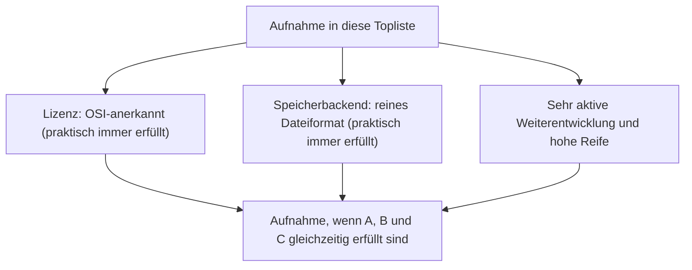
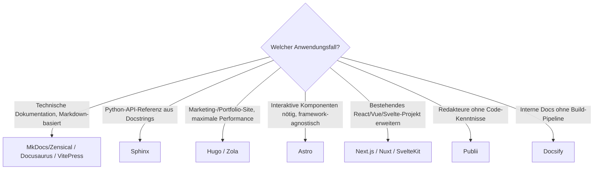

# Static-Site-Generatoren mit PostgreSQL- oder Dateiformat-Speicherung, aktiver Weiterentwicklung & hoher Reife — Top-16-Topliste

Die [Beste Static-Site- & Docs-Generatoren 2026 (Top 20)](static-site-generatoren-2026-topliste.md) rankt die gesamte Kategorie nach Verbreitung, Build-Geschwindigkeit und Ökosystemgröße. Diese Seite wendet die inzwischen etablierten strengeren Kriterien an — nur OSI-Open-Source, Persistenz ausschließlich in PostgreSQL oder einem reinen Dateiformat, sehr aktive Weiterentwicklung, hohe Reife.

!!! note "Hinweis: Speicherkriterium ist bei Static-Site-Generatoren praktisch immer erfüllt"
    Jeder Static-Site-Generator liest per Definition Quelldateien und schreibt statisches HTML — ein Datenbankdienst kommt in dieser Werkzeugklasse architektonisch nicht vor. Alle 20 Systeme der Basis-Topliste sind zudem OSI-lizenziert. Der einzige relevante Filter dieser Seite ist deshalb **Entwicklungsaktivität**.

---

## Bewertungskriterien

!!! warning "Achtung: Momentaufnahme, Stand August 2026 — bewusst kürzer als 20"
    Von den 20 Systemen der [Basis-Topliste](static-site-generatoren-2026-topliste.md) fallen vier ausschließlich wegen geringerer Aktivität heraus: Jekyll (deutlich verlangsamtes Entwicklungstempo gegenüber Hugo/Docusaurus, siehe [Workspace-/Docs-as-Code-Speicherbackend-Topliste](workspace-kollaboration-docs-as-code-2026-topliste.md#was-bewusst-nicht-in-dieser-liste-steht)), Gatsby (spürbar reduzierte Aktivität seit der Netlify-Übernahme 2023), Middleman und Metalsmith (beide deutlich ruhiger als vergleichbare Alternativen im jeweiligen Ökosystem).

---

## Top 16 im Überblick

| Rang | System | Sprache | Lizenz | Speicherbackend |
|---|---|---|---|---|
| 1 | **Astro** | Node.js/JavaScript | MIT | Reines Dateiformat |
| 2 | **Hugo** | Go | Apache-2.0 | Reines Dateiformat |
| 3 | **Next.js** (Static Export) | React/Node.js | MIT | Reines Dateiformat |
| 4 | **Eleventy** (11ty) | Node.js/JavaScript | MIT | Reines Dateiformat |
| 5 | **VitePress** | Vue/Node.js (Vite) | MIT | Reines Dateiformat |
| 6 | **Docusaurus** | React/Node.js | MIT | Reines Dateiformat |
| 7 | **Zola** | Rust | MIT | Reines Dateiformat |
| 8 | **MkDocs / Zensical** | Python / Rust+Python | BSD-3-Clause (MkDocs) | Reines Dateiformat — auch die Basis dieses Repositorys |
| 9 | **Sphinx** | Python | BSD-2-Clause | Reines Dateiformat |
| 10 | **Nuxt** (Static Generate) | Vue/Node.js | MIT | Reines Dateiformat |
| 11 | **SvelteKit** (Static Adapter) | Svelte/Node.js | MIT | Reines Dateiformat |
| 12 | **Publii** | Electron (Node.js) | GPL-3.0 | Reines Dateiformat |
| 13 | **Hexo** | Node.js | MIT | Reines Dateiformat |
| 14 | **Docsify** | JavaScript (kein Build-Schritt) | MIT | Reines Dateiformat |
| 15 | **Pelican** | Python | AGPL-3.0 | Reines Dateiformat |
| 16 | **Nanoc** | Ruby | MIT | Reines Dateiformat |

---

## Highlights im Detail

### Diese Liste bestätigt: Speicherkriterium und Lizenz sind hier kein echter Filter
Anders als bei den meisten Speicherbackend-Toplisten dieser Reihe scheitert kein einziges System dieser Kategorie an Lizenz oder Speicherbackend — alle vier Ausschlüsse sind reine Aktivitäts-Fälle. Das bestätigt dieselbe Beobachtung wie bei den [IPython-/Jupyter-Systemen](ipython-jupyter-postgresql-dateiformat-2026-topliste.md) und den [R-Markdown-/Quarto-Werkzeugen](rmarkdown-quarto-postgresql-dateiformat-2026-topliste.md): Manche Werkzeugklassen sind architektonisch bereits auf Dateiformat und Offenheit angelegt.

### Nanoc: alt, aber laut Basis-Topliste selbst weiterhin aktiv gepflegt
Anders als Middleman und Metalsmith, die für dieselbe Generation stehen, aber hier ausgeschlossen wurden, bescheinigt die Basis-Topliste Nanoc explizit fortlaufende aktive Pflege trotz seines Alters — ein Beleg dafür, dass Alter allein kein Ausschlussgrund ist, solange die Kontinuität nachweisbar bleibt (dasselbe Prinzip wie bei DokuWiki oder TiddlyWiki in den Wiki-Speicherbackend-Toplisten).

---

## Entscheidungshilfe nach Anwendungsfall

---

## 🔗 Verwandte Themen

- [Startseite](../../index.md) — zurück zur Dokumentations-Zentrale
- [Beste Static-Site- & Docs-Generatoren 2026 (Top 20)](static-site-generatoren-2026-topliste.md) — Basis-Topliste ohne Aktivitätsfilter
- [Workspace-, Kollaborations- & Docs-as-Code-Plattformen (Top 20)](workspace-kollaboration-docs-as-code-2026-topliste.md) — Überschneidung im Docs-as-Code-Hosting-Cluster (MkDocs, Docusaurus, Hugo, VitePress u. a.)
- [Rust-Bausteine für CMS mit PostgreSQL-/Dateiformat-Speicherung (Top 12)](rust-cms-postgresql-dateiformat-2026-topliste.md) — Zola dort im generatorübergreifenden Rust-Kontext
- [Rust-Bausteine für Wissenssysteme mit PostgreSQL-/Dateiformat-Speicherung (Top 15)](rust-wissenssysteme-postgresql-dateiformat-2026-topliste.md) — Zensical/Zola dort ebenfalls vertreten
- [Open-Source-Wissenssysteme mit PostgreSQL- oder Dateiformat-Speicherung (Top 20)](postgresql-dateiformat-wissenssysteme-2026-topliste.md) — dieselben Speicherkriterien für die breitere Wissenssysteme-Klasse
