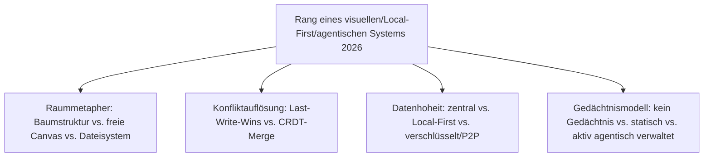
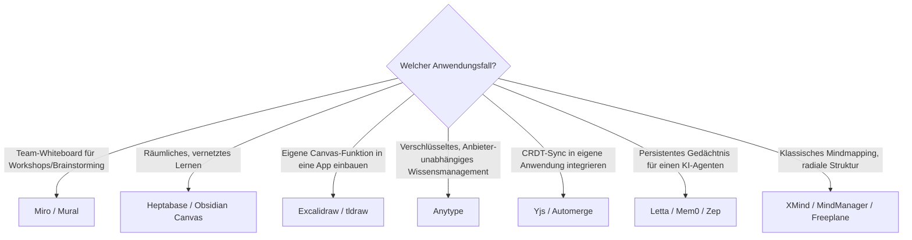

# Beste visuelle, Local-First & agentische Wissenssysteme 2026 — Top-20-Topliste

Die [Evolution und Architekturen digitaler Visueller, Local-First & Agentischer Wissenssysteme](evolution-digitaler-visuell-agentische-wissenssysteme.md) verfolgt drei zunächst getrennte Architektur-Stränge — **räumliche Notizführung**, **konfliktfreie Offline-Synchronisation** und **autonome Agenten-Gedächtnisse** —, die erst in der Gegenwart zusammenfließen. Diese Seite übersetzt alle drei Stränge in eine gemeinsame **Momentaufnahme 2026**: 20 Systeme, quer über Canvas-Werkzeuge, CRDT-Bausteine und agentische Speicherarchitekturen hinweg.

!!! note "Hinweis: Architektur-Achse statt Verlinkungs-Achse"
    Wie die zugrunde liegende Evolution-Chronologie selbst betont, überschneidet sich diese Liste an mehreren Stellen mit der [PKM-Wissensgraphen-Topliste](pkm-wissensgraphen-2026-topliste.md) (Anytype, Heptabase, Obsidian Canvas, Letta erscheinen dort ebenfalls) — hier stehen sie im Kontext der **Canvas-/Sync-/Agenten-Architektur**, dort im Kontext des **Verlinkungs-/Block-Editor-Paradigmas**. Dieselben Werkzeuge, zwei unterschiedliche Bewertungsdimensionen.

---

## Bewertungskriterien

!!! warning "Achtung: Naive-Sync-Systeme aus Generation 2 als historische Warnung"
    Rang 15–17 (Evernote früh, Simplenote, Notational Velocity) stehen hier auch als **Negativbeispiel**: Ihr Last-Write-Wins-Sync-Modell verlor bei gleichzeitiger Offline-Bearbeitung nachweislich Daten — genau das Problem, das CRDTs (Rang 9–10) und Local-First-Architekturen (Rang 5–8) später lösen. **Stand: August 2026.**

---

## Top 20 im Überblick

| Rang | System | Generation | Architektur-Prinzip | Besondere Stärke |
|---|---|---|---|---|
| 1 | **Miro** | 1c (Team-Whiteboards) | Cloud-zentrierte Mehrbenutzer-Leinwand | Größte Marktdurchdringung unter den kollaborativen Whiteboards |
| 2 | **Heptabase** | 5 (Unendliche Canvas) | Räumliche Anordnung strukturierter Notizkarten | Explizit für vernetztes Lernen konzipiert, Karteikarten aus Notizen automatisch generiert |
| 3 | **Obsidian Canvas** | 5 (Unendliche Canvas) | Räumliche Ebene über einem dateibasierten Markdown-Vault | Verbindet Canvas-Darstellung mit vollständiger Datenhoheit des zugrunde liegenden Vaults |
| 4 | **Excalidraw** | 1c/5 (Canvas) | Open-Source-Zeichenfläche, oft eingebettet | Meistgenutzte Open-Source-Canvas-Engine, häufig als Baustein anderer Tools eingebettet |
| 5 | **Anytype** | 4 (Local-First & P2P) | Verschlüsselte, objektbasierte Wissensdatenbank auf IPFS-Basis | Konsequenteste Umsetzung des Local-First-Manifests für persönliches Wissensmanagement |
| 6 | **Letta** (ehem. MemGPT) | 6 (Agentische Gedächtnissysteme) | Seitenweise verwaltetes virtuelles Agenten-Gedächtnis | Produktisierte Referenzarchitektur für persistentes LLM-Agenten-Gedächtnis |
| 7 | **Mem0** | 6 (Agentische Gedächtnissysteme) | Agentic-Memory-as-a-Service | Langzeitgedächtnis als eigenständiger, in beliebige Agenten-Stacks einbindbarer Dienst |
| 8 | **Zep** | 6 (Agentische Gedächtnissysteme) | Spezialisierte Agentic-Memory-Infrastruktur | Starker Fokus auf zeitlich strukturiertes Gedächtnis für Produktions-Agenten |
| 9 | **Yjs** | 3 (CRDT-Forschung & Praxisreife) | Performance-optimierte CRDT-Bibliothek | Häufigste CRDT-Grundlage in modernen Block-Editoren und Canvas-Tools |
| 10 | **Automerge** | 3 (CRDT-Forschung & Praxisreife) | JSON-artige CRDT-Dokumente | Erste breit nutzbare CRDT-Bibliothek, weiterhin aktiv in Local-First-Apps |
| 11 | **tldraw** | 5 (Unendliche Canvas) | Einbettbares Infinite-Canvas-SDK | Führendes Entwickler-Toolkit zum Einbau eigener Canvas-Funktionen in andere Anwendungen |
| 12 | **XMind** | 1b (Freie Mindmapping-Software) | Radiale Baumstruktur, lokale Speicherung | Meistgenutzte kommerzielle Mindmapping-Software mit großer Vorlagenbibliothek |
| 13 | **Mural** | 1c (Team-Whiteboards) | Cloud-zentrierte Mehrbenutzer-Leinwand | Etablierte Miro-Alternative mit Enterprise-Fokus |
| 14 | **MindManager** | 1a (Radiale Mindmaps) | Radiale Baumstruktur, proprietäre Desktop-App | Bis heute im Enterprise-Umfeld verbreitetste kommerzielle Mindmapping-Lösung |
| 15 | **Freeplane** | 1b (Freie Mindmapping-Software) | Radiale Baumstruktur, Open Source | Aktivst gepflegter FreeMind-Fork, weiterhin kostenlose Referenz der Kategorie |
| 16 | **Actual Budget** | 4 (Local-First & P2P) | CRDT-basierte lokale Datenhaltung außerhalb PKM | Referenzimplementierung des Local-First-Prinzips als domänenübergreifendes Architekturmuster |
| 17 | **Evernote** (frühe Architektur als Referenzfall) | 2 (Naive Mehrgeräte-Synchronisation) | Proprietärer Sync-Server, Last-Write-Wins | Historisch prägendstes Beispiel für die Grenzen naiver Cloud-Synchronisation |
| 18 | **Simplenote** | 2 (Naive Mehrgeräte-Synchronisation) | Proprietärer Sync-Server, Last-Write-Wins | Minimalistische, bis heute betriebene Fortsetzung derselben frühen Architektur |
| 19 | **Notational Velocity / nvALT** | 2 (Naive Mehrgeräte-Synchronisation) | Dropbox-Ordner mit Klartextdateien | Konzeptioneller Vorläufer heutiger dateibasierter PKM-Tools, ganz ohne echten Konfliktschutz |
| 20 | **Inspiration** | 1a (Radiale Mindmaps) | Radiale Baumstruktur, Desktop-App seit 1988 | Älteste noch vertriebene Software dieser Liste, Ursprung der gesamten Mindmapping-Kategorie |

---

## Highlights im Detail

### Rang 2–4, 11: Canvas als eigenständige, wachsende Architekturschicht
Heptabase, Obsidian Canvas, Excalidraw und tldraw zeigen 2026 zwei parallele Entwicklungen derselben Grundidee: fertige Endnutzer-Anwendungen (Heptabase, Obsidian Canvas) einerseits, einbettbare Entwickler-Bausteine (Excalidraw, tldraw) andererseits — Letztere erklären, warum die Infinite-Canvas-Metapher inzwischen in immer mehr fremden Anwendungen auftaucht, ohne dass jedes Team eine eigene Canvas-Engine bauen muss.

### Rang 6–8: agentisches Gedächtnis wird zur eigenständigen Infrastrukturkategorie
Letta, Mem0 und Zep lösen alle dasselbe Grundproblem — Wissen soll über einzelne Agenten-Sitzungen hinweg persistent bleiben —, aber mit unterschiedlichem Integrationsgrad: Letta produktisiert die vollständige MemGPT-Architektur, Mem0 und Zep bieten Gedächtnis als schlankeren, in bestehende Agenten-Frameworks einbindbaren Dienst.

### Rang 17–19: die Kategorie, die Local-First überhaupt erst nötig machte
Evernote (frühe Architektur), Simplenote und Notational Velocity/nvALT stehen bewusst am Ende dieser Liste — nicht wegen fehlender historischer Bedeutung, sondern weil ihr Last-Write-Wins-Sync-Modell exakt das Problem demonstriert, dessen Lösung Generation 3/4 dieser Zeitachse (CRDT, Local-First) erst motivierte.

---

## Entscheidungshilfe nach Anwendungsfall

!!! tip "Tipp: PKM-Perspektive ergänzend prüfen"
    Wer eines dieser Systeme primär als persönliches Notizwerkzeug statt als Architektur-Baustein bewertet, findet in der [PKM-Wissensgraphen-Topliste 2026](pkm-wissensgraphen-2026-topliste.md) dieselben Kandidaten aus einer nutzungsorientierten Perspektive.

---

## 🔗 Verwandte Themen

- [Startseite](../../index.md) — zurück zur Dokumentations-Zentrale
- [Evolution und Architekturen digitaler Visueller, Local-First & Agentischer Wissenssysteme](evolution-digitaler-visuell-agentische-wissenssysteme.md) — chronologisches Generationenmodell, dessen aktuellen Stand diese Topliste zusammenfasst
- [Visuelle, Local-First & agentische Wissenssysteme mit PostgreSQL-/Dateiformat-Speicherung (Top 15)](visuell-agentische-wissenssysteme-postgresql-dateiformat-2026-topliste.md) — dieselbe Kategorie, strenger gefiltert nach Lizenz, Speicherbackend und Entwicklungsaktivität
- [Beste PKM-Wissensgraphen & Block-Editoren 2026 (Top 20)](pkm-wissensgraphen-2026-topliste.md) — Schwester-Topliste entlang der Verlinkungs-/Block-Editor-Achse
- [Beste Multi-Agenten-Wissensökosysteme 2026 (Top 20)](multiagenten-wissensoekosysteme-2026-topliste.md) — Orchestrierungsperspektive auf dieselben Agenten-Gedächtnissysteme (Rang 6–8)
- [Beste semantische & RAG-Wissenssysteme 2026 (Top 20)](semantische-rag-wissenssysteme-2026-topliste.md) — analoges Ranking für Generation 4 der Evolution-Chronologie
- [LLM-Wiki-Pattern (Karpathy-Muster)](llm-wiki-pattern-karpathy.md) — verwandtes Persistenzprinzip auf Team-/Repository-Ebene
- [AI Agents – Das Praxis-Handbuch & Architektur-Leitfaden](../../künstliche-intelligenz/coding/ai-agents-praxis.md) — Vertiefung zu Rang 6–8
