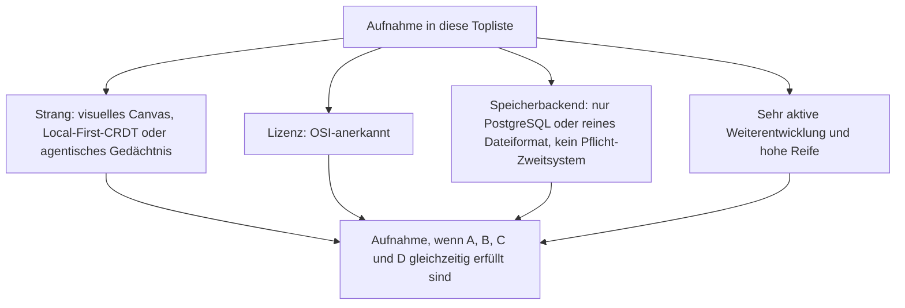
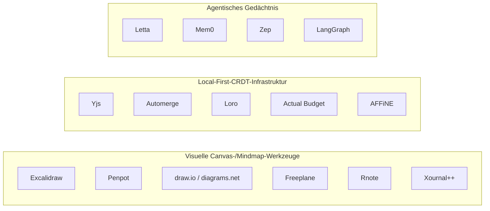
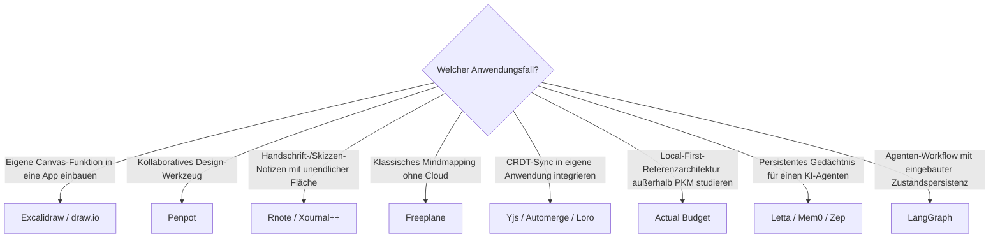

# Visuelle, Local-First & Agentische Wissenssysteme mit PostgreSQL- oder Dateiformat-Speicherung, aktiver Weiterentwicklung & hoher Reife — Top-15-Topliste

Die [Beste visuelle, Local-First & agentische Wissenssysteme 2026 (Top 20)](visuell-agentische-wissenssysteme-2026-topliste.md) rankt drei Architektur-Stränge gemeinsam — räumliche Canvas-Werkzeuge, CRDT-Bausteine für konfliktfreie Offline-Synchronisation und autonome Agenten-Gedächtnisse —, unabhängig von Lizenz. Diese Seite wendet auf genau dieselben drei Stränge die inzwischen etablierten strengeren Kriterien an: nur OSI-Open-Source, Content-/Zustands-Persistenz ausschließlich in PostgreSQL oder einem reinen Dateiformat, sehr aktive Weiterentwicklung, hohe Reife.

!!! note "Hinweis: Nur OSI-anerkannte Lizenzen"
    Wie in der [Gesamtübersicht](open-source-llm-agent-mcp-systeme.md) zählen hier ausschließlich Systeme unter einer OSI-anerkannten Open-Source-Lizenz (MIT, GPL, LGPL, AGPL, BSD, Apache-2.0, MPL-2.0). Das kostet dieser Liste die meisten proprietären Marktführer der Basis-Topliste (Miro, Heptabase, Obsidian, Mural, XMind, MindManager, Evernote, Simplenote, Inspiration) sowie Anytype (Lizenzstatus 2026 nicht durchgängig OSI-konform) und tldraw (eigene, nicht vollständig permissive Lizenz für den gehosteten Sync-Dienst seit einer neueren Version).

!!! tip "Tipp: CRDT-Bibliotheken und Agenten-Gedächtnis-Dienste zählen als Datei-/Postgres-kompatibel, wenn sie kein Pflicht-Backend erzwingen"
    Yjs, Automerge, Loro, Mem0 und LangGraph besitzen kein eigenes festes Speicherbackend — sie binden ein beliebiges an. Sie zählen hier, weil ihre typische Standardnutzung mit Datei-Persistenz (LevelDB, Snapshot-Dateien, SQLite-Checkpoints) oder PostgreSQL auskommt, ohne ein Pflicht-Zweitsystem zu erzwingen — dieselbe Logik wie bei den RAG-Frameworks in der [Speicherbackend-Topliste für semantische Systeme](semantische-rag-wissenssysteme-postgresql-dateiformat-2026-topliste.md).

---

## Bewertungskriterien

!!! warning "Achtung: Momentaufnahme, Stand August 2026 — bewusst kürzer als 20"
    Von den 20 Systemen der [Basis-Topliste](visuell-agentische-wissenssysteme-2026-topliste.md) fallen zwölf allein wegen fehlender OSI-Lizenz heraus, zwei weitere (tldraw, Notational Velocity/nvALT) wegen Lizenz- bzw. Aktivitätsproblemen. Ergänzt um sieben zusätzliche, bislang nicht gelistete Open-Source-Bausteine (Penpot, draw.io/diagrams.net, Rnote, Xournal++, Loro, LangGraph sowie die Wiederaufnahme von AFFiNE aus anderen Toplisten dieser Dokumentation) reicht es dennoch nur zu 15 statt 20 Rängen.

---

## Top 15 im Überblick

| Rang | System | Strang | Lizenz | Speicherbackend | Aktivität/Reife |
|---|---|---|---|---|---|
| 1 | **Excalidraw** | Visuell | MIT | Reines Dateiformat (`.excalidraw`-JSON) | Meistgenutzte Open-Source-Canvas-Engine, sehr aktiv |
| 2 | **Yjs** | Local-First | MIT | Kein Pflicht-Backend — typisch LevelDB-Datei/IndexedDB | Häufigste CRDT-Grundlage moderner Block-Editoren, extrem aktiv |
| 3 | **AFFiNE** | Local-First/Visuell | MIT | PostgreSQL (Selfhosting) | Blocks und Whiteboard vereint, wöchentliche Canary-Builds |
| 4 | **Letta** (ehem. MemGPT) | Agentisch | Apache-2.0 | PostgreSQL (Produktion) oder SQLite (lokal) | Produktisierte MemGPT-Referenzarchitektur, sehr aktiv |
| 5 | **Automerge** | Local-First | MIT | Kein Pflicht-Backend — Dokumente als Binärdatei serialisierbar | Erste breit nutzbare CRDT-Bibliothek, weiterhin aktiv |
| 6 | **Penpot** | Visuell | MPL-2.0 | PostgreSQL (Redis nur als Cache) | Echtzeit-Multiplayer-Design, aktiv |
| 7 | **Mem0** | Agentisch | Apache-2.0 | Kein Pflicht-Backend — typisch PostgreSQL/pgvector oder Datei-Vektor-DB | Agentic-Memory-as-a-Service, sehr aktiv |
| 8 | **Zep** | Agentisch | Apache-2.0 | PostgreSQL | Zeitlich strukturiertes Gedächtnis für Produktions-Agenten |
| 9 | **draw.io / diagrams.net** | Visuell | Apache-2.0 | Reines Dateiformat (`.drawio`-XML) | Native Echtzeit-Kollaboration via WebRTC, aktiv |
| 10 | **LangGraph** | Agentisch | MIT | Checkpointing via SQLite oder PostgreSQL | Agenten-Orchestrierung mit eingebauter Zustandspersistenz, extrem aktiv |
| 11 | **Actual Budget** | Local-First | MIT | SQLite-Datei (lokal + Sync-Server) | Referenzimplementierung des Local-First-Prinzips außerhalb PKM |
| 12 | **Loro** | Local-First | MIT/Apache-2.0 | Kein Pflicht-Backend — Snapshot-Export als Datei | Jung, aber sehr hohe Entwicklungsdynamik |
| 13 | **Rnote** | Visuell | GPL-3.0 | Reines Dateiformat (`.rnote`) | Aktiv gepflegtes Skizzen-/Notiz-Werkzeug mit unendlicher Canvas |
| 14 | **Xournal++** | Visuell | GPL-2.0 | Reines Dateiformat (`.xopp`) | Mature seit 2013, weiterhin aktive Handschrift-/Notiz-Referenz |
| 15 | **Freeplane** | Visuell | GPL-2.0 | Reines Dateiformat (`.mm`-XML) | Aktivst gepflegter FreeMind-Fork, solide statt rasante Kadenz |

---

## Highlights im Detail

### Yjs, Automerge & Loro: die CRDT-Infrastruktur hinter der halben Dokumentation
Yjs ist keine abstrakte Bibliothek für diese Dokumentation — sie steckt bereits als Unterbau in AFFiNE (Rang 3), HedgeDoc, Docmost und Nextcloud Text aus anderen Toplisten dieser Reihe. Zusammen mit Automerge (Rang 5) und dem jüngeren, performance-fokussierten Loro (Rang 12) zeigt diese Liste die gesamte CRDT-Werkzeugkette, die hinter praktisch jedem Real-time-Kollaborationssystem der [Echtzeit-Kollaborations-Topliste](echtzeit-kollaboration-opensource-wissenssysteme-2026-topliste.md) steckt.

### Letta, Mem0, Zep & LangGraph: agentisches Gedächtnis wird PostgreSQL-nativ
Alle vier Systeme lösen dasselbe Grundproblem — Wissen soll über einzelne Agenten-Sitzungen hinweg persistent bleiben — und alle vier kommen 2026 ohne dedizierte Vektor- oder Graph-Datenbank als Pflicht-Backend aus. Das ist kein Zufall: pgvector (siehe [Semantische-RAG-Speicherbackend-Topliste](semantische-rag-wissenssysteme-postgresql-dateiformat-2026-topliste.md)) hat den architektonischen Standardpfad für agentisches Gedächtnis ebenso geprägt wie für klassisches RAG.

### Excalidraw, draw.io, Rnote & Xournal++: Canvas-Werkzeuge ohne jeden Datenbankserver
Vier der 15 Ränge speichern ihre visuellen Inhalte als gewöhnliche Dateien — `.excalidraw`, `.drawio`, `.rnote`, `.xopp` — ohne jede Datenbank. Das macht Backup, Versionierung via Git und Migration zwischen Rechnern trivial, im Gegensatz zu den Cloud-zentrierten proprietären Whiteboards (Miro, Mural) der Basis-Topliste.

---

## Was bewusst nicht in dieser Liste steht

!!! warning "Achtung: Ausschluss trotz Reife oder Architektur-Einfluss"
    - **Proprietär, aus der Basis-Topliste**: Miro, Heptabase, Obsidian Canvas (Obsidian selbst ist proprietäre Freeware), Mural, XMind, MindManager, Evernote (frühe Architektur), Simplenote, Inspiration.
    - **Unklarer Lizenzstatus**: Anytype (eigenes CRDT-Protokoll, Lizenzstatus 2026 uneinheitlich), tldraw (eigene, nicht vollständig permissive Lizenz für den gehosteten Sync-Dienst).
    - **Eingestellte Weiterentwicklung**: Notational Velocity/nvALT — konzeptioneller Vorläufer heutiger dateibasierter PKM-Tools, aber seit vielen Jahren praktisch ohne aktive Pflege.
    - **Bereits in dedizierten Toplisten abgedeckt**: Die Orchestrierungsperspektive auf Letta/Mem0/Zep steht zusätzlich in [Beste Multi-Agenten-Wissensökosysteme 2026](multiagenten-wissensoekosysteme-2026-topliste.md); die reine Kollaborationsperspektive auf Excalidraw/AFFiNE/Penpot/draw.io steht in [Open-Source-Wissenssysteme mit echter Echtzeit-Kollaboration](echtzeit-kollaboration-opensource-wissenssysteme-2026-topliste.md).

---

## Entscheidungshilfe nach Anwendungsfall

---

## 🔗 Verwandte Themen

- [Startseite](../../index.md) — zurück zur Dokumentations-Zentrale
- [Beste visuelle, Local-First & agentische Wissenssysteme 2026 (Top 20)](visuell-agentische-wissenssysteme-2026-topliste.md) — Basis-Topliste ohne Lizenz-/Speicherbackend-/Aktivitätsfilter
- [Evolution und Architekturen digitaler Visueller, Local-First & Agentischer Wissenssysteme](evolution-digitaler-visuell-agentische-wissenssysteme.md) — chronologisches Generationenmodell als Hintergrund
- [Produktionsreife visuelle, Local-First & agentische Wissenssysteme nach Generation (Top 3)](produktionsreife-visuell-agentische-wissenssysteme-generationen-2026-topliste.md) — härtestes Sieb: zusätzlich fünf Jahre Produktion und sehr große Skala; von diesen 15 bleiben Freeplane, Yjs und Excalidraw, der agentische Gedächtnis-Strang fällt komplett
- [Open-Source-Wissenssysteme mit PostgreSQL- oder Dateiformat-Speicherung (Top 22)](postgresql-dateiformat-wissenssysteme-2026-topliste.md) — dieselben Speicherkriterien für die breitere Wissenssysteme-Klasse
- [Semantische & RAG-Wissenssysteme mit PostgreSQL-/Dateiformat-Speicherung (Top 15)](semantische-rag-wissenssysteme-postgresql-dateiformat-2026-topliste.md) — dieselbe Framework-Behandlung (kein Pflicht-Backend), enger auf RAG-Bausteine gefasst
- [Open-Source-Wissenssysteme mit echter Echtzeit-Kollaboration (Top 15)](echtzeit-kollaboration-opensource-wissenssysteme-2026-topliste.md) — große Überschneidung im Visuell-Cluster (Excalidraw, AFFiNE, Penpot, draw.io)
- [Beste Multi-Agenten-Wissensökosysteme 2026 (Top 20)](multiagenten-wissensoekosysteme-2026-topliste.md) — Orchestrierungsperspektive auf Rang 4, 7, 8, 10 dieser Liste
- [Multi-Agenten-Wissensökosysteme mit PostgreSQL-/Dateiformat-Speicherung (Top 14)](multiagenten-wissensoekosysteme-postgresql-dateiformat-2026-topliste.md) — dieselben Speicherkriterien, Überschneidung bei Letta und LangGraph
- [Rust-Bausteine für Wissenssysteme mit PostgreSQL-/Dateiformat-Speicherung (Top 15)](rust-wissenssysteme-postgresql-dateiformat-2026-topliste.md) — dieselbe CRDT-Infrastruktur (yrs/Automerge) auf Bibliotheksebene statt Produktebene
- [Bidirektionale Wissensgraphen & Real-time Block-Editoren (Top 15)](bidirektionale-wissensgraphen-realtime-block-editoren-2026-topliste.md) — dieselben Kriterien, enger gefasst auf PKM-Verlinkung und Block-Editoren
- [AI Agents – Das Praxis-Handbuch & Architektur-Leitfaden](../../künstliche-intelligenz/coding/ai-agents-praxis.md) — Vertiefung zu Rang 4, 7, 8, 10
