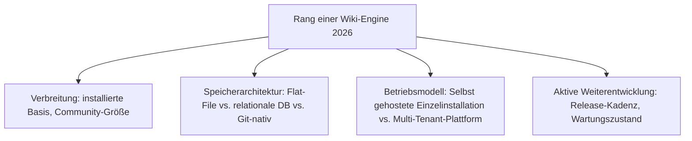
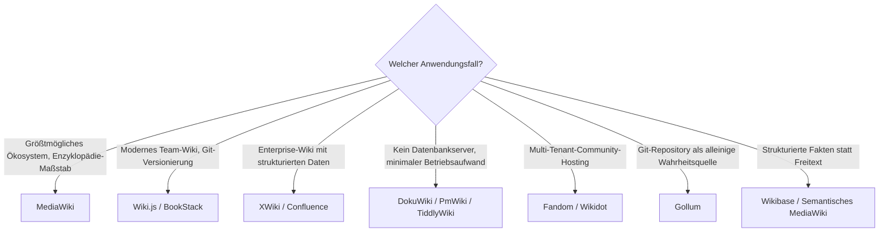

# Beste Wiki-Engines 2026 — Top-20-Topliste

Die [Evolution und Architekturen digitaler Wiki-Engines](evolution-digitaler-wiki-engines.md) ordnet diese Kategorie chronologisch nach Generation. Diese Seite übersetzt die Chronologie in eine **Momentaufnahme 2026** — und bleibt dabei strikt bei der engeren Definition der Evolution-Chronologie: **kollaborative, versionierte Textsysteme mit manueller Verlinkung**, nicht persönliche PKM-Werkzeuge und nicht die breiteren RAG-/Wissensmanagement-Plattformen, die bereits [Die führenden Open-Source-Wissenssysteme 2026](fuehrende-opensource-wissenssysteme-2026-topliste.md) und [Wissenssysteme für den eigenen Selfhosting-Server](wissenssysteme-selfhosting-server-topliste.md) abdecken.

!!! note "Hinweis: Engere Kategorie als die bestehenden Wissenssysteme-Toplisten"
    Die beiden bereits vorhandenen Wissenssysteme-Toplisten mischen Wiki-Engines mit PKM-Tools und RAG-Plattformen. Diese Seite bleibt konsequent bei reinen **Wiki-Engines** — inklusive mehrerer hier erstmals gerankter, älterer aber weiterhin genutzter Enterprise-/Community-Engines (Foswiki, TWiki, PmWiki, MoinMoin, JSPWiki), die in den breiteren Toplisten keinen Platz hatten.

---

## Bewertungskriterien

!!! warning "Achtung: Legacy-Engines mit großer Bestandsbasis, aber geringer Neuinstallationsrate"
    Rang 9–12 und 18 (Foswiki, TWiki, PmWiki, MoinMoin, Apache JSPWiki) laufen 2026 vielerorts noch produktiv, werden aber kaum noch für Neuprojekte gewählt — vor einer Neuinstallation die aktuelle Release-Historie prüfen. **Stand: August 2026.**

---

## Top 20 im Überblick

| Rang | System | Sprache/Stack | Speicherarchitektur | Besondere Stärke |
|---|---|---|---|---|
| 1 | **[MediaWiki](mediawiki/evolution-digitaler-mediawiki.md)** | PHP | relationale DB | Größte installierte Basis aller Wiki-Engines weltweit, trägt Wikipedia |
| 2 | **[Wiki.js](wikijs-linux-installation.md)** | Node.js/Vue.js | relationale DB (+ optionaler Git-Sync) | Modernste SPA-Oberfläche dieser Liste, vollständiger Rewrite 2018 |
| 3 | **[XWiki](xwiki/installieren.md)** | Java | relationale DB | Strukturierte Datenfelder, tiefste Enterprise-Integration (LDAP, SSO) |
| 4 | **DokuWiki** | PHP | Flat-File | Kein Datenbankdienst nötig, extrem einfaches Hosting & Backup |
| 5 | **BookStack** | PHP | relationale DB | Bücher/Kapitel/Seiten-Hierarchie, sehr niedrige Einstiegshürde |
| 6 | **TikiWiki** | PHP | relationale DB | Breitester Funktionsumfang „out of the box" unter den LAMP-Wikis |
| 7 | **[Semantisches MediaWiki](semantische-mediawiki/installieren.md)** | PHP (MediaWiki-Erweiterung) | relationale DB + Triple-Store | Semantische Anreicherung via Inline-Queries & SPARQL, siehe [SMW SPARQL Endpoint](semantische-mediawiki/smw-sparql-queries.md) |
| 8 | **Foswiki** | Perl | Flat-File | TWiki-Fork mit aktiverer Weiterentwicklung als das Original |
| 9 | **TWiki** | Perl | Flat-File | Ursprung der Foswiki-Abspaltung, weiterhin in älteren Enterprise-Installationen im Einsatz |
| 10 | **PmWiki** | PHP | Flat-File | Minimalistische Textdatei-Engine ohne Datenbank-Overhead, seit 2002 aktiv |
| 11 | **MoinMoin** | Python | Flat-File | Lange Zeit Standard-Wiki im wissenschaftlichen/Linux-Distributions-Umfeld |
| 12 | **Wikidot** | eigenständig | relationale DB, Multi-Tenant | Grundlage großer Communities wie der SCP-Foundation |
| 13 | **Fandom** (ehem. Wikia) | MediaWiki-basiert, Multi-Tenant | relationale DB | Größte Multi-Tenant-Hosting-Plattform für Fan-Communities weltweit |
| 14 | **Gollum** | Ruby | Git-nativ | Backend hinter der GitHub-Wiki-Funktion — jede Änderung ein Commit |
| 15 | **Wikibase** (Wikidata-Basis) | PHP (MediaWiki-basiert) + Triple-Store | relationale DB + Triple-Store | Referenzimplementierung für strukturierte Fakten statt Freitext |
| 16 | **TiddlyWiki** | JavaScript | Einzeldatei | Nicht-lineares Wiki in einer einzigen portablen HTML-Datei |
| 17 | **Wikijump** (ftml-Parser) | Rust | relationale DB | Rust-Rewrite der Wikidot-Engine, siehe [Generation 2 der Rust-Wissenssysteme](evolution-digitaler-rust-wissenssysteme.md#generation-2-rust-native-such-content-engines-als-produkt-2018-2022) |
| 18 | **Apache JSPWiki** | Java | Flat-File/relationale DB (wählbar) | Etablierte Java-Alternative zu XWiki mit geringerem Enterprise-Overhead |
| 19 | **Confluence** | Java | relationale DB | Marktführendes proprietäres Enterprise-Wiki, tief in die Atlassian-Suite integriert |
| 20 | **Outline** | Node.js/React | relationale DB | Modernstes Team-Wiki dieser Liste, aber Business Source License statt OSI-Open-Source |

---

## Lizenz-Sonderfälle

!!! warning "Achtung: Quellcode einsehbar ≠ Open Source"
    **Confluence** (Rang 19) ist vollständig proprietär und kostenpflichtig lizenziert — kein einsehbarer Quellcode. **Outline** (Rang 20) bringt zwar öffentlichen Quellcode mit, steht aber unter der **Business Source License (BSL)**, nicht OSI-anerkannt. Wer strikt OSI-Open-Source benötigt, greift stattdessen zu Rang 1–3, 5–6 oder 8 (MediaWiki, Wiki.js, XWiki, DokuWiki, BookStack, TikiWiki, Foswiki).

---

## Highlights im Detail

### Rang 8–11: die Perl-/Python-Flat-File-Engines der zweiten Generation
Foswiki, TWiki, PmWiki und MoinMoin teilen ein gemeinsames Architekturprinzip — Klartext-Speicherung ohne Datenbankdienst — und stehen 2026 strukturell näher an DokuWiki (Rang 4) als an den relationalen Enterprise-Engines der oberen Ränge. Ihre geringere Neuinstallationsrate spiegelt eher den allgemeinen Rückgang klassischer Perl-/Python-Wiki-Projekte wider als technische Schwächen.

### Rang 12–14: Multi-Tenant-Skalierung als eigene Betriebsart
Wikidot, Fandom und (implizit) MediaWiki-Hosting-Dienste zeigen ein Betriebsmodell, das sich fundamental von der klassischen Einzelinstallation (Rang 1–3, 5–11) unterscheidet: eine gemeinsame Infrastruktur trägt tausende unabhängige Communities gleichzeitig, mit eigenen Namensräumen statt eigener Serverhardware pro Organisation.

### Rang 17: der einzige Rust-native Vertreter dieser Liste
Wikijump/ftml demonstriert, dass auch ältere Wiki-Communities (SCP-Foundation, vormals auf Wikidot) ihre Engine komplett neu in Rust aufbauen können, statt die bestehende Codebasis inkrementell zu pflegen — ein direktes Beispiel für [Generation 4 dieser Zeitachse](evolution-digitaler-wiki-engines.md#generation-4-vollstandige-rewrites-auf-modernen-web-stacks-ab-2018) in Aktion.

---

## Entscheidungshilfe nach Anwendungsfall

!!! tip "Tipp: Breitere Wissenssysteme-Perspektive bei Bedarf"
    Wer nicht auf eine klassische Wiki-Engine festgelegt ist, findet in der [Top-20-Topliste der führenden Open-Source-Wissenssysteme 2026](fuehrende-opensource-wissenssysteme-2026-topliste.md) auch PKM- und RAG-Alternativen zum Vergleich.

---

## 🔗 Verwandte Themen

- [Startseite](../../index.md) — zurück zur Dokumentations-Zentrale
- [Evolution und Architekturen digitaler Wiki-Engines](evolution-digitaler-wiki-engines.md) — chronologisches Generationenmodell, dessen aktuellen Stand diese Topliste zusammenfasst
- [Die führenden Open-Source-Wissenssysteme 2026 (Top 20)](fuehrende-opensource-wissenssysteme-2026-topliste.md) — breiter gefasste Schwester-Topliste inkl. PKM und RAG-Plattformen
- [Beste Open-Source-Wissenssysteme für den eigenen Selfhosting-Server (Top 20)](wissenssysteme-selfhosting-server-topliste.md) — Selfhosting-Perspektive über dieselbe breitere Kategorie
- [Evolution und Architekturen von MediaWiki](mediawiki/evolution-digitaler-mediawiki.md) — vertiefende Produkt-Geschichte zu Rang 1
- [Evolution und Architekturen digitaler Rust-Wissenssysteme](evolution-digitaler-rust-wissenssysteme.md) — vertiefend zu Rang 17 (Wikijump/ftml)
- [Klassische Wiki-Systeme mit LLM-Integration](klassische-wiki-systeme-llm-integration.md) — LLM-Nachrüstung konkreter Engines aus dieser Liste
- [Beste Wissensmanagement-Systeme (Open Source) mit MCP-Server (Top 20)](wissensmanagement-mcp-server-topliste.md) — Agenten-/MCP-Anbindung konkreter Wiki-Engines aus dieser Liste
