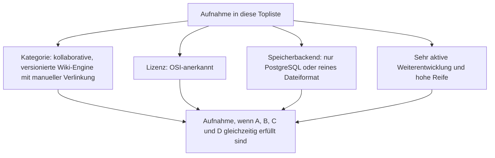
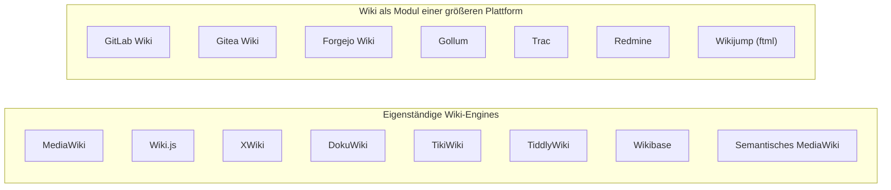
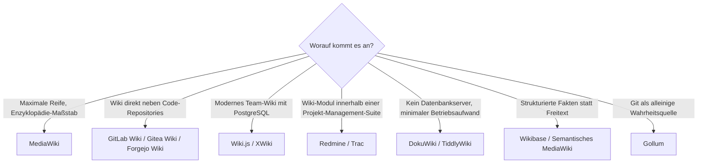

# Wiki-Engines mit PostgreSQL- oder Dateiformat-Speicherung, aktiver Weiterentwicklung & hoher Reife — Top-15-Topliste

Die [Beste Wiki-Engines 2026 (Top 20)](wiki-engines-2026-topliste.md) rankt die gesamte Kategorie **kollaborative, versionierte Textsysteme mit manueller Verlinkung** — inklusive proprietärer Systeme (Confluence), Source-available-Sonderfällen (Outline) und Engines mit geringer Neuinstallationsrate (Foswiki, TWiki, PmWiki, MoinMoin, Apache JSPWiki). Diese Seite wendet auf genau dieselbe Kategorie dieselben strengeren Kriterien an, die bereits die [Topliste nach Speicherbackend](postgresql-dateiformat-wissenssysteme-2026-topliste.md) für die breitere Wissenssysteme-Klasse etabliert hat: **nur OSI-Open-Source, Content-Persistenz ausschließlich in PostgreSQL oder einem reinen Dateiformat, sehr aktive Weiterentwicklung, hohe Reife.**

!!! note "Hinweis: Engere Kategorie als die bestehenden Wissenssysteme-Toplisten"
    Wie die [Basis-Topliste](wiki-engines-2026-topliste.md) bleibt auch diese Seite konsequent bei reinen Wiki-Engines — PKM-Werkzeuge (Logseq, Zettlr, SilverBullet) und RAG-/Wissensmanagement-Plattformen (Docmost, AFFiNE, Khoj) gehören nicht hierher, auch wenn einige von ihnen dieselben Speicher- und Aktivitätskriterien erfüllen würden. Sie stehen stattdessen in der [breiteren Speicherbackend-Topliste](postgresql-dateiformat-wissenssysteme-2026-topliste.md).

!!! tip "Tipp: Warum diese Liste kürzer als 20 ist"
    Von den 20 Engines der Basis-Topliste erfüllen nur 10 gleichzeitig alle drei Zusatzkriterien (Lizenz, Speicherbackend, Aktivität/Reife) — die übrigen 10 fallen wegen MySQL-only-Speicherung (BookStack), fehlender OSI-Lizenz (Wikidot, Fandom, Confluence, Outline) oder geringer Neuinstallationsrate (Foswiki, TWiki, PmWiki, MoinMoin, Apache JSPWiki) heraus. Um die Liste dennoch aussagekräftig zu füllen, ergänzt diese Seite fünf aktiv weiterentwickelte Wiki-Module aus größeren Plattformen (Forges, Projekt-Tracker) — technisch vollwertige, kollaborative, versionierte Wiki-Engines, auch wenn sie nicht als eigenständiges Produkt vermarktet werden.

---

## Bewertungskriterien

!!! warning "Achtung: Momentaufnahme, Stand August 2026"
    Bei den Forge-/Tracker-Wiki-Modulen (Rang 2, 5, 6, 8, 10) hängt die Release-Kadenz an der Gesamtentwicklung der jeweiligen Plattform, nicht am Wiki-Feature allein — die Aktivitätsangabe bezieht sich auf das Gesamtprojekt. Vor einer Entscheidung die aktuelle Roadmap direkt im Repository prüfen.

---

## Top 15 im Überblick

| Rang | System | Stack | Lizenz | Speicherbackend | Aktivität/Reife |
|---|---|---|---|---|---|
| 1 | **[MediaWiki](mediawiki/evolution-digitaler-mediawiki.md)** | PHP | GPL-2.0 | PostgreSQL offiziell unterstützt (Standard MySQL/MariaDB) | Höchste Reife, durchgängig von der WMF weiterentwickelt |
| 2 | **GitLab Wiki** (GitLab CE) | Ruby/Go | MIT | Git-Dateiformat je Wiki-Seite (Markdown/AsciiDoc-Dateien im Repo) | Extrem aktive Gesamtentwicklung, sehr große Contributor-Basis |
| 3 | **[Wiki.js](klassische-wiki-systeme-llm-integration.md)** | Node.js/Vue.js | AGPL-3.0 | PostgreSQL (empfohlener Standard) | Sehr aktiv, seit 2016 produktionsreif |
| 4 | **XWiki** | Java | LGPL-2.1 | PostgreSQL offiziell unterstützt | Monatliche Releases, seit 2003 reif |
| 5 | **Gitea Wiki** | Go | MIT | Git-Dateiformat je Wiki-Seite | Sehr aktive Community, häufige Releases |
| 6 | **Redmine** | Ruby on Rails | GPL-2.0 | PostgreSQL offiziell unterstützt (auch MySQL/SQLite) | Kontinuierlich gepflegt seit 2006, große Plugin-Ökosystem-Basis |
| 7 | **DokuWiki** | PHP | GPL-2.0 | Reines Dateiformat, kein Datenbankserver | Reif seit 2004, stetige statt rasante Release-Kadenz |
| 8 | **Forgejo Wiki** | Go | MIT | Git-Dateiformat je Wiki-Seite | Community-Fork von Gitea seit 2022, seither sehr hohe Entwicklungsdynamik |
| 9 | **TikiWiki** | PHP | LGPL-2.1 | Relationale DB, PostgreSQL unterstützt (MySQL in der Praxis üblicher) | Regelmäßige LTS-Releases |
| 10 | **Trac** | Python | Modifizierte BSD-Lizenz | SQLite oder PostgreSQL wählbar | Wiki-Modul einer Issue-Tracking-Suite, ruhig aber kontinuierlich gepflegt seit 2003 |
| 11 | **TiddlyWiki** | JavaScript | BSD-3-Clause | Einzeldatei (HTML) — reinstes Dateiformat dieser Liste | Ununterbrochen gepflegt seit 2004 |
| 12 | **Wikibase** (Wikidata-Basis) | PHP (MediaWiki-Basis) | GPL-2.0 | PostgreSQL offiziell unterstützt (MediaWiki-Datenbankschicht) | Professionell von Wikimedia Deutschland weiterentwickelt |
| 13 | **Semantisches MediaWiki** | PHP (MediaWiki-Erweiterung) | GPL-2.0+ | PostgreSQL offiziell unterstützt (MediaWiki-Datenbankschicht) | Seit professional.wiki-Sponsoring (ab 2023) wieder deutlich aktiver, siehe [Installation](semantische-mediawiki/installieren.md) |
| 14 | **Gollum** | Ruby | MIT | Git-Dateiformat — jede Änderung ein Commit | Backend hinter der GitHub-Wiki-Funktion, kontinuierlich gepflegt |
| 15 | **Wikijump** (ftml-Parser) | Rust | AGPL-3.0 | PostgreSQL | Rust-Rewrite der Wikidot-Engine für die SCP-Foundation-Community |

---

## Highlights im Detail

### Wiki-Engines leben zunehmend in Forges statt als eigenständiges Produkt
Vier der 15 Ränge (GitLab Wiki, Gitea Wiki, Forgejo Wiki, Gollum) sind keine eigenständig vermarkteten Wiki-Produkte, sondern das Wiki-Feature einer größeren Entwicklungsplattform — mit Git-Dateien statt Datenbank als Speicher. Weil diese Plattformen insgesamt eine deutlich größere Entwicklermannschaft und Nutzerbasis haben als klassische Standalone-Wiki-Projekte, ist ihr Wiki-Modul faktisch aktiver gepflegt als so manche "reine" Wiki-Engine — ein Muster, das sich seit der Rewrite-Welle in [Generation 4 der Wiki-Engine-Chronologie](evolution-digitaler-wiki-engines.md#generation-4-vollstandige-rewrites-auf-modernen-web-stacks-ab-2018) verstärkt hat.

### Trac & Redmine: die unterschätzten Wiki-Module aus der Projekt-Management-Welt
Beide Systeme sind primär als Issue-Tracker bekannt, bringen aber jeweils ein vollwertiges, eigenständig nutzbares Wiki-Modul mit Versionshistorie und Verlinkung mit — und beide unterstützen PostgreSQL nativ als Backend, ohne ein zusätzliches Pflichtsystem zu benötigen. Trac ist dabei das ruhigste System dieser Liste (seltene, aber verlässliche Releases seit 2003), Redmine deutlich aktiver gepflegt.

### Forgejo Wiki: der jüngste, aber am schnellsten wachsende Eintrag
Forgejo entstand 2022 als Community-Fork von Gitea nach Governance-Konflikten im Gitea-Projekt. Trotz des jungen Alters hat sich die Entwicklungsgeschwindigkeit seither so stark beschleunigt, dass Forgejo Wiki in dieser Liste vor dem länger etablierten Trac und noch vor TikiWiki rangiert.

---

## Was bewusst nicht in dieser Liste steht

!!! warning "Achtung: Ausschluss trotz Open Source, Aktivität oder Reife"
    Von den 20 Engines der [Basis-Topliste](wiki-engines-2026-topliste.md) fallen zehn heraus:

    - **MySQL-only-Speicherung**: BookStack unterstützt offiziell nur MySQL/MariaDB, kein PostgreSQL.
    - **Andere Datenbank jenseits Postgres/Datei**: Growi (nicht in der Basis-Topliste, aber ein häufig genannter Kandidat) ist MongoDB-basiert und fällt aus demselben Grund heraus wie in der [breiteren Speicherbackend-Topliste](postgresql-dateiformat-wissenssysteme-2026-topliste.md#was-bewusst-nicht-in-dieser-liste-steht).
    - **Geringe Neuinstallationsrate trotz Reife**: Foswiki, TWiki, PmWiki, MoinMoin und Apache JSPWiki laufen laut Basis-Topliste 2026 vielerorts noch produktiv, werden aber kaum noch für Neuprojekte gewählt — die Aktivitätsschwelle dieser Liste erfüllen sie damit nicht.
    - **Nicht als Open-Source-Software distributierbar**: Wikidot und Fandom sind reine Hosting-Plattformen ohne selbst betreibbaren, offen lizenzierten Quellcode.
    - **Lizenzausschluss unabhängig von Aktivität/Reife**: Confluence (vollständig proprietär) und Outline (Business Source License, nicht OSI-anerkannt).

---

## Entscheidungshilfe nach Anwendungsfall

---

## 🔗 Verwandte Themen

- [Startseite](../../index.md) — zurück zur Dokumentations-Zentrale
- [Beste Wiki-Engines 2026 (Top 20)](wiki-engines-2026-topliste.md) — Basis-Topliste ohne Lizenz-/Speicherbackend-/Aktivitätsfilter
- [Open-Source-Wissenssysteme mit PostgreSQL- oder Dateiformat-Speicherung (Top 20)](postgresql-dateiformat-wissenssysteme-2026-topliste.md) — dieselben Speicherkriterien für die breitere Wissenssysteme-Klasse inkl. PKM und RAG
- [Open-Source-Wissenssysteme mit aktiver Weiterentwicklung & hoher Reife (Top 20)](aktive-reife-opensource-wissenssysteme-2026-topliste.md) — dieselben Aktivitäts-/Reife-Kriterien für die breitere Wissenssysteme-Klasse
- [Open-Source-Wissenssysteme mit echter Echtzeit-Kollaboration (Top 15)](echtzeit-kollaboration-opensource-wissenssysteme-2026-topliste.md) — ergänzendes Kriterium CRDT/OT-Kollaboration statt Speicherbackend
- [Evolution und Architekturen digitaler Wiki-Engines](evolution-digitaler-wiki-engines.md) — chronologisches Generationenmodell als Hintergrund
- [PostgreSQL DBA Praxis-Handbuch](../../entwicklung/infrastruktur/postgresql-dba-praxis.md) — vertiefend zur Datenbankschicht hinter den PostgreSQL-Rängen dieser Liste
- [Rust-Bausteine für Wissenssysteme mit PostgreSQL-/Dateiformat-Speicherung (Top 15)](rust-wissenssysteme-postgresql-dateiformat-2026-topliste.md) — Überschneidung bei Wikijump/ftml auf Bibliotheksebene
- [Evolution und Architekturen von MediaWiki](mediawiki/evolution-digitaler-mediawiki.md) — vertiefende Produkt-Geschichte zu Rang 1
