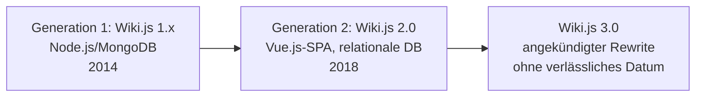

# Evolution und Architekturen von Wiki.js

Wiki.js bildet Generation 3/4 der [Evolution digitaler Wiki-Engines](evolution-digitaler-wiki-engines.md) — die ursprüngliche 1.x-Version fällt in [Generation 3 (Docs-as-Code-Konvergenz)](evolution-digitaler-wiki-engines.md#generation-3-docs-as-code-konvergenz-git-statt-eigener-versionshistorie-ca-2010-2018), der vollständige 2.0-Rewrite in [Generation 4 (Vollständige Rewrites auf modernen Web-Stacks)](evolution-digitaler-wiki-engines.md#generation-4-vollstandige-rewrites-auf-modernen-web-stacks-ab-2018) —, die ihrerseits Teil der übergeordneten [Evolution digitaler Wissenssysteme](evolution-digitaler-wissenssysteme.md) sind. Diese eigenständige Zeitachse zoomt — analog zu den Produkt-Spezialartikeln [Evolution und Architekturen von MediaWiki](mediawiki/evolution-digitaler-mediawiki.md), [Evolution und Architekturen von XWiki](xwiki/evolution-digitaler-xwiki.md) und [Evolution und Architekturen von DokuWiki](dokuwiki/evolution-digitaler-dokuwiki.md) — in genau Wiki.js' eigene Architekturlinie hinein: von der ursprünglichen Node.js/MongoDB-Erstversion über den vollständigen 2.0-Rewrite mit Vue.js-Oberfläche und GraphQL-API bis zur modularen Auth-/Storage-/Search-/Editor-Architektur, die bis heute jede Erweiterung trägt. Die praktische Installation behandelt [Wiki.js native Linux-Installation](wikijs-linux-installation.md), die aktuelle KI-Integration [Wiki.js-KI-Agent](wikijs-ki-agent.md).

!!! note "Hinweis: Generationen überlappen sich"
    Die Zeiträume sind grobe Orientierung, keine scharfen Grenzen — der modulare Plugin-Ansatz aus Generation 3 trägt bis heute jede neue Auth-/Storage-/Search-Integration, parallel zur KI-gestützten Generation 5. Entscheidend ist die **Architektur** (Speicherbackend, Frontend-Technologie, Erweiterungsmechanismus), nicht allein das Versionsjahr.

!!! warning "Achtung: langer 2.x-Lebenszyklus, 3.0 in Entwicklung"
    Wiki.js 2.x wird bereits seit 2018 als stabile Hauptversion gepflegt, ein grundlegend neuer Rewrite ist seit Längerem angekündigt, aber ohne verlässliches Erscheinungsdatum. Aktuellen Stand immer gegen die [offizielle Wiki.js-Dokumentation](https://docs.requarks.io/) prüfen, bevor diese Zeitachse als Entscheidungsgrundlage dient.

---

## Generation 1: Wiki.js 1.x — Node.js/MongoDB-Erstversion, 2014

- **Architektur:** Node.js-Backend, **MongoDB** als dokumentenorientierte Datenbank statt relationaler Speicherung, serverseitig gerenderte Oberfläche, optionaler **Git-Sync** zur Versionierung außerhalb der Datenbank.
- **Bedeutung:** früher Vertreter der Node.js-basierten Wiki-Engines, siehe [Generation 3 der Wiki-Engines-Zeitachse](evolution-digitaler-wiki-engines.md#generation-3-docs-as-code-konvergenz-git-statt-eigener-versionshistorie-ca-2010-2018) — der optionale Git-Sync bleibt konzeptioneller Vorläufer der modularen Storage-Architektur aus Generation 3 dieser Zeitachse.
- **Grenzen:** MongoDB als Wahrheitsquelle erschwert komplexe relationale Abfragen (Rechte, Mehrsprachigkeit) — einer der Haupttreiber für den vollständigen Rewrite in Generation 2.

---

## Generation 2: Wiki.js 2.0 — vollständiger Rewrite, 2018

Statt inkrementeller Weiterentwicklung ersetzt diese Generation praktisch die gesamte technische Basis — derselbe Bruch wie bei anderen Engines aus [Generation 4 der Wiki-Engines-Zeitachse](evolution-digitaler-wiki-engines.md#generation-4-vollstandige-rewrites-auf-modernen-web-stacks-ab-2018).

**Architektur:** **Vue.js**-Single-Page-Application als Frontend statt serverseitig gerenderter Templates, **relationale Datenbank** (PostgreSQL empfohlen, zusätzlich MySQL/MariaDB, MSSQL, SQLite) statt MongoDB, **GraphQL-API** statt REST als primäre Programmierschnittstelle.

| Meilenstein | Bedeutung |
|---|---|
| **Vue.js-SPA-Oberfläche** | Löst die serverseitig gerenderte Oberfläche aus Generation 1 ab, siehe [Wiki.js native Linux-Installation](wikijs-linux-installation.md). |
| **Relationale Datenbank** | Ermöglicht die granularen Rechte- und Mehrsprachigkeits-Abfragen aus Generation 4 dieser Zeitachse, die mit MongoDB deutlich aufwendiger gewesen wären. |
| **GraphQL-API** | Ersetzt REST als primäre Schnittstelle — Grundlage der GraphQL-Anbindung aus Generation 5. |

---

## Generation 3: Modulare Auth-/Storage-/Search-/Editor-Architektur, ab 2018

Statt Erweiterungen als klassische Plugins nachzuladen, definiert Wiki.js 2.x feste **Modul-Kategorien**, zwischen denen direkt im Admin-Interface umgeschaltet wird — ohne Code-Änderung oder Neustart.

| Modul-Kategorie | Rolle |
|---|---|
| **Auth-Module** | Authentifizierungsstrategien (lokal, LDAP, OAuth2, SAML u. a.) über Passport.js-Strategien austauschbar. |
| **Storage-Module** | Sync-Ziele für Backup/Versionierung (Git, lokales Dateisystem, AWS S3 u. a.) — direkte Fortsetzung des Git-Sync-Gedankens aus Generation 1. |
| **Search-Module** | Suchindex-Backends (integrierte DB-Volltextsuche, Algolia, Elasticsearch, Azure Cognitive Search u. a.). |
| **Editor-Module** | Eingabeformate (Markdown, WYSIWYG/CKEditor, AsciiDoc u. a.) parallel nutzbar, pro Seite wählbar. |
| **Comment-Module** | Diskussionsanbindung (eingebaut, Discourse, Disqus). |

!!! tip "Architektonischer Vorteil"
    Weil jede Kategorie unabhängig austauschbar ist, lässt sich z. B. das Suchbackend skalieren, ohne Authentifizierung oder Editor-Konfiguration anzufassen — dieselbe Modularität, die [XWikis Extension Manager](xwiki/evolution-digitaler-xwiki.md#generation-6-extension-marketplace-flavors-ki-ara-ab-den-2020er-jahren) und [DokuWikis Plugin-System](dokuwiki/evolution-digitaler-dokuwiki.md#generation-3-plugin-template-architektur-ab-20052006) auf ihre Weise verfolgen, hier jedoch als feste Modul-Slots statt offenem Marketplace.

---

## Generation 4: Granulares Rechte- & Mehrsprachigkeitssystem, ab 2018

Die relationale Datenbank aus Generation 2 macht zwei Funktionen praktikabel, die mit dem MongoDB-Modell aus Generation 1 deutlich aufwendiger gewesen wären.

**Architektur:** **Page Rules** definieren Lese-/Schreib-/Verwaltungsrechte granular pro Seite, Pfad oder Nutzergruppe; **Locales** erlauben mehrere parallele Sprachversionen derselben Seite als First-Class-Datenmodell statt Community-Konvention.

---

## Generation 5: GraphQL-API-Reife & KI-Agenten-Anbindung, ab 2023

Die GraphQL-API aus Generation 2 wird zur Grundlage programmatischer Automatisierung und KI-gestützter Pflege.

**Architektur:** typisierte GraphQL-Schemas für Seiten, Nutzer und Rechte ersetzen eigene REST-Client-Implementierungen — dieselbe Rolle, die die REST-API bei [XWiki](xwiki/evolution-digitaler-xwiki.md#generation-4-verschachtelte-dokumentenhierarchie-rest-api-reife-ab-2013) und [MediaWiki](mediawiki/evolution-digitaler-mediawiki.md) einnimmt, hier jedoch typisiert statt endpunktbasiert.

!!! tip "Bezug zu diesem Repository"
    Der [Wiki.js-KI-Agent](wikijs-ki-agent.md) dieses Repositories nutzt genau diese GraphQL-API nach demselben Human-in-the-Loop-Prinzip wie der [MediaWiki-KI-Agent](mediawiki/mediawiki-ki-agent.md) und die [XWiki Agenten-Pipeline](xwiki/xwiki-ki-agent.md), siehe auch [Generation 6 der Wiki-Engines-Zeitachse](evolution-digitaler-wiki-engines.md#generation-6-ki-agenten-pflegen-bestehende-wiki-engines-direkt-ab-2023).

---

## Generation 6: Langer 2.x-Lebenszyklus & angekündigter 3.0-Rewrite

Anders als bei den meisten Geschwister-Artikeln dieser Reihe bringt die aktuelle Generation keinen abgeschlossenen architektonischen Sprung, sondern eine besonders lang laufende Stabilitätsphase.

**Architektur:** Wiki.js 2.x bleibt seit 2018 die durchgängig gepflegte Hauptversion — ein grundlegend neuer Rewrite (**Wiki.js 3.0**) ist seit Längerem in Aussicht gestellt, ohne dass sich diese Zeitachse auf ein verlässliches Erscheinungsdatum oder finale Architekturentscheidungen festlegen kann.

---

## Alternative Sortier- & Klassifikationskriterien für Wiki.js

### 1. Speicherbackend

- **Dokumentenorientiert** — MongoDB (Generation 1).
- **Relational** — PostgreSQL/MySQL/MSSQL/SQLite (ab Generation 2).

### 2. Frontend-Architektur

- **Serverseitig gerendert** — Generation 1.
- **Single-Page-Application** (Vue.js) — ab Generation 2.

### 3. API-Zugriff

- **Kein/eingeschränkter programmatischer Zugriff** — Generation 1.
- **GraphQL** — ab Generation 2, ausgereift für Automatisierung in Generation 5.

### 4. Erweiterungsmechanismus

- **Fest verdrahtet** — Generation 1.
- **Modul-Slot im Admin-UI** (Auth/Storage/Search/Editor/Comments) — ab Generation 3, ohne offenen Marketplace wie bei XWiki oder DokuWiki.

---

## Verwandte Themen

- [Wiki.js native Linux-Installation](wikijs-linux-installation.md) — Installationsanleitung
- [Nginx über Unix-Socket anbinden](wikijs-nginx-unix-socket.md) — Reverse-Proxy-Konfiguration
- [Wiki.js-KI-Agent](wikijs-ki-agent.md) — Vertiefung zu Generation 5
- [Evolution und Architekturen digitaler Wiki-Engines](evolution-digitaler-wiki-engines.md) — übergeordnetes Generationenmodell, in dem Wiki.js Generation 3/4/6 bildet
- [Evolution und Architekturen von MediaWiki](mediawiki/evolution-digitaler-mediawiki.md) — analoger Produkt-Spezialartikel für MediaWiki
- [Evolution und Architekturen von XWiki](xwiki/evolution-digitaler-xwiki.md) — analoger Produkt-Spezialartikel, Extension-Marketplace statt fester Modul-Slots
- [Evolution und Architekturen von DokuWiki](dokuwiki/evolution-digitaler-dokuwiki.md) — analoger Produkt-Spezialartikel, dateibasiert statt relational
- [Dokumentationsübersicht](index.md)
